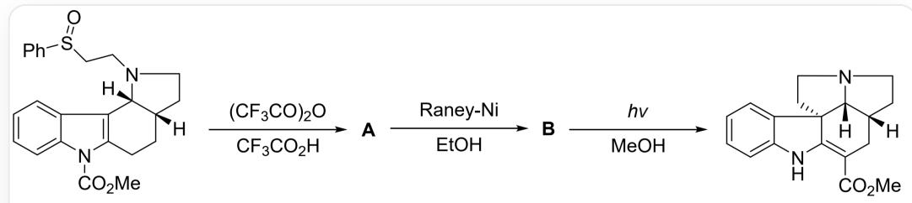
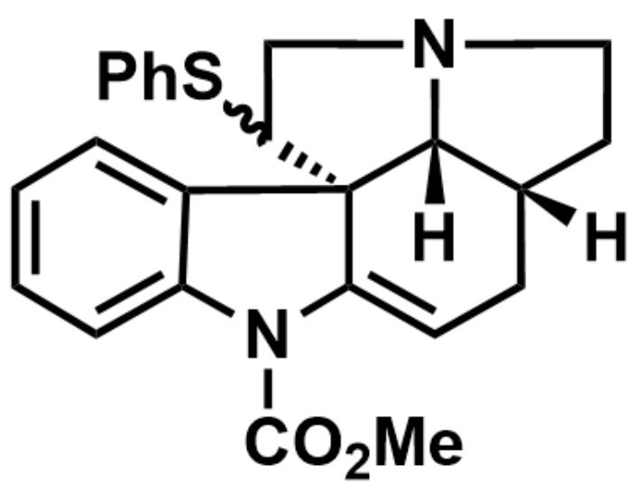
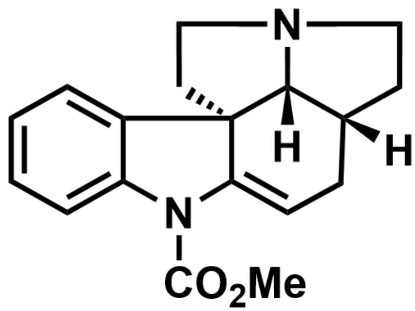

# 题目

Pummerer重排通常是指用酸酐将亚砜的氧原子活化，经历硫离子中间体，最终生成α-官能团化的硫醚的化学反应。在某天然产物的全合成中（如下图所示），利用Pummerer重排构建了新的季碳中心。

  
图中为多步反应，可以描述为：[H][C@@]1(CCN(CCS(C2=CC=CC=C2)=O)  
[C@]13[H])CCC4=C3C5=CC=CC=C5N4C(OC)=O>  $(CF_{3}CO)_{2}O$  ，  $CF_{3}CO_{2}H > [\mathsf{A}]$  ，[A]>  
Raney - Ni, EtOH> [B], [B]> hv, MeOH> [H]  
[ \text{[C@@]1(CC(C(OC)=O)=C2N([H])C3=CC=CC=C3[C@]24CCN5CC1)[C@]45[H]。其中[1]>2'>[3]表示化合物1在2的条件下反应得到化合物3。} ]

下列关于A和B说法正确的有：

1.A 有三个立体化学中心  
2.A和B环的数量相同  
3. A 生成 B 的过程中发生了碳碳双键移位  
4.B在光照下发生了[1,5]-  $\sigma$  迁移  
5.最终产物与 B 相比不存在立体化学中心的产生或消失  
6.B 生成最终产物的中间体中存在亚胺结构

A. 1,2,4,5,6

B.  $1,2,3,4,5,6$  
C. 5,6  
D. 2,6  
E. 2,3,6  
F. 1,2,4,6  
G. 1,3,4,5  
H. 2,4,5  
1. 3,4,6  
J. 以上选项均不正确或答案不完全

# 答案

正确答案: C

# 详细解析

在反应物生成 A 的过程中，首先发生了经典的 Pummerer 重排反应，即亚砜的氧原子亲核进攻三氟乙酸酐，得到硫鎘离子，随后发生1，2消除，得到硫醚邻位的碳正离子（或含碳硫双键的鎘离子）。由于吲哚环较富电子，可以发生芳香亲电取代反应，吲哚环三号位亲核进攻碳正离子，构建了类似产物的五元环系，并生成了亚胺正离子结构，最终消除  $\mathrm{H}^{+}$  得到 A，结构如下：

# CHECKPOINT

1 PTS

吲哚环三号位亲核进攻碳正离子，构建了类似产物的五元环系

[H][C@@]1(CC=C([C@@](C2=CC=CC=C32)4C(CN5CC1)SC6=CC=CC=C6)N3C(OC)=O)[C@]45[H]

# CHECKPOINT

1 PTS

A 结构为 [H][C@@]1(CC=C([C@@](C2=CC=CC=C32)4C(CN5CC1)SC6=CC=CC=C6)N3C(OC)=O)[C@]45[H]

所以A有四个立体化学中心。说法1错误

A 随后被 Raney - Ni 还原碳硫键, 最终得到一分子 PhSH 和 B, B 的结构如下:

[H][C@@]1(CC=C([C@@](C2=CC=CC=C32)4CCN5CC1)N3C(OC)=O)[C@@]45[H]

# CHECKPOINT

1 PTS

Raney - Ni 还原碳硫键

# CHECKPOINT

1 PTS

B结构为[H][C@@]1(CC=C([C@@](C2=CC=CC=C32)4CCN5CC1)N3C(OC)=O)[C@]45[H]

由于被还原，B比A少一个苯环，并且A生成B的过程中没有发生碳碳双键移位。说法2，3错误

# CHECKPOINT

1 PTS

A比B多一个环，A生成B的过程中没有发生碳碳双键移位

在光照下B中的-COOMe发生[1,3]- $\sigma$  迁移，得到亚胺中间体，随后发生亚胺与烯胺的互变异构得到最终产物。在该步反应中不存在立体化学中心的产生或消失。因此说法4错误，5，6正确

# CHECKPOINT

1 PTS

B 在光照下发生了[1,3]- $\sigma$  迁移

# CHECKPOINT

1 PTS

最终产物与 B 相比不存在立体化学中心的产生或消失

# CHECKPOINT

1 PTS

B 生成最终产物的中间体中存在亚胺结构

所以说5，6正确，答案为C