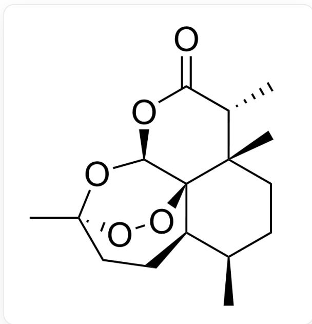

# Question

Some laboratories use the following method to determine the content of substance  $\mathbf{A}$  in a certain plant. The structure of  $\mathbf{A}$  is shown below:

  
C[C@@H]1CC[C@@]2(C)[C@@H](C)C(=O)O[C@H]3[C@]42[C@@H]1CC[C@@](C)(O3)OO4

Precisely weigh  $0.2885\mathrm{g}$  of potassium dichromate dried at  $130^{\circ}\mathrm{C}$  for two hours, dissolve it in water, and dilute to  $100~\mathrm{mL}$ . Transfer  $20.00~\mathrm{mL}$ , add  $1\mathrm{g}$  of potassium iodide and  $5\mathrm{mL}$  of  $1 + 5$  sulfuric acid, and let it stand in the dark for  $5\mathrm{min}$ . Using starch as the indicator, titrate with sodium thiosulfate solution until the endpoint is reached, consuming  $26.24~\mathrm{mL}$ . Then weigh  $24.9034\mathrm{g}$  of the dried plant powder into a dry  $250~\mathrm{mL}$  round-bottom flask, add  $200~\mathrm{mL}$  of n-pentane, install a Soxhlet extractor, and reflux for  $2\mathrm{h}$ . Filter under suction, dilute with n-pentane to  $250~\mathrm{mL}$ . Transfer  $25.00~\mathrm{mL}$  of the n-pentane solution, evaporate the n-pentane on a water bath, add  $10~\mathrm{mL}$  of anhydrous ethanol,  $1~\mathrm{mL}$  of glacial acetic acid,  $20~\mathrm{mL}$  of  $5\%$  potassium iodide, and  $5~\mathrm{mL}$  of  $1 + 1$  hydrochloric acid, heat on a water bath at  $70^{\circ}\mathrm{C}$  for 30 minutes, and titrate with sodium thiosulfate using starch as the indicator until the endpoint is reached, consuming  $11.73~\mathrm{mL}$  of the standard sodium thiosulfate titration solution.

Among the following statements, at least one is correct (for statements involving calculations, deviations within  $1\%$  are considered correct):

1. There are 8 chiral carbon atoms in the structure of  $\mathbf{A}$ .  
2. In the structure of  $\mathbf{A}$ , there is a carbon atom shared by three six-membered rings, and its stereochemical configuration is R.  
3. When extracting A using a Soxhlet extractor, n-pentane can be replaced with n-hexane.  
4. The concentration of the sodium thiosulfate solution is  $0.04585\mathrm{mol / L}$  
5. The content of A is  $3.000\%$ .

Among these statements, let the number of incorrect statements be a, and the smallest number among the correct statements be b. Then a and b are respectively

A. 1, 1  
B. 1,2  
C. 1,3  
D. 1,4  
E. 1,5  
F. 2,1  
G. 2, 2  
H. 2,3  
1. 2,4

J. 2,5  
K. 3,1  
L. 3,2  
M. 3, 3  
N. 3,4  
O. 3,5  
P. 4,1  
Q. 4,2  
R. 4,3  
S. 4, 4  
T. 4,5

# Answer

Correct Answer: L

# Detailed Explanation

According to the structure, A actually has 7 chiral carbon atoms; Statement 1 is incorrect.

# CHECKPOINT

1 PTS

A actually has 7 chiral carbon atoms

The carbon atom shared by three six-membered rings (one of which is a peroxide six-membered ring, relatively concealed) is the central carbon atom of the structure, with an R stereochemical configuration. Therefore, Statement 2 is correct.

# CHECKPOINT

1 PTS

The carbon atom shared by three six-membered rings is the central carbon atom of the structure, with an R stereochemical configuration

A contains a bridged ring structure formed by a peroxide bond, which is thermally unstable and prone to decomposition. Thus, n-hexane with too high a boiling point cannot be used as the extraction solvent, making Statement 3 incorrect.

# CHECKPOINT

1 PTS

A is thermally unstable and prone to decomposition, so n-hexane with too high a boiling point cannot be used as the extraction solvent

The analysis process of  $\mathbf{A}$  consists of two steps. First, the sodium thiosulfate solution is standardized using potassium dichromate. According to the stoichiometric relationship,  $1\mathrm{mol}\mathrm{Cr}_2\mathrm{O}_7^{2 - }$  produces  $3\mathrm{mol}\mathrm{I}_2$  , and  $1\mathrm{mol}$ $\mathrm{I}_2$  consumes  $2\mathrm{mol}\mathrm{S}_2\mathrm{O}_3^{2 - }$  . Therefore,  $\mathrm{n(Cr_2O_7^{2 - }):n(I_2)} = 1:6$  . Substituting the data yields a sodium thiosulfate solution concentration of  $0.04485\mathrm{mol / L}$  , which differs from the  $0.04585\mathrm{mol / L}$  in Statement 4 by more than  $1 \%$  . Hence, Statement 4 is incorrect.

# CHECKPOINT

1 PTS

The sodium thiosulfate solution concentration is  $0.04485\mathrm{mol / L}$

The peroxide bond in  $\mathbf{A}$  can undergo a redox reaction with potassium iodide, and the generated iodine is backtitrated with sodium thiosulfate solution. The stoichiometric relationship is  $1\mathrm{mol}$ $\mathbf{A} \sim 1\mathrm{mol}$ $\mathrm{I}_2 \sim 2\mathrm{mol}$ $\mathrm{S}_2\mathrm{O}_3^{2-}$ . Substituting the specific data gives a total mass of  $\mathbf{A}$  in the sample as  $0.7425\mathrm{g}$ , with a mass percentage of  $2.982\%$ , differing from the  $3.000\%$  in Statement 5 by less than  $1\%$ . Thus, Statement 5 is correct.

# CHECKPOINT

2 PTS

The total mass of A in the sample is  $0.7425\mathrm{g}$ , with a mass percentage of  $2.982\%$

Therefore, there are 3 incorrect statements in total, and the correct statements are Statements 2 and 5, making Option L correct.

In fact,  $\mathbf{A}$  is artemisinin.