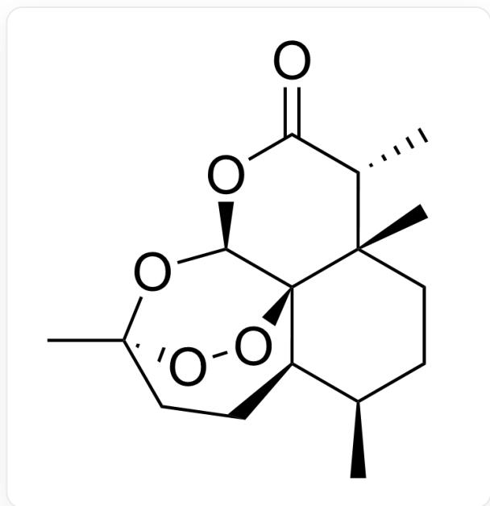

# 题目

有实验室用如下方法测定某植物中某物质A的含量。A的结构如下图所示:

  
C[C@@H]1CC[C@@]2(C)[C@@H](C)C(=O)O[C@H]3[C@]42[C@@H]1CC[C@@](C)(O3)OO4

准确称取在  $130^{\circ} \mathrm{C}$  干燥两小时的重铬酸钾  $0.2885 \mathrm{~g}$ , 溶于水稀释至  $100 \mathrm{~mL}$  。移取  $20.00 \mathrm{~mL}$ , 加  $1 \mathrm{~g}$  碘化钾和  $5 \mathrm{~mL} 1 + 5$  硫酸, 于暗处放置  $5 \mathrm{~min}$  。以淀粉做指示剂, 用硫代硫酸钠溶液滴定至终点, 消耗  $26.24 \mathrm{~mL}$  。然后称取  $24.9034 \mathrm{~g}$  干燥的该植物粉末于一个干燥的  $250 \mathrm{~mL}$  圆

底烧瓶中，加  $200 \mathrm{~mL}$  正戊烷，安装索氏提取器回流提取  $2 \mathrm{~h}$  。抽滤，用正戊烷稀释至  $250 \mathrm{~mL}$  。移取  $25.00 \mathrm{~mL}$  正戊烷溶液，在水浴上蒸发除去正戊烷，加入  $10 \mathrm{~mL}$  无水乙醇，  $1 \mathrm{~mL}$  冰乙酸，  $20 \mathrm{~mL} 5 \%$  碘化钾，和  $5 \mathrm{~mL} 1 + 1$  盐酸，水浴  $70^{\circ} \mathrm{C}$  加热30分钟，以淀粉为指示剂用硫代硫酸钠滴定至终点, 消耗硫代硫酸钠标准滴定溶液  $11.73 \mathrm{~mL}$  。

有下列至少一个正确的说法：(涉及到计算的说法，计算误差在  $1 \%$  之内均视为正确)

1. A 结构中有 8 个手性碳原子。  
2. A 结构中, 有一个被三个六元环共用的碳原子, 其立体化学构型为  $\mathrm{R}$  。

3. 利用索氏提取器提取A时，正戊烷可以更换为正己烷。  
4. 硫代硫酸钠溶液的浓度为  $0.04585 \mathrm{~mol} / \mathrm{L}$  。  
5. A的含量为  $3.000\%$

以上说法中，设错误的说法个数为a，正确的说法中的最小序号为b，则a,b分别为

A. 1, 1  
B. 1, 2  
C. 1,3  
D. 1, 4  
E. 1, 5  
F. 2, 1  
G. 2, 2  
H. 2, 3  
1. 2,4  
J. 2,5  
K. 3, 1

L. 3, 2  
M. 3, 3  
N. 3, 4  
O. 3, 5  
P. 4, 1  
Q. 4, 2  
R. 4, 3  
S. 4, 4  
T. 4, 5

# 答案

正确答案: L

# 详细解析

根据结构，A实际上有7个手性碳原子；说法1错误

# CHECKPOINT

1 PTS

A实际上有7个手性碳原子

被三个六元环（有一个六元环是过氧六元环，比较隐蔽）共用的碳原子即为结构最中心的碳原子，其立体化学构型为R，故说法2正确。

# CHECKPOINT

1 PTS

被三个六元环共用的碳原子即为结构最中心的碳原子，其立体化学构型为R

A 含有由过氧键构成的的桥环结构, 对热不稳定, 容易分解, 从而不能使用沸点太高的正己烷当作提取溶剂, 说法3错误。

# CHECKPOINT

1 PTS

A对热不稳定，容易分解，从而不能使用沸点太高的正己烷当作提取溶剂

A 的分析过程分两步，首先是硫代硫酸钠溶液利用重铬酸钾的标定，根据化学计量关系， $1\mathrm{mol}\mathrm{Cr}_2\mathrm{O}_7^{2-}$ 产生  $3\mathrm{mol}\mathrm{I}_2$ ，而  $1\mathrm{mol}\mathrm{I}_2$  消耗  $2\mathrm{mol}\mathrm{S}_2\mathrm{O}_3^{2-}$ 。因此， $\mathrm{n}(\mathrm{Cr}_2\mathrm{O}_7^{2-}): \mathrm{n}(\mathrm{I}_2) = 1:6$ ，带入数据可得硫代硫酸钠溶液浓度为  $0.04485\mathrm{mol/L}$ ，与说法4的  $0.04585\mathrm{mol/L}$  差距超过  $1\%$ ，故说法4错误。

# CHECKPOINT

1 PTS

硫代硫酸钠溶液浓度为  $0.04485 \mathrm{~mol} / \mathrm{L}$

A的过氧键可与碘化钾发生氧化还原反应，生成的碘单质被硫代硫酸钠溶液返滴定。其反应计量关系为1mol  $\mathbf{A}\sim 1\mathrm{mol~I}_2\sim 2\mathrm{mol~S_2O_3^{2 - }}$  ，带入具体数据可得样品中A总质量为  $0.7425\mathrm{g}$  ，质量百分比为  $2.982\%$  与说法5的  $3.000\%$  差距小于  $1\%$  ，说法5正确。

# CHECKPOINT

2 PTS

样品中A总质量为  $0.7425\mathrm{g}$ ，质量百分比为  $2.982\%$

因此，错误的说法共有3种，正确说法有说法2，5，故L选项正确。

实际上，A就是青蒿素。