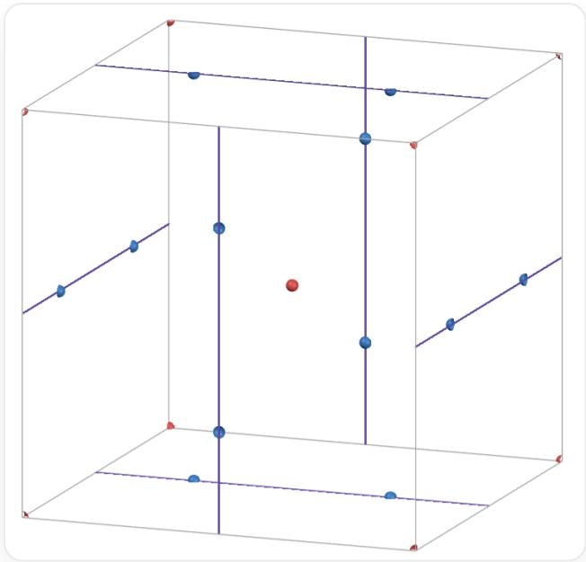
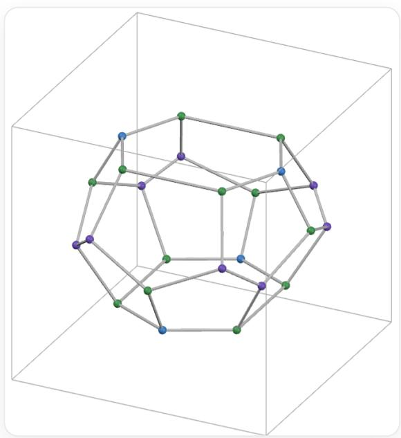

# Question

A certain crystal belongs to the cubic system, and its structure consists of polyhedral cages formed by connecting specific vertices, with a gas molecule (which can be regarded as a sphere) located at the center of each cage. The center of the unit cell is a center of symmetry, where the coordinates of two gas molecules are  $(0,0,0)$  and  $\left(\frac{1}{2},0,\frac{1}{4}\right)$ , respectively. These two molecules reside in different types of polyhedral cages, with the molecule at  $(0,0,0)$  located at the center of a pentagonal dodecahedral cage. Determine the ratio of the number of all distinct polygonal faces formed between the polyhedral cages in a proper unit cell of this crystal that cannot be related by crystal symmetry.

A.  $2: 1$  
B.  $3: 1$  
C.  $3: 2$  
D.  $5: 1$  
E.  $4: 3$  
F.  $5: 2$  
G.  $5: 3$  
H.  $5: 4$  
1. 7:2  
J. 8:1

K.  $1: 1: 1$  
L.  $2: 1: 1$  
M.  $2: 2: 1$  
N.  $3: 2: 1$  
O.  $4: 2: 1$  
P.  $4: 4: 1$  
Q.  $4: 3: 2$  
R.  $5: 3: 1$  
S.  $5: 2: 2$  
T.  $4: 3: 3$  
U.  $5: 3: 2$

# Answer

Correct Answer: P

# Detailed Explanation

In this crystal,  $(0,0,0)$  is the center of the pentagonal dodecahedron, and  $\left(\frac{1}{2},0,\frac{1}{4}\right)$  is the center of another polyhedral cage.

Assuming the two polyhedral cages centered at these coordinates are adjacent.

Since the pentagonal dodecahedron in the unit cell of the cubic crystal system has  $T_{\mathrm{h}}$  symmetry, it is inferred that the centers of the other polyhedral cages are distributed around  $(0, 0, 0)$  according to the requirements of  $T_{\mathrm{h}}$ .

# CHECKPOINT

1 PTS

The pentagonal dodecahedron in the cubic crystal system conforms to the  $T_{\mathrm{h}}$  point group

Thus, the coordinates are obtained as  $\left(\frac{1}{2},0,\frac{1}{4}\right),\left(\frac{1}{2},0, - \frac{1}{4}\right),\left(-\frac{1}{2},0,\frac{1}{4}\right),\left(-\frac{1}{2},0, - \frac{1}{4}\right);$

$$
\left(\frac {1}{4}, \frac {1}{2}, 0\right), \left(- \frac {1}{4}, \frac {1}{2}, 0\right), \left(\frac {1}{4}, - \frac {1}{2}, 0\right), \left(- \frac {1}{4}, - \frac {1}{2}, 0\right);
$$

$$
\left(0, \frac {1}{4}, \frac {1}{2}\right), \left(0, - \frac {1}{4}, \frac {1}{2}\right), \left(0, \frac {1}{4}, - \frac {1}{2}\right), \left(0, - \frac {1}{4}, - \frac {1}{2}\right).
$$

After sorting and merging into one unit cell, the coordinates become

$$
\left(\frac {1}{2}, 0, \frac {1}{4}\right), \left(\frac {1}{2}, 0, \frac {3}{4}\right), \left(\frac {1}{4}, \frac {1}{2}, 0\right), \left(\frac {3}{4}, \frac {1}{2}, 0\right), \left(0, \frac {1}{4}, \frac {1}{2}\right), \left(0, \frac {3}{4}, \frac {1}{2}\right).
$$

# CHECKPOINT

2 PTS

The centers of one type of polyhedral cage are located at

$$
\left(\frac {1}{2}, 0, \frac {1}{4}\right), \left(\frac {1}{2}, 0, \frac {3}{4}\right), \left(\frac {1}{4}, \frac {1}{2}, 0\right), \left(\frac {3}{4}, \frac {1}{2}, 0\right), \left(0, \frac {1}{4}, \frac {1}{2}\right), \left(0, \frac {3}{4}, \frac {1}{2}\right).
$$

It is noted that the centers of these polyhedral cages form a geometric environment around the body center of the unit cell that is identical in shape but differently oriented compared to the vertex positions. Therefore, it is inferred that there is also a dodecahedral cage at the body center of the unit cell.

# CHECKPOINT

1 PTS

There is a dodecahedral cage at the body center

Thus, the coordinates of the dodecahedral cage centers in the unit cell are given as  $(0,0,0),\left(\frac{1}{2},\frac{1}{2},\frac{1}{2}\right)$ .

# CHECKPOINT

1 PTS

The coordinates of the dodecahedral cage centers are  $(0,0,0),\left(\frac{1}{2},\frac{1}{2},\frac{1}{2}\right)$

The positions of all derived polyhedral cage centers in the unit cell are shown in the figure.

The figure shows a cubic frame outlined in gray. A red sphere is located at each vertex and the body center of the cube. Each face of the cube has a thin purple line connecting the midpoints of two opposite edges. The purple lines on adjacent faces are not parallel. There are 12 blue spheres, two on each face, positioned at the  $\frac{1}{4}$  and  $\frac{3}{4}$  points along the purple lines, which pass through them.

Observing the unit cell, its structure satisfies the requirement of having a symmetry center at the body center. In the figure, red spheres mark the centers of the pentagonal dodecahedral cages, while blue spheres mark the centers of the other type of cage.

It can be seen that each red sphere is surrounded by 12 blue spheres, forming a triacontahedral shape, corresponding to the pentagonal dodecahedral cage. Each blue sphere is surrounded by 4 red spheres and 10 blue spheres, collectively forming a bicapped hexagonal antiprism structure with  $D_{2\mathrm{d}}$  symmetry. The corresponding cage shape is a tetradecahedron  $5^{12}6^{2}$ , composed of 2 parallel but differently oriented hexagons and 12 pentagons.

Each unit cell contains a total of 2 pentagonal dodecahedra and  $65^{12}6^{2}$  tetradecahedra.

# CHECKPOINT

1 PTS

The unit cell contains 2 pentagonal dodecahedra and  $65^{12}6^{2}$  tetradecahedra

The shape of the  $5^{12}6^{2}$  tetradecahedron is shown in the figure. The two hexagonal faces are parallel but have differently oriented main diagonals. The 12 pentagonal faces are divided into two types: 4 pentagons have mirror symmetry (green-green-purple-green-purple), while the other 8 pentagons are asymmetric (green-blue-green-purple-purple). Its point group is  $D_{2\mathrm{d}}$ .

The figure shows a cubic frame outlined in gray, inside which is a polyhedron with blue, green, and purple spheres as vertices and gray lines as edges. Each vertex connects to three edges. The polyhedron is composed of pentagons and hexagons, with two hexagons at the top and bottom. The vertex color sequence of the hexagons is **blue-green-green-blue-green-green**. The top hexagon has two **green-green** edges parallel to one set of cube edges, oriented from upper left to lower right, while the bottom hexagon has two **green-green** edges parallel to another set of cube edges, oriented from upper right to lower left. The top hexagon is surrounded by 6 downward-sloping pentagons sharing edges, with 2 pentagons having the vertex color sequence **green-green-purple-green-purple** and the other 4 having **green-blue-green-purple-purple**. The bottom hexagon is similarly surrounded by 6 upward-sloping pentagons with the same classification and vertex color sequences. The 12 pentagons enclose a ring in the middle of the polyhedron, with the vertex sequence **green-purple-purple-green-purple-purple-purple-purple-purple-purple-purple-purple-purple-purple-purple-purple-purple-purple-purple-purple-purple-purple-purple-purple-purple-purple-purple-purple-purple-purple-purple-purple-purple-purple-purple-purple-purple-purple-purple-purple-purple-purple-purple-purple-purple-purple-purple-purple-purple-purple-purple-purple-purple-purple-purple-purple-ppurple-ppurple-ppurple-ppurple-ppurple-ppurple-ppurple-ppurple-ppurple-ppurple-ppurple-ppurple-ppurple-ppurple-ppurple-ppurple-ppurple-ppurple-ppurple-ppurple-ppurple-ppurple-ppurple-ppurple-ppurple-ppurple-ppurple-ppurple-ppurple-ppurple-ppurple-ppurple-ppurple-ppurple-ppurple-ppurple-ppurple-ppurple-ppurple-ppurple-ppurple-ppurple-ppurple-ppurple-ppurple-ppurple-ppurple-ppurple-ppurple-ppurple-pPurple-PPurple-PPurple-PPurple-PPurple-PPurple-PPurple-PPurple-PPurple-PPurple-PPurple-PPurple-PPurple-PPurple-PPurple-PPurple-PPurple-PPurple-PPurple-PPurple-PPurple-PPurple-PPurple-PPurple-PPurple-PPurple-PPurple-PPurple-PPurple-PPurple-PPurple-PPurple-PPurple-PPurple-PPurple-PPurple-PPurple-PPurple-PPurple-PPurple-PPurple-PPurple-PPurple-PPurple-PPurple-PPurple-PPurple-PPurple-PPurple-PPurple-PPurple/PPurple/PPurple/PPurple/PPurple/PPurple/PPurple/PPurple/PPurple/PPurple/PPurple/PPurple/PPurple/PPurple/PPurple/PPurple/PPurple/PPurple/PPurple/PPurple/PPurple/PPurple/PPurple/PPurple/PPurple/PPurple/PPurple/PPurple/PPurple/PPurple/PPurple/PPurple/PPurple/PPurple/PPurple/PPurple/PPurple/PPurple/PPurple/PPurple/PPurple/PPurple/PPurple/PPurple/PPurple/PPurple/PPurple/PPurple/PPurple/PPurple/PPurple/p

Based on the adjacency relationships of the polyhedral cage centers in the unit cell, the types and quantities of faces connecting the polyhedral cages can be derived.

Each pentagonal dodecahedral cage is adjacent to  $125^{12}6^{2}$  tetradecahedral cages through one type of pentagonal face (corresponding to the 4 pentagonal faces with green-green-purple-green-purple in the figure). The number of such pentagonal faces in the unit cell is  $2 \times 12 = 6 \times 4 = 24$ .

# CHECKPOINT

2 PTS

There are 24 pentagonal faces shared between pentagonal dodecahedra and  $5^{12}6^{2}$  tetradecahedra in the unit cell

The remaining 8 pentagonal faces (green-blue-green-purple-purple) and 2 hexagonal faces in the  $5^{12}6^2$  tetradecahedra are shared between two  $5^{12}6^2$  tetradecahedra. In the unit cell, the number of pentagonal faces shared by two  $5^{12}6^2$  tetradecahedra is  $\frac{6 \times 8}{2} = 24$ , and the number of hexagonal faces is  $\frac{6 \times 2}{2} = 6$ .

# CHECKPOINT

2 PTS

In the unit cell, there are 24 pentagonal faces and 6 hexagonal faces shared between two  $5^{12}6^{2}$  tetradecahedra

Among these three types of faces, each type can be related by crystal symmetry, but there is no symmetry relationship between different types. Therefore, the ratio of the numbers of different faces is  $4:4:1$ .

# CHECKPOINT

1 PTS

The ratio of the numbers of the three types of faces is  $4:4:1$