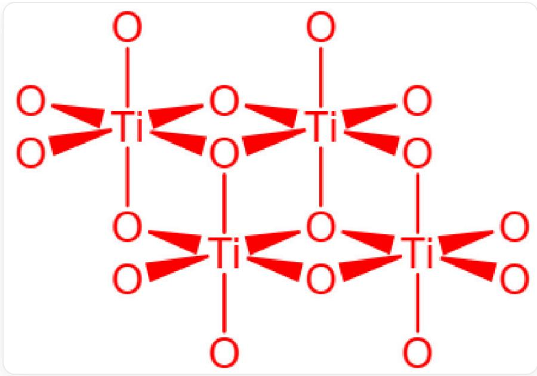

# Question

The name of element  $\mathbf{M}$  originates from Greek mythology. The element  $\mathbf{M}$  is usually prepared from a certain natural mineral, the main component of which is  $\mathbf{G}$ , containing  $31.56\%$  of  $\mathbf{M}$ . The first step in preparing the element  $\mathbf{M}$  is to treat  $\mathbf{G}$  with elemental carbon and excess chlorine gas at high temperature. The element  $\mathbf{M}$  can directly combine with nitrogen gas to form a stable golden-yellow solid  $\mathbf{A}$ , and  $\mathbf{A}$  is isostructural with NaCl. A dissolves in aqua regia to form  $\mathbf{B}$ . Adding Zn powder to a concentrated HCl solution of  $\mathbf{B}$  causes the solution to turn purple, and the solute is  $\mathbf{C}$ .  $\mathbf{B}$  is easily converted to  $\mathbf{D}$  upon exposure to air.  $\mathbf{D}$  is also very stable, insoluble in sulfuric acid or nitric acid, but soluble in hydrofluoric acid to form  $\mathbf{E}$ , and  $\mathbf{E}$  can also be used for the preparation of  $\mathbf{M}$ . Dissolving  $\mathbf{B}$  in anhydrous ethanol and passing ammonia gas through it can prepare  $\mathbf{F}$ , and the mass fraction of  $\mathbf{M}$  in  $\mathbf{F}$  is  $20.99\%$ . In the actual existing form of  $\mathbf{F}$ ,  $\mathbf{M}$  has two chemical environments, and the molecular weight does not exceed 1000.

The following statements are correct:

A. The metallic valence in  $\mathbf{A}$  is  $+4$  
B. B and C are both metal chlorides, wherein the metal valence states are  $+4$  and  $+2$ , respectively.  
C. D has multiple crystal structures, in one of which the anions form an approximate hexagonal close-packed structure, and the cations fill all the octahedral voids formed by the anions.  
D. E substance has more than 1 possible structure, and none of them are harmful to the environment.  
E. The chemical formula for preparing  $\mathbf{F}$  mentioned in the problem, after balancing and simplifying the coefficients, the sum of the coefficients on both sides of the equation are equal.  
F. In the true structure of  $\mathbf{F}$ , the O element can be connected to a maximum of 2  $\mathbf{M}$  [elements].  
G. In the real structure of  $\mathbf{F}$ , the coordination polyhedron formed by ligands around the central atom is a trigonal bipyramidal structure.

H. G ore exhibits magnetism comparable to magnetite, which is due to their similar crystal structures.  
In the equation for the first step of the  $\mathbf{G}$  preparation of  $\mathbf{M}$ , the product contains metals with valence states of  $+2$  and  $+4$ , respectively.  
J. In the equation for the first step of  $\mathbf{G}$  preparation of  $\mathbf{M}$ , after balancing and simplifying coefficients, has the sum of reactant coefficients on the left side less than the sum of product coefficients on the right side.  
K. All of the above options are incorrect.

# Answer

Correct Answer: K

# Detailed Explanation

The element  $\mathbf{M}$  from mythology is commonly found in V-Ti-Nb-Ta, etc. According to the direct combination of elemental  $\mathbf{M}$  with nitrogen gas to produce a stable golden yellow solid  $\mathbf{A}$ ,  $\mathbf{A}$  is isostructural with NaCl, it can be inferred that  $\mathbf{A}$  has a face-centered cubic structure, and the ratio of anions to cations is 1:1, so  $\mathbf{A}$  should be MN, where TiN is golden yellow. Finally, it is inferred that  $\mathbf{M}$  is Ti and  $\mathbf{A}$  is TiN. The metal valence in  $\mathbf{A}$  is  $+3$ , so A is incorrect.

# CHECKPOINT

1 PTS

M is Ti

# CHECKPOINT

1 PTS

A is TiN

A dissolves in aqua regia to form B. Zinc powder is added to the concentrated hydrochloric acid solution of B, and the solution turns purple, and the solute is C, which is purple.

Aqua regia is a strong oxidant that oxidizes  $\mathbf{M}$  to its highest stable oxidation state and forms chlorides. Therefore,  $\mathbf{B}$  is  $\mathrm{TiCl_4}$ , and  $\mathbf{C}$  is  $\mathrm{TiCl_3}$ , where  $\mathrm{Ti}^{3+}$  is purple in solution, which meets the requirements of the question, and the metal valences are  $+4$  and  $+3$  respectively, so  $\mathbf{B}$  is incorrect.

# CHECKPOINT

1 PTS

B is  $\mathrm{TiCl}_4$

# CHECKPOINT

1 PTS

C is  $\mathrm{TiCl}_3$

$\mathbf{B}$  is easily converted to  $\mathbf{D}$  when exposed to air. In addition,  $\mathbf{D}$  is also very stable, insoluble in sulfuric acid or nitric acid, but can be dissolved in hydrofluoric acid to form  $\mathbf{E}$ . It is inferred that  $\mathbf{D}$  is  $\mathrm{TiO_2}$ .  $\mathrm{TiO_2}$  has three crystal structures, namely rutile, anatase, and brookite. Among them, in the rutile structure, the anions are approximately cubic packed, and the cations fill half of the octahedral voids formed by the anions, so C is incorrect.

# CHECKPOINT

1 PTS

D is  $\mathrm{TiO}_2$

# CHECKPOINT

1 PTS

In the rutile structure, the anions are approximately cubic packed, and the cations fill half of the octahedral voids formed by the anions

D reacts with hydrofluoric acid to form E. E is  $\mathrm{H}_2[\mathrm{TiF}_6]$  or  $\mathrm{TiF}_4$ . Fluorotitanic acid is polluting to the environment, so D is incorrect.

# CHECKPOINT

1 PTS

E is  $\mathrm{H}_2[\mathrm{TiF}_6]$  or  $\mathrm{TiF}_4$

B is dissolved in anhydrous ethanol and ammonia gas is passed in to prepare F. The mass fraction of M in F is  $20.99\%$ . F is  $\mathrm{Ti}(\mathrm{OC}_2\mathrm{H}_5)_4$ . The mass fraction of Ti is  $\omega = 47.87 / (8 \times 12.01 + 20 \times 1.01 + 4 \times 16.00 + 47.87) = 20.99\%$ .

# CHECKPOINT

1 PTS

F is  $\mathrm{Ti}(\mathrm{OC}_2\mathrm{H}_5)_4$

The preparation process of  $\mathbf{F}$  can be written as  $\mathrm{TiCl_4 + 4NH_3 + 4C_2H_5OH = Ti(OC_2H_5)_4 + 4NH_4Cl}$ . The sum of the coefficients on both sides is not equal, so  $\mathrm{E}$  is incorrect.

# CHECKPOINT

1 PTS

The preparation process of  $\mathbf{F}$  can be written as

$$
\mathrm {T i C l} _ {4} + 4 \mathrm {N H} _ {3} + 4 \mathrm {C} _ {2} \mathrm {H} _ {5} \mathrm {O H} = \mathrm {T i} (\mathrm {O C} _ {2} \mathrm {H} _ {5}) _ {4} + 4 \mathrm {N H} _ {4} \mathrm {C l}
$$

The real structure of  $\mathbf{F}$  is shown in the figure, where O represents the OEt group, and the chemical formula is  $\mathrm{Ti}_4(\mathrm{OC}_2\mathrm{H}_5)_{16}$ , the mass is  $228.11 \times 4 = 912.44$ , which is less than 1000, and there are two different environments of Ti.

Real structure of substance F, where O represents the OEt group, Ti are connected by oxygen bridges, ethoxy groups form an octahedron surrounding Ti, two octahedrons on top, two staggered octahedrons on the bottom, chemical formula is  $\mathrm{Ti}_4\left(\mathrm{OC}_2\mathrm{H}_5\right)_{16}$

In the real structure of  $\mathbf{F}$ , the O element acts as an oxygen bridge and connects at most 3 Ti. The coordination polyhedron formed by the ligands around the central atom is an octahedral structure. The 4 octahedrons are divided into two layers, so F and G are incorrect.

# CHECKPOINT

1 PTS

In the real structure of  $\mathbf{F}$ , the O element acts as an oxygen bridge and connects at most 3 Ti. The coordination polyhedron formed by the ligands around the central atom is an octahedral structure. The 4 octahedrons are divided into two layers

$\mathbf{M}$  is prepared from the mineral  $\mathbf{G}$ , and the mass fraction of  $\mathbf{M}$  is  $31.56\%$ . Common Ti minerals mainly include rutile  $\mathrm{TiO}_2$  and ilmenite  $\mathrm{FeTiO}_3$ .

If  $\mathbf{G}$  is  $\mathrm{TiO}_2$ ,  $\mathrm{Ti}\% = 47.87 / (47.87 + 2 \times 16.00) = 59.9\%$ , which is inconsistent.

If  $\mathbf{G}$  is ilmenite  $\mathrm{FeTiO_3}$ ,  $\mathrm{Ti\%} = 47.87 / (55.85 + 47.87 + 3\times 16.00) = 47.87 / 151.72 = 31.55\%$ . This ore has a perovskite structure, while magnetite has a spinel structure, so the considerable magnetism does not come from structural similarity, so H is incorrect.

# CHECKPOINT

1 PTS

G is ilmenite  $\mathrm{FeTiO_3}$

# CHECKPOINT

1 PTS

Ilmenite has a perovskite structure, while magnetite has a spinel structure

The first step in preparing  $\mathbf{M}$  from  $\mathbf{G}$  is the high-temperature reaction of  $\mathbf{G}$  with carbon in chlorine gas (carbon chlorination method).

The equation is  $2\mathrm{FeTiO}_3 + 6\mathrm{C} + 7\mathrm{Cl}_2 = 2\mathrm{FeCl}_3 + 2\mathrm{TiCl}_4 + 6\mathrm{CO}$ , the sum of the coefficients on the left side is greater than the sum of the coefficients on the right side, and the metal valences of the products are  $+3$  and  $+4$  respectively, so I and J are incorrect.

# CHECKPOINT

1 PTS

Preparing M from G The equation is  $2\mathrm{FeTiO}_3 + 6\mathrm{C} + 7\mathrm{Cl}_2 = 2\mathrm{FeCl}_3 + 2\mathrm{TiCl}_4 + 6\mathrm{CO}$

The final answer is K.