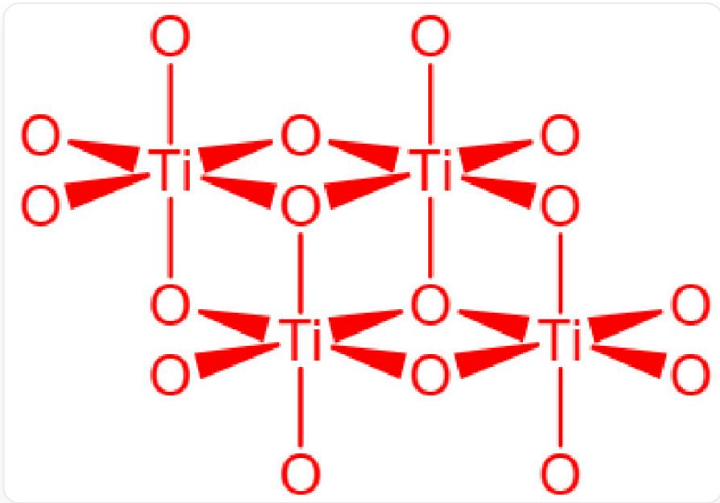

# 题目

元素M的名称来源于希腊神话。M单质常从某天然矿物制备，该矿物主要成分为G，含M  $31.56\%$  。制备M单质的第一步为G与碳单质一起用过量氯气高温处理。M单质可直接与氮气化合生成稳定的金黄色固体A，A与NaCl类质同晶。A溶于王水生成B。向B的浓HCl溶液中加入Zn粉，溶液变为紫色，其中溶质为C。B暴露在空气中易转化为D，D同样十分稳定，不溶于硫酸或硝酸，但可以溶于氢氟酸生成E，E也可用于M的制备。将B溶于无水乙醇并通入氨气可制备F，F中M质量分数为  $20.99\%$  。F实际存在形态中M有两种化学环境，分子量不超过1000。

以下说法正确的是

A. A中金属价态为 +4 价  
B. B和C都为金属氯化物，其中金属价态分别为  $+4$  价和  $+2$  价  
C. D有多种晶体结构, 其中一种晶体结构阴离子作近似六方密堆积, 阳离子填充在由阴离子构成的所有八面体空隙中  
D. E物质有大于1种的可能结构, 它们都对环境没有危害  
E. 题目中提到的制备  $\mathbf{F}$  的化学式, 配平和简化系数后, 方程式左右两边系数和相等  
F. F的真实结构中, O元素最多可以和2个M相连  
G. F的真实结构中, 配体围绕中心原子形成的配位多面体为三角双锥结构  
H. G 矿石与磁铁矿磁性相当, 这是因为他们的晶体结构类似

I. G制备M第一步的方程式中，产物包含的金属价态分别为  $+2$  价和  $+4$  价

J. G制备M第一步的方程式中，配平和化简系数后，左边反应物系数和小于右边产物系数和  
K. 以上选项均不正确

# 答案

正确答案: K

# 详细解析

来自神话的元素M较为常见的有V、Ti、Nb、Ta等，根据M单质与氮气直接化合生成稳定的金黄色固体A，A与NaCl类质同晶可以推断A为面心立方结构，阴离子阳离子比例为1：1，因此A应该为MN,其中TiN为金黄色，最终推断出M为Ti，A为TiN，A中金属价态为  $+3$  价，A错误。

# CHECKPOINT

1 PTS

M为Ti

# CHECKPOINT

1 PTS

A为TiN

A 溶于王水生成 B。B 的浓盐酸溶液中加入锌粉，溶液变为紫色，溶质为 C，颜色为紫色。

王水是强氧化剂，会将M氧化到其最高稳定氧化态，并形成氯化物。所以，B为  $\mathrm{TiCl_4}$  ，C为  $\mathrm{TiCl_3}$  其中  $\mathrm{Ti}^{3+}$  在溶液中为紫色，符合题目要求，金属价态分别为  $+4$  、  $+3$  价，B错误。

# CHECKPOINT

1 PTS

B为  $\mathrm{TiCl_4}$

# CHECKPOINT

1 PTS

C为  $\mathrm{TiCl_3}$

B 暴露在空气中易转化为 D，结合 D 同样十分稳定，不溶于硫酸或硝酸，但可以溶于氢氟酸生成 E，推断 D 为  $\mathrm{TiO}_2$ ， $\mathrm{TiO}_2$  有三种晶体结构，分别是金红石型、锐钛矿型、板钛矿型，其中金红石结构阴离子作近似立方堆积，阳离子填充在阴离子构成的八面体空隙的一半，C 错误。

# CHECKPOINT

1 PTS

D为  $\mathrm{TiO_2}$

# CHECKPOINT

1 PTS

金红石结构阴离子作近似立方堆积，阳离子填充在阴离子构成的八面体空隙的一半

D 与氢氟酸反应生成 E, E 为  $\mathrm{H}_{2}\left[\mathrm{TiF}_{6}\right]$  或者  $\mathrm{TiF}_{4}$ , 氟钛酸对环境有污染, D错误。

# CHECKPOINT

1 PTS

E为  $\mathrm{H}_2[\mathrm{TiF}_6]$  或者  $\mathrm{TiF}_4$

将B溶于无水乙醇并通入氨气可制备F，F中M质量分数为  $20.99\%$  ，F为  $\mathrm{Ti(OC_2H_5)_4}$  ,Ti的质量分数 $\omega = 47.87 / (8\times 12.01 + 20\times 1.01 + 4\times 16.00 + 47.87) = 20.99\%$  。

# CHECKPOINT

1 PTS

$\mathbf{F}$  为  $\mathrm{Ti}(\mathrm{OC}_2\mathrm{H}_5)_4$

$\mathbf{F}$  的制备过程可以写为  $\mathrm{TiCl_4 + 4NH_3 + 4C_2H_5OH = Ti(OC_2H_5)_4 + 4NH_4Cl}$ , 两边系数和不相等, E错误。

# CHECKPOINT

1 PTS

$\mathbf{F}$  的制备过程可以写为

$$
\mathrm {T i C l} _ {4} + 4 \mathrm {N H} _ {3} + 4 \mathrm {C} _ {2} \mathrm {H} _ {5} \mathrm {O H} = \mathrm {T i} (\mathrm {O C} _ {2} \mathrm {H} _ {5}) _ {4} + 4 \mathrm {N H} _ {4} \mathrm {C l}
$$

$\mathbf{F}$  的真实结构如图所示，其中O代表OEt基团，化学式为  $\mathrm{Ti_4(OC_2H_5)_16}$ ，质量为  $228.11\times 4 = 912.44$ ，小于1000，有两种不同环境的Ti。

  
物质F的真实结构，其中O代表OEt基团,Ti之间通过氧桥连接，乙氧基组成八面体将Ti围在中间，上面两个八面体，下面两个交错的八面体，化学式为  $\mathrm{Ti}_{4}(\mathrm{OC}_{2}\mathrm{H}_{5})_{16}$

F的真实结构中，O元素作为氧桥，最多连接3个Ti，配体围绕中心原子形成的配位多面体是八面体结构，4个八面体分为两层，F、G错误。

# CHECKPOINT

1 PTS

F的真实结构中，O元素作为氧桥，最多连接3个Ti，配体围绕中心原子形成的配位多面体是八面体结构，4个八面体分为两层

M从矿物G制备，M的质量分数为  $31.56\%$  。常见的Ti的矿物主要有金红石  $\mathrm{TiO_2}$  、钛铁矿  $\mathrm{FeTiO_3}$  。

如果  $\mathbf{G}$  是  $\mathrm{TiO}_2$  ，  $\mathrm{Ti\%} = 47.87 / (47.87 + 2\times 16.00) = 59.9\%$  不符。

如果  $\mathbf{G}$  是钛铁矿  $\mathrm{FeTiO_3}$ ,  $\mathrm{Ti\%} = 47.87 / (55.85 + 47.87 + 3\times 16.00) = 47.87 / 151.72 = 31.55\%$  。该矿石为钙钛矿型结构，而磁铁矿为尖晶石型结构，因此磁性相当不来自于结构相似，H错误。

# CHECKPOINT

1 PTS

G是钛铁矿  $\mathrm{FeTiO_3}$

# CHECKPOINT

1 PTS

钛铁矿为钙钛矿型结构，而磁铁矿为尖晶石型结构

通过  $\mathbf{G}$  制备  $\mathbf{M}$  的第一步是  $\mathbf{G}$  与碳在氯气中高温反应（碳氯化法）。

方程式为  $2\mathrm{FeTiO}_3 + 6\mathrm{C} + 7\mathrm{Cl}_2 = 2\mathrm{FeCl}_3 + 2\mathrm{TiCl}_4 + 6\mathrm{CO}$ ，左边系数和大于右边系数和，产物金属价态分别为  $+3$ 、 $+4$  价，I、J错误。

# CHECKPOINT

1 PTS

通过G制备M方程式为  $2\mathrm{FeTiO}_3 + 6\mathrm{C} + 7\mathrm{Cl}_2 = 2\mathrm{FeCl}_3 + 2\mathrm{TiCl}_4 + 6\mathrm{CO}$

最终答案为K。