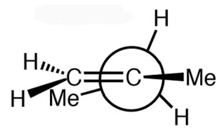
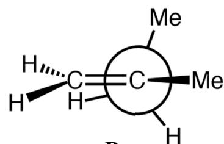
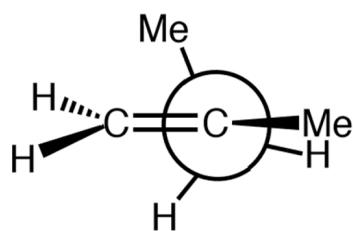
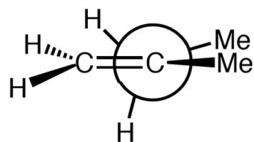

# Question

In the potential energy diagram of an organic molecule  $\mathbf{X}$  rotating around one of its bonds, the points where the first derivative of the potential energy curve is 0 correspond to the following conformations  $\mathbf{A} \sim \mathbf{D}$ :

  
A

  
B

  
C

  
D

Newman projection, the front carbon is connected to an alkenyl group  $= \mathrm{CH}_2$  and a methyl group  $\mathrm{CH}_3$  substituent, while the back carbon is connected to a methyl group  $\mathrm{CH}_3$  substituent and two hydrogens  $\mathrm{H}$ , where in A the alkenyl group of the front carbon overlaps with the methyl group of the back carbon, in B the alkenyl group of the front carbon overlaps with the hydrogen of the back carbon, in C the methyl group of the front carbon overlaps with the hydrogen of the back carbon, and in D the methyl group of the front carbon overlaps with the methyl group of the back carbon

The points where the first derivative of the potential energy curve is 0 correspond to four different energies  $1 \sim 4$  (with the lowest energy conformation as the zero point, unit kcal):  $0.00, +0.06, +1.39, +2.68$ .

Please match the conformation numbers with the energy numbers, and select the correct result from the following options.

A. All other options are incorrect

B. A-1 B-2 C-3 D-4  
C. A-3 B-2 C-1 D-4  
D. A-3 B-1 C-2 D-4  
E. A-2 B-1 C-3 D-4  
F. A-2 B-3 C-1 D-4  
G. A-1 B-2 C-4 D-3  
H. A-1 B-3 C-4 D-2  
I. A-1 B-4 C-3 D-2  
J. A-1 B-4 C-2 D-3

# Answer

Correct Answer: E

# Detailed Explanation

First, it is necessary to determine the structure of the organic molecule  $\mathbf{X}$ . According to the image, it is a Newman projection. The front carbon is connected to an alkene group  $=\mathrm{CH}_2$  and a methyl  $\mathrm{CH}_3$  substituent, while the rear carbon is connected to a methyl  $\mathrm{CH}_3$  substituent and two hydrogens H. Therefore, the SMILES of molecule  $\mathbf{X}$  can be represented as  ${}^{\backprime}\mathrm{[CH2:1]} = [\mathrm{CH:2}]([\mathrm{CH3:5}])[\mathrm{CH2:3}][\mathrm{CH3:4}]^{\prime}$ , which is 2-methyl-1-butene.

# CHECKPOINT

1 PTS

The SMILES of molecule  $\mathbf{X}$  can be represented as  $\mathrm{[CH2:1] = [CH:2]([CH3:5][CH2:3][CH3:4]}$ , which is 2-methyl-1-butene

The figure presents four different Newman conformations of SMILES [CH2:1] = [CH:2] ([CH3:5]) [CH2:3] [CH3:4] rotated along the `[C:2][C:3]` bond, where in A `[C:1]` overlaps with `[C:4]`, in B `[C:1]` overlaps with the hydrogen on `[C:3]`, in C `[C:5]` overlaps with the hydrogen on `[C:3]`, and in D `[C:5]` overlaps with `[C:4]`.

# CHECKPOINT

1 PTS

In A `[C:1]` overlaps with `[C:4]`, in B `[C:1]` overlaps with the hydrogen on `[C:3]`, in C `[C:5]` overlaps with the hydrogen on `[C:3]`, and in D `[C:5]` overlaps with `[C:4]`

Furthermore, it is necessary to examine the relative magnitude of the steric hindrance effects of each conformation to determine the relative energy levels. This mainly involves A(1,3) strain and eclipsing steric hindrance, where the

A(1,3) strain of the alkene group and the methyl group has less impact than the eclipsing steric hindrance of the two methyl groups.

# CHECKPOINT

0.5 PTS

The A(1,3) strain of the alkene group and the methyl group has less impact than the eclipsing steric hindrance of the two methyl groups

It is not difficult to find that, for  $\mathbf{B}$ , the two methyl groups in the front and back are in a staggered configuration and there is no eclipsing steric hindrance. The A(1,3) strain is only two hydrogens, which is the most stable conformation. Therefore,  $\mathbf{B}$  should correspond to energy 1.

# CHECKPOINT

1 PTS

B corresponds to energy 1

For A, there is A(1,3) strain between the methyl group and the alkene group, and there is no staggered conformation between the two methyl groups, so its energy will be slightly higher than B, corresponding to energy 2.

# CHECKPOINT

1 PTS

A corresponds to energy 2

For  $\mathbf{C} / \mathbf{D}$ , there is eclipsing strain between methyl and hydrogen or methyl, so its energy is higher than  $\mathbf{A} / \mathbf{B}$ , and the eclipsing strain between methyl and methyl is greater. Therefore, the energy of  $\mathbf{D}$  is higher than  $\mathbf{C}$ ,  $\mathbf{D}$  corresponds to energy 4, and  $\mathbf{C}$  corresponds to energy 3.

# CHECKPOINT

1 PTS

C corresponds to energy 3

# CHECKPOINT

1 PTS

D corresponds to energy 4

Finally, select option E.