# Question

Compound  $\mathbf{D}$  was obtained through the following reaction sequence.

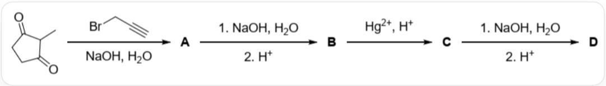

The diagram contains the following reaction: CC1C(=O)CCC1=O>BrCC#C.[O-][Na+].O[A], [A]>[O-]

$\left[\mathrm{Na}+\right]. \mathrm{O} > \left[^{\star}\right], \left[^{\star}\right] > \left[\mathrm{H}+\right] > \left[\mathrm{B}\right], \left[\mathrm{B}\right] > \left[\mathrm{Hg} + + \right]. \left[\mathrm{H}+\right] > \left[\mathrm{C}\right], \left[\mathrm{C}\right] > \left[\mathrm{O}-\right] \left[\mathrm{Na}+\right]. \mathrm{O} > \left[^{\star}\right], \left[^{\star}\right] > \left[\mathrm{H}+\right] > \left[\mathrm{D}\right]$ , where the intermediate  $[\ast]$  is not shown in the original diagram

The chemical formula of  $\mathbf{D}$  is  $\mathrm{C_9H_{12}O_3}$ , and the molecule contains two methyl groups.

If the reaction from  $\mathbf{A}$  to  $\mathbf{B}$  is skipped and the process is directly carried out as follows, in addition to the main product  $\mathbf{D}$ , a byproduct  $\mathbf{D}'$  is also obtained.

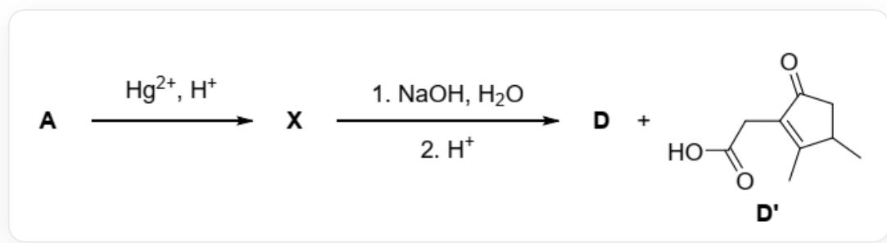

[A]  $\rightharpoondown$  [Hg++].[H+]  $\rightharpoonup$  [X], [X]  $\rightharpoonup$  [O-][Na+].O  $\rightharpoonup$ $[^{*}]$  ,  $[^{*}] > [\mathrm{H} + ] > [\mathrm{D}]$  .[D'], where the structure of  $\mathbf{D}'$  is CC1CC(=O)C(=C1C)CC(=O)O

Determine how many times ring-opening and ring-closing reactions occur in total during the reaction mechanism from  $\mathbf{X}$  to  $\mathbf{D}'$ .

A. 1

B. 2  
C. 3  
D. 4  
E. 5  
F. 6  
G. 7  
H. 8  
1. 9  
J. 10

# Answer

Correct Answer: F

# Detailed Explanation

The initial substrate is  $\mathrm{CC1C(=O)CCC1 = O}$

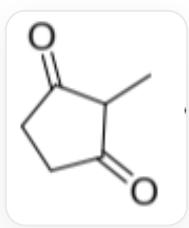  
CC1C(=O)CCC1=O

in the presence of haloalkyne BrCC#C,

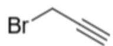  
BrCC#C

and under basic aqueous solution conditions, alkylation occurs, and a propargyl group is attached to the common  $\alpha$ -carbon of the two carbonyl groups, yielding A, C#CCC1(C)C(=O)CCC1=O.

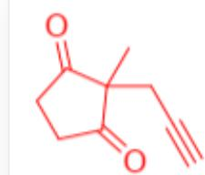  
C#CCC1(C)C(=O)CCC1=O

# CHECKPOINT

1 PTS

A propargyl group is attached to the common  $\alpha$  position of the two carbonyl groups of the substrate

# CHECKPOINT

1 PTS

A is C#CCC1(C)C(=O)CCC1=O

In an aqueous NaOH solution, the carbonyl carbon of A is attacked by  $\mathrm{OH}^{-}$ , followed by ring-opening, breaking the bond between it and the common  $\alpha$ -carbon of the diketone, and subsequent acidification yields the product B bearing a carboxyl group, C#CCC(C)C(=O)CCC(=O)O.

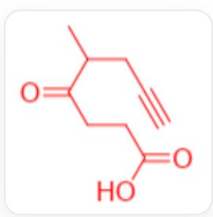  
C#CCC(C)C(=O)CCC(=O)

# CHECKPOINT

1 PTS

The carbonyl carbon of  $\mathbf{A}$  is attacked by hydroxide and the ring opens, and acidification yields  $\mathbf{B}$  bearing a carboxyl group

# CHECKPOINT

1 PTS

B is C#CCC(C)C(=O)CCC(=O)O

From  $\mathbf{B}$  to  $\mathbf{C}$ , under acidic mercuric ion conditions, hydration of the terminal alkyne occurs, generating  $\mathbf{C}$  with a methyl ketone structure,  $\mathrm{CC}(\mathrm{CC}(= \mathrm{O})\mathrm{C})\mathrm{C}(= \mathrm{O})\mathrm{CCC}(= \mathrm{O})\mathrm{O}$ .

CC(CC(=O)C)C(=O)CCC(=O)O

# CHECKPOINT

1 PTS

Hydration of the terminal alkyne of  $\mathbf{B}$  yields  $\mathbf{C}$  with a methyl ketone structure

# CHECKPOINT

1 PTS

C is CC(CC(=O)C)C(=O)CCC(=O)O

The ketone carbonyl group near the end of the C molecule undergoes condensation with the  $\alpha$  position of the central ketone carbonyl group under basic conditions, eliminating one molecule of water, generating the five-membered ring product D, CC1=C(CC(=O)O)C(=O)C(C)C1.

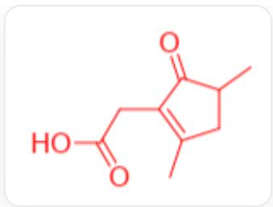

CC1=C(CC(=O)O)C(=O)C(C)C1

# CHECKPOINT

1 PTS

C undergoes dehydration condensation to generate the five-membered ring product D

# CHECKPOINT

1 PTS

D is CC1=CC(=O)O)C(=O)C(C)C1

The molecular formula of  $\mathbf{D}$  is  $\mathrm{C_9H_{12}O_3}$ . Compared with  $\mathbf{A}$ , it has more  $\mathrm{C_3H_4O}$ , which is equivalent to replacing one hydrogen atom with a propargyl group and adding one molecule of water, which is consistent with the above reasoning.

# CHECKPOINT

1 PTS

Compared with A, D is equivalent to replacing one hydrogen atom with a propargyl group and adding one molecule of water

It can be seen that there are indeed two methyl groups in the D molecule.

Next, analyze the process of  $\mathbf{A}\to \mathbf{X}\to \mathbf{D} + \mathbf{D}'$

From  $\mathbf{A}$  to  $\mathbf{X}$ , again under acidic mercuric ion conditions, the terminal alkyne is oxidized to a methyl ketone, so the structure of  $\mathbf{X}$  is CC(=O)CC1(C)C(=O)CCC1=O,

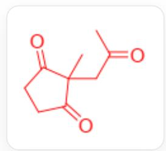  
CC(=O)CC1(C)C(=O)CCC1=O

# CHECKPOINT

1 PTS

X is CC(=O)CC1(C)C(=O)CCC1=O

Under basic aqueous solution conditions,  $\mathbf{X}$  is attacked by the nucleophile  $\mathrm{OH}^{-}$ . Through a ring-opening - proton transfer - ring-closing process,  $\mathbf{D}$  can also be obtained. The intermediates involved are

$$
\mathrm {C C} (= \mathrm {C} (\mathrm {C C C} (= \mathrm {O}) [ \mathrm {O} - ]) [ \mathrm {O} - ]) \mathrm {C C} (= \mathrm {O}) \mathrm {C},
$$

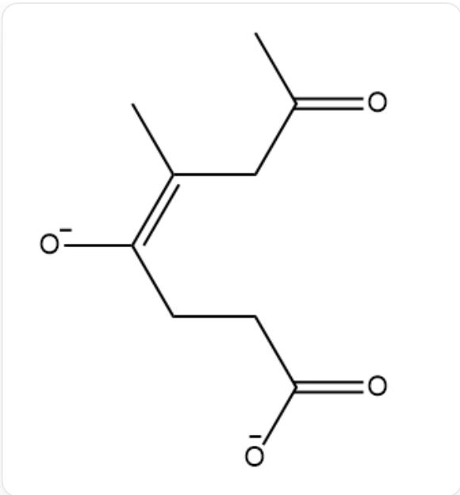  
CC(=C(CCC(=O)[O-])[O-])CC(=O)C

and

$$
\mathrm {C C} (\mathrm {C C} (= \mathrm {O}) \mathrm {C}) \mathrm {C} (= \mathrm {C C C} (= \mathrm {O}) [ \mathrm {O} - ]) [ \mathrm {O} - ].
$$

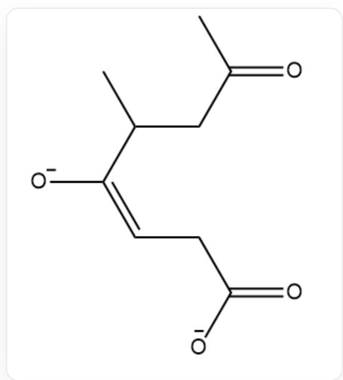  
CC(CC(=O)C)C(=CCC(=O)[O-])[O-]

If  $\mathrm{OH}^{-}$  does not act as a nucleophile to attack, but deprotonation occurs, then the subsequent reaction is:

# CHECKPOINT

1 PTS

$\mathrm{OH}^{-}$  acts as a base to remove the  $\alpha$ -position proton of the exocyclic carbonyl group in  $\mathbf{X}$

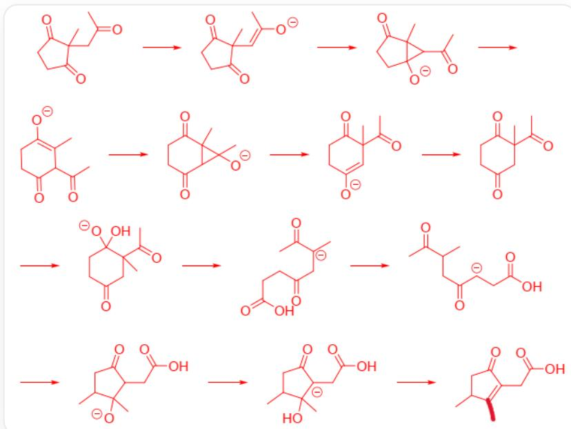  
图中涉及13个分子或离子，通过箭头连接成一串，按顺序分别为CC(=O)CC1(C)C(=O)CCC1=O,  
C/C(=C\C1(C)C(=O)CCC1=O)/[O], CC(=O)C1C2(C)C(=O)CCC12[O], CC1=C(CCC(=O)C1C(=O)C)[O],  
CC12C  $(= 0)$  CCC  $(= 0)$  C1C2(C)[O], CC  $(= 0)$  C1(C)C=C(CCC1=O)[O], CC  $(= 0)$  C1(C)CC  $(= 0)$  CCC1=O,  
CC(=O)C1(C)CC(=O)CCC1(O)[O], CC(=O)[C-](C)CC(=O)CCC(=O)O, CC(CC(=O)[C-]CC(=O)O)C(=O)C,

The specific process is that the  $\alpha$ -position of the exocyclic carbonyl group of  $\mathbf{X}$  is deprotonated to generate C/C(=C\C1(C)C(=O)CCC1=O)/[O]

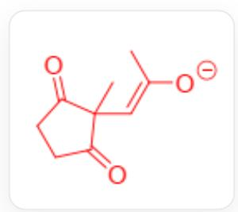  
CC1CC(=O)C(CC(=O)O)C1(C)[O], CC1CC(=O)[C-](CC(=O)O)C1(C)O, CC1CC(=O)C(=C1C)CC(=O)O  
C/C(=C\C1(C)C(=O)CCC1=O)/[O]

The enolate anion attacks the carbonyl carbon to obtain the [3.1.0] bridged ring  $\mathrm{CC(=O)C1C2(C)C(=O)CCC12[O]}$

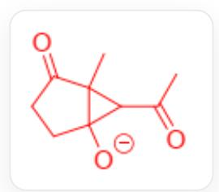

CC  $(= 0)$  C1C2(C)C  $(= 0)$  CCC12[O]

The carbon-carbon bond breaks to obtain an enolate anion with a six-membered ring structure CC1=C(CCC(=O)C1C(=O)C)[O]

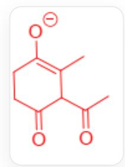

CC1=C(CCC(=O)C1C(=O)C)[O]

The enolate anion attacks the exocyclic carbonyl group to obtain the [4.1.0] bridged ring CC12C(=O)CCC(=O)C1C2(C)[O]

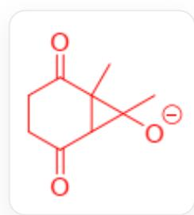

CC12C(=O)CCC(=O)C1C2(C)[O]

Ring opening yields another rearranged enolate anion  $\mathrm{CC(=O)C1(C)C = C(CCC1 = O)[O]}$

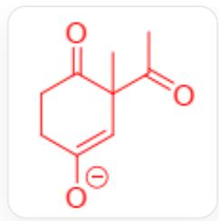

$\mathrm{CC(=O)C1(C)C = C(CCCC1 = O)[O]}$

Protonation yields CC(=O)C1(C)CC(=O)CCC1=O

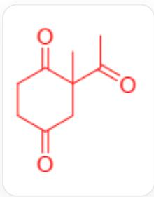

CC(=O)C1(C)CC(=O)CCC1=O

The carbonyl group is attacked by an external hydroxyl group  $\mathrm{CC(=O)C1(C)CC(=O)CCC1(O)[O]}$

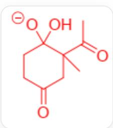

CC(=O)C1(C)CC(=O)CCC1(O)[O]

Ring opening yields the carboxylic acid intermediate  $\mathrm{CC(=O)[C-]}$  (C)CC(=O)CCC(=O)O

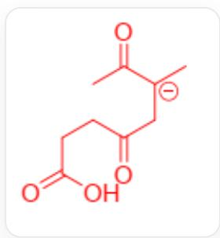

CC(=O)[C-](C)CC(=O)CCC(=O)O

Proton transfer generates CC(CC(=O)[C-]CC(=O)O)C(=O)C

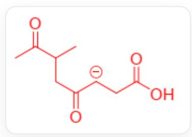

CC(CC(=O)[C-]CC(=O)O)C(=O)C

Ring closure generates the five-membered ring CC1CC(=O)C(CC(=O)O)C1(C)[O]

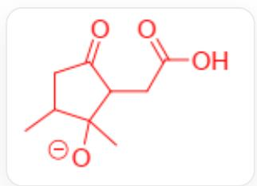

CC1CC(=O)C(CC(=O)O)C1(C)[O]

Proton transfer generates CC1CC(=O)[C-]  $(\mathrm{CC}(= \mathrm{O})\mathrm{O})\mathrm{C}1(\mathrm{C})\mathrm{O}$

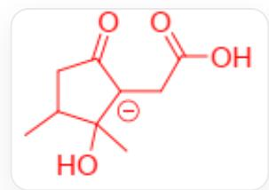

CC1CC(=O)[C-](CC(=O)O)C1(C)O

Hydroxyl leaves to generate  $\mathbf{D}'$  CC1CC  $(= 0)\mathrm{C} (= \mathrm{C}1\mathrm{C})\mathrm{CC} (= 0)\mathrm{O}$ .

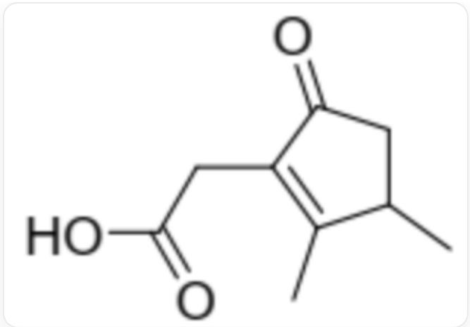  
CC1CC  $(= 0)$  C  $(= 1$  CC  $(= 0)$  O

In the above process, a total of 3 ring closures and 3 ring openings occurred, so the total number of ring closures and ring openings involved is 6.

# CHECKPOINT

1 PTS

3 ring closures, 3 ring openings