# 题目

人们通过以下反应得到了化合物D。

  
图中包含如下反应：CC1C(=O)CCC1=O>BrCC#C.[O-][Na+].O>A，[A]>[O-][Na+].O>[*]，[*]>[H+]>[B]，[B]>[Hg++].[H+]>[C]，[C]>[O-][Na+].O>[*]，[*]>[H+]>[D]，中间体[*]原图未画出

D 的化学式为  $\mathrm{C}_{9} \mathrm{H}_{12} \mathrm{O}_{3}$ , 分子中有两个甲基。

若不进行A到B的反应，而直接按如下过程反应，则除得到主产物D外，还得到副产物  $\mathbf{D}^{\prime}$  。

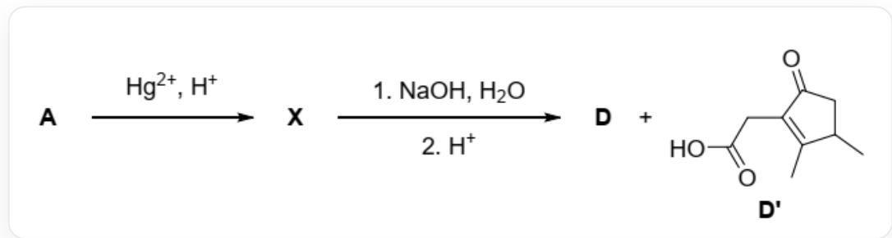  
[A]  $\rightharpoondown$  [Hg++].[H+]  $\rightharpoonup$  [X], [X]  $\rightharpoonup$  [O-][Na+].O  $\rightharpoonup$  [*, ], [*/]  $\rightharpoonup$  [H+]  $\rightharpoonup$  [D].[D'], 其中\mathsf{mathbf{b}}f\{\mathsf{D}^{\prime}\}结构为 CC1CC(=O)C(=C1C)CC(=O)O

求在从  $\mathbf{X}$  到  $\mathbf{D}'$  的反应机理中，开环和关环反应加起来总共发生了几次。

A. 1  
B. 2  
C. 3

D. 4  
E. 5  
F. 6  
G. 7  
H. 8  
1. 9  
J. 10

# 答案

正确答案: F

# 详细解析

一开始的底物CC1C(=O)CCC1=O,

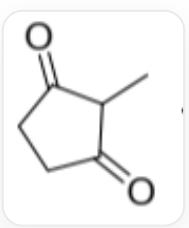  
CC1C(=O)CCC1=O

在卤代烃BrCC#C,

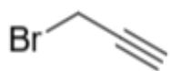  
BrCC#C

以及碱性水溶液条件下，发生烷基化，在两个羰基的共同  $\alpha$ -碳上连上了炔丙基，得到A，C#CCC1(C)C(=O)CCC1=O。

  
C#CCC1(C)C(=O)CCC1=O

# CHECKPOINT

1 PTS

在底物两个羰基的共同α位连上炔丙基

# CHECKPOINT

1 PTS

A为C#CCC1(C)C(=O)CCC1=O

A 在  $\mathrm{NaOH}$  水溶液中, 羰基碳被  $\mathrm{OH}^{-}$  进攻, 随后开环, 断开其与双羰基共同  $\alpha$ -碳之间的键, 之后酸化得到带有羧基的产物 B, C#CCC(C)C(=O)CCC(=O)O。

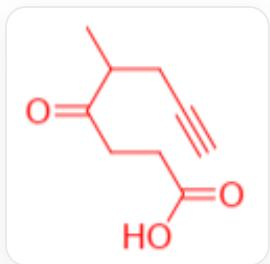

$$
\mathrm {C} \# \mathrm {C C C} (\mathrm {C}) \mathrm {C} (= \mathrm {O}) \mathrm {C C C} (= \mathrm {O})
$$

# CHECKPOINT

1 PTS

A 的羰基碳被氢氧根进攻并开环, 酸化得到带羧基的  $\mathrm{B}$

# CHECKPOINT

1 PTS

B 为C#CCC(C)C(=O)CCC(=O)O

从B到C，酸性汞离子条件，为端炔基的水合，生成具有甲基酮结构的C，CC(CC(=O)C)C(=O)CCC(=O)O。

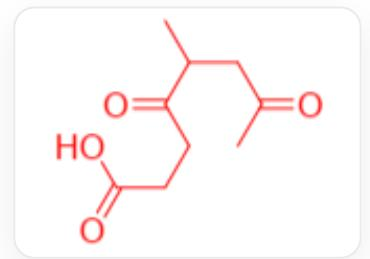

CC(CC(=O)C)C(=O)CCC(=O)O

# CHECKPOINT

1 PTS

B的端炔基水合得到具有甲基酮结构的C

# CHECKPOINT

1 PTS

C为CC(CC(=O)C)C(=O)CCC(=O)O

C 分子中靠近末端的酮羰基在碱性条件下与中部酮羰基的  $\alpha$  位发生缩合, 脱去 1 分子水, 生成五元环产物 D , CC1= C(CC(=O)O)C(=O)C(C)C1。

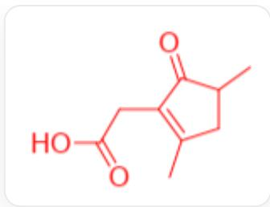

CC1=C(CC(=O)O)C(=O)C(C)C1

# CHECKPOINT

1 PTS

C脱水缩合生成五元环产物D

# CHECKPOINT

1 PTS

D 为CC1=C(CC(=O)O)C(=O)C(C)C1

D 的分子式为  $\mathrm{C}_{9} \mathrm{H}_{12} \mathrm{O}_{3}$ , 与 A 相比, 多了  $\mathrm{C}_{3} \mathrm{H}_{4} \mathrm{O}$ , 相当于将一个氢原子替换成炔丙基并多了一分子水,这与上述推理相符。

# CHECKPOINT

1 PTS

D与A相比，相当于将一个氢原子替换成炔丙基并多了一分子水

可以看到D的分子中确实存在两个甲基。

接下来分析  $\mathbf{A} \to \mathbf{X} \to \mathbf{D} + \mathbf{D}'$  的过程。

A 到 X，同样是酸性汞离子条件，将端炔基氧化为甲基酮，故 X 的结构为CC(=O)CC1(C)C(=O)CCC1=O,

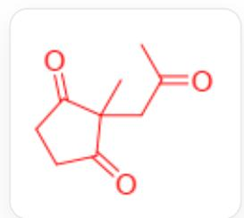  
CC(=O)CC1(C)C(=O)CCC1=O

# CHECKPOINT

1 PTS

X为CC  $(= 0)$  CC1(C)C  $(= 0)$  CCC1  $= 0$

X在碱性水溶液条件下，受亲核试剂  $\mathrm{OH}^{-}$  进攻，经过开环- 质子转移- 关环过程同样可以得到D，涉及的中间体为

$\mathrm{CC(=C(CCC(=O)[O-])[O-])CC(=O)C,}$

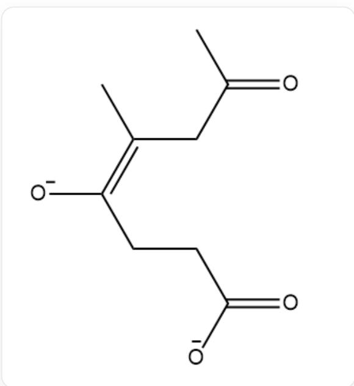  
CC(=C(CCC(=O)[O-][O-])CC(=O)C

和

$\mathrm{CC(CC(=O)C)C(=CCC(=O)[O-])[O-]_{\circ}}$

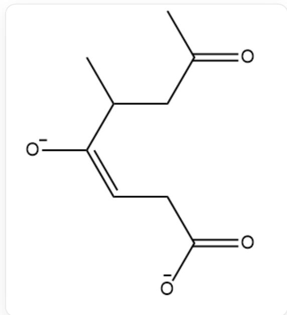

CC(CC(=O)C)C(=CCC(=O)[O-])[O-]

若  $\mathrm{OH}^{-}$  并未作为亲核试剂进攻，而是发生了去质子化，则后续反应为：

# CHECKPOINT

1 PTS

$\mathrm{OH}^{-}$ 作碱, 将  $\mathbf{X}$  中环外羰基的  $\alpha$  位质子拔除

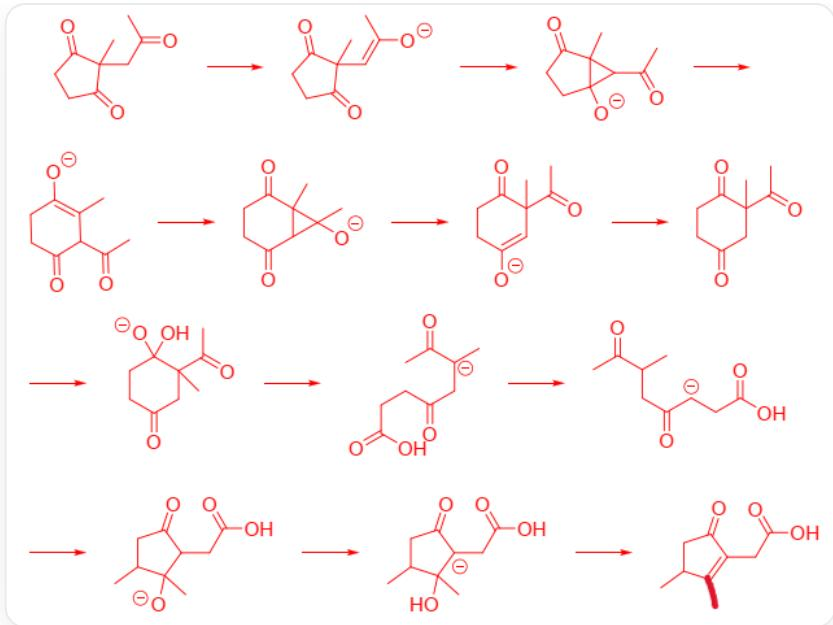

图中涉及13个分子或离子，通过箭头连接成一串，按顺序分别为CC(=O)CC1(C)C(=O)CCC1=O,

$$
C / C (= C \backslash C 1 (C) C (= O) C C C 1 = O) / [ O ], C C (= O) C 1 C 2 (C) C (= O) C C C 1 2 [ O ], C C 1 = C (C C C (= O) C 1 C (= O) C) [ O ],
$$

$$
C C 1 2 C (= O) C C C (= O) C 1 C 2 (C) [ O ], \quad C C (= O) C 1 (C) C = C (C C C 1 = O) [ O ], \quad C C (= O) C 1 (C) C C (= O) C C C 1 = O,
$$

$$
C C (= O) C 1 (C) C C (= O) C C C 1 (O) [ O ], \quad C C (= O) [ C - ] (C) C C (= O) C C C (= O) O, \quad C C (C C (= O) [ C - ] C C (= O) O) C (= O) C,
$$

$$
C C 1 C C (= O) C (C C (= O) O) C 1 (C) [ O ], \quad C C 1 C C (= O) [ C - ] (C C (= O) O) C 1 (C) O, \quad C C 1 C C (= O) C (= C 1 C) C C (= O) O
$$

具体过程为  $\mathbf{X}$  环外基的  $\alpha$  位去质子, 生成  $\mathrm{C} / \mathrm{C} (= \mathrm{C} \backslash \mathrm{C} 1 (\mathrm{C}) \mathrm{C} (= \mathrm{O}) \mathrm{CC} \mathrm{C} 1 = \mathrm{O}) / [ \mathrm{O} ]$

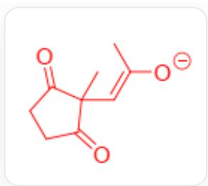

$$
\mathrm {C} / \mathrm {C} (= \mathrm {C} \backslash \mathrm {C} 1 (\mathrm {C}) \mathrm {C} (= \mathrm {O}) \mathrm {C C C} 1 (= \mathrm {O}) / [ \mathrm {O} ]
$$

烯醇负离子进攻羰基碳得到[3.1.0]桥环CC(=O)C1C2(C)C(=O)CCC12[O]

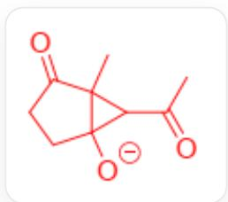

$$
C C (= O) C 1 C 2 (C) C (= O) C C C 1 2 [ O ]
$$

碳碳键断开得到具有六元环结构的烯醇负离子CC1=C(CCC(=O)C1C(=O)C)[O]

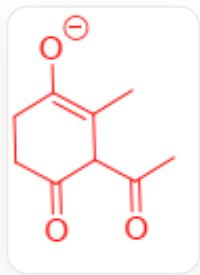

CC1=C(CCC(=O)C1C(=O)C)[O]

烯醇负离子进攻环外羰基得到[4.1.0]桥环CC12C(=O)CCC(=O)C1C2(C)[O]

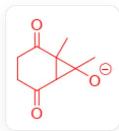

CC12C(=O)CCC(=O)C1C2(C)[O]

开环得到重排的另一种烯醇负离子CC(=O)C1(C)C=C(CCC1=O)[O]

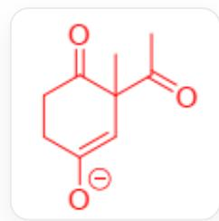

CC(=O)C1(C)C=C(CCCC1=O)[O]

质子化，得到CC(=O)C1(C)CC(=O)CCC1=O

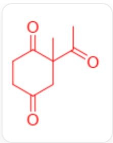

CC(=O)C1(C)CC(=O)CCC1=O

羰基被外来羟基进攻CC(=O)C1(C)CC(=O)CCC1(O)[O]

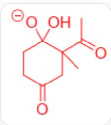

CC(=O)C1(C)CC(=O)CCC1(O)[O]

开环得到羧基中间体  $\mathrm{CC}(= 0)[\mathrm{C} - ](\mathrm{C})\mathrm{CC}(= 0)\mathrm{CCC}(= 0)\mathrm{O}$

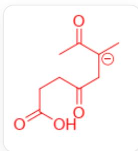

CC(=O)[C-]（C)CC(=O)CCC(=O)O

质子转移，生成CC(CC(=O)[C-]-CC(=O)O)C(=O)C

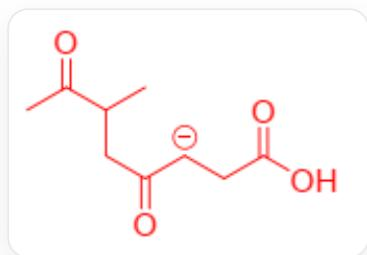

CC(CC(=O)[C-]CC(=O)O)C(=O)C

关环生成五元环CC1CC(=O)C(CC(=O)O)C1(C)[O]

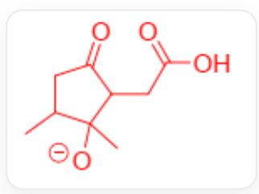  
CC1CC(=O)C(CC(=O)O)C1(C)[O]

质子转移，生成CC1CC(=O)[C-](CC(=O)O)C1(C)O

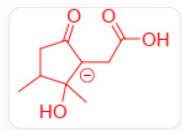  
CC1CC(=O)[C-](CC(=O)O)C1(C)O

羟基离去生成  $\mathbf{D}^{\prime}$  CC1C=C(CC(=O)O)C(=O)C1。

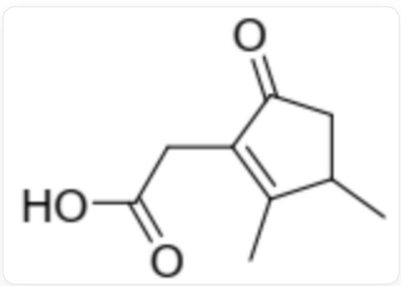  
CC1CC  $(= 0)\mathrm{C}(\equiv \mathrm{C}1\mathrm{C})\mathrm{CC}(\equiv 0)\mathrm{O}$

在上述过程中，总共发生了3次关环，3次开环，故涉及到的关环和开环次数总和为6。

# CHECKPOINT

1 PTS

3次关环，3次开环