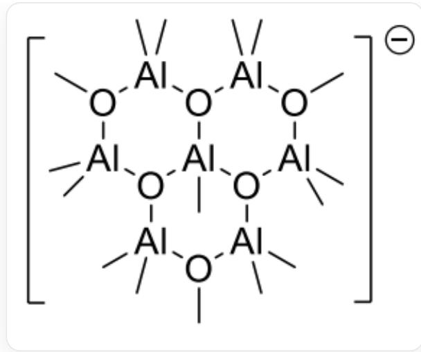

# Question

Given that a certain organoaluminum compound contains the anion  $\left[\mathrm{Al}_{7} \mathrm{O}_{6} \mathrm{C}_{16} \mathrm{H}_{48}\right]^{-}$ , in which both aluminum and oxygen have two different chemical environments, which of the following statements is correct:

A. The aluminum-aluminum bond exists in this anion.  
B. The anion contains 3 six-membered rings.  
C. Two chemical environments have 3 and 4 aluminum atoms respectively.  
D. The anion contains both two-coordinate and three-coordinate oxygen atoms.  
E. There are a total of 3 carbon-oxygen bonds in this anion.  
F. The anion contains an aluminum atom coordinated to 4 oxygen atoms.

# Answer

Correct Answer: E

# Detailed Explanation

Based on the carbon-to-hydrogen ratio, it is speculated that all carbon and hydrogen exist in the form of methyl (or methoxy) groups and do not participate in the construction of the framework, while the framework can only consist of 7 aluminum atoms and 6 oxygen atoms. Since the aluminum-oxygen bond is very stable, aluminum and oxygen should exist alternately in the framework. According to the principle of maximizing symmetry, it is inferred that the framework consists of three six-membered rings.

# CHECKPOINT

1 PTS

The framework contains three six-membered rings

One aluminum atom is shared by 3 rings, and the other aluminum and oxygen atoms are arranged alternately around it. Thus, three oxygen atoms connect three aluminum atoms, and the other three oxygen atoms each connect two aluminum atoms. Aluminum has a  $+3$  valence, with a total of 21 positive charges, so 22 negative charges are required. The three oxygen atoms connecting three aluminum atoms have a total of 6 negative charges, so the remaining 16 negative charges are from 13 methyl groups and 3 methoxy groups. All aluminum atoms have a tetrahedral configuration, so the 6 aluminum atoms at the edges each connect to 2 methyl groups, and the central aluminum atom connects to 1 methyl group, resulting in the structure of the anion:

The structure of the anion is C[O-]1[Al+](C)(C)[O-]([Al+](C)(C)[O-](C)[Al+]2(C)C)[Al]([O-]2[Al+](C)(C)[O-](C) [Al+]3(C)C)(C)[O-]3[Al+]1(C)C

# CHECKPOINT

2 PTS

The structure of the anion is  $\mathrm{[C[O - ]1[Al + ](C)(C)[O - ]([Al + ](C)(C)[O - ](C)[Al + ]2(C)C)[Al]([O - ]2[Al + ])}$  (C) [O-](C)[Al+]3(C)C)(C)[O-]3[Al  $^+$  ]1(C)C])

There are two chemical environments for aluminum atoms: 1 aluminum atom is coordinated by 2 methyl groups and 2 oxygen atoms, and 5 aluminum atoms are coordinated by 1 methyl group and 3 oxygen atoms. Options A and C are incorrect.

There are two chemical environments for oxygen atoms: 3 oxygen atoms are coordinated by 3 aluminum atoms, and 3 oxygen atoms are coordinated by 2 aluminum atoms and 1 methyl group. Option E is correct, and options D and F are incorrect.

There are three six-membered rings in the structure, so option B is incorrect.