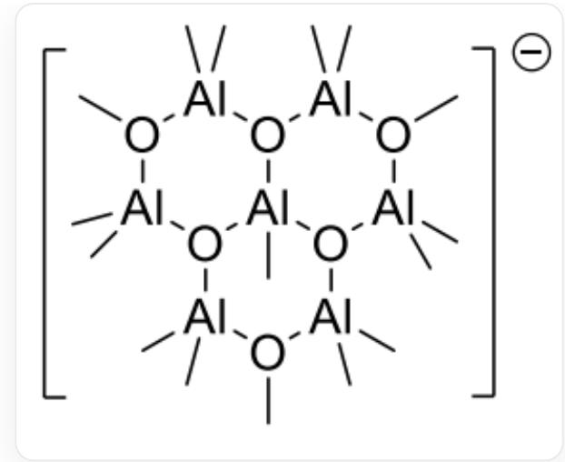

# 题目

已知某有机铝化合物中含有  $\left[\mathrm{Al}_{7} \mathrm{O}_{6} \mathrm{C}_{16} \mathrm{H}_{48}\right]^{-}$ 阴离子，其中的铝和氧都有两种不同的化学环境，下列说法正确的是：

A. 该阴离子中存在铝-铝键  
B. 该阴离子中有且仅有2个六元环  
C. 两种化学环境的铝原子分别有3个和4个  
D. 该阴离子中有二配位和三配位的氧原子  
E. 该阴离子中一共有3根碳氧键  
F. 该阴离子中存在与4个氧原子配位的铝原子

# 答案

正确答案: E

# 详细解析

根据碳氢比例，推测碳和氢全部以甲基（或甲氧基）形式存在，不参与骨架的构建，而骨架只能是7个铝原子和6个氧原子。而铝氧键非常稳定，因此铝和氧在骨架种应该间隔存在。根据对称性尽可能高的原则，推断骨架为三个六元环。

# CHECKPOINT

1 PTS

骨架含有三个六元环

其中一个铝原子为3个环共用，其他的铝和氧在四周间隔排列，由此有三个氧原子是连接三个铝的，另外三个氧原子各连接两个铝。铝为  $+3$  价，共有21个正电荷，因此需要22个负电荷。三个连接三个铝的氧原子共有6个负电荷，因此其余16个负电荷为13个甲基和3个甲氧基。所有铝均为四面体构型，则边缘的6个铝各连接2个甲基，中心的铝连接1个甲基，这样就得到了阴离子的结构：

阴离子的结构为C[O-]1[Al+](C)(C)[O-]([Al+](C)(C)[O-](C)[Al+]2(C)C)[Al]([O-]2[Al+](C)(C)[O-](C)[Al+]3(C)C)(C)[O-]3[Al+]1(C)C

# CHECKPOINT

2 PTS

阴离子的结构为[C[O-]1[Al+](C)(C)[O-]([Al+](C)(C)[O-](C)[Al+]2(C)C)[Al]([O-]2[Al+](C)(C)[O-](C)[Al+]3(C)C)(C)[O-]3[Al+]1(C)C])

铝原子有两种化学环境：1个铝原子被2个甲基和2个氧原子配位，5个铝原子被1个甲基和3个氧原子配位。A和C选项错误。

氧原子有两种化学环境：3个氧原子被3个铝原子配位，3个氧原子被2个铝原子和1个甲基配位。E选项正确，D和F选项错误。

该结构中有三个六元环，B选项错误。