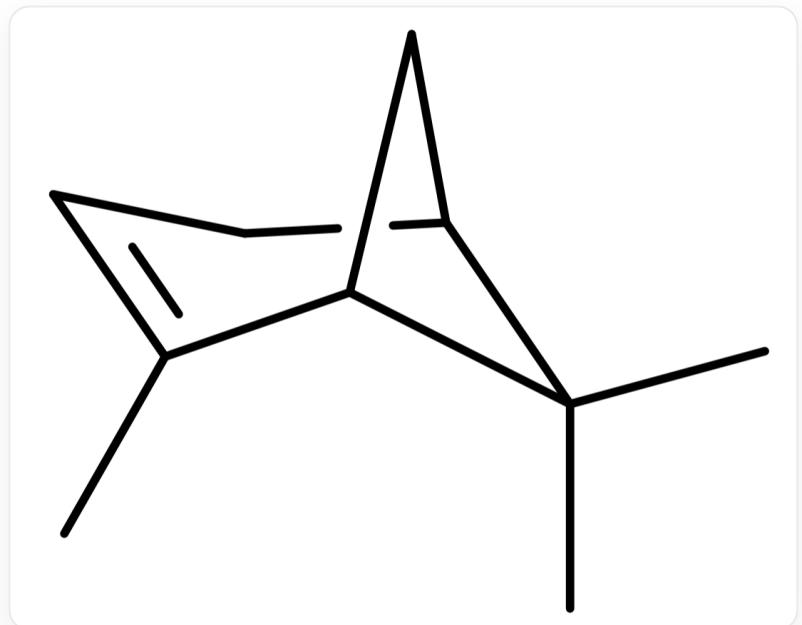
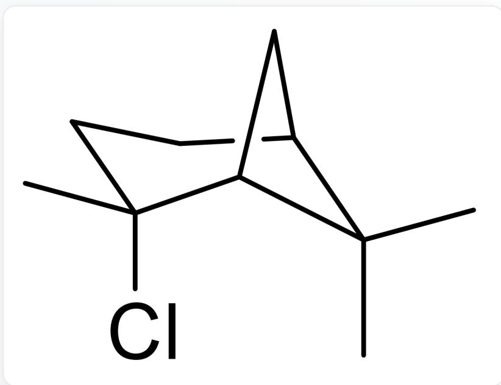
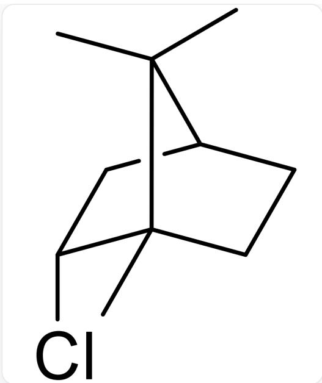
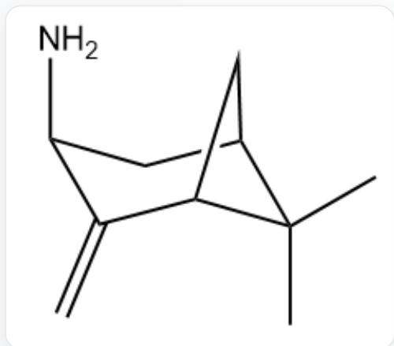
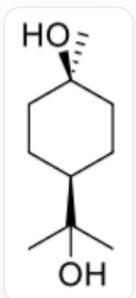
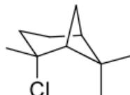
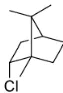
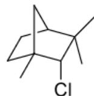
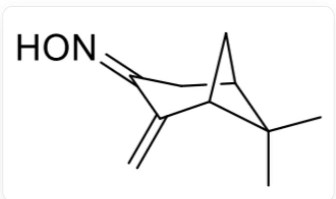
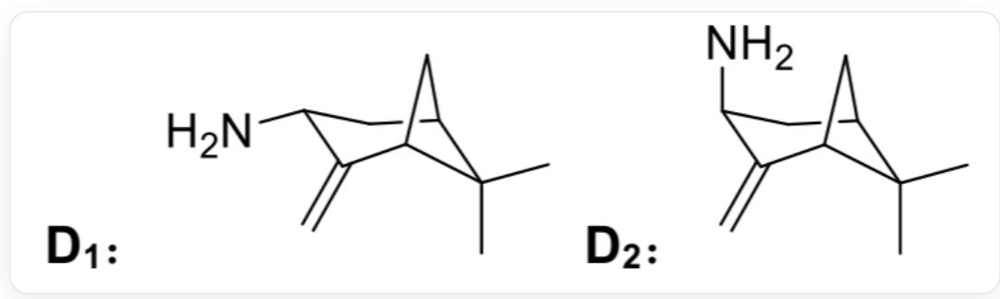

# Question

The structure of  $(-)-\alpha$ -pinene is shown in the figure.

  
[C@H]12C[C@H](CC=C1C)C2(C)C

The specific rotation of a solution of  $(-)$ - $\alpha$ -pinene is  $-50.7^{\circ}$ .  $(-)$ - $\alpha$ -Pinene is mixed with its enantiomer in a certain ratio, and the specific rotation of the resulting solution is  $-12^{\circ}$ . Calculate the enantiomeric excess e.e. of the mixture.

(-)-  $\alpha$ -Pinene is added to  $5\% \mathrm{H}_2\mathrm{SO}_4$  to generate an optically inactive product  $\mathbf{A}$ .

At low temperature,  $(-)$ - $\alpha$ -pinene reacts with one equivalent of HCl in diethyl ether to produce  $\mathbf{B}_1$  and  $\mathbf{B}_2$ . If the reaction is carried out at room temperature, the products are  $\mathbf{B}_3$  and a small amount of  $\mathbf{B}_4$ . The formation of  $\mathbf{B}_1, \mathbf{B}_2, \mathbf{B}_3, \mathbf{B}_4$  all proceed through a single intermediate.  $\mathbf{B}_1$  and  $\mathbf{B}_2$  are stereoisomers, and  $\mathbf{B}_3$  and  $\mathbf{B}_4$  are constitutional isomers. The rate of elimination reaction with sodium ethoxide:  $\mathbf{B}_2 > \mathbf{B}_1$ .

(-)-  $\alpha$ -Pinene reacts with NOCl, and then treated with KOH to generate compound C. C is treated with  $\mathrm{Zn} / \mathrm{CH}_3\mathrm{COOH}$  to obtain stereoisomers  $\mathbf{D_1}$  and  $\mathbf{D_2}$ . The rate of reaction with 2-chloropentane:  $\mathbf{D_1} > \mathbf{D_2}$ .

Which of the following options is correct:

A. All options other than A and B are incorrect.  
B. Other than A and B, more than 1 option is correct.  
C. The e.e. value of the mixture is greater than  $25\%$  
D. The molecular weight of  $\mathbf{A}$  is less than 170.

E. The structure of  $\mathbf{B_1}$  is

C1C[C@](Cl)(C)[C@@]2(C[C@@]1([H])C2(C)C)[H]

F.  $\mathbf{B}_{4}$  's structure is

C1[C@@H][Cl][C@]2(C)C(C)(C)[C@H]1CC2

G. The structure of  $D_{1}$  is

C1[C@H](N)C(=C)[C@@H]2C[C@H]1C2(C)C

# Answer

Correct Answer: A

# Detailed Explanation

Mixture's enantiomeric excess e.e.  $= \left|\left[\alpha\right]_{\text {mix }}\right| / \left|\left[\alpha\right]_{\text {pure }}\right| \times 100 \% = 12 / 50.7 = 23.7 \%$

It can be seen that e.e. is no greater than  $25\%$ . Therefore, option C is incorrect.

# CHECKPOINT

0.5 PTS

e.e.  $= 23.7\%$  , option C is incorrect

Under  $5\% \mathrm{H}_2\mathrm{SO}_4$  conditions,  $\alpha$ -pinene is protonated to obtain a carbocation, undergoing ring-opening and addition to obtain A as shown in the figure below:

CC(O)([C@H]1CC[C@@H](O)CC1)C

The molecular formula is  $\mathrm{C_{10}H_{20}O_2}$ , and the molecular weight is 172.26, option D is incorrect.

# CHECKPOINT

1 PTS

A's molecular formula is  $\mathrm{C_{10}H_{20}O_2}$ , molecular weight is 172.26, greater than 170, option D is incorrect

# CHECKPOINT

1 PTS

A 's structure is CC(O)([C@H]1CC[C@@H](O)CC1)

The classical pinene-hydrochloric acid reaction proceeds through a unique non-classical carbocation intermediate. At low temperatures, the chloride anion is rapidly intercepted, yielding a pair of stereoisomeric chlorides  $\mathbf{B}_1,\mathbf{B}_2$ . At higher temperatures, it is further converted to structurally isomeric  $\mathbf{B}_3,\mathbf{B}_4$  via Wagner-Meerwein rearrangement (commonly described as bornyl chloride  $\mathbf{B}_3$  and a small amount of fenchyl chloride  $\mathbf{B}_4$  in biology), which are structural isomers of each other.

The elimination rates (sodium ethoxide) of  $\mathbf{B}_1$  and  $\mathbf{B}_2$  are different,  $\mathbf{B}_2 > \mathbf{B}_1$ , reflecting the difference in the accessibility of their trans-elimination (trans-coplanar geometry), which is consistent with the two stereoisomers (same skeleton) obtained at low temperatures.

# CHECKPOINT

1 PTS

$\mathbf{B}_1$  undergoes E2 elimination reaction slower than  $\mathbf{B}_2$ , indicating that  $\mathbf{B}_1$  is a trans structure, option E is incorrect

The  $\mathbf{B}_4$  structure given in option F does not match the corresponding relationship between the skeleton and the substitution position of the classical minor product (anisole/anisyl chloride), which is incorrect.

  
B1:  
B2:

  
B3:

  
B4:

$\mathbf{B}_{1}$  : C1C[C@@](Cl)(C)[C@@]2(C[C@@]1([H])C2(C)C)[H];  $\mathbf{B}_{2}$  : C1C[C@@](Cl)(C) [C@@]2(C[C@@]1([H])C2(C)C)[H];  $\mathbf{B}_{3}$  : C1[C@@H](Cl)[C@@]2(C)C(C)(C)[C@H]1CC2;  $\mathbf{B}_{4}$  : C1C[C@@]2(C[C@H]1C(C)(C)[C@@H]2Cl)C

# CHECKPOINT

1 PTS

During this rearrangement reaction, the migration rate of the quaternary carbon is faster, and the option's structure is the major product  $\mathbf{B}_3$ , option F is incorrect

# CHECKPOINT

1 PTS

$\mathbf{B}_{1}$  's structure is C1C[C@@](Cl)(C)[C@@]2(C[C@@]1([H])C2(C)C)[H]

# CHECKPOINT

1 PTS

$\mathbf{B}_{2}$  's structure is C1C[C@](Cl)(C)[C@@]2(C[C@@]1([H])C2(C)C)[H]

# CHECKPOINT

1 PTS

$\mathbf{B}_{3}$  's structure is C1[C@@H](Cl)[C@]2(C)C(C)(C)[C@H]1CC2

# CHECKPOINT

1 PTS

$\mathbf{B}_{4}$  's structure is C1C[C@@]2(C[C@H]1C(C)(C)[C@@H]2Cl)C

The addition of  $\alpha$ -pinene and NOCl yields a chlorinated hydrocarbon containing a nitroso group. Under alkaline conditions, the nitroso group tautomerizes to an oxime, and then an elimination reaction occurs to obtain C;

C结构为C1C(=NO)C(=C)[C@]2([H])C[C@@]1([H])C2(C)C

# CHECKPOINT

1 PTS

C's structure is C1C(=NO)C(=C)[C@]2([H])C[C@@]1([H])C2(C)C

$\mathrm{Zn / AcOH}$  reduction yields the corresponding amine. The generated amine has two stereoisomers (exo/endo), where the exo-substituted amine has less steric hindrance and exhibits a more pronounced nucleophilicity, resulting in a faster substitution reaction (quaternization) with secondary haloalkanes (such as 2-chloropentane), so  $\mathbf{D}_1 > \mathbf{D}_2$ .

  
$\mathbf{D}_{1}$  结构为C1[C@@]2(C(C)(C)[C@](C2)([H])C(=C)[C@@H]1N)[H],  $\mathbf{D}_{2}$  结构为C1[C@@]2(C(C)(C)[C@](C2) $([\mathrm{H}])\mathrm{C}(= \mathrm{C})[\mathrm{C}@\mathrm{H}]1\mathrm{N})[\mathrm{H}]$

The  $\mathbf{D_1}$  structure given in option G is the endo-camphornene amine configuration, which does not match the rate comparison. Therefore, G is incorrect.

# CHECKPOINT

1 PTS

The exo-substituted amine has less steric hindrance and exhibits a more pronounced nucleophilicity, resulting in a faster substitution reaction with secondary haloalkanes

# CHECKPOINT

1 PTS

$\mathbf{D_1}$  's structure is C1[C@@]2(C(C)(C)[C@](C2)([H])C(=C)[C@@H]1N)[H]

# CHECKPOINT

1 PTS

$\mathbf{D_2}$  's structure is C1[C@@]2(C(C)(C)[C@](C2)([H])C(=C)[C@H]1N)[H]

In summary: C, D, E, F, and G are all incorrect, so A should be selected.