# 题目

$(-)-$  - 萘烯的结构如图

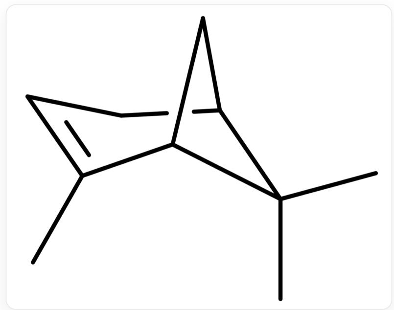  
[C@H]12C[C@H](CC=C1C)C2(C)C

(-)-  $\alpha$ -蒎烯的溶液的比旋光度为  $-50.7^{\circ}$  。将  $(-)$ - $\alpha$ -蒎烯与其对映体按一定比例混合, 所得溶液的比旋光度为  $-12^{\circ}$  。求该混合物的对映体过量 e.e.

将(-)-  $\alpha$ -蒎烯加入  $5\% \mathrm{H}_2\mathrm{SO}_4$  中,生成无旋光性的产物A。

在低温下， $(-)-\alpha-$  萘烯与一当量的HCl在乙醚中反应，产物为  $\mathbf{B}_{1}$  和  $\mathbf{B}_{2}$  。若反应在室温下进行，则产物为  $\mathbf{B}_{3}$  以及少量的  $\mathbf{B}_{4}$  。  $\mathbf{B}_{1}, \mathbf{B}_{2}, \mathbf{B}_{3}, \mathbf{B}_{4}$  的生成均只经过唯一的中间体。 $\mathbf{B}_{1}$  和  $\mathbf{B}_{2}$  为立体异构， $\mathbf{B}_{3}$  和  $\mathbf{B}_{4}$  为构造异构。与乙醇钠发生消除反应的速率： $\mathbf{B}_{2} > \mathbf{B}_{1}$  。

(-)-  $\alpha$ -蒎烯与 NOCl 反应, 再用 KOH 处理, 生成化合物 C。C 用  $\mathrm{Zn} / \mathrm{CH}_3\mathrm{COOH}$  处理得到立体异构体  $\mathbf{D}_{1}$  和  $\mathbf{D}_{2}$  。与 2-氯戊烷反应的速率:  $\mathbf{D}_{1} > \mathbf{D}_{2}$  。

下列选项正确的是：

A. 除A, B外其他选项均不正确

B. 除A, B外, 有多于1个选项正确  
C. 混合物的e.e值大于  $25\%$  
D. A 的分子量小于170  
E.  $\mathbf{B}_{1}$  的结构为

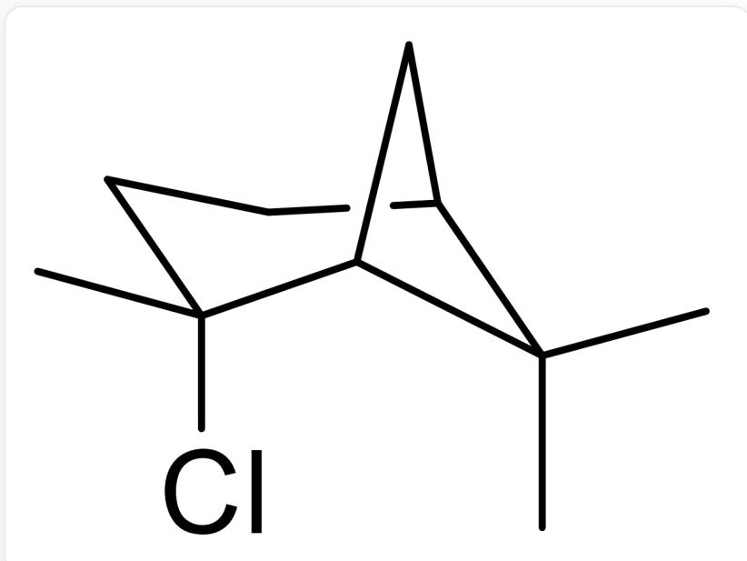

C1C[C@](Cl)(C)[C@@]2(C[C@@]1([H])C2(C)C)[H]

F.  $\mathbf{B}_{4}$  的结构为

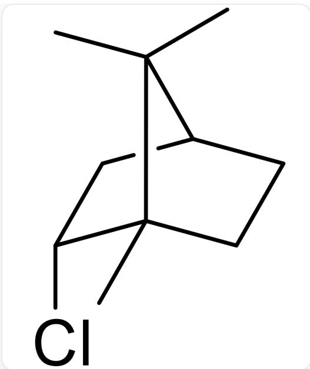

C1[C@@H][Cl][C@]2(C)C(C)(C)[C@H]1CC2

G.  $\mathbf{D}_{1}$  的结构为

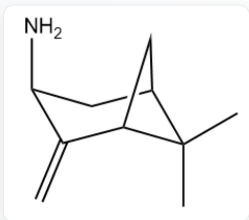

C1[C@H](N)C(=C)[C@@H]2C[C@H]1C2(C)C

# 答案

正确答案: A

# 详细解析

混合物的对映体过量 e.e. = |[α]mix|/|[α]pure|×100% = 12/50.7 = 23.7%。

由此可见e.e.并不大于  $25\%$  。故选项C错误。

# CHECKPOINT

0.5 PTS

e.e.  $= 23.7\%$  ，选项C错误

$5\% \mathrm{H}_2\mathrm{SO}_4$  条件下，  $\alpha$ -蒎烯质子化得到碳正离子，发生开环与加成，得到如下图所示的A：

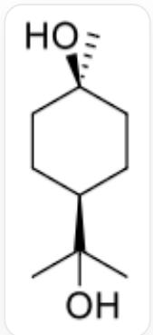

CC(O)([C@H]1CC[C@@H](O)CC1)C

分子式为  $\mathrm{C_{10}H_{20}O_2}$  ，分子量为172.26，选项D错误

# CHECKPOINT

1 PTS

A 分子式为  $\mathrm{C}_{10} \mathrm{H}_{20} \mathrm{O}_{2}$ , 分子量为 172.26, 大于 170, 选项D错误

# CHECKPOINT

1 PTS

A结构为CC(O)([C@H]1CC[C@@H](O)CC1)

经典的蒎烯-盐酸反应经唯一的非经典碳正离子中间体，低温时氯阴离子迅速截获，得到一对立体异构的氯化物  $\mathbf{B}_1, \mathbf{B}_2$ ；在较高温度经Wagner-Meerwein重排进一步转化为构造异构的  $\mathbf{B}_3, \mathbf{B}_4$ （常见表述为生物里冰片基（bornyl）氯化物  $\mathbf{B}_3$  及少量的茚烷基（fenchyl）氯化物  $\mathbf{B}_4$ ），二者互为构造异构体。

$\mathbf{B}_{1}$  与  $\mathbf{B}_{2}$  的消除（乙醇钠）速率不同， $\mathbf{B}_{2} > \mathbf{B}_{1}$ ，反映了它们在反式消除（反式共面几何）可达性上的差异，这与低温所得的两立体异构体（同一骨架）相符。

# CHECKPOINT

1 PTS

$\mathbf{B}_1$  相较  $\mathbf{B}_2$  发生E2消除反应的速率更慢，说明  $\mathbf{B}_1$  为反式结构，选项E错误

选项F给出的  $\mathbf{B}_{4}$  结构与经典的少量产物（茴香烷/茴香基氯化物）在骨架与取代位置的对应关系不符，错误。

B1:

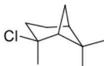

B2:

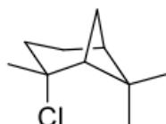

B3:

B4:

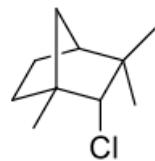

$\mathbf{B}_{1}$  : C1C[C@@](Cl)(C)[C@@]2(C[C@@]1([H])[C2(C)C)[H];  $\mathbf{B}_{2}$  : C1C[C@@](Cl)(C) [C@@]2(C[C@@]1([H])[C2(C)C)[H];  $\mathbf{B}_{3}$  : C1[C@@H](Cl)[C@@]2(C)C(C)(C)[C@H]1CC2;  $\mathbf{B}_{4}$  : C1C[C@@]2(C[C@H]1C(C)(C)[C@@H]2Cl)C

# CHECKPOINT

1 PTS

在此重排反应过程中, 季碳的迁移速率更快, 选项中的是主要产物  $\mathbf{B}_{3}$ , 选项F错误

# CHECKPOINT

1 PTS

$\mathbf{B}_{1}$  结构为C1C[C@@](Cl)(C)[C@@]2(C[C@@]1([H])C2(C)C)[H]

# CHECKPOINT

1 PTS

$\mathbf{B}_{2}$  结构为C1C[C@](Cl)(C)[C@@]2(C[C@@]1([H])C2(C)C)[H]

# CHECKPOINT

1 PTS

$\mathbf{B}_{3}$  结构为C1[C@@H](Cl)[C@]2(C)C(C)(C)[C@H]1CC2

# CHECKPOINT

1 PTS

$\mathbf{B}_{4}$  结构为C1C[C@@]2(C[C@H]1C(C)(C)[C@@H]2Cl)C

$\alpha$ -蒎烯与NOCl加成得到含有亚硝基的氯代烃，碱性条件下亚硝基互变异构为肟，再发生消除反应得到C；

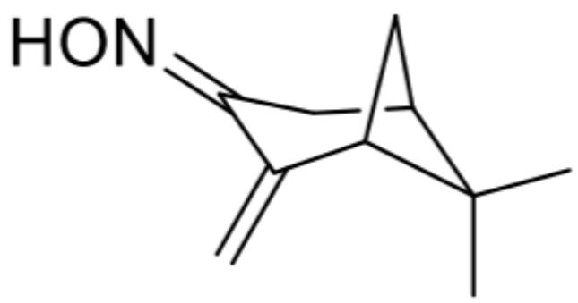

C结构为C1C(=NO)C(=C)[C@]2([H])C[C@@]1([H])C2(C)C

# CHECKPOINT

1 PTS

C结构为C1C(=NO)C(=C)[C@]2([H])C[C@@]1([H])C2(C)C

$\mathrm{Zn / AcOH}$  还原得到相应胺。生成的胺有两种立体异构（exo/endo），其中外向（exo）取代的胺位阻更小、亲核性显现更充分，对二级卤代烷（如2-氯戊烷）的取代反应（季铵化）更快，故  $\mathbf{D}_1 > \mathbf{D}_2$  。

D1:  
D2:  
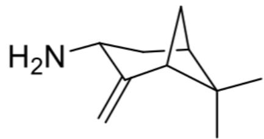  
$\mathbf{D}_{1}$  结构为C1[C@@]2(C(C)(C)[C@](C2)([H])C(=C)[C@@H]1N)[H],  $\mathbf{D}_{2}$  结构为C1[C@@]2(C(C)(C)[C@](C2) ([H])C(=C)[C@H]1N)[H]

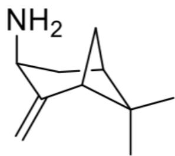

选项G给出的  $\mathbf{D}_{1}$  结构是内向（endo）的樟脑烯胺构型，不符合速率比较。故G错误。

# CHECKPOINT

1 PTS

外向（exo）取代的胺位阻更小、亲核性显现更充分，对二级卤代烷的取代反应更快

# CHECKPOINT

1 PTS

$\mathbf{D_1}$  结构为C1[C@@]2(C(C)(C)[C@](C2)([H])C(=C)[C@@H]1N)[H]

# CHECKPOINT

1 PTS

$\mathbf{D}_{2}$  结构为C1[C@@]2(C(C)(C)[C@](C2)([H])C(=C)[C@H]1N)[H]

综上：C、D、E、F、G均不成立，应选A。