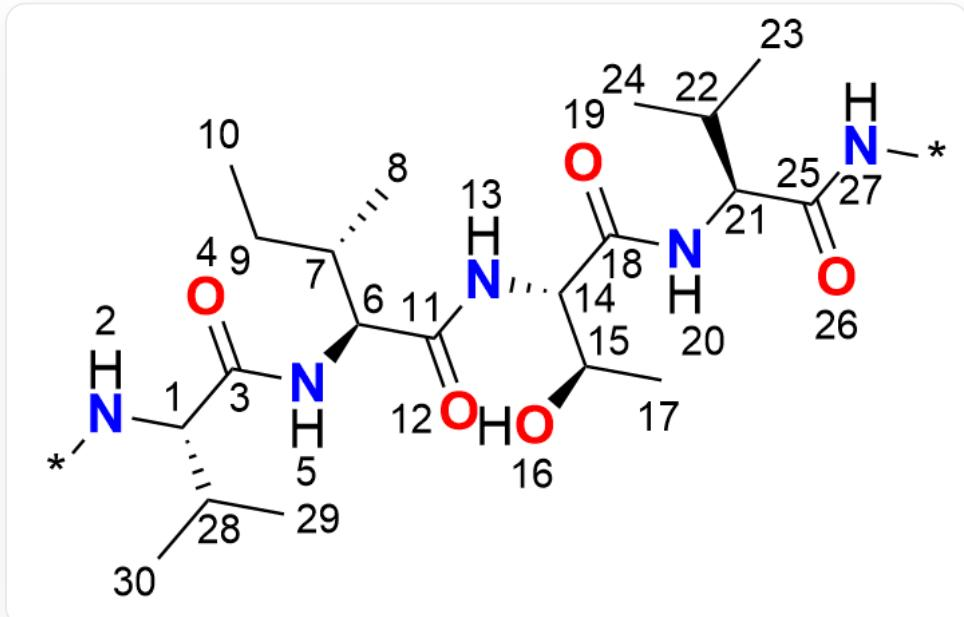
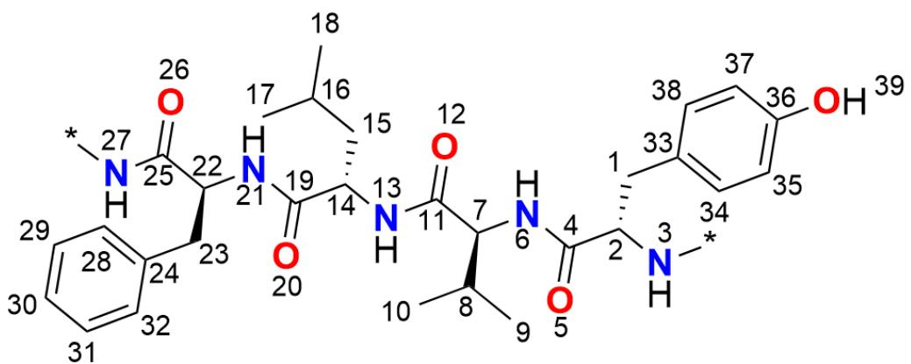

# Question

For the following two polypeptide fragments (P1/P2) in a protein:

Fragment 1 (P1) SMARTS:  $[^{*}]$ -[N:2]-[C@@:1]([C:28]([C:29])[C:30])-[C:3](=[O:4])-[N:5]-[C@@:6]([C@@:7]  
  
([C:8])[C:9]-[C:10])-[C:11](= [O:12])-[N:13]-[C@@:14]([C@@:15]([O:16])[C:17])-[C:18](= [O:19])-[N:20]-  
[C@@:21]([C:22]([C:23])[C:24])-[C:25](=[O:26])-[N:27]-[*]

Fragment 2 (P2) SMARTS:  $[\ast]$ -[N:3]-[C@@:2]([C:1]-[c:33]1[c:34][c:35][c:36]([O:39])[c:37][c:38]1)-[C:4](=  
  
\[O:5]\)-[N:6]-[C@@:7]([C:10][C:8][C:9])-[C:11](=[O:12])-[N:13]-[C@@:14]([C:15]-[C:16]([C:17])[C:18])-  
[C:19](=[O:20])-[N:21]-[C@@:22]([C:23]-[c:24]1[c:28][c:29][c:30][c:31][c:32]1)-[C:25](=[O:26])-[N:27]-[*]

The two polypeptide fragments in the protein can undergo parallel  $\beta$ -sheet and antiparallel  $\beta$ -sheet formation. It is known that in each possible folding pairing mode, only the inter-amide hydrogen bond pairing links between the fragments are considered, and the hydrogen bond links with amino acid residues outside the fragments are not considered. At the same time, the number of hydrogen bonds formed between the two polypeptide fragments is the same in each folding pairing mode.

In each of the two polypeptide fragments paired by  $\beta$ -sheet, define:

$$
S _ {1} = \sum_ {i} a _ {1, i} - \sum_ {j} h _ {1, j}
$$

$$
S _ {2} = \sum_ {i} a _ {2, i} - \sum_ {j} h _ {2, j}
$$

where the subscript  $1,2$  is used to distinguish the two polypeptide fragments,  $a_{1,i}$  represents the atomic number of the hydrogen bond acceptor in polypeptide fragment 1,  $h_{1,i}$  represents the atomic number of the hydrogen bond donor in polypeptide fragment 1,  $a_{2,i}$  represents the atomic number of the hydrogen bond acceptor in polypeptide fragment 2, and  $h_{2,i}$  represents the atomic number of the hydrogen bond donor in polypeptide fragment 2.

Further define the parameter  $z_{n}$ , the value of which is calculated as follows:

$$
z _ {n} = \left\{ \begin{array}{l l} \frac {S _ {1} \cdot S _ {2}}{\left(\operatorname* {m i n} \{S _ {1} , S _ {2} \}\right) ^ {2}} & \text {i f p a r a l l e l \beta - s h e e t} \\ \frac {S _ {1} \cdot S _ {2}}{\left(\operatorname* {m a x} \{S _ {1} , S _ {2} \}\right) ^ {2}} & \text {i f a n t i p a r a l l e l \beta - s h e e t} \end{array} \right.
$$

The subscript  $n$  represents different  $\beta$ -sheet pairing combinations forming different hydrogen bonds, and its value is  $1, 2, \dots$ .

Please observe the two polypeptide fragments and calculate the value of  $\max (z_n)$ ,  $n = 1,2,\dots$ .

A. All other options are incorrect  
B. 0.750  
C. 1.333  
D. 0.875  
E. 3.00  
F. 0.890  
G. 1.500  
H. 1.866  
1.145  
J. 1.000

# Answer

Correct Answer: F

# Detailed Explanation

First consider that for these two polypeptide fragments, there are four possible  $\beta$ -sheet pairing modes:

1. Parallel  $\beta$ -sheet:

- Hydrogen bonds (P2 atom -> P1 atom):  $27 - > 26$ ,  $20 < -20$ ,  $13 - > 12$ ,  $5 < -5$

# CHECKPOINT

0.5 PTS

Folding mode 1: Parallel sheet, hydrogen bonds (P2 atom -> P1 atom):  $27 - > 26$ ,  $20 < -20$ ,  $13 - > 12$ ,  $5 < -5$

2. Parallel  $\beta$ -sheet:

- Hydrogen bonds (P2 atom -> P1 atom):  $26 < -27$ ,  $21 - > 19$ ,  $12 < -13$ ,  $6 - > 4$

# CHECKPOINT

0.5 PTS

Folding mode 2: Parallel sheet, hydrogen bonds (P2 atom -> P1 atom):  $26 < -27$ ,  $21 \rightarrow 19$ ,  $12 < -13$ ,  $6 \rightarrow 4$

3. Antiparallel  $\beta$ -sheet:

- Hydrogen bonds (P2 atom -> P1 atom):  $26 < -5$ ,  $21 - > 12$ ,  $12 < -20$ ,  $6 - > 26$

# CHECKPOINT

0.5 PTS

Folding mode 3: Antiparallel sheet, hydrogen bonds (P2 atom -> P1 atom):  $26 < -5$ ,  $21 - > 12$ ,  $12 < -20$ ,  $6 - > 26$

4. Antiparallel  $\beta$ -sheet:

- Hydrogen bonds (P2 atom -> P1 atom):

$$
2 0 <   - 2, 1 3 - > 4, 5 <   - 1 3, 3 - > 1 9
$$

# CHECKPOINT

0.5 PTS

Folding mode 4: Antiparallel sheet, hydrogen bonds (P2 atom -> P1 atom):  $20 < -2$ ,  $13 - > 4$ ,  $5 < -13$ ,  $3 - > 19$

Further calculate the  $z_{n}$  value for each pairing combination.

1. Pairing combination one ( $z_{1}$ , parallel  $\beta$ -sheet)  
- Hydrogen bonds (P2 atom -> P1 atom):  $27 - > 26$ ,  $20 < -20$ ,  $13 - > 12$ ,  $5 < -5$  
- Fragment 1 (P1) atoms:  
- Donors  $(h_1)$  : 20, 5  
- Acceptors  $(a_{1})$  : 26, 12  
- Fragment 2 (P2) atoms:  
- Donors  $(h_2)$  : 27, 13  
- Acceptors  $(a_2)$  : 20, 5

- Calculate  $S_{1}$  and  $S_{2}$ :

$$
- S _ {1} = (2 6 + 1 2) - (2 0 + 5) = 3 8 - 2 5 = 1 3
$$

$$
- S _ {2} = (2 0 + 5) - (2 7 + 1 3) = 2 5 - 4 0 = - 1 5
$$

- Calculate  $z_{1}$ :

$$
z _ {1} = \frac {S _ {1} \cdot S _ {2}}{(\min \{S _ {1} , S _ {2} \}) ^ {2}} = \frac {1 3 \times (- 1 5)}{(\min \{1 3 , - 1 5 \}) ^ {2}} = \frac {- 1 9 5}{(- 1 5) ^ {2}} = \frac {- 1 9 5}{2 2 5} \approx - 0. 8 6 6 7
$$

# CHECKPOINT

1 PTS

$z = -0.8667$  for one pairing mode

2. Pairing combination two ( $z_2$ , parallel  $\beta$ -sheet)

- Hydrogen bonds (P2 atom -> P1 atom):  $26 < -27$ ,  $21 - > 19$ ,  $12 < -13$ ,  $6 - > 4$

- Fragment 1 (P1) atoms:

- Donors  $(h_1)$  : 27, 13

- Acceptors  $(a_{1})$ : 19, 4

- Fragment 2 (P2) atoms:

- Donors  $(h_2)$  : 21, 6

- Acceptors  $(a_2)$  : 26, 12

- Calculate  $S_{1}$  and  $S_{2}$ :

$$
\begin{array}{l} - S _ {1} = (1 9 + 4) - (2 7 + 1 3) = 2 3 - 4 0 = - 1 7 \\ - S _ {2} = (2 6 + 1 2) - (2 1 + 6) = 3 8 - 2 7 = 1 1 \\ \end{array}
$$

- Calculate  $z_{2}$ :

$$
z _ {2} = \frac {S _ {1} \cdot S _ {2}}{(\min \{S _ {1} , S _ {2} \}) ^ {2}} = \frac {- 1 7 \times 1 1}{(\min \{- 1 7 , 1 1 \}) ^ {2}} = \frac {- 1 8 7}{(- 1 7) ^ {2}} = \frac {- 1 8 7}{2 8 9} \approx - 0. 6 4 7 1
$$

# CHECKPOINT

1 PTS

$z = -0.6471$  for one pairing mode

3. Pairing combination three  $(z_{3}$  , antiparallel  $\beta$  -sheet)

- Hydrogen bonds (P2 atom -> P1 atom):  $26 < -5$ ,  $21 - > 12$ ,  $12 < -20$ ,  $6 - > 26$  
- Fragment 1 (P1) atoms:  
- Donors  $(h_1)$  : 5, 20  
- Acceptors  $(a_{1})$  : 12, 26  
- Fragment 2 (P2) atoms:  
- Donors  $(h_2)$  : 21, 6  
- Acceptors  $(a_2)$  : 26, 12  
- Calculate  $S_{1}$  and  $S_{2}$ :  
-  $S_{1} = (12 + 26) - (5 + 20) = 38 - 25 = 13$  
-  $S_{2} = (26 + 12) - (21 + 6) = 38 - 27 = 11$  
- Calculate  $z_{3}$ :

$$
z _ {3} = \frac {S _ {1} \cdot S _ {2}}{(\max \{S _ {1} , S _ {2} \}) ^ {2}} = \frac {1 3 \times 1 1}{(\max \{1 3 , 1 1 \}) ^ {2}} = \frac {1 4 3}{1 3 ^ {2}} = \frac {1 4 3}{1 6 9} \approx 0. 8 4 6 2
$$

# CHECKPOINT

1 PTS

$z = 0.8462$  for one pairing mode

4. Pairing combination four ( $z_4$ , antiparallel  $\beta$ -sheet)

$$
- S _ {1} = (4 + 1 9) - (2 + 1 3) = 2 3 - 1 5 = 8
$$

$$
- S _ {2} = (2 0 + 5) - (1 3 + 3) = 2 5 - 1 6 = 9
$$

- Hydrogen bonds (P2 atom -> P1 atom):  $20 < -2$ ,  $13 - > 4$ ,  $5 < -13$ ,  $3 - > 19$  
- Fragment 1 (P1) atoms:  
- Donors  $(h_1)$  : 2, 13  
- Acceptors  $(a_{1})$  : 4, 19  
- Fragment 2 (P2) atoms:  
- Donors  $(h_2)$ : 13, 3  
- Acceptors  $(a_{2})$ : 20, 5  
- Calculate  $S_{1}$  and  $S_{2}$ :  
- Calculate  $z_4$ :

$$
z _ {4} = \frac {S _ {1} \cdot S _ {2}}{(\max \{S _ {1} , S _ {2} \}) ^ {2}} = \frac {8 \times 9}{(\max \{8 , 9 \}) ^ {2}} = \frac {7 2}{9 ^ {2}} = \frac {7 2}{8 1} \approx 0. 8 8 8 9
$$

# CHECKPOINT

1 PTS

$$
z = 0. 8 8 8 9 \text {f o r o n e p a i r i n g m o d e}
$$

Finally, all  $z_{n}$  values are as follows:

$$
\begin{array}{l} - z _ {1} \approx - 0. 8 6 6 7 \\ - z _ {2} \approx - 0. 6 4 7 1 \\ - z _ {3} \approx 0. 8 4 6 2 \\ - z _ {4} \approx 0. 8 8 8 9 \\ \end{array}
$$

Comparing these four values, the maximum value can be obtained.

$$
\max \left(z _ {n}\right) = z _ {4} \approx \mathbf {0 . 8 9 0}
$$

Therefore, choose option  $\mathbf{F}$

# CHECKPOINT

1 PTS

Maximum value  $\max (z_n) = 0.890$ , choose option F