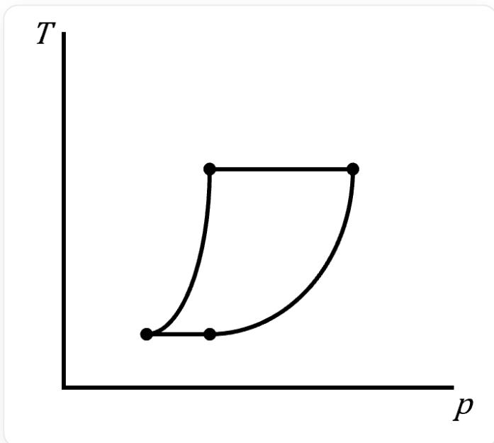
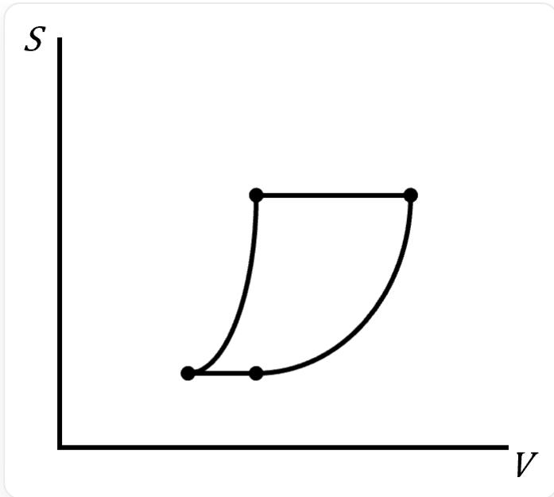
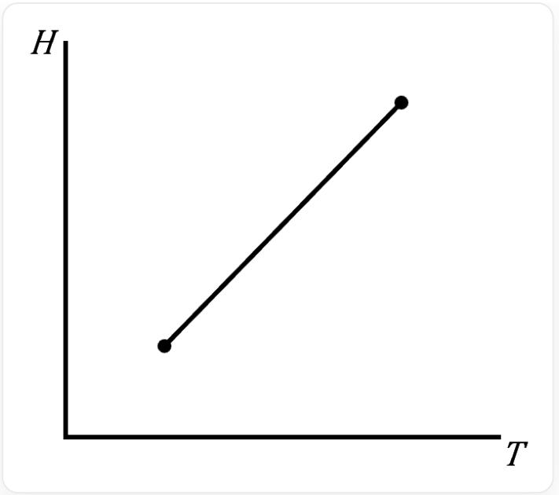
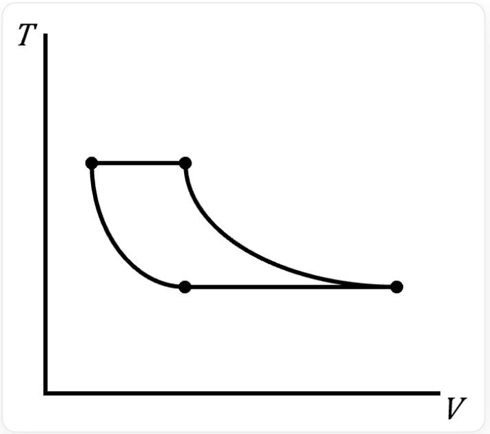

# Question

For the Carnot cycle of an ideal gas, the following are schematic diagrams of the cycle in non- $p - V$  coordinate graphs. Identify which of these are correct and select the option that includes all correct diagrams.

1.

This image is a two-dimensional line graph with two perpendicular axes, the vertical axis labeled T and the horizontal axis labeled p. The axes do not display specific numerical ranges or units. The graph shows a closed quadrilateral with four bold vertices. The left and right sides are curves, with the right curve being flatter than the left. The top and bottom sides are straight lines, with the top line longer than the bottom. Starting from the bottom-left corner, there is a right-upward convex curve, followed by a horizontal rightward line, then a left-downward convex curve, and finally a horizontal leftward line returning to the starting point. The vertices are not marked with explicit numbers or symbols. There is no title, legend, or additional text, numbers, symbols, or chemical formulas.

2.

This image is a two-dimensional line graph with two perpendicular axes, the vertical axis labeled S and the horizontal axis labeled V. The axes do not display specific numerical ranges or units. The graph shows a closed quadrilateral with four bold vertices. The left and right sides are curves, with the right curve being flatter than the left. The top and bottom sides are straight lines, with the top line longer than the bottom. Starting from the bottom-left corner, there is a right-upward convex curve, followed by a horizontal rightward line, then a left-downward convex curve, and finally a horizontal leftward line returning to the starting point. The vertices are not marked with explicit numbers or symbols. There is no title, legend, or additional text, numbers, symbols, or chemical formulas.

3.

This image is a two-dimensional line graph with two perpendicular axes, the vertical axis labeled H and the horizontal axis labeled T. The axes do not display specific numerical ranges or units. The graph shows a line segment extending from the bottom-left to the top-right, with both endpoints bold. The endpoints and the origin of the axes are nearly colinear. There is no title, legend, or additional text, numbers, symbols, or chemical formulas.

4.

This image is a two-dimensional line graph with two perpendicular axes, the vertical axis labeled T and the horizontal axis labeled V. The axes do not display specific numerical ranges or units. The graph shows a closed quadrilateral with four bold vertices. The left and right sides are curves, with the right curve being flatter than the left. The top and bottom sides are straight lines, with the top line shorter than the bottom. Starting from the top-left corner, there is a right-downward convex curve, followed by a horizontal rightward line, then a left-upward convex curve, and finally a horizontal leftward line returning to the starting point. The vertices are not marked with explicit numbers or symbols. There is no title, legend, or additional text, numbers, symbols, or chemical formulas.

A. 1,2,3  
B. 1,3,4  
C. 1,2  
D. 2,3  
E. 3,4  
F. 2,4

G. 1,4  
H. None of the above options are correct

# Answer

Correct Answer: E

# Detailed Explanation

The Carnot cycle consists of four reversible processes: isothermal expansion, adiabatic expansion, isothermal compression, and adiabatic compression.

# CHECKPOINT

0.5 PTS

The Carnot cycle consists of four reversible processes: isothermal expansion, adiabatic expansion, isothermal compression, and adiabatic compression

Examining the  $T - p$  diagram: the two isothermal processes correspond to horizontal lines, while the adiabatic process follows  $p^{1 - \gamma}T^{\gamma} = C$ , which can be rewritten as  $T = C'p^{\frac{\gamma - 1}{\gamma}}$ . Here,  $\frac{\gamma - 1}{\gamma} < 1$ , so the adiabatic segment of the  $T - p$  curve should be convex upward, not convex downward as shown in the diagram. Thus, Figure 1 is incorrect.

# CHECKPOINT

0.5 PTS

$$
T = C ^ {\prime} p ^ {\frac {\gamma - 1}{\gamma}}
$$

# CHECKPOINT

1 PTS

The adiabatic process's  $T - p$  curve should be convex upward; Figure 1 is incorrect.

Examining the  $S - V$  diagram: the two adiabatic processes have  $Q = 0$ , so  $S = 0$ , corresponding to horizontal lines. For the isothermal process,  $\Delta S = nR \cdot \ln \frac{V_2}{V_1}$ , meaning the expression for  $S$  contains a logarithmic term in  $V$ , resulting in a convex upward function. However, the diagram shows a convex downward curve, so Figure 2 is incorrect.

# CHECKPOINT

0.5 PTS

$$
\Delta S = n R \cdot l n \frac {V _ {2}}{V _ {1}}
$$

# CHECKPOINT

1 PTS

The isothermal process's  $S - V$  curve should be convex upward; Figure 2 is incorrect.

Examining the  $H - T$  diagram: For an ideal gas, the isothermal process has  $H = 0$ . Therefore, the Carnot cycle on the  $H - T$  diagram consists of only two state points. Since  $\Delta H / \Delta T = C_p$ , the line connecting these two points is straight, which is correct. Additionally, it is necessary to verify whether this line passes through the origin, as for an ideal gas,  $H \to 0$  when  $T \to 0$ . The schematic satisfies this condition as well. In summary, Figure 3 is correct.

# CHECKPOINT

0.5 PTS

The Carnot cycle on the  $H - T$  diagram consists of only two state points

# CHECKPOINT

0.5 PTS

The line connecting the two state points is straight

# CHECKPOINT

0.5 PTS

The  $H - T$  curve's extension passes through the origin of the coordinate axes

Examining the  $T - V$  diagram: the two isothermal processes correspond to horizontal lines, while the adiabatic process follows  $TV^{\gamma - 1} = C$ , so  $T = CV^{1 - \gamma}$ , which is a convex downward function. For the same temperature,  $\Delta V = V_{2} - V_{1} = \left(\frac{C_{2}}{T}\right)^{\frac{1}{\gamma - 1}} - \left(\frac{C_{1}}{T}\right)^{\frac{1}{\gamma - 1}} = C^{\prime}\left(\frac{1}{T}\right)^{\frac{1}{\gamma - 1}}$ . For  $T_{2} > T_{1}$ ,  $\Delta V_{2} < \Delta V_{1}$ , meaning the top edge of the graph is shorter than the bottom edge. In summary, Figure 4 is correct.

# CHECKPOINT

0.5 PTS

$$
T = C V ^ {1 - \gamma}
$$

# CHECKPOINT

0.5 PTS

The isothermal process's  $T - V$  curve is convex downward

# CHECKPOINT

0.5 PTS

The top edge of the  $T - V$  curve is shorter than the bottom edge

Therefore, the answer is option E.