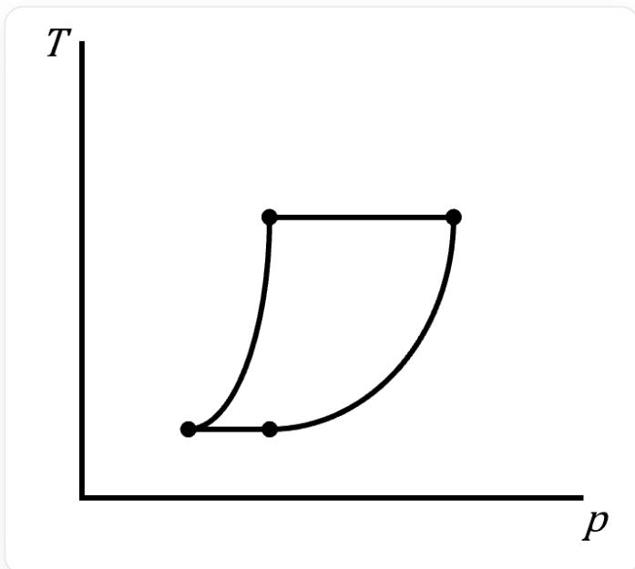
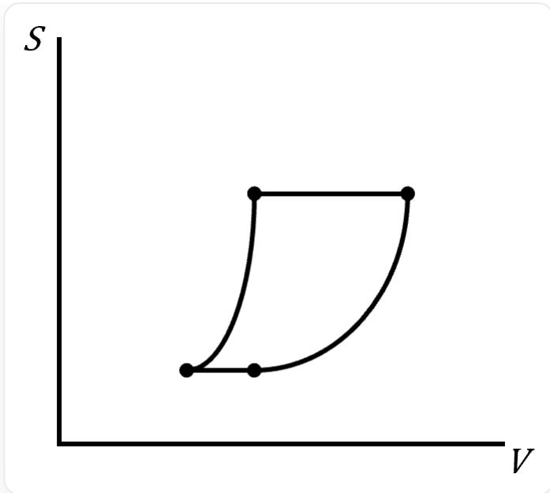
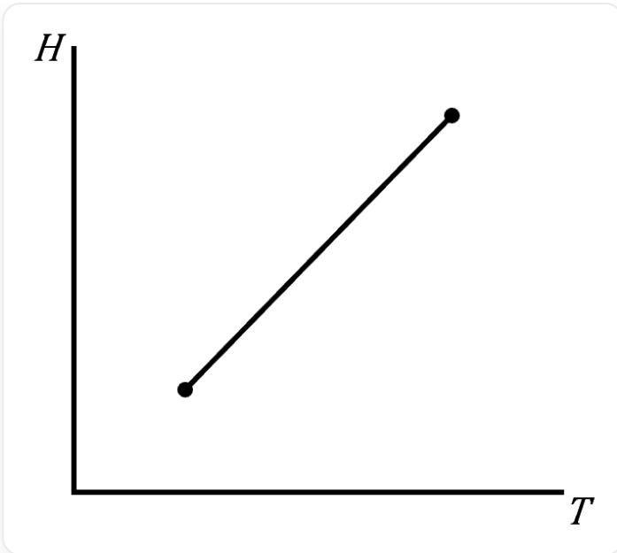
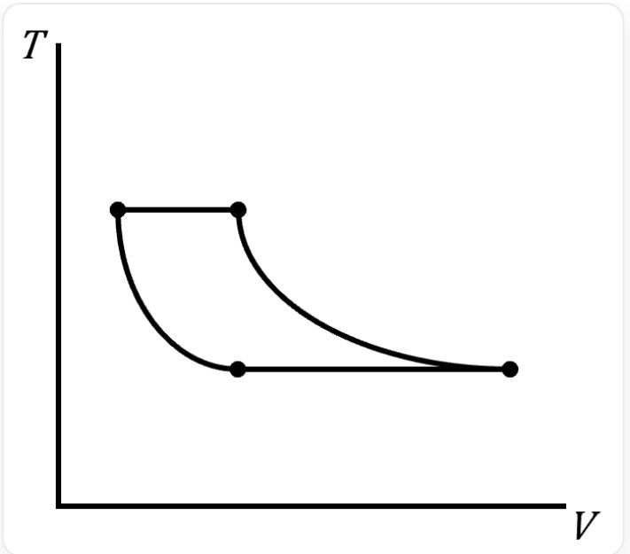

# 题目

对于理想气体的卡诺循环，以下为该循环在非  $p - V$  坐标图中的示意图，其中哪些是正确的，选出包含所有正确示意图的选项？

1.

该图像是一个二维线图，图中有两条互相垂直的坐标轴，竖直轴标记为 T，水平轴标记为 p。坐标轴上没有显示具体的数值范围或单位。图中有一个闭合的四边形，四个顶点加粗；其左侧和右侧的边为曲线，右侧曲线比左侧更平缓；顶部和底部的边为直线，顶边比底边更长。从左下角开始，先是一条向右向上倾斜且下凸的边，然后是一条水平向右的边，接着是一条向左向下倾斜且下凸的边，最后是一条水平向左的边，回到起点。四边形的顶点处没有明确的数字或符号标记。没有标题、图例，也没有额外的文字、数字、符号或化学式。

2.

该图像是一个二维线图，图中有两条互相垂直的坐标轴，竖直轴标记为S，水平轴标记为V。坐标轴上没有显示具体的数值范围或单位。图中有一个闭合的四边形，四个顶点加粗；其左侧和右侧的边为曲线，右侧曲线比左侧更平缓；顶部和底部的边为直线，顶边比底边更长。从左下角开始，先是一条向右向上倾斜且下凸的边，然后是一条水平向右的边，接着是一条向左向下倾斜且下凸的边，最后是一条水平向左的边，回到起点。四边形的顶点处没有明确的数字或符号标记。没有标题、图例，也没有额外的文字、数字、符号或化学式。

3.

该图像是一个二维线图，图中有两条互相垂直的坐标轴，竖直轴标记为H，水平轴标记为T。坐标轴上没有显示具体的数值范围或单位。图中有一条从左下一点延伸至右上一点的线段，两端点加粗；线段的两端点和坐标轴原点接近共直线。没有标题、图例，也没有额外的文字、数字、符号或化学式。

4.

该图像是一个二维线图，图中有两条互相垂直的坐标轴，竖直轴标记为 T，水平轴标记为 V。坐标轴上没有显示具体的数值范围或单位。图中有一个闭合的四边形，四个顶点加粗；其左侧和右侧的边为曲线，右侧曲线比左侧更平缓；顶部和底部的边为直线，顶边比底边更短。从左上角开始，先是一条向右向下倾斜且下凸的边，然后是一条水平向右的边，接着是一条向左向上倾斜且下凸的边，最后是一条水平向左的边，回到起点。四边形的顶点处没有明确的数字或符号标记。没有标题、图例，也没有额外的文字、数字、符号或化学式。

A. 1,2,3  
B. 1,3,4  
C. 1,2  
D. 2,3  
E. 3,4  
F. 2,4  
G. 1,4

# H. 以上选项均不对

# 答案

正确答案: E

# 详细解析

卡诺循环由四个可逆过程组成：等温膨胀、绝热膨胀、等温压缩、绝热压缩。

# CHECKPOINT

0.5 PTS

卡诺循环由四个可逆过程组成：等温膨胀、绝热膨胀、等温压缩、绝热压缩

看  $T - p$  图：两段等温过程对应水平线，而绝热过程有  $p^{1 - \gamma}T^{\gamma} = C$  ，变形得  $T = C'p^{\frac{\gamma - 1}{\gamma}}$  ，其中  $\frac{\gamma - 1}{\gamma} < 1$  ，故绝热一段的  $T - p$  图线应是上凸的，并非图中的下凸，图1错误。

# CHECKPOINT

0.5 PTS

$$
T = C ^ {\prime} p ^ {\frac {\gamma - 1}{\gamma}}
$$

# CHECKPOINT

1 PTS

绝热过程的  $T - p$  图线应是上凸的, 图1错误

看  $S - V$  图：两段绝热过程  $Q = 0$  ，故  $S = 0$  ，对应水平线。而等温过程有  $\Delta S = nR \cdot \ln \frac{V_2}{V_1}$  ，故  $S$  表达式中含  $V$  的项为对数项，为上凸函数，并非图中的下凸，图2错误。

# CHECKPOINT

0.5 PTS

$$
\Delta S = n R \cdot l n \frac {V _ {2}}{V _ {1}}
$$

# CHECKPOINT

1 PTS

等温过程的  $S - V$  图线应是上凸的，图2错误

看  $H - T$  图：对于理想气体，等温过程  $H = 0$  。所以卡诺循环在  $H - T$  图上只有两个状态点。 $\Delta H / \Delta T = C_p$  ，两状态点连线为直线，正确。此外，还需检查该直线是否过原点，因为理想气体  $T \rightarrow 0$  时  $H \rightarrow 0$  ，示意图在这一要素上也是对的。综上，图3正确。

# CHECKPOINT

0.5 PTS

卡诺循环在  $H - T$  图上只有两个状态点

# CHECKPOINT

0.5 PTS

两状态点连线为直线

# CHECKPOINT

0.5 PTS

$H - T$  图线延长线过坐标轴原点

看  $T - V$  图：两段等温过程对应水平线，而绝热过程有  $TV^{\gamma -1} = C$  ，故  $T = CV^{1 - \gamma}$  ，为下凸函数。而同一温度的  $\Delta V = V_{2} - V_{1} = \left(\frac{C_{2}}{T}\right)^{\frac{1}{\gamma - 1}} - \left(\frac{C_{1}}{T}\right)^{\frac{1}{\gamma - 1}} = C^{\prime}\left(\frac{1}{T}\right)^{\frac{1}{\gamma - 1}}$  。对于  $T_{2} > T_{1}$  ，有  $\Delta V_{2} < \Delta V_{1}$  ，所以图形的顶边短于底边。综上，图4正确。

# CHECKPOINT

0.5 PTS

$$
T = C V ^ {1 - \gamma}
$$

# CHECKPOINT

0.5 PTS

等温过程的  $T - V$  图线是下凸的

# CHECKPOINT

0.5 PTS

$T - V$  图线的顶边短于底边

所以答案是选项E。