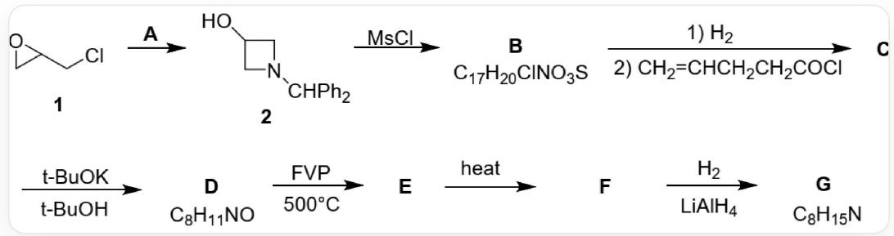

# Question

A synthetic route for  $\mathbf{G}$  is as follows:

Synthetic route: Compound 1, SMILES is ClCC1CO1, generates compound 2 in the presence of A, the SMILES of compound 2 is OC1CN(C(C2=CC=CC=C2)C3=CC=CC=C3)C1, compound 2 generates B under the action of  $M s C l$ , its chemical formula is  $C_{17}H_{20}ClNO_{3}S$ , B undergoes a one-step hydrogen reaction, a one-step reaction with C=CCCC(Cl)=O to generate C, C reacts with potassium tert-butoxide in tert-butanol to generate D with the chemical formula  $C_{8}H_{11}NO$ , D generates E under FVP conditions at  $500^{\circ}C$ , E generates F upon heating, F reacts with hydrogen and lithium aluminum hydride to generate G with the chemical formula  $C_{8}H_{15}N$

The following statements are made:

1. C has one chiral carbon atom  
2. The degree of unsaturation of  $\mathbf{C}$  is 3  
3.  $\mathbf{E}$  contains a four-membered ring  
4.  $\mathbf{G}$  has two rings  
5. A has 13 carbon atoms  
6. A can be replaced by  $NH_{3}$

Which of the following options is completely correct

A. 1,3,6  
B. 1,4  
C. 2,3,5  
D. 2,4,5  
E. 2,4,5,6  
F. 1,5,6  
G. 3,4,6  
H. 3,5,6  
I. 4,5,6  
J. 2,3,5  
K. 2,3,6  
L. All of the above options are incorrect or incomplete.

# Answer

Correct Answer: D

# Detailed Explanation

Compound 1, SMILES is ClCC1CO1, generates compound 2 under condition A. In 2, the epoxide ring opens, forming a new nitrogen-containing four-membered ring. Combined with the position of the hydroxyl group, it can be known that the nitrogen atom attacks the 1st and 3rd positions of 1. Then the structure of A is NC(C1=CC=CC=C1)C2=CC=CC=C2, containing 13 carbon atoms.

# CHECKPOINT

1 PTS

The structure of  $\mathbf{A}$  is NC(C1=CC=CC=C1)C2=CC=CC=C2, containing 13 carbon atoms, statement 5 is correct

2 generates  $\mathbf{B}$  under the action of  $M s C l$ . There is only  $1 S$  in  $\mathbf{B}$ , which should be one molecule of  $M s C l$  reacting with the hydroxyl group. Therefore, it is easy to obtain its structure as CS(OC1C[N+](C1) ([H])C(C2=CC=CC=C2)C3=CC=CC=C3)(=O)=O.[Cl-], which conforms to the chemical formula  $C_{17}H_{20}ClNO_{3}S$ .

# CHECKPOINT

1 PTS

The structure of  $\mathbf{B}$  is CS(OC1C[N+](C1)([H])C(C2=CC=CC=C2)C3=CC=CC=C3)(=O)=O.[Cl-]

The purpose of introducing the sterically hindered diphenylmethyl group on the amino group here is to prevent it from reacting with  $M s C l$ . If ammonia is used in the previous step, side reactions may occur in this step, so A

cannot be replaced with ammonia.

# CHECKPOINT

1 PTS

The purpose of introducing the sterically hindered diphenylmethyl group on the amino group is to prevent it from reacting with  $M s C l$ . If ammonia is used in the previous step, side reactions may occur in this step, so

A cannot be replaced with ammonia, statement 6 is incorrect

B is hydrogenolyzed to remove the diphenylmethyl group, and then reacted with acyl chloride C=CCCC(Cl)=O to obtain O=C(CCC=C)N1CC(OS(C)(=O)=O)C1, which is C. There is a four-membered ring and two double bonds, with a degree of unsaturation of 3, and it does not have a chiral center.

# CHECKPOINT

2 PTS

The structure of  $\mathbf{C}$  is  $O = C(CCC = C)N1CC(OS(C)(= O) = O)C1$ , which has a four-membered ring and two double bonds, with a degree of unsaturation of 3, and does not have a chiral center, statement 1 is incorrect, statement 2 is correct

After  $\mathbf{C}$  is treated with potassium tert-butoxide,  $S$  disappears, then elimination occurs to obtain  $\mathbf{D}$ :  $\mathrm{O = C(CCC = C)N1C = CC1}$ , which conforms to the chemical formula  $C_8H_{11}NO$ .

# CHECKPOINT

1 PTS

The structure of  $\mathbf{D}$  is  $O = C(CCC = C)N1C = CC1$

D undergoes four-membered ring opening under flash vacuum pyrolysis conditions at  $500^{\circ} \mathrm{C}$  to obtain  $\mathbf{E}$ :  $\mathrm{O} = \mathrm{C}(\mathrm{CCC} = \mathrm{C}) / \mathrm{N} = \mathrm{C} / \mathrm{C} = \mathrm{C}$

# CHECKPOINT

1 PTS

The structure of  $\mathbf{E}$  is  $O = C(CCC = C) / N = C / C = C$ , does not contain a four-membered ring, statement 3 is incorrect

E undergoes a Diels-Alder reaction upon heating to obtain  $\mathbf{F}$  : O=C1N2C=CCCC2CC1

# CHECKPOINT

1 PTS

The structure of  $\mathbf{F}$  is  $O = C1N2C = CCCC2CC1$

F hydrogenates to reduce the double bond, and lithium aluminum hydride reduces the amide to amine, to obtain

$\mathbf{G}$ : N12CCCCC1CCC2, which conforms to the chemical formula  $C_8H_{15}N$ , and has two rings.

# CHECKPOINT

1 PTS

The structure of  $\mathbf{G}$  is N12CCCCC1CCC2, the chemical formula has two rings, statement 4 is correct

Select option D