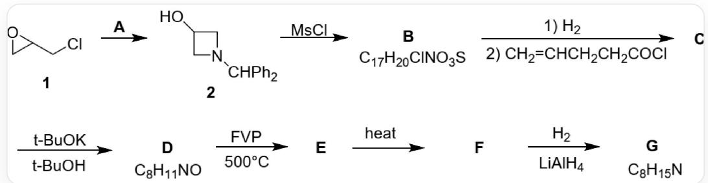
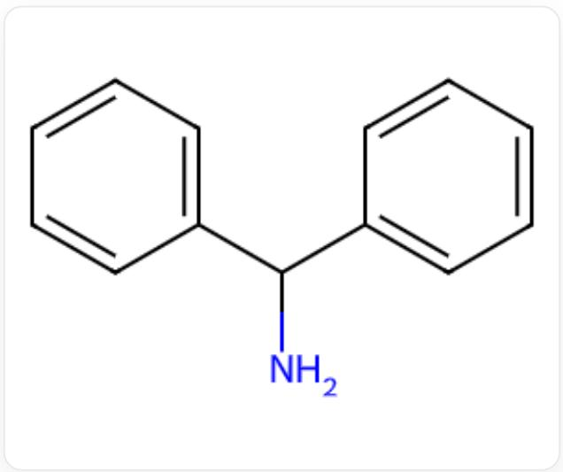
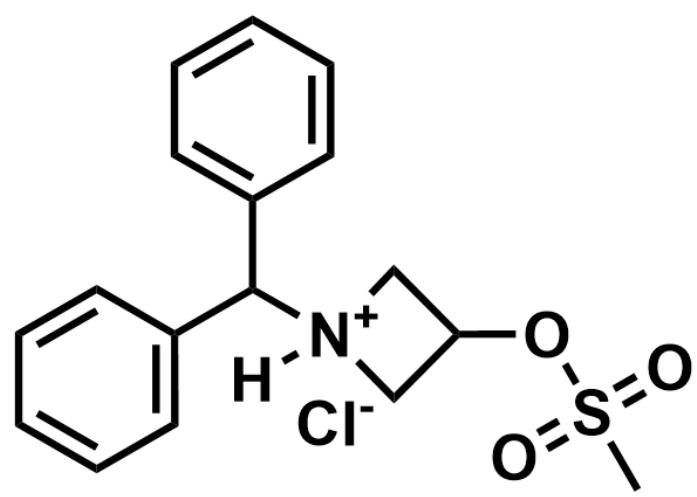
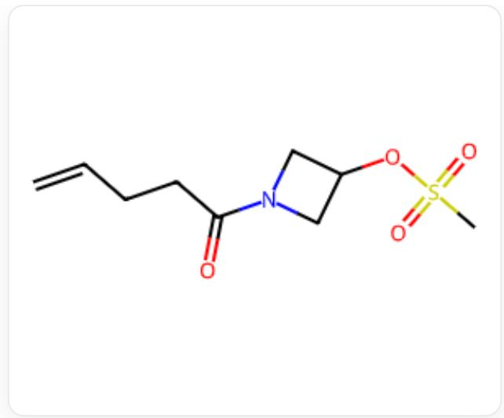
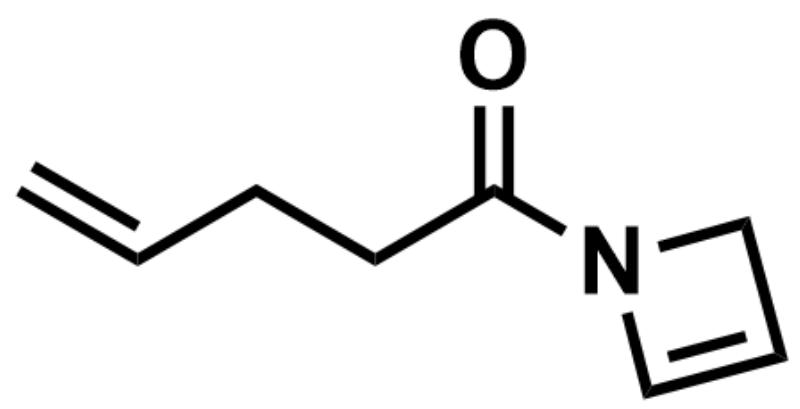
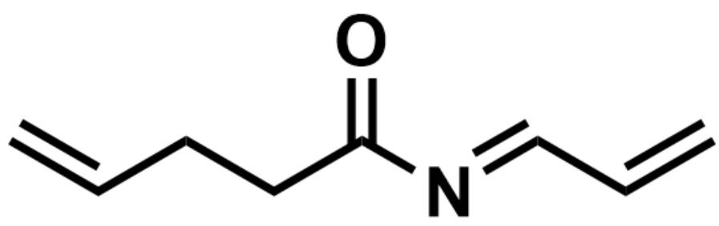
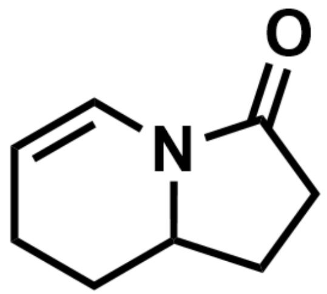
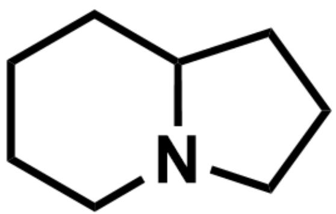

# 题目

$\mathbf{G}$  的一种合成路线如下：

合成路线：化合物1，SMILES为CICC1CO1，在A的存在下生成化合物2，化合物2的SMILES为

OC1CN(C(C2=CC=CC=C2)C3=CC=CC=C3)C1，化合物2在MsCl作用下生成B，其化学式为

$C_{17}H_{20}ClNO_{3}S$ ， $\backslash \mathrm{bf}\{B\}$ 在经历一步氢气反应，一步与  $C = CCCC(Cl) = O$  反应后生成 $\backslash \mathrm{bf}\{C\}$ ， $\backslash \mathrm{bf}\{C\}$ 在叔丁醇中与叔丁醇钾反应生成化学式为C_8H_11NO的 $\backslash \mathrm{bf}\{D\}$ ， $\backslash \mathrm{bf}\{D\}$ 在500°C的FVP条件下生成 $\backslash \mathrm{bf}\{E\}$ ， $\backslash \mathrm{bf}\{E\}$ 加热生成 $\backslash \mathrm{bf}\{F\}$ ， $\backslash \mathrm{bf}\{F\}$ 与氢气、氢化铝锂反应生成化学式为C_8H_15N的 $\backslash \mathrm{bf}\{G\}$

有以下说法：

1. C中有一个手性碳原子  
2.C的不饱和度为3  
3.E 含有四元环  
4. G 中有两个环  
5. A中有13个碳原子  
6. A 可以用  $N H_{3}$  替代

下列选项中完全正确的是

A. 1,3,6

B. 1,4  
C. 2,3,5  
D. 2,4,5  
E. 2,4,5,6  
F. 1,5,6  
G. 3,4,6  
H. 3,5,6  
I. 4,5,6  
J. 2,3,5  
K. 2,3,6  
L. 以上选项均不正确或不完整

# 答案

正确答案: D

# 详细解析

化合物1，SMILES为ClCC1CO1，在条件A的作用下生成化合物2，2中环氧打开，形成了新的含氮四元环，结合羟基位置，可以知道是氮原子进攻1的1号位和3号位，则A的结构为NC(C1=CC=CC=C1)C2=CC=CC=C2，含13个碳原子

  
NC(C1=CC=CC=C1)C2=CC=CC=C2

CHECKPOINT

1 PTS

A 的结构为  $\mathrm{NC}(\mathrm{C} 1 = \mathrm{CC} = \mathrm{CC} = \mathrm{C} 1) \mathrm{C} 2 = \mathrm{CC} = \mathrm{CC} = \mathrm{C} 2$ , 含 13 个碳原子, 说法5正确

2 在  $M s C l$  作用下生成 B, B 中只有 1 个 S, 应该为一分子  $M s C l$  与羟基反应, 因此容易得到其结构为  $\mathrm{CS}(\mathrm{OC} 1 \mathrm{C}[\mathrm{N} + ]) (\mathrm{C} 1)([\mathrm{H}]) \mathrm{C}(\mathrm{C} 2 = \mathrm{CC} = \mathrm{CC} = \mathrm{C} 2) \mathrm{C} 3 = \mathrm{CC} = \mathrm{CC} = \mathrm{C} 3)(= \mathrm{O}) = \mathrm{O} .[\mathrm{Cl} - ]$ , 符合化学式  $C_{17} H_{20} C l N O_{3} S$

CS(OC1C[N+](C1)([H])C(C2=CC=CC=C2)C3=CC=CC=C3)(=O)=O.[Cl-]

# CHECKPOINT

1 PTS

B 的结构为  $\mathrm{CS}(\mathrm{OC1C}[\mathrm{N} + ](\mathrm{C}1)([\mathrm{H}])\mathrm{C}(\mathrm{C}2 = \mathrm{CC} = \mathrm{CC} = \mathrm{C}2)\mathrm{C}3 = \mathrm{CC} = \mathrm{CC} = \mathrm{C}3)(= 0) = 0.[\mathrm{Cl} - ]$

此处引入氨基上大位阻二苯甲基的目的是阻止其与  $M s C l$  反应，若上一步换用氨则这一步可能出现副反应，故不能将A替换为氨

# CHECKPOINT

1 PTS

引入氨基上大位阻二苯甲基的目的是阻止其与  $M s C l$  反应，若上一步换用氨则这一步可能出现副反应，故不能将A替换为氨，说法6错误

B氢解，脱去二苯甲基，随后与酰氯C=CCCC(Cl)=O反应，得到O=C(CCC=C)N1CC(OS(C)(=O)=O)C1，即C，其中有一个四元环和两个双键，不饱和度为3，且不具有手性中心。

  
$\mathrm{O = C(CCC = C)N1CC(OS(C)(= O) = O)C1}$

# CHECKPOINT

2 PTS

C的结构为  $O = C(CCC = C)N1CC(OS(C)(= O) = O)C1$  ，其中有一个四元环和两个双键，不饱和度为3，不具有手性中心，说法1错误，说法2正确

C在经叔丁醇钾处理后  $S$  消失, 则发生消除得到  $\mathrm{D}: \mathrm{O} = \mathrm{C}(\mathrm{CC}) = \mathrm{C}) \mathrm{N} 1 \mathrm{C} = \mathrm{CC} 1$ , 符合化学式  $C_{8} H_{11} N O$

  
$\mathrm{O = C(CCC = C)N1C = CC1}$

# CHECKPOINT

1 PTS

D 的结构为  $O = C(CCC = C)N1C = CC1$

D 在  $500^{\circ} \mathrm{C}$  的闪式真空热解条件下四元环打开, 得到  $\mathrm{E}: \mathrm{O} = \mathrm{C}(\mathrm{CC}) = \mathrm{C} / \mathrm{N} = \mathrm{C} / \mathrm{C} = \mathrm{C}$

[ \mathrm{O} = \mathrm{C}(\mathrm{CCC}) = \mathrm{C} / \mathrm{N} = \mathrm{C} / \mathrm{C} = \mathrm{C} ]

# CHECKPOINT

1 PTS

E 的结构为  $O = C(CCC = C) / N = C / C = C$ , 不含有四元环, 说法3错误

E加热发生Diels-Alder反应，得到F：O=C1N2C=CCCCC2CC1

O=C1N2C=CCCCC2CC1

# CHECKPOINT

1 PTS

$\mathbf{F}$  的结构为  $\mathrm{O = C1N2C = CCCC2CC1}$

$\mathbf{F}$  加氢还原双键，氢化铝锂还原酰胺为胺，得到  $\mathbf{G}: \mathrm{N}12\mathrm{CCCCC}1\mathrm{CCC}2$  ，符合化学式  $C_8H_{15}N$  ，有两个环

N12CCCCC1CCC2

# CHECKPOINT

1 PTS

G的结构为N12CCCCC1CCC2，化学式有两个环，说法4正确

选择选项D