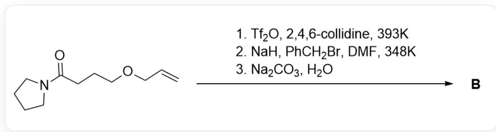
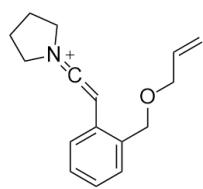
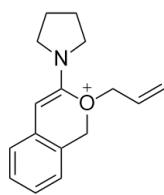
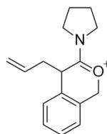
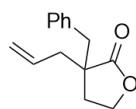
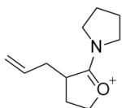

# Question

This image describes an organic reaction. The substrate is  $O = C(CC1 = CC = CC = C1COCC = C)N2CCCC2$ , which first reacts under  $Tf_{2}O, 2, 4, 6 - \text{collidine}$ ,  $DCM$  conditions to produce an intermediate, and the intermediate then reacts with  $NaHCO_{3}, H_{2}O$  to obtain product A, with the structure

$$
O = C 1 O C C (C = C C = C 2) = C 2 C 1 C C = C.
$$

The process of the above reaction generating product  $\mathbf{A}$  involves three key positively charged intermediates 1, 2, 3, and undergoes a pericyclic reaction step.

The model reaction in the figure above has the following application:

This image describes an organic reaction, the substrate is O=C(CCCOCC=C)N1CCCCC1, which generates product B under three-step conditions, the conditions being

1.  $Tf_2O$ , 2, 4, 6 - collidine, 393K; 2. NaH, PhCH $_2$ Br, DMF, 348K; 3. Na $_2$ CO $_3$ , H $_2$ O.

Regarding the structures of intermediates 1, 2, 3 and product B, the correct statement is:

A. All other options are incorrect  
B. 1,2,3 each possesses two six-membered rings

C. The generation of A occurred via an electrocyclic reaction.  
D. There exist two 6-membered rings in  $\mathbf{B}$  
E. B does not contain chiral carbon atoms.  
F. B hydrolyzes under acidic conditions, and the hydrolysis product contains 18 hydrogen atoms.

# Answer

Correct Answer: F

# Detailed Explanation

First, the added base abstracts the active hydrogen of the substrate to generate an enolate, and trifluoromethanesulfonic anhydride  $(\mathrm{Tf}_2\mathrm{O})$  captures the oxygen anion of the enolate to generate an OTf group. This group has extremely high leaving group ability, so the nitrogen atom of the amide promotes the departure of the OTf group to generate a positive ion allene structure 1, with the structure C=CCOCC1=CC=CC=C1C=C=[N+]2CCCCC2.

# CHECKPOINT

1 PTS

$\mathrm{Tf}_2\mathrm{O}$  captures the oxygen anion of the enolate to generate an OTf group

# CHECKPOINT

1 PTS

Therefore, the nitrogen atom of the amide promotes the departure of the OTf group to generate a positive ion allene

# CHECKPOINT

1 PTS

Intermediate 1, with the structure  $\mathrm{C} = \mathrm{CCOCC}1 = \mathrm{CC} = \mathrm{CC} = \mathrm{C}1\mathrm{C} = \mathrm{C} = [\mathrm{N} + ]2\mathrm{CC}\mathrm{CC}2$

The sp carbon atom in the allene structure has strong electrophilicity. According to the oxa-six-membered ring in the product, the oxygen atom of the ether in the substrate nucleophilically attacks this carbon atom to generate a six-membered ring oxonium ion 2, with the structure C=CC[O+](C(N1CCCC1)=C2)CC3=C2C=CC=C3.

# CHECKPOINT

1 PTS

The oxygen atom of the ether nucleophilically attacks the allene to generate a six-membered ring oxonium ion

# CHECKPOINT

1 PTS

Intermediate 2 with the structure  $\mathrm{C = CC}[\mathrm{O + }](\mathrm{C}(\mathrm{N1CCCC1}) = \mathrm{C2})\mathrm{CC3} = \mathrm{C2C} = \mathrm{CC} = \mathrm{C3}$

Observing the allyl position of product A, it can be seen that the allyl group and the carbon atom of the six-membered ring form a new C-C bond. Observing the structure, it can be seen that a [3,3]- $\sigma$  sigmoidotropic rearrangement occurs, causing the allyl group to migrate from the oxygen atom to the  $\beta$ -position of the oxygen atom. The structure after the migration is intermediate 3, with the structure C=CCC1C(N2CCCCC2)=[O+]CC3=C1C=CC=C3.

# CHECKPOINT

1 PTS

A [3,3]- $\sigma$  sigmoidotropic rearrangement occurs, causing the allyl group to migrate from the oxygen atom to the  $\beta$ -position of the oxygen atom

# CHECKPOINT

1 PTS

Intermediate 3 with the structure  $\mathrm{C = CCC1C(N2CCCC2) = [O + ]CC3 = C1C = CC = C3}$

Intermediate 3 is hydrolyzed to enamine under basic conditions to obtain product A.

According to the model reaction, the mechanism for the formation of  $\mathbf{B}$  is similar. The substrate reacts with  $\mathrm{Tf}_2\mathrm{O}$  to generate a positive ion allene structure, which is nucleophilically attacked by the intramolecular ether to form a five-membered ring, followed by a [3,3]- $\sigma$  sigmoidotropic rearrangement to migrate the allyl group. At this time, the obtained intermediate structure is C=CCC1CC[O+]=C1N2CCCCC2.

# CHECKPOINT

1 PTS

According to the model reaction, the structure of the intermediate for the formation of B is C=CCC1CC[O+]=C1N2CCCC2

Before the enamine is hydrolyzed, sodium hydride and benzyl bromide are added. Sodium hydride abstracts the most acidic tertiary carbon hydrogen atom in the system, and then undergoes a substitution reaction with benzyl bromide; the final step is basic hydrolysis, and the structure of product B is O=C1OCCC1(CC2=CC=CC=C2)CC=C.

# CHECKPOINT

1 PTS

Sodium hydride abstracts the most acidic tertiary carbon hydrogen atom in the system, and then undergoes a substitution reaction with benzyl bromide

# CHECKPOINT

1 PTS

The structure of product B is  $\mathrm{O = C1OCCC1(CC2 = CC = CC = C2)CC = C}$

According to the structure, options B-E are all incorrect.

B hydrolyzes the ester group under acidic conditions to generate an alcohol and an acid. This structure has a total of 18 hydrogen atoms, so option F is correct.

  
1

  
2

  
3

  
B

Intermediate 1 with the structure  $C = \text{CCOCC}1 = \text{CC} = \text{CC} = \text{C}1\text{C} = \text{C} = [N + ]2\text{CCCC}2$ ; intermediate 2 with the structure

C=CC[O+](C(N1CCCCC1)=C2)CC3=C2C=CC=C3; intermediate 3 with the structure C=CCC1C(N2CCCCC2)=

$[O + ]CC3 = C1C = CC = C3$  ; product B with the structure O=C1OCCC1(CC2=CC=CC=C2)CC=C; intermediate for

the formation of  $\mathbf{B}$  with the structure  $C = C C C 1 C C [O + ] = C 1 N 2 C C C C 2$