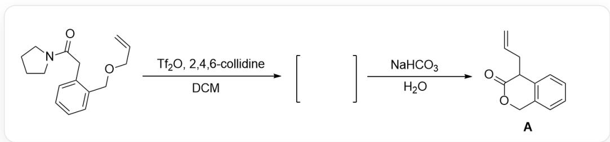
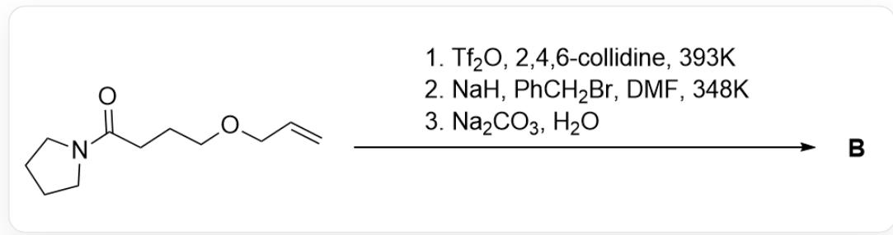
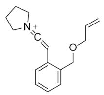
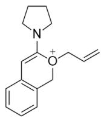
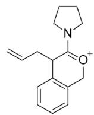
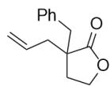
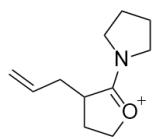

# 题目

该图片描述了一步有机反应。底物为O=C(CC1=CC=CC=C1COCC=C)N2CCCC2，首先在 $Tf_{2}O,2,4,6 - collidine,DCM$ 条件下反应产生中间体，中间体再与NaHCO3,H2O反应得到产物A，结构为O=C1OCC(C=CC=C2)=C2C1CC=C。

上图的反应生成产物A的过程经历了三个关键的带正电中间体1,2,3，且经历一步周环反应。

上图的模型反应有如下应用：

该图描述了一步有机反应，底物为O=C(CCCOC=C)N1CCCC1，在三步条件下生成产物B，条件为  $1.Tf_{2}O,2,4,6 - collidine,393K;2.NaH,PhCH_{2}Br,DMF,348K;3.Na_{2}CO_{3},H_{2}O$ 。

关于中间体 1,2,3 和产物 B 的结构，说法正确的是：

A. 其他选项均不正确  
B. 1,2,3均存在两个六元环  
C. 生成  $\mathbf{A}$  的过程发生了电环化反应

D. B 中存在两个六元环  
E. B 不存在手性碳原子  
F. B 在酸性条件下水解, 水解产物含有 18 个氢原子

# 答案

正确答案: F

# 详细解析

第一步，加入的碱拔去底物的活泼氢生成烯醇负离子，三氟甲磺酸酐(Tf $_2$ O)捕获该烯醇负离子的氧负生成OTf基团。该基团具有极强的离去性，因此酰胺的氮原子促进OTf基团离去生成正离子联烯结构1，结构为C=CCOCC1=CC=CC=C1C=C=[N+]2CCCCC2。

# CHECKPOINT

1 PTS

$\mathrm{Tf}_{2} \mathrm{O}$  捕获该烯醇负离子的氧负生成OTf基团

# CHECKPOINT

1 PTS

因此酰胺的氮原子促进OTf基团离去生成正离子联烯

# CHECKPOINT

1 PTS

中间体1，结构为C=CCOCC1=CC=CC=C1C=C=[N+]2CCCC2

联烯结构中的sp碳原子具有强亲电性，根据产物中的氧杂六元环可知底物中醚的氧原子亲核该碳原子生成六元环氧鎘离子2，结构为C=CC[O+](C(N1CCCC1)=C2)CC3=C2C=CC=C3.

# CHECKPOINT

1 PTS

醚的氧原子亲核联烯生成六元环氧鎘离子

# CHECKPOINT

1 PTS

中间体2结构为  $\mathrm{C = CC[O + ](C(N1CCCC1) = C2)CC3 = C2C = CC = C3}$

观察产物 A 的烯丙基位置可知烯丙基与六元环的碳原子形成了新的 C - C 键, 观察结构可知发生了周环反应中的[3, 3]- $\sigma$ 迁移反应使得烯丙基从氧原子上迁移到氧原子的  $\beta$  位, 迁移后的结构即为中间体 3 , 结构为  $\mathrm{C} = \mathrm{CC}1 \mathrm{C}(\mathrm{N} 2 \mathrm{CCCC} 2) = [\mathrm{O} + ] \mathrm{CC} 3 = \mathrm{C} 1 \mathrm{C} = \mathrm{CC} = \mathrm{C} 3$ 。

# CHECKPOINT

1 PTS

发生[3，3]-σ迁移反应，烯丙基从氧原子上迁移到氧原子的β位

# CHECKPOINT

1 PTS

中间体3结构为C=CCC1C(N2CCCC2)=[O+]CC3=C1C=CC=C3

中间体3在碱性条件水解烯胺即得到产物A。

根据模型反应，生成B的机理类似，底物与  $\mathrm{Tf}_2\mathrm{O}$  反应产生正离子联烯结构，被分子内的醚亲核生成五元环后发生[3，3]-σ迁移反应使烯丙基迁移，此时得到的中间体结构为C=CCC1CC[O+]=C1N2CCCC2。

# CHECKPOINT

1 PTS

根据模型反应，生成B中间体结构为C=CCC1CC[O+]=C1N2CCCCC2

该结构在水解烯胺前加入氢化钠和苄溴，氢化钠拔除体系酸性最强的三级碳氢原子，之后与苄溴发生取代反应；最后一步碱性水解，产物B结构为O=C1OCCC1(CC2=CC=CC=C2)CC=C。

# CHECKPOINT

1 PTS

氢化钠拔除体系酸性最强的三级碳氢原子，之后与苄溴发生取代反应

# CHECKPOINT

1 PTS

产物B结构为  $0 = \mathrm{C}1\mathrm{O}\mathrm{C}\mathrm{C}\mathrm{C}1(\mathrm{CC}2 = \mathrm{CC} = \mathrm{CC} = \mathrm{C}2)\mathrm{CC} = \mathrm{C}$

根据结构可知选项B-E均错误。

B 酸性条件水解酯基生成醇和酸, 该结构共有18个氢原子, 选项F正确。

  
1

  
2

  
3

  
B

中间体1结构为C=CCOCC1=CC=CC=C1C=C=[N+]2CCCCC2；中间体2结构为C=CC[O+]

(C(N1CCCC1)=C2)CC3=C2C=CC=C3；中间体3结构为C=CCC1C(N2CCCC2)=[O+]CC3=C1C=CC=C3；产物B结构为O=C1OCCC1(CC2=CC=CC=C2)CC=C；生成B中间体结构为C=CCC1CC[O+]=C1N2CCCC2