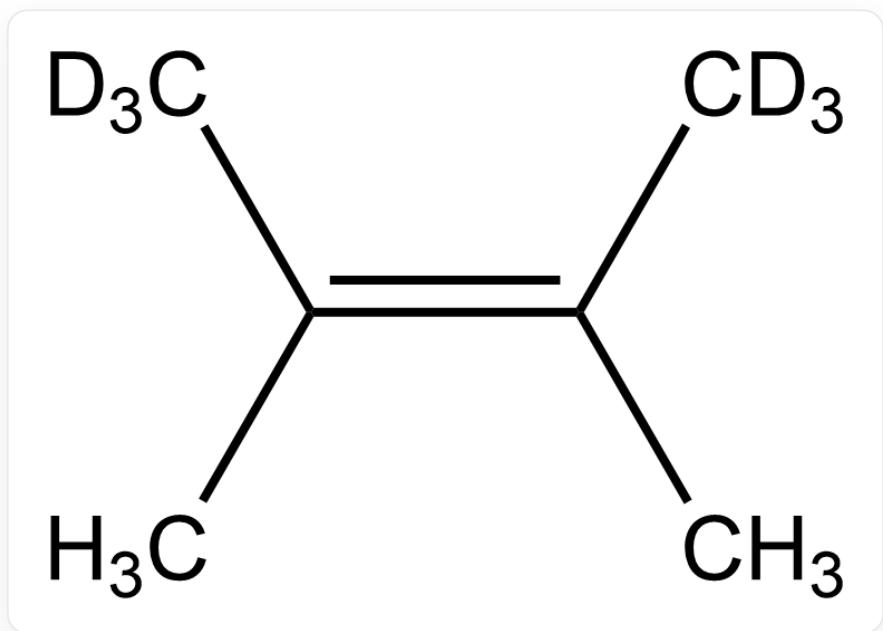
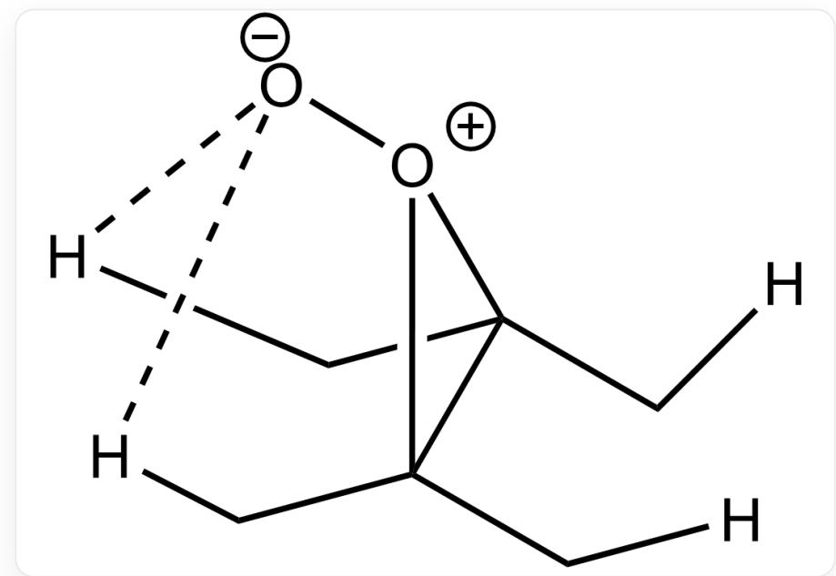

# Question

Predict for which substrates the first-order kinetic isotope effect (KIE) can be observed when singlet oxygen  ${}^{1}{\mathrm{O}}_{2}$  reacts with them. Consider only the reaction with a single molecule.

  
C/C(C)=C(C([2H])([2H])[2H])\C([2H])([2H])[2H],Substrate 1

# Substrate 1

  
C/C(C([2H])([2H])[2H])=C(C)\C([2H])([2H])[2H],Substrate 2

# Substrate 2

  
C/C(C([2H])([2H])[2H])=C(C)/C([2H])([2H])[2H],Substrate 3

# Substrate 3

A. All other options are incorrect  
B. Only option 1  
C. Only option 2  
D. Only option 3  
E. Only options 1, 2  
F. Only options 1, 3  
G. Only options 2, 3  
H. Option 1, 2, 3

# Answer

Correct Answer: E

# Detailed Explanation

The kinetic isotope effect arises from the difference in zero-point energy between C-H and C-D bonds.

# CHECKPOINT

1 PTS

The kinetic isotope effect arises from the difference in zero-point energy between C-H and C-D bonds

This is the transition state of the reaction

  
[H]CC(C[H])([O+]1[O-])C1(C[H])C[H]

For substrate 3, regardless of which side the peroxide faces in the intermediate, only one of H or D can be attacked, thus no KIE is generated.

# CHECKPOINT

1 PTS

For substrate 3, regardless of which side the peroxide faces in the intermediate, only one of H or D can be attacked, thus no KIE is generated

Whereas for substrates 1 and 2, regardless of which side the peroxide faces in the intermediate, there is competition between attacking H and D, hence KIE exists.

# CHECKPOINT

1 PTS

Whereas for substrates 1 and 2, regardless of which side the peroxide faces in the intermediate, there is competition between attacking H and D, hence KIE exists