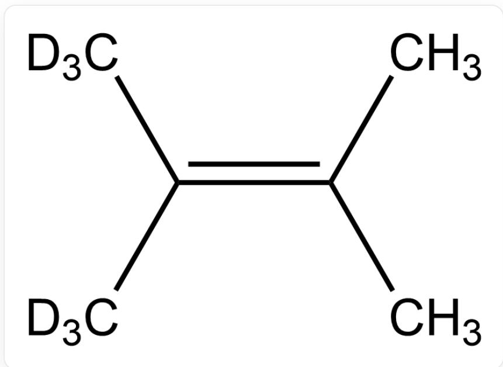
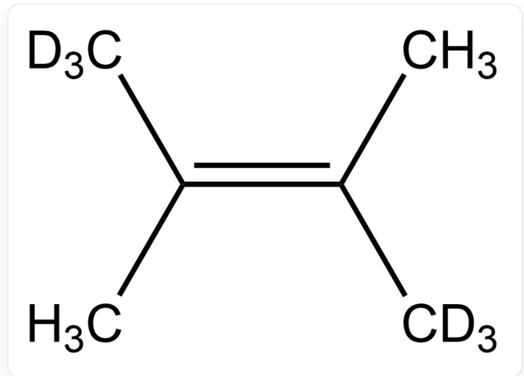
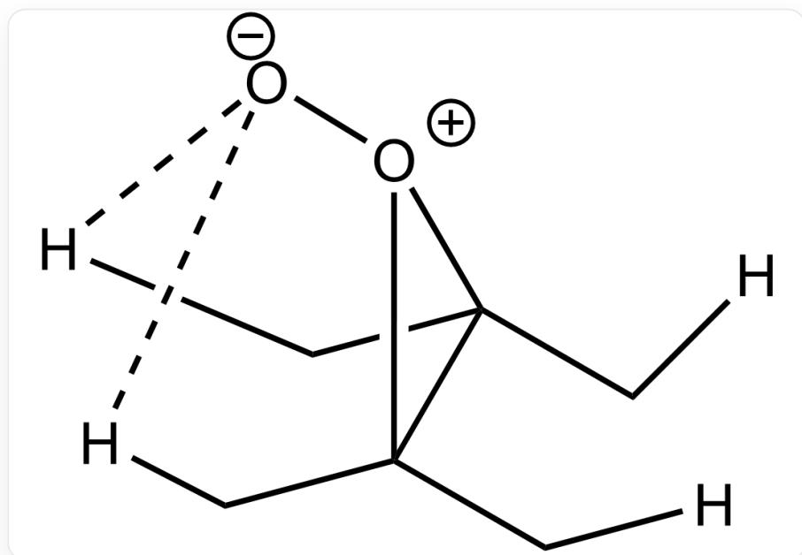

# 题目

请预测单线态氧  ${ }^{1} \mathrm{O}_{2}$  与以下哪些底物发生反应时, 能观测到一级动力学同位素效应(KIE)? 仅考虑与单个分子反应的情况。

  
C/C(C) = C(C([2H])([2H])([2H])\C([2H])([2H])[2H], 底物1

底物1

  
C/C(C([2H])([2H])[2H])=C(C)\C([2H])([2H])[2H],底物2

底物2

  
C/C(C([2H])([2H])[2H])=C(C)/C([2H])([2H])[2H],底物3

底物3

A. 其他选项均不正确  
B. 只有选项1  
C. 只有选项2  
D. 只有选项3  
E. 只有选项1、2  
F. 只有选项1、3  
G. 只有选项2、3  
H. 选项1、2、3

# 答案

正确答案: E

# 详细解析

动力学同位素效应是由于 C-H 键和 C-D 键之间的零点能有差别造成的

CHECKPOINT

1 PTS

动力学同位素效应是由于C-H键和C-D键之间的零点能有差别造成的

这是反应的过渡态

  
[H]CC(C[H])([O+]1[O-])C1(C[H])C[H]

速控步是烯丙基C-H/C-D键的断裂

# CHECKPOINT

1 PTS

速控步是烯丙基C-H/C-D键的断裂

对于底物1和2，单线态氧无论从双键的哪一侧进攻，其可以夺取的烯丙位上都同时存在甲基（ $-CH_{3}$ ）和氘代甲基（ $-CD_{3}$ ），因此C-H键断裂和C-D键断裂形成竞争关系，从而能观测到分子间KIE

# CHECKPOINT

1 PTS

对于底物1和2，单线态氧无论从双键的哪一侧进攻，其可以夺取的烯丙位上都同时存在甲基（ $-CH_{3}$ ）和氘代甲基（ $-CD_{3}$ ），因此C-H键断裂和C-D键断裂形成竞争关系，从而能观测到分子间KIE

对于底物3，无论中间体中过氧朝向哪一侧,均只可能进攻H或D中的一种,故不会产生KIE

# CHECKPOINT

1 PTS

对于底物3，无论中间体中过氧朝向哪一侧,均只可能进攻H或D中的一种,故不会产生KIE