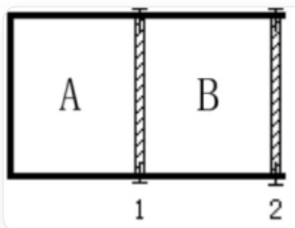

# Question

In a "U"-shaped reactor, frictionless and massless heat-conducting pistons 1 and 2 are fixed by pins at the center and right side, respectively, dividing the adiabatic reactor into a left section A and a right section B

In the adiabatic reactor shown in the figure, the following reactions take place respectively:

$$
\mathrm {N} _ {2} \mathrm {O} _ {4 (g)} \rightleftharpoons 2 \mathrm {N O} _ {2 (g)}, K _ {p} ^ {\circ} = 0. 1 4 1
$$

Initially, both sections have reached chemical equilibrium, with equal volumes and total pressures of  $2p^{\circ}$  and  $p^{\circ}$  ( $p^{\circ} = 101325\mathrm{Pa}$ ), respectively, at a temperature of  $298\mathrm{K}$ .

If the pin on piston 1 is removed, what will be the volume ratio of sections A and B when the piston stabilizes in its final position?

A. 2.096  
B. 2.000  
C. 1.048  
D. 1.500

E. 4.192  
F. None of the above answers are correct

# Answer

Correct Answer: A

# Detailed Explanation

In the initial state, consider the equilibrium when any portion of  $\mathrm{N}_2\mathrm{O}_4$  is introduced. Assuming the total pressure,  $\mathrm{N}_2\mathrm{O}_4$  partial pressure, and  $\mathrm{NO}_2$  partial pressure are  $p$ ,  $p_{\mathrm{N}_2\mathrm{O}_4}$ , and  $p_{\mathrm{NO}_2}$ , respectively, and the degree of dissociation is  $\alpha$ , the following relationships hold at equilibrium:

$$
p _ {\mathrm {N O} _ {2}} = 2 \alpha p p _ {\mathrm {N} _ {2} \mathrm {O} _ {4}} = (1 - \alpha) p K _ {p} ^ {\circ} = \frac {p _ {\mathrm {N O} _ {2}} ^ {2}}{p _ {\mathrm {N} _ {2} \mathrm {O} _ {4}} p ^ {\circ}} = \frac {4 \alpha^ {2}}{1 - \alpha} \frac {p}{p ^ {\circ}}
$$

# CHECKPOINT

2 PTS

Dissociation degree equation  $K_{p}^{\circ} = \frac{p_{\mathrm{NO}_{2}}^{2}}{p_{\mathrm{N}_{2}\mathrm{O}_{4}}p^{\circ}} = \frac{4\alpha^{2}}{1 - \alpha}\frac{p}{p^{\circ}}$

Given  $K_{p}^{\circ}$  and the total pressure  $p$ , the degree of dissociation  $\alpha$  can be calculated, and subsequently, the partial pressures of gases on sides A and B are:

$$
p _ {\mathrm {A}} (\mathrm {N} _ {2} \mathrm {O} _ {4}) = 1 5 5. 5 \mathrm {k P a}, p _ {\mathrm {A}} (\mathrm {N O} _ {2}) = 4 7. 5 \mathrm {k P a} p _ {\mathrm {B}} (\mathrm {N} _ {2} \mathrm {O} _ {4}) = 6 9. 7 \mathrm {k P a}, p _ {\mathrm {B}} (\mathrm {N O} _ {2}) = 3 1. 6 \mathrm {k P a}
$$

# CHECKPOINT

2 PTS

$$
p _ {\mathrm {A}} (\mathrm {N} _ {2} \mathrm {O} _ {4}) = 1 5 5. 5 \mathrm {k P a}, p _ {\mathrm {A}} (\mathrm {N O} _ {2}) = 4 7. 5 \mathrm {k P a} p _ {\mathrm {B}} (\mathrm {N} _ {2} \mathrm {O} _ {4}) = 6 9. 7 \mathrm {k P a}, p _ {\mathrm {B}} (\mathrm {N O} _ {2}) = 3 1. 6 \mathrm {k P a}
$$

According to the ideal gas law  $PV = nRT$ , the total nitrogen ratio between A and B before removing the pin is:

$$
\frac {n _ {A} \left(\mathrm {N O} _ {2}\right)}{n _ {B} \left(\mathrm {N O} _ {2}\right)} = \frac {2 p _ {\mathrm {A}} \left(\mathrm {N} _ {2} \mathrm {O} _ {4}\right) + p _ {\mathrm {A}} \left(\mathrm {N O} _ {2}\right)}{2 p _ {\mathrm {B}} \left(\mathrm {N} _ {2} \mathrm {O} _ {4}\right) + p _ {\mathrm {B}} \left(\mathrm {N O} _ {2}\right)} = 2. 0 9 6
$$

# CHECKPOINT

1 PTS

The total nitrogen content ratio between  $\mathbf{A}$  and  $\mathbf{B}$  before removing the pin is 2.096

The piston can conduct heat, so the temperatures on both sides are the same, and the equilibrium constants are identical.

# CHECKPOINT

1 PTS

The piston can conduct heat, so the temperatures on both sides are the same, and the equilibrium constants are identical

After removing the pin on piston 1, when the piston stabilizes, the total pressures on sides A and B are equal. Therefore, according to the above equations, the degrees of dissociation on both sides are the same, and the partial pressures of the same gas are equal.

# CHECKPOINT

1 PTS

After removing the pin, the degrees of dissociation on both sides are the same, and the partial pressures of the same gas are equal

Based on the ideal gas law, partial pressure relationships, and proportionality, the volume ratio after removing the pin can be related to the total nitrogen content, yielding the result:

$$
\frac {V _ {\mathrm {A}} ^ {t}}{V _ {\mathrm {B}} ^ {t}} = \frac {n _ {\mathrm {A} , \backslash \mathrm {t o t a l}} ^ {t}}{n _ {\mathrm {B} , \mathrm {t o t a l}} ^ {t}} = \frac {n _ {\mathrm {A} , \mathrm {N} _ {2} \mathrm {O} _ {4}} ^ {t}}{n _ {\mathrm {B} , \mathrm {N} _ {2} \mathrm {O} _ {4}} ^ {t}} = \frac {n _ {\mathrm {A} , \mathrm {N O} _ {2}} ^ {t}}{n _ {\mathrm {B} , \mathrm {N O} _ {2}} ^ {t}} = \frac {2 n _ {\mathrm {A} , \mathrm {N} _ {2} \mathrm {O} _ {4}} ^ {t} + n _ {\mathrm {A} , \mathrm {N O} _ {2}} ^ {t}}{2 n _ {\mathrm {B} , \mathrm {N} _ {2} \mathrm {O} _ {4}} ^ {t} + n _ {\mathrm {B} , \mathrm {N O} _ {2}} ^ {t}} = \frac {n _ {A} (\mathrm {N O} _ {2})}{n _ {B} (\mathrm {N O} _ {2})} = 2. 0 9 6
$$

# CHECKPOINT

2 PTS

After removing the pin, the volume ratio between  $\mathbf{A}$  and  $\mathbf{B}$  equals the nitrogen content ratio, which is 2.096