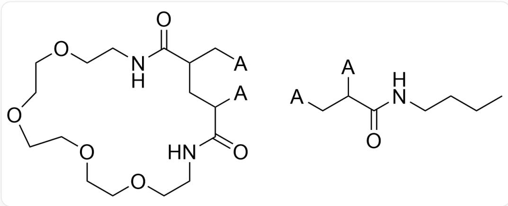
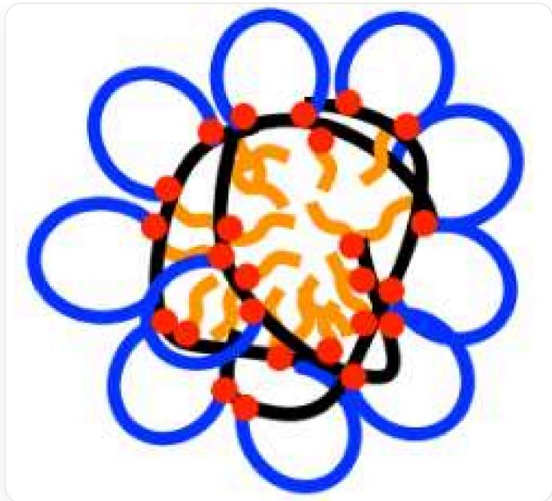
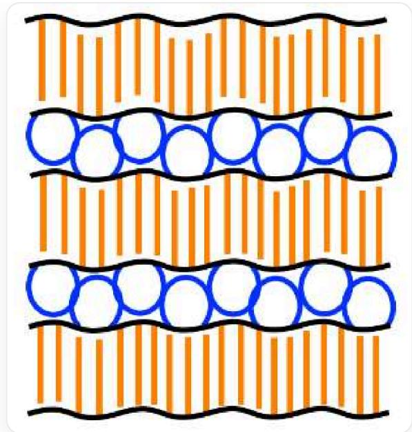
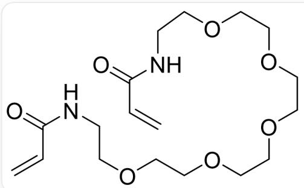
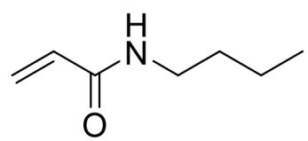

# Question

The following are two repeating units of the random copolymer A:

  
O=C(NCCOCCOCCOCOCCN1)C(C[*])CC([\*])C1=O and CCCNC(C([\*])C[*])=O, where "***" indicates other atoms connected to the repeating unit

1,2-Dichloroethane was used as a solvent during the preparation of  $\mathbf{A}$ ,  $\mathrm{Fe_2(C_5H_5)_2(CO)_4}$  and ethyl 2-iodoisobutyrate were used as initiators, and an appropriate amount of iodine  $\mathrm{I}_2$  was added to the system. The reaction initiation process produced a mononuclear complex  $\mathbf{B}$  of  $\mathrm{Fe(II)}$ .

Which of the following statements is correct:

1. Fe in B satisfies the 18-electron rule  
2. This reaction is coordination polymerization  
3. It is known that a larger number-average molecular weight can be obtained when this polymerization reaction is carried out in cyclohexane, which is mainly related to intermolecular hydrogen bonds.  
4. A can form a spherical structure in water. If the main chain of A is represented by a black curve, one type of side chain is represented by an orange curve connected to the main chain at one end, and the other type of side chain is represented by a blue line connected to the main chain at both ends (i.e., forming a ring), and the connection point between the side chain and the main chain is represented by a red dot, then A can be represented as:

The background of this image is pure white and does not contain any text, coordinate axes, or legends. A black, irregular closed curve encloses a hollow area. Multiple red dots are evenly distributed on the black curve, serving as connection points between different colored curves. Within the space enclosed by the black curve, multiple blue curves are filled, with both ends of these blue curves connected to the black curve, forming a ring and intertwining and overlapping each other. The entire outer circumference of the black curve is connected to multiple orange curves, extending outward in a radial pattern.

5. A can also form a spherical structure in chloroform. With reference to the above representation method, it can be represented as:

The background of this image is pure white and does not contain any text, coordinate axes, or legends. A black, irregular closed curve encloses a hollow area. Multiple red dots are evenly distributed on the black curve, serving as connection points between different colored curves. Outside the black curve, there are multiple blue curves, with both ends of these blue curves connected to the black curve to form a ring, and these rings surround the black curve. The entire inner circumference of the black curve is connected to multiple orange curves, extending inward in a radial pattern.

6. A has a lamellar microphase separated structure in the solid state. With reference to the above representation method, it can be represented as:

The image is a structural diagram presented on a white background, which does not contain any text, numbers, or labels. A black straight line extends horizontally, with blue lines on one side. Both ends of the blue lines are connected to the black straight line to form a ring, and these rings are evenly distributed; on the other side, there are orange lines, with one end of the orange lines connected to the black straight line, arranged at equal intervals. Such a set of lines is called X. If the blue lines are facing upwards and the orange lines are facing downwards, it is X+; otherwise, it is X-. There are now 3 X+ and 3 X- arranged alternately and closely in the vertical direction. The blue lines on different X are staggered and close to each other one by one, and the orange lines on different X are also staggered and close to each other one by one.

(Note: Red dots are not described in the picture, but do not judge the statement to be wrong because of this)

A. All other options are incorrect  
B. 1,3,6  
C. 1,3,4,5,6  
D. 2,6  
E. 4,6

F. 2,3,5  
G. 3,5,6  
H. 1,4  
1. 3,4  
J. 6  
K. 1,3  
L. 2,6  
M. 3  
N. 5,6  
O. 1,3,4,6  
P. 1,6  
Q. 1,4,5,6  
R. 3,4,5,6  
S. 3,4,6

# Answer

Correct Answer: P

# Detailed Explanation

The addition of an appropriate amount of iodine can transform active free radicals in the system into "dormant species" and generate iodine radicals, thereby controlling the molecular weight of the polymer and achieving a narrow molecular weight distribution. The initiation step of the reaction is the homolytic cleavage of the  $\mathrm{C - I}$  bond in ethyl 2-iodoisobutyrate. The iodine radical reacts with  $\mathrm{Fe_2(C_5H_5)_2(CO)_4}$  to form  $\mathrm{Fe(C_5H_5)(CO)_2I}$ . In this way, the Fe is in the  $+2$  oxidation state, surrounded by  $6 + 6 + 2 + 2 + 2$ , a total of 18 electrons, so statement 1 is correct.

# CHECKPOINT

1 PTS

A mononuclear complex of  $\mathrm{Fe}$ ,  $\mathrm{Fe}(\mathrm{C}_5\mathrm{H}_5)(\mathrm{CO})_2\mathrm{I}$ , is generated

# CHECKPOINT

0.5 PTS

Fe in  $\mathrm{Fe}(\mathrm{C}_5\mathrm{H}_5)(\mathrm{CO})_2\mathrm{I}$  satisfies the 18-electron rule

The cleavage of the C - I bond generates the  $\alpha -\mathrm{C}$  free radical, which initiates polymerization through addition to the double bond, which is free radical polymerization, so statement 2 is incorrect.

# CHECKPOINT

1 PTS

This reaction is free radical polymerization

The structures of the two monomers used in the reaction are as follows:

  
The SMILES notations of the two monomers are  $O = C(NCCOCCOCCOCOCOCCNC(C = C) = O)C = C$  and CCCNC  $(C = C) = 0$

$\mathrm{O = C(NCCOCCOCCOCOCOCOCNC(C = C) = O)C = C}$  can form intramolecular hydrogen bonds  $\mathrm{N - H\dots O = C}$  in 1,2-dichloroethane, bringing the two carbon-carbon double bonds closer together. Therefore, these two carbon-carbon double bonds are easily subjected to successive addition and ring closure by free radicals, strung together in one main chain. In cyclohexane, this type of hydrogen bond is not easily formed, and the two carbon-carbon double bonds are far apart, making it more likely to react separately with two different free radicals, thereby forming connections between two different main chains, leading to crosslinking and higher number average molecular weight, i.e., more double bonds participate in chain growth of the polymerization rather than ring closure. So statement 3 is incorrect.

# CHECKPOINT

1 PTS

$\mathrm{O = C(NCCOCCOCCOCOCOCOCNC(C = C) = O)C = C}$  can form intramolecular hydrogen bonds  $\mathrm{N - H\dots O = C}$  in 1,2-dichloroethane, bringing the two carbon-carbon double bonds closer together

The blue lines represent crown ether fragments, and the orange lines represent butyl groups. The former can form hydrogen bonds with water and is hydrophilic, while the latter is hydrophobic.

# CHECKPOINT

1 PTS

The blue lines represent hydrophilic fragments, and the orange lines represent hydrophobic fragments

Therefore, the correct representation is: in water, the blue lines face outwards and the orange lines face inwards; in chloroform, the blue lines face inwards and the orange lines face outwards, so statements 4 and 5 are incorrect.

# CHECKPOINT

1 PTS

In water, the blue lines face outwards and the orange lines face inwards; in chloroform, the blue lines face inwards and the orange lines face outwards

In the layered structure in the solid state, the hydrophilic blue fragments face together, and the hydrophobic orange fragments face together, so statement 6 is correct.

# CHECKPOINT

1 PTS

In the layered structure in the solid state, the hydrophilic blue lines face together, and the hydrophobic orange lines face together

Therefore, choose P