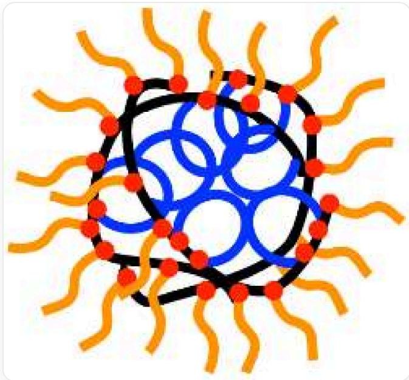
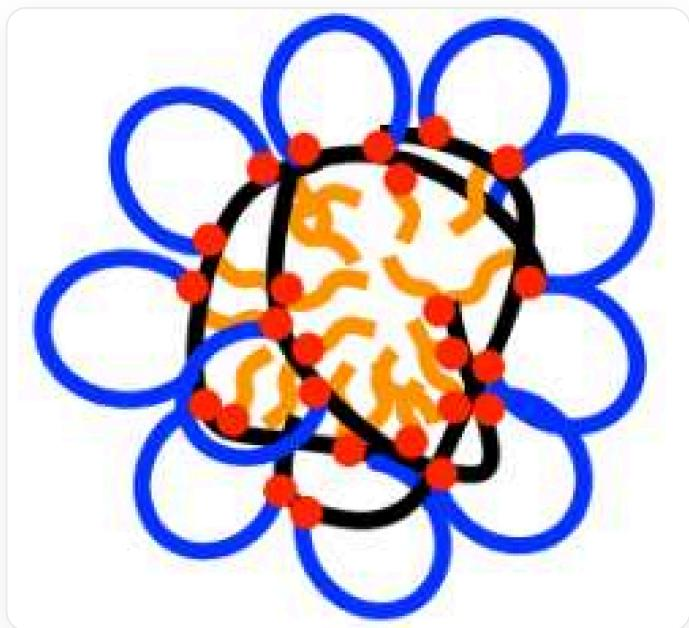
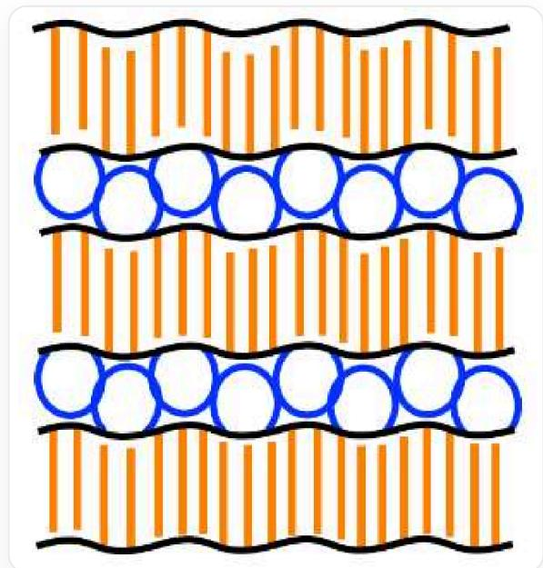
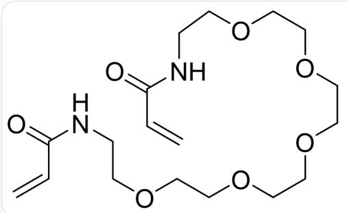
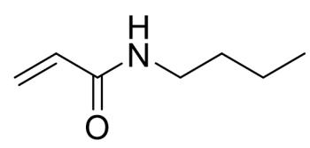

# 题目

以下是无规共聚物A的两种重复单元:

  
$\mathrm{O = C(NCCOCCOCCOCOCCN1)C(C[*])CC([\*])C1 = O}$  和CCCCNC(C([\*])C[\*])=O，这里标注“\*\*"的为重复单元连接的其他原子

制备A时使用了1,2-二氯乙烷为溶剂， $\mathrm{Fe_2(C_5H_5)_2(CO)_4}$  和2-碘代异丁酸乙酯作为引发剂，并向体系中加入了适量的碘 $\mathrm{I}_2$ 。反应引发过程产生了 $\mathrm{Fe(II)}$ 的单核配合物B。

下列说法正确的是：

1. B中Fe满足18电子规则  
2. 该反应为配位聚合  
3. 已知该聚合反应在环己烷中进行时可以获得更大的数均分子量，这主要与分子间氢键有关  
4. A 在水中可以形成球状结构。若将 A 的主链以黑色曲线表示，一种支链用一端连在主链的橙色曲线表示，另一种支链用两端连在主链的蓝色线条表示（即构成了一个环），支链与主链连接处用红色圆点表示，则 A 可以表示为：

该图像背景为纯白色，不包含任何文字、坐标轴或图例。图中一条黑色的、不规则的闭合曲线围成了一个中空的区域，在黑色曲线的上均匀地分布着多个红色圆点，为不同颜色曲线之间的连接点。在这条黑色曲线所包围的内部空间里，填充着多条蓝色的曲线，这些蓝色曲线的两端都连接在黑色曲线上从而构成一个环，并相互交织、重叠。黑色曲线外侧一整圈都连接着多条橙色曲线，呈辐射状向外延伸。

5. A 在氯仿中也可以形成球状结构，参照上面的表示方法，则可以表示为：

该图像背景为纯白色，不包含任何文字、坐标轴或图例。图中一条黑色的、不规则的闭合曲线围成了一个中空的区域，在黑色曲线的上均匀地分布着多个红色圆点，为不同颜色曲线之间的连接点。在这条黑色曲线的外面有着多条蓝色的曲线，这些蓝色曲线的两端都连接在黑色曲线上从而构成一个环，这些环环绕了黑色曲线一圈。黑色曲线内侧一整圈都连接着多条橙色曲线，呈辐射状向内延伸。

6. A 在固态具有片层状的微相分离结构, 参照上面的表示方法, 则可以表示为:

该图像是一张在白色背景上呈现的结构示意图，其中不包含任何文字、数字或标签。黑色直线水平延伸，其一侧有蓝色线条，蓝色线条的两端连接在黑色直线上从而构成一个环，这些环等距分布；另一侧有橙色线条，橙色线条的一端连接着黑色直线，等距排布。将这样的一组线条称为X，若蓝色线条朝上，橙色线条朝下则为X+；否则为X-。现有3个X+和3个X-在竖直方向上交替紧密排布，不同X上的蓝色线条一个一个交错紧靠，不同X上的橙色线条亦一个一个交错紧靠。

（注意：图片中未描述红色圆点，但不要因此就判断该说法错误）

A. 其他选项均不正确  
B. 1,3,6  
C. 1,3,4,5,6  
D. 2,6

E. 4,6

F. 2,3,5  
G. 3,5,6  
H. 1,4  
1. 3,4  
J. 6  
K. 1,3  
L. 2,6  
M. 3  
N. 5,6  
O. 1,3,4,6  
P. 1,6  
Q. 1,4,5,6  
R. 3,4,5,6  
S. 3,4,6

# 答案

正确答案: P

# 详细解析

这里加入适量的碘单质可以将体系中的活性自由基转化为“休眠种”并产生碘自由基，从而控制控制聚合物的分子量并实现窄分子量分布。该反应的引发步骤为2-碘代异丁酸乙酯中的C-I键均裂，碘自由基与 $\mathrm{Fe_2(C_5H_5)_2(CO)_4}$  反应形成  $\mathrm{Fe(C_5H_5)(CO)_2I}$ ，这样  $\mathrm{Fe}$  为  $+2$  价，周围有  $6 + 6 + 2 + 2 + 2$  共18电子，说法1正确

# CHECKPOINT

1 PTS

生成了Fe的单核配合物  $\mathrm{Fe}(\mathrm{C}_{5}\mathrm{H}_{5})(\mathrm{CO})_{2}\mathrm{I}$

# CHECKPOINT

0.5 PTS

$\mathrm{Fe}(\mathrm{C}_5\mathrm{H}_5)(\mathrm{CO})_2\mathrm{I}$  中  $\mathrm{Fe}$  满足18电子规则

C-I键断裂生成了  $\alpha -\mathrm{C}$  自由基，与双键进行加成引发聚合，为自由基聚合，说法2错误

# CHECKPOINT

1 PTS

该反应为自由基聚合

该反应用的两种单体结构如下：

两种单体的SMILES分别为O=C(NCCOCCOCCOCCOCCOCCNC(C=C)=O)C=C和CCCCNC(C=C)=O

$\mathrm{O = C(NCCOCCOCCOCOCOCOCNC(C = C) = O)C = C}$  在1,2-二氯乙烷中可以形成分子内氢键  $\mathrm{N - H\dots O = C}$  ，拉近两个碳碳双键的距离，因此这两个碳碳双键容易被自由基连续加成关环，串在一根主链中；；在环己烷中不容易形成这种氢键，两个碳碳双键距离远，更可能与两个不同的自由基分别反应，从而在两条不同的主链之间形成连接，导致交联和更高的数均分子量，即更多的双键参与了聚合的链增长而非关环。说法3错误

# CHECKPOINT

1 PTS

$\mathrm{O = C(NCCOCCOCCOCOCOCGCNC(C = C) = O)C = C}$  在1,2-二氯乙烷中可以形成分子内氢键  $\mathrm{N - H\dots O = C}$  ，拉近两个碳碳双键的距离

蓝色线条代表冠醚片段，橙色线条代表丁基，前者可以与水形成氢键，是亲水的，而后者是疏水的

# CHECKPOINT

1 PTS

蓝色线条代表亲水片段，橙色线条代表疏水片段

因此正确的画法是：在水中蓝色线条朝外，橙色线条朝内；氯仿中蓝色线条朝内，橙色线条朝外，说法4和5错误

# CHECKPOINT

1 PTS

在水中蓝色线条朝外，橙色线条朝内，氯仿中蓝色线条朝内，橙色线条朝外

在固态的层状结构中，亲水性的蓝色片段朝着一起，疏水性的橙色片段朝着一起，说法6正确

# CHECKPOINT

1 PTS

在固态的层状结构中，亲水性的蓝色线条朝着一起，疏水性的橙色线条朝着一起

故选P