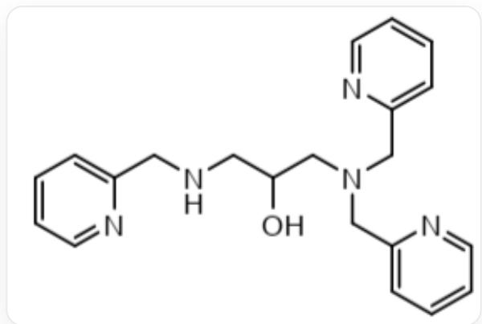

# Question

The multidentate ligand HTPPNOL (as shown) forms complexes with copper that can be used to simulate the active centers of binuclear copper-containing enzymes.

  
C1=CC=NC(=C1)CNCC(CN(CC2=NC=CC=C2)CC3=CC=CC=N3)O

In all the formed complexes, the rings consisting solely of  $\mathrm{Cu}^{2+}$  and atoms from HTPPNOL are all five-membered rings.

In a sodium acetate solution, HTPPNOL reacts with  $\mathrm{Cu}^{2+}$  to form the binuclear complex  $[\mathrm{Cu}_2(\mathrm{TPPNOL})(\mathrm{CH}_3\mathrm{COO})]^{2+}$ . In this complex ion,  $\mathrm{Cu}^{2+}$  exhibits two coordination numbers, one of which is five-coordinate (trigonal bipyramidal geometry), and the complex structure includes four six-membered ring.

Based on the above information, select the correct option.

A. Another coordination number of  $\mathrm{Cu}^{2+}$  is 5.  
B. The complex has 5 five-membered rings.  
C. In this complex, the two  $\mathrm{Cu}^{2+}$  ions have different oxygen coordination numbers.

D. When the salt of this complex ion is dissolved in water, only one binuclear complexes with identical coordination numbers for two  $\mathrm{Cu}^{2+}$  exist in the solution. Moreover, these two complexes can interconvert by adjusting the  $\mathsf{pH}$  of the solution. In both complexes, the coordination number of  $\mathrm{Cu}^{2+}$  is 4.  
E. In the alkaline solution of the  $\mathrm{Cu}^{2+}$ -HTPPNOL system without other ligands, there exist binuclear complex ions where the coordination number of  $\mathrm{Cu}^{2+}$  is 5, and the oxygen coordination numbers of the two  $\mathrm{Cu}^{2+}$  ions in this complex are identical.  
F. To measure the crystal structure of the complex ion in option E, you can choose a solution with smaller anions to reduce the solubility of the complex ion in the solution and obtain crystals.  
G. None of the above options is correct.

# Answer

Correct Answer: B

# Detailed Explanation

A new six-membered ring exists in the complex. Based on the information that all rings composed only of  $\mathrm{Cu}^{2+}$  and atoms from HTPPNOL are five-membered rings, this six-membered ring cannot be composed of HTPPNOL and  $\mathrm{Cu}^{2+}$ . Therefore, it must be formed by bridging acetate ions, namely the  $\mathrm{Cu}-\mathrm{O}-\mathrm{C}-\mathrm{O}-\mathrm{Cu}$  bridge.

# CHECKPOINT

1 PTS

The six-membered ring is formed by bridging acetate ions, namely the  $\mathrm{Cu} - \mathrm{O} - \mathrm{C} - \mathrm{O} - \mathrm{Cu}$  bridge.

According to the structure of HTPPNOL and the clue that all rings formed by  $\mathrm{Cu}^{2+}$  and atoms from HTPPNOL are five-membered rings, it can be known that N/N or N/O every two carbons in HTPPNOL can form a five-membered ring with  $\mathrm{Cu}^{2+}$ . A total of 5 five-membered rings can be generated.

# CHECKPOINT

1 PTS

N/N or N/O every two carbons in HTPPNOL can form a five-membered ring with  $\mathrm{Cu}^{2+}$ , and a total of 5 five-membered rings can be generated.

Based on the distance between  $\mathrm{Cu}^{2+}$  and the coordinating atoms on HTPPNOL, the approximate structure of the dinuclear complex formed by HTPPNOL and  $\mathrm{Cu}^{2+}$  can be inferred. For five-coordinated  $\mathrm{Cu}^{2+}$ , it is coordinated with two pyridine nitrogens, one amine nitrogen connected to the two methylpyridines, one hydroxyl oxygen in HTPPNOL, and one carboxyl oxygen in  $\mathrm{CH}_3\mathrm{COO}^-$ .

# CHECKPOINT

2 PTS

The five-coordinated  $\mathrm{Cu}^{2+}$  is coordinated with two pyridine nitrogens, one amine nitrogen connected to the two methylpyridines, one hydroxyl oxygen in HTPPNOL, and one carboxyl oxygen in  $\mathrm{CH}_3\mathrm{COO}^-$ .

The other  $\mathrm{Cu}^{2+}$  is coordinated with the remaining one pyridine nitrogen, one amine nitrogen connected to the methylpyridine, one hydroxyl oxygen in HTPPNOL, and one carboxyl oxygen in  $\mathrm{CH}_3\mathrm{COO}^-$ . Its coordination number is 4.

# CHECKPOINT

2 PTS

The other  $\mathrm{Cu}^{2+}$  is coordinated with one pyridine nitrogen, one amine nitrogen connected to the methylpyridine, one hydroxyl oxygen in HTPPNOL, and one carboxyl oxygen in  $\mathrm{CH}_3\mathrm{COO}^-$ , and the coordination number is 4.

Option A: The coordination number of the other  $\mathrm{Cu}^{2+}$  is 4, A is incorrect.

Option B: The complex has 5 five-membered rings, B is correct.

Option C: The O coordination numbers of  $\mathrm{Cu}^{2+}$  in the complex are the same, both are 2, C is incorrect.

Option D: Dissolving the salt of the complex ion in water yields two dinuclear complexes with the same  $\mathrm{Cu}^{2+}$  coordination number. It is possible that  $\mathrm{H}_2\mathrm{O}$  coordinates with  $\mathrm{Cu}^{2+}$  with a coordination number of 4, resulting in complexes with  $\mathrm{Cu}^{2+}$  coordination numbers of 5.

# CHECKPOINT

1 PTS

$\mathrm{H}_2\mathrm{O}$  coordinates with  $\mathrm{Cu}^{2+}$  with a coordination number of 4, and the  $\mathrm{Cu}^{2+}$  coordination numbers of the complex are all 5.

Among them, the protonation/deprotonation of  $\mathrm{H}_2\mathrm{O} / \mathrm{OH}^-$  can be achieved by adjusting the  $\mathsf{pH}$ , forming these two dinuclear complexes.

# CHECKPOINT

1 PTS

The protonation/deprotonation of  $\mathrm{H}_2\mathrm{O} / \mathrm{OH}^-$  can be achieved by adjusting the pH to complete the conversion of the two complexes

D is incorrect.

Option E:

In an alkaline solution without other ligands, only  $\mathrm{OH}^{-}$  coordinates with  $\mathrm{Cu^{2 + }}$  besides HTPPNOL.

# CHECKPOINT

1 PTS

$\mathrm{OH}^{-}$  coordinates with  $\mathrm{Cu}^{2+}$ .

It is known that a dinuclear complex with  $\mathrm{Cu}^{2+}$  coordination numbers of 5 is formed in the system, indicating that one  $\mathrm{OH}^{-}$  replaces the position of  $\mathrm{CH}_3\mathrm{COO}^-$  in the original complex and coordinates with two  $\mathrm{Cu}^{2+}$  respectively.

# CHECKPOINT

1 PTS

One  $\mathrm{OH}^{-}$  coordinates with two  $\mathrm{Cu}^{2+}$  respectively.

Another  $\mathrm{OH}^{-}$  coordinates with the original  $\mathrm{Cu}^{2+}$  with a coordination number of 4 to form the complex.

# CHECKPOINT

1 PTS

Another  $\mathrm{OH}^{-}$  coordinates with the original  $\mathrm{Cu}^{2+}$  with a coordination number of 4

Adding the hydroxyl oxygen in HTPPNOL that coordinates with the two  $\mathrm{Cu}^{2+}$ , the oxygen coordination numbers of  $\mathrm{Cu}^{2+}$  in the complex are 2 and 3 respectively.

# CHECKPOINT

1 PTS

The oxygen coordination numbers of  $\mathrm{Cu}^{2+}$  in the complex are 2 and 3 respectively.

# E is incorrect.

Option F: According to the Bartolho rule, crystals composed of large anions and large cations have lower solubility. A solution with larger volume anions should be selected to reduce the solubility of the complex ion in the solution to obtain crystals.

# CHECKPOINT

1 PTS

According to the Bartolho rule, a solution with larger volume anions should be selected

F is incorrect.

Option G: G is incorrect.