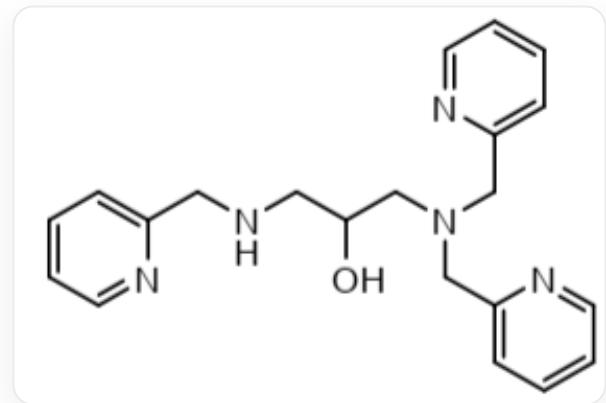

# 题目

多齿配体HTPPNOL（如图）与铜形成的配合物可以用于模拟双核含铜酶的活性中心。

  
C1=CC=NC(=C1)CNCC(CN(CC2=NC=CC=C2)CC3=CC=CC=N3)O

在形成的所有配合物中，只由  $\mathrm{Cu}^{2+}$  与来自HTPPNOL的原子构成的环均为五元环。

在乙酸钠溶液中 HTPPNOL 与  $\mathrm{Cu}^{2+}$  反应生成双核配合物  $\left[\mathrm{Cu}_{2}(\mathrm{TPPNOL})(\mathrm{CH}_{3} \mathrm{COO})\right]^{2+}$  。这个配离子中， $\mathrm{Cu}^{2+}$  有两种配位数，其中一个为五配位（三角双锥构型），配合物结构中包含四个六元环。

请根据以上信息，选出正确的选项。

A. 另一个  $\mathrm{Cu}^{2+}$  的配位数为 5 。  
B. 该配合物有 5 个五元环。  
C. 该配合物中两个  $\mathrm{Cu}^{2+}$  的氧配位数不同。  
D. 将该配离子的盐溶于水, 溶液中仅存在一种两个  $\mathrm{Cu}^{2+}$  配位数一致的双核配合物。且这两个配合物之间可以通过调控溶液  $\mathrm{pH}$  相互转化。那么这两个配合物中  $\mathrm{Cu}^{2+}$  配位数均为 4 。

E. 在无其他配体的碱性溶液  $\mathrm{Cu}^{2+}$ -HTPPNOL 体系中存在  $\mathrm{Cu}^{2+}$  配位数均为 5 的双核配离子,那么这个配合物中两个  $\mathrm{Cu}^{2+}$  的氧配位数相同。  
F. 若要测量选项 E 中配离子的晶体结构, 可选择体积较小阴离子的溶液, 减小配离子在溶液中的溶解度以获得晶体。  
G. 以上选项均不正确

# 答案

正确答案: B

# 详细解析

配合物中存在四个六元环，除了三个吡啶环外。根据只由  $\mathrm{Cu}^{2+}$  与来自HTPPNOL的原子构成的环均为五元环这个信息，这个六元环不可能是由HTPPNOL和  $\mathrm{Cu}^{2+}$  构成的。因此，它必定是由桥联的醋酸根离子形成的，即  $\mathrm{Cu}-\mathrm{O}-\mathrm{C}-\mathrm{O}-\mathrm{Cu}$  桥。

# CHECKPOINT

1 PTS

六元环由桥联的醋酸根离子形成的，即  $\mathrm{Cu - O - C - O - Cu}$  桥。

根据HTPPNOL的结构以及  $\mathrm{Cu}^{2+}$  与来自HTPPNOL的原子构成的环均为五元环这两个线索，可知HTPPNOL中每隔两个碳的N/N或N/O可与  $\mathrm{Cu}^{2+}$  形成五元环。一共可能生成5个五元环。

# CHECKPOINT

1 PTS

HTPPNOL中每隔两个碳的  $\mathrm{N} / \mathrm{N}$  或  $\mathrm{N} / \mathrm{O}$  可与  $\mathrm{Cu}^{2+}$  形成五元环，共可生成5个五元环。

根据  $\mathrm{Cu}^{2+}$  与 HTPPNOL 上配位原子的距离，可以推测 HTPPNOL 与  $\mathrm{Cu}^{2+}$  形成的双核配合物的大致结构。对于五配位的  $\mathrm{Cu}^{2+}$  而言，它分别与 HTPPNOL 中的两个吡啶氮、一个与该两个甲基吡啶相连的胺基氮、一个羟基氧和  $\mathrm{CH}_3\mathrm{COO}^-$  中一个羧基氧配位。

# CHECKPOINT

2 PTS

五配位的  $\mathrm{Cu}^{2+}$  分别与 HTPPNOL 中的两个吡啶氮、一个与该两个甲基吡啶相连的胺基氮、一个羟基氧和  $\mathrm{CH}_3\mathrm{COO}^-$  中一个羧基氧配位。

而另一个  $\mathrm{Cu}^{2+}$  则与 HTPPNOL 中剩下的一个吡啶氮、一个与该甲基吡啶相连的胺基氮、一个羟基氧和  $\mathrm{CH}_3\mathrm{COO}^-$  中一个羧基氧配位。它的配位数为 4 。

# CHECKPOINT

2 PTS

另一个  $\mathrm{Cu}^{2+}$  与 HTPPNOL 中的一个吡啶氮、一个与该甲基吡啶相连的胺基氮、一个羟基氧和  $\mathrm{CH}_3\mathrm{COO}^-$  中一个羧基氧配位，配位数为 4。

选项A：另一个  $\mathrm{Cu^{2 + }}$  的配位数为4，A错误。

选项B：该配合物有5个五元环，B正确。

选项C：该配合物中  $\mathrm{Cu^{2 + }}$  的O配位数相同，均为2，C错误。

选项D：将该配离子的盐溶于水，得到了  $\mathrm{Cu}^{2+}$  配位数相同的两个双核配合物。可能是  $\mathrm{H}_2\mathrm{O}$  与配位数为4的  $\mathrm{Cu}^{2+}$  配位，得到了  $\mathrm{Cu}^{2+}$  配位数均为5的配合物。

# CHECKPOINT

1 PTS

$\mathrm{H}_2\mathrm{O}$  与配位数为4的  $\mathrm{Cu}^{2+}$  配位，配合物的  $\mathrm{Cu}^{2+}$  配位数均为5。

其中可以通过调节  $\mathrm{pH}$  实现  $\mathrm{H}_2\mathrm{O} / \mathrm{OH}^-$  质子/去质子化，形成这两种双核配合物。

# CHECKPOINT

1 PTS

可以通过调节  $\mathrm{pH}$  实现  $\mathrm{H}_2\mathrm{O} / \mathrm{OH}^-$  质子/去质子化,完成两种配合物的转化

D 错误。

选项E：

在无其他配体的碱性溶液中，除了 HTPPNOL 只有  $\mathrm{OH}^{-}$ 与  $\mathrm{Cu}^{2+}$  配位。

# CHECKPOINT

1 PTS

$\mathrm{OH}^{-}$  与  $\mathrm{Cu}^{2+}$  配位。

已知体系中形成  $\mathrm{Cu}^{2+}$  配位数均为 5 的双核配离子，可知一个  $\mathrm{OH}^{-}$ 取代了原配合物中  $\mathrm{CH}_3\mathrm{COO}^-$  的位置，分别与两个  $\mathrm{Cu}^{2+}$  配位。

# CHECKPOINT

1 PTS

一个  $\mathrm{OH}^{-}$  分别与两个  $\mathrm{Cu}^{2+}$  配位。

另一个  $\mathrm{OH}^{-}$  与原配位数为4的  $\mathrm{Cu^{2 + }}$  配位，形成该配合物。

# CHECKPOINT

1 PTS

另一个  $\mathrm{OH}^{-}$  与原配位数为4的  $\mathrm{Cu}^{2+}$  配位

加上HTPPNOL中与两个  $\mathrm{Cu}^{2+}$  配位的羟基氧，配合物中  $\mathrm{Cu}^{2+}$  的氧配位数分别2和3。

# CHECKPOINT

1 PTS

配合物中  $\mathrm{Cu}^{2+}$  的氧配位数分别 2 和 3。

E 错误。

选项F：根据巴索洛规则，大阴离子与大阳离子组成的晶体溶解度更小。应选择体积较大阴离子的溶液，以达到减小配离子在溶液中的溶解度来获得晶体的效果。

# CHECKPOINT

1 PTS

根据巴索洛规则，应选择体积较大阴离子的溶液

F 错误。

选项G：G错误。