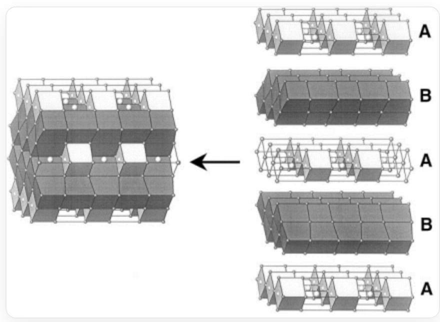
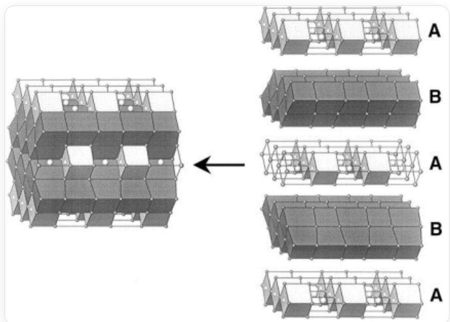

# Question

It has been discovered that alkali metal oxides can induce the disproportionation reaction of gold. Dissolving  $\mathrm{Rb}_2\mathrm{O}$  in molten rubidium metal, adding gold metal, and heating to  $200^{\circ}\mathrm{C}$  for 14 days yields an orthorhombic crystal. The structure of this crystal is shown below and can be viewed as a stacking of two types of layers, A and B. In the diagram, all cube vertices represent a rubidium atom, each hollow cube center contains a rubidium atom, while each white and black cube center contains a gold atom; oxygen atoms are located at the interfaces between all white cubes and hollow cubes. The structure is as follows:

On the left is a stacking structure composed of hollow cube frameworks, black cubes, and white cubes, and on the right is its layered decomposition, with a black arrow pointing from the right to the left. In the left stacking structure, the left-right direction aligns with the cube edges, while the up-down and front-back directions align with the cube face diagonals. In the right decomposed structure, from top to bottom, it splits into five layers: A, B, A, B, A. Layer A consists of hollow cube frameworks and white cubes, with the front-back direction showing the same type of cubes sharing edges and the left-right direction showing different types of cubes sharing faces. Adjacent A layers are staggered left-right for the same type of cubes. Layer B consists solely of black cubes, with the front-back direction forming a zigzag structure through face-sharing and the left-right direction also face-sharing. In the left stacking structure, adjacent black cube layers are connected via shared edges, while adjacent white-hollow cube layers have no direct connection.

Calculate the variance of the oxidation states of gold in this crystal.

A. 0  
B.  $\frac{1}{4}$  
C.  $\frac{2}{9}$  
D.  $\frac{3}{16}$  
E.  $\frac{4}{25}$  
F. 1  
G.  $\frac{8}{9}$  
H.  $\frac{3}{4}$  
16 25  
9 J. 4  
K. 2  
L.  $\frac{27}{16}$  
M.  $\frac{36}{25}$  
N. 4

0.  $\frac{32}{9}$  
P. 3  
Q.  $\frac{64}{25}$

# Answer

Correct Answer: I

# Detailed Explanation

From the crystal structure:

On the left is a packing structure composed of a hollow cubic framework, black cubes, and white cubes. On the right is its layered decomposition, with a black arrow in the middle pointing from the right to the left. In the packing

structure on the left, the left-right direction aligns with the cube edges, while the up-down and front-back directions align with the cube face diagonals. In the decomposed structure on the right, it is split into five layers from top to bottom: A, B, A, B, A. Layer A consists of the hollow cubic framework and white cubes, with the front-back direction showing edge-sharing connections of the same type of cubes and the left-right direction showing face-sharing connections of different types of cubes. Adjacent A layers have the same type of cubes staggered in the left-right direction. Layer B consists only of black cubes, with the front-back direction showing face-sharing connections forming a zigzag structure and the left-right direction showing face-sharing connections. In the packing structure on the left, adjacent black cube layers are connected via edge-sharing, while adjacent white-hollow cube layers have no direct connections.

It can be seen that the ratio of the three types of cubes is hollow: white: black = 1 : 1 : 4 .

# CHECKPOINT

1 PTS

The ratio of the three types of cubes is hollow: white: black  $= 1:1:4$

According to the problem description, the hollow cube contains 2 Rb atoms at the vertices and body center, and 1 O atom on the faces, giving the chemical formula  $\mathrm{Rb}_{2}\mathrm{O}$ .

# CHECKPOINT

1 PTS

The hollow cube contains  $\mathrm{Rb}_2\mathrm{O}$

The white cube contains Rb at the vertices, Au at the body center, and 1 O atom on the faces, giving the chemical formula RbAuO.

# CHECKPOINT

1 PTS

The white cube contains  $\mathrm{RbAuO}$

The black cube contains Rb at the vertices and Au at the body center, giving the chemical formula RbAu.

# CHECKPOINT

1 PTS

The black cube contains RbAu

Therefore, the overall chemical formula of the crystal is  $1 \times$  hollow +  $1 \times$  white +  $4 \times$  black =  $\mathrm{Rb}_7\mathrm{Au}_5\mathrm{O}_2$ .

# CHECKPOINT

1 PTS

The overall chemical formula of the crystal is  $\mathrm{Rb_7Au_5O_2}$

From the crystal structure, it can be observed that there are no clusters with unconventional oxidation states of Rb, nor structures like peroxide or superoxide. Thus, it can be concluded that the oxidation number of Rb in the crystal is  $+1$ , and that of O is  $-2$ .

# CHECKPOINT

1 PTS

In the crystal, the oxidation number of Rb is  $+1$ , and that of O is  $-2$

Therefore, the average oxidation number of Au is  $\frac{-1 \times 7 + 2 \times 2}{5} = -\frac{3}{5}$ .

# CHECKPOINT

1 PTS

The average oxidation number of Au is  $-\frac{3}{5}$

Considering the charge balance of each Au with its surrounding environment, the oxidation number of Au at the center of the white cube is  $+1$ , and that at the center of the black cube is  $-1$ .

# CHECKPOINT

1 PTS

The oxidation number of Au at the center of the white cube is  $+1$ , and that at the center of the black cube is  $-1$

Using the formula for variance, we have  $\sigma^2 = \frac{1}{1 + 4} \times \left[ +1 - \left(-\frac{3}{5}\right) \right]^2 + \frac{4}{1 + 4} \times \left[ -1 - \left(-\frac{3}{5}\right) \right]^2 = \frac{16}{25}$ . The correct answer is  $\mathbf{I}$ .

# CHECKPOINT

1 PTS

The variance of the oxidation numbers of gold is  $\sigma^2 = \frac{16}{25}$