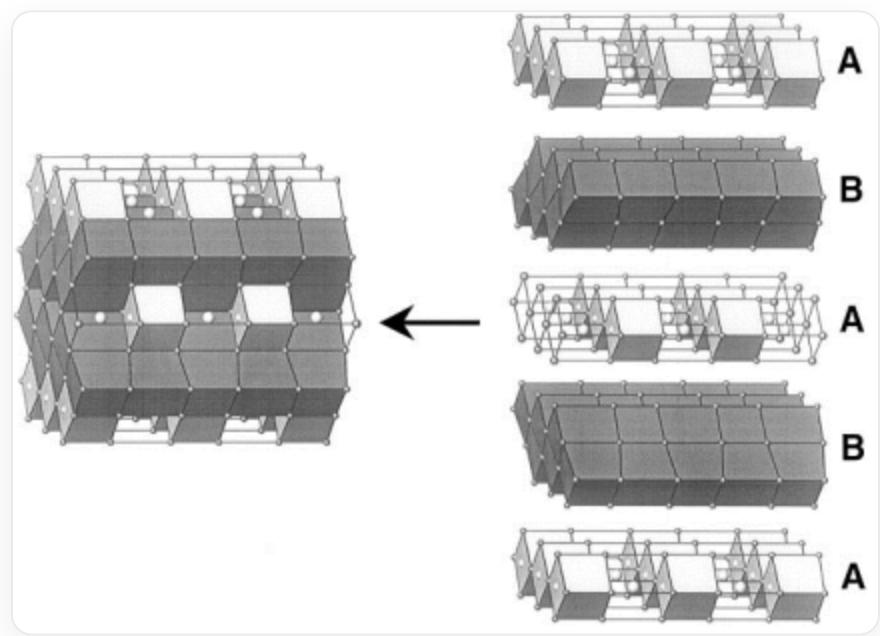
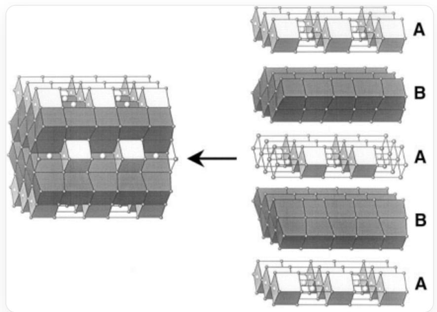

# 题目

人们发现碱金属氧化物可以引发金的歧化反应。将  $\mathrm{Rb}_{2} \mathrm{O}$  溶解在熔融的铷单质中，加入金单质并加热至  $200^{\circ} \mathrm{C}$ ，反应14天，得到一种正交晶系的晶体。该晶体的结构如下图所示，可看做由A、B两种层堆叠而成。图中所有立方体的顶点均代表一个铷原子，每个空心立方体的中心均有一个铷原子，而每个白色立方体和黑色立方体的中心均有一个金原子；氧原子位于所有白色立方体和空心立方体的交界面上。其结构如下：

左边为由空心立方体框架、黑色立方体、百色立方体构成的堆积结构，右边为其层状拆分，中间有一黑色箭头从右侧指向左侧，在左侧的堆积结构中，左右方向沿立方体的棱方向，上下和前后方向沿立方体的面对角线方向，在右侧的拆分结构中，从上至下拆分为A,B,A,B,A五层，A层包含空心立方体框架和白色立方体，前后方向为同种立方体共棱连接，左右方向为不同种立方体共面连接，相邻的A层之间同种立方体在左右方向上错开，B层只包含黑色立方体，前后方向为共面连接形成折线形结构，左右方向为共面连接，在左侧的堆积结构中，相邻的黑色立方体层之间通过共棱连接，相邻的白色-空白立方体层之间无直接连接。

求该晶体中，金的氧化数的方差。

A. 0

B.  $\frac{1}{4}$  
C.  $\frac{2}{9}$  
D.  $\frac{3}{16}$  
E.  $\frac{4}{25}$  
F. 1  
G.  $\frac{8}{9}$  
H.  $\frac{3}{4}$  
16 25  
9 J. 4  
K. 2  
L.  $\frac{27}{16}$  
M.  $\frac{36}{25}$  
N. 4  
0.  $\frac{32}{9}$

P. 3  
Q.  $\frac{64}{25}$

# 答案

正确答案: I

# 详细解析

由晶体结构：

左边为由空心立方体框架、黑色立方体、百色立方体构成的堆积结构，右边为其层状拆分，中间有一黑色箭头从右侧指向左侧，在左侧的堆积结构中，左右方向沿立方体的棱方向，上下和前后方向沿立方体的面对角线方向，在右侧的拆分结构中，从上至下拆分为A,B,A,B,A五层，A层包含空心立方体框架和白色立方体，前后方向为同种立方体共棱连接，左右方向为不同种立方体共面连接，相邻的A层之间同种立方体在左右方向上错开，B层只包含黑色立方体，前后方向为共面连接形成折线形结构，左右方向为共面连接，在左侧的堆积结构中，相邻的黑色立方体层之间通过共棱连接，相邻的白色-空白立方体层之间无直接连接。

可以看出三种立方体的数目比为空：白：黑  $= 1:1:4$

# CHECKPOINT

1 PTS

三种立方体的数目比为空：白：黑  $= 1:1:4$

由题目描述，空立方体中含有顶点和体心2个Rb，面上的1个O，化学式为  $\mathrm{Rb}_2\mathrm{O}$  。

# CHECKPOINT

1 PTS

空立方体的内容为  $\mathrm{Rb}_{2} \mathrm{O}$

白立方体中含有顶点Rb，体心Au，面上的1个O，化学式为RbAuO。

# CHECKPOINT

1 PTS

白立方体的内容为RbAuO

黑立方体中含有顶点Rb，体心Au，化学式为RbAu。

# CHECKPOINT

1 PTS

黑立方体的内容为RbAu

故晶体的总化学式为  $1 \times$  空  $+1 \times$  白  $+4 \times$  黑  $= \mathrm{Rb}_{7} \mathrm{Au}_{5} \mathrm{O}_{2}$  。

# CHECKPOINT

1 PTS

晶体总化学式为  $\mathrm{Rb_7Au_5O_2}$

由晶体结构可看出，不存在非常规氧化态Rb构成的簇，也不存在过氧根、超氧根等结构，故可认为晶体中Rb的氧化数为  $+1$  ，O的氧化数为-2。

# CHECKPOINT

1 PTS

晶体中Rb的氧化数为  $+1$  ，O的氧化数为-2

故  $\mathrm{Au}$  的平均氧化数为  $\frac{-1\times 7 + 2\times 2}{5} = -\frac{3}{5}$

# CHECKPOINT

1 PTS

Au的平均氧化数为  $-\frac{3}{5}$

考虑每个  $\mathrm{Au}$  与周边环境的电荷平衡，有白立方体中心的  $\mathrm{Au}$  的氧化数为  $+1$  ，黑立方体中心的  $\mathrm{Au}$  的氧化数为  $-1$  。

# CHECKPOINT

1 PTS

白立方体中心的  $\mathrm{Au}$  的氧化数为  $+1$  ，黑立方体中心的  $\mathrm{Au}$  的氧化数为-1

由方差的计算公式，有  $\sigma^2 = \frac{1}{1 + 4} \times \left[ +1 - \left(-\frac{3}{5}\right) \right]^2 + \frac{4}{1 + 4} \times \left[ -1 - \left(-\frac{3}{5}\right) \right]^2 = \frac{16}{25}$ ，正确答案为I。

# CHECKPOINT

1 PTS

金的氧化数的方差为  $\sigma^2 = \frac{16}{25}$