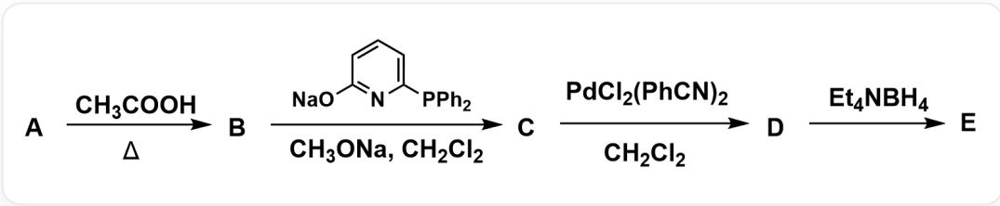
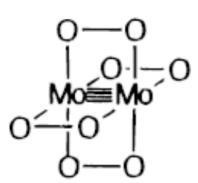
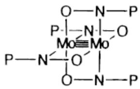
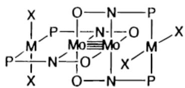
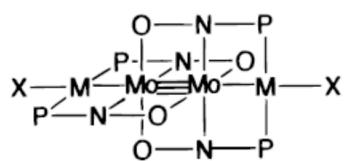

# Question

Complex  $\mathbf{E}$  can be synthesized according to the following route:

Substance A and  $CH_{3}COOH$  generate B under heating conditions. Subsequently, B reacts with [Na]OC1=NC(P(C2=CC=CC=C2)C3=CC=CC=C3)=CC=C1 and  $CH_{3}ONa$  in  $CH_{2}Cl_{2}$  to generate C. Next, C reacts with  $\mathrm{PdCl}_2(\mathrm{PhCN})_2$  in  $CH_{2}Cl_{2}$  to generate D. Finally, D reacts with  $\mathrm{Et}_4\mathrm{NBH}_4$  to generate E

A is a mononuclear carbonyl complex of molybdenum that satisfies the 18-electron rule. B, C, D, and E are all compounds containing Mo - Mo bonds, and all metal atoms have 16 electrons around them. Their molar mass, Mo - Mo distance, non-metal atoms coordinated with the metal, and the highest order symmetry axis are shown in the following table:

<table><tr><td>Compound</td><td>M/ (g·mol-1)</td><td>d(Mo-Mo)/pm</td><td>CoordinatingAtom</td><td>Highest Order SymmetryAxis</td></tr><tr><td>B</td><td>428.1</td><td>210</td><td>O</td><td>C4</td></tr><tr><td>C</td><td>1389.9</td><td>210</td><td>N、O</td><td>I4</td></tr><tr><td>D</td><td>2169.2</td><td>210</td><td>N、O、P、Cl</td><td>I4</td></tr><tr><td>E</td><td>2098.3</td><td>212</td><td>N、O、P、Cl</td><td>I4</td></tr></table>

Which of the following statements is incorrect (choose F if all are correct)?

A. A contains 6 CO  
B. The bond order of the Mo-Mo bond in  $\mathbf{B}$  is 4  
C. The bond order of the Mo - Mo bond in C is 4  
D. The bond order of the D Mo-Mo bond is 4.  
E. The bond order of the  $\mathbf{E}$  in Mo - Mo bond is 4.  
F. All of the above options are correct.

# Answer

Correct Answer: E

# Detailed Explanation

From the prompt "A is a mononuclear carbonyl complex of molybdenum that satisfies the 18-electron rule," it can be determined that A is  $\mathrm{Mo(CO)_6}$ .

# CHECKPOINT

1 PTS

A is  $\mathrm{Mo(CO)_6}$

The process of  $\mathbf{A} \rightarrow \mathbf{B}$  should be the replacement of CO by acetic acid. Since the coordinating atom is only O, it indicates that complete substitution has occurred. According to the prompt "B, C, D, and E are all compounds containing Mo-Mo bonds," let's assume there are 2 Mo first. Then the amount of Mo is  $191.92\mathrm{g}\cdot \mathrm{mol}^{-1}$ . Based on the molecular weight of B, the remaining four acetate groups can be deduced. Considering that the highest-order symmetry axis of B is  $C_4$ , all four acetate groups should be bridging ligands. The chemical formula of B should be  $\mathrm{Mo}_2(\mathrm{CH}_3\mathrm{COO})_4$ . It should be noted that Mo is in the  $+2$  oxidation state. From the prompt "all metal atoms have 16 electrons around them," it can be determined that the bond order of Mo is  $\frac{16\times 2 - 4\times 2 - 4\times 4}{2} = 4$ .

# CHECKPOINT

1 PTS

The chemical formula of  $\mathbf{B}$  should be  $\mathrm{Mo_2(CH_3COO)_4}$ , the bond order of Mo is 4

During the formation of  $\mathbf{C}$ , according to the data in the question, the Mo - Mo bond distance does not change, and the coordinating atoms are N and O, indicating that ligand substitution has occurred. Due to  $I_{4}$  symmetry, let's assume that all four ligands are substituted, i.e., the chemical formula of  $\mathbf{C}$  should be  $\mathrm{Mo}_{2}(\mathrm{X})_{4}$ , where  $\mathbf{X}$  is OC1=NC(P(C2=CC=CC=C2)C3=CC=CC=C3)=CC=C1. Calculating the molecular weight, it coincides with the prompt. Combined with  $I_{4}$  symmetry, adjacent ligand molecules should adopt opposite orientations. The bond order of Mo should be the same as that of A, which is 4.

# CHECKPOINT

1 PTS

The chemical formula of C should be  $\mathrm{Mo}_2(\mathrm{X})_4$ , where  $\mathbf{X}$  is OC1=NC(P(C2=CC=CC=C2)C3=CC=CC=C3)=CC=C1, the bond order of Mo is 4

During the formation of  $\mathbf{D}$ , the coordinating atoms increase by  $\mathbf{P}$  and  $\mathrm{Cl}$ . It can be seen that  $\mathrm{PdCl}_2(\mathrm{PhCN})_2$  is coordinated to  $\mathbf{P}$  in  $\mathrm{OC1} = \mathrm{NC}(\mathrm{P}(\mathrm{C2} = \mathrm{CC} = \mathrm{CC} = \mathrm{C2})\mathrm{C3} = \mathrm{CC} = \mathrm{CC} = \mathrm{C3}) = \mathrm{CC} = \mathrm{C1}$ , and the ligand  $\mathrm{PhCN}$  is replaced by  $\mathbf{P}$ . The product is  $\mathrm{Mo}_2(\mathrm{X})_4(\mathrm{PdCl}_2)_2$ , and the calculated molecular weight matches. The bond order of  $\mathrm{Mo}$  should be the same as that of  $\mathbf{A}$ , which is 4.

# CHECKPOINT

1 PTS

The chemical formula of  $\mathbf{D}$  should be  $\mathrm{Mo}_2(\mathrm{X})_4(\mathrm{PdCl}_2)_2$ , the bond order of Mo is 4

During the formation of  $\mathbf{E}$ , the molecular weight decreases, and the Mo - Mo bond distance increases. It indicates that ligand departure may have occurred, and at the same time, Pd and Mo are connected. Calculating the decreased molecular weight, it can be determined that two Cl have departed, and the product is  $\mathrm{Mo}_2(\mathrm{X})_4(\mathrm{PdCl})_2$ . Due to the formation of the Pd - Mo bond, the bond order of Mo changes. Two Pd - Mo bonds will reduce the bond order by 1, and the bond order of Mo is 3.

# CHECKPOINT

1 PTS

The chemical formula of  $\mathbf{E}$  should be  $\mathrm{Mo}_2(\mathrm{X})_4(\mathrm{PdCl})_2$ , the bond order of Mo is 3

Structures of B, C, D, and  $\mathbf{E}+$ . Only the coordinating atoms are shown in the figure.