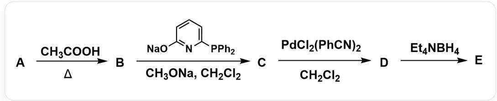
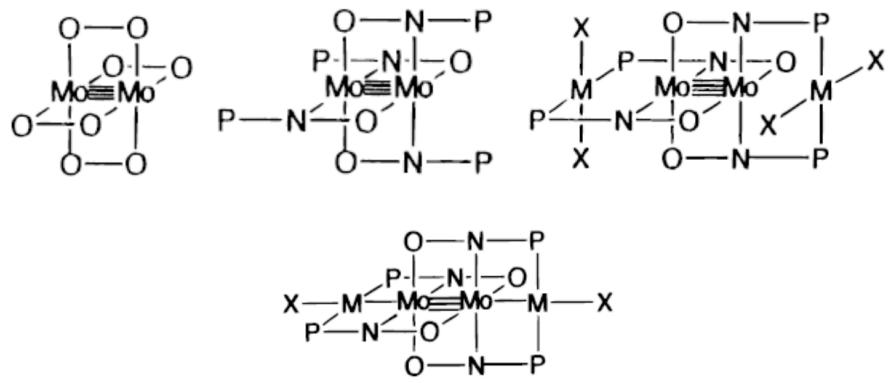

# 题目

配合物E可按如下路线合成：

物质A和  $C H_{3} C O O H$  在加热条件下生成B。随后，B会和

[Na]OC1=NC(P(C2=CC=CC=C2)C3=CC=CC=C3)=CC=C1和CH3ONa在CH2Cl2下反应，生成C。接下来，C和PdCl2(PhCN)2在CH2Cl2中反应，生成D。最后，D和Et4NBH4反应生成E

A 为钼的的单核羰基配合物，满足18电子规则。B、C、D、E均为含有Mo-Mo键的化合物，所有的金属原子周围均有16个电子，其摩尔质量、Mo-Mo间距、与金属配位的非金属原子和最高次对称轴如下表所示：

<table><tr><td>化合物</td><td>M/(g·mol-1)</td><td>d(Mo-Mo)/pm</td><td>配位原子</td><td>最高次对称轴</td></tr><tr><td>B</td><td>428.1</td><td>210</td><td>O</td><td>C4</td></tr><tr><td>C</td><td>1389.9</td><td>210</td><td>N、O</td><td>I4</td></tr><tr><td>D</td><td>2169.2</td><td>210</td><td>N、O、P、Cl</td><td>I4</td></tr><tr><td>E</td><td>2098.3</td><td>212</td><td>N、O、P、Cl</td><td>I4</td></tr></table>

下列说法中，错误的是(若均正确，选F)

A. A中包含6个CO

B. B中Mo - Mo键键级为4  
C. C中Mo - Mo键键级为4  
D. D 中Mo - Mo 键键级为4  
E. E中Mo - Mo键键级为4  
F. 以上选项都正确

# 答案

正确答案: E

# 详细解析

由题干“A为钼的的单核羰基配合物，满足18电子规则”，可以判断出A为Mo(CO)。

# CHECKPOINT

1 PTS

A 为  $\mathrm{Mo}(\mathrm{CO})_{6}$

$\mathbf{A} \rightarrow \mathbf{B}$  的过程应为CO被乙酸取代。由于配位原子仅有O，说明发生了完全取代。根据题干"B、C、D、E均为含有Mo-Mo键的化合物"，不妨先假设有2个Mo。则Mo的量为  $191.92 \mathrm{~g} \cdot \mathrm{mol}^{-1}$ ，根据B的分子量，可以推算出剩余四个乙酸根。考虑到B的最高次对称轴为  $C_{4}$ ，四个乙酸根应当均为桥连配体。B的化学式应为  $\mathrm{Mo}_{2}(\mathrm{CH}_{3} \mathrm{COO})_{4}$ ，需要注意Mo为  $+2$  价。由题干"所有的金属原子周围均有16个电子"，可以判断Mo的键级为  $\frac{16 \times 2 - 4 \times 2 - 4 \times 4}{2} = 4$ 。

# CHECKPOINT

1 PTS

B 的化学式应为  $\mathrm{Mo}_{2}(\mathrm{CH}_{3}\mathrm{COO})_{4}, \mathrm{Mo}$  的键级为 4

生成C过程中，根据题目数据，Mo-Mo键距离未改变，配位原子有N和O，说明发生了配体取代。由于  $I_{4}$  对称性，不妨假设四个配体均发生取代，即C的化学式应为  $\mathrm{Mo}_{2}(\mathrm{X})_{4}$ ， $\mathbf{X}$  即  $\mathrm{OC1 = NC(P(C2 = CC = CC = C2)C3 = CC = CC = C3) = CC = C1}$ 。计算分子量，正好与题干吻合。结合  $I_{4}$  对称性，相邻的配体分子应当采用相反的取向。Mo的键级应与A相同，为4。

# CHECKPOINT

1 PTS

C 的化学式应为  $\mathrm{Mo}_{2}(\mathrm{X})_{4}$ ,  $\mathbf{X}$  即  $\mathrm{OC1 = NC(P(C2 = CC = CC = C2)C3 = CC = CC = C3) = CC = C1}$ , Mo 的键级为 4

生成 D 过程中，配位原子增加了 P 和 Cl。可以看出， $\mathrm{PdCl}_2(\mathrm{PhCN})_2$  被  $\mathrm{OC1} = \mathrm{NC}(\mathrm{P}(\mathrm{C}2 = \mathrm{CC} = \mathrm{CC} = \mathrm{C}2)\mathrm{C}3 = \mathrm{CC} = \mathrm{CC} = \mathrm{C}3) = \mathrm{CC} = \mathrm{C}1$  中的 P 配位，同时配体 PhCN 被 P 取代，产物为  $\mathrm{Mo}_2(\mathrm{X})_4(\mathrm{PdCl}_2)_2$ ，计算分子量吻合。Mo 的键级应与 A 相同，为 4。

# CHECKPOINT

1 PTS

D 的化学式应为  $\mathrm{Mo}_{2}(\mathrm{X})_{4}(\mathrm{PdCl}_{2})_{2}, \mathrm{Mo}$  的键级为 4

生成E过程中，分子量降低，Mo-Mo键距离增大。说明可能发生了配体的离去，同时Pd和Mo相连。计算降低的分子量，可以判断离去了两个Cl，产物为  $\mathrm{Mo}_{2}(\mathrm{X})_{4}(\mathrm{PdCl})_{2}$  。由于Pd-Mo键的形成，Mo的键级发生变化。两根Pd-Mo键会使键级降低1，Mo的键级为3。

# CHECKPOINT

1 PTS

E 的化学式应为  $\mathrm{Mo}_{2}(\mathrm{X})_{4}(\mathrm{PdCl})_{2}, \quad \mathrm{Mo}$  的键级为 3

B、C、D、E+的结构。图中仅给出了配位原子。