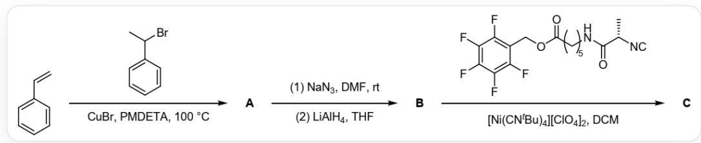
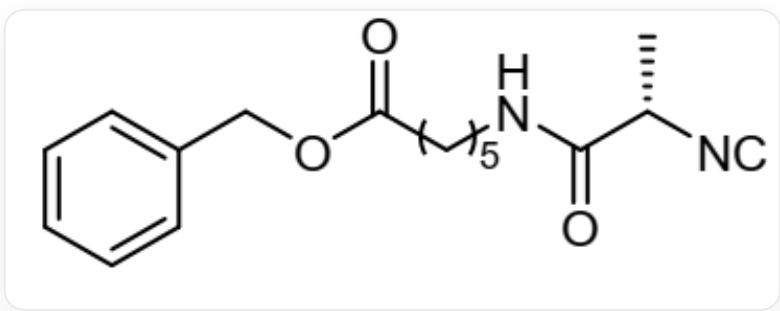
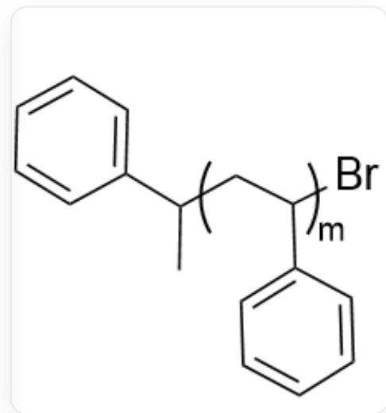
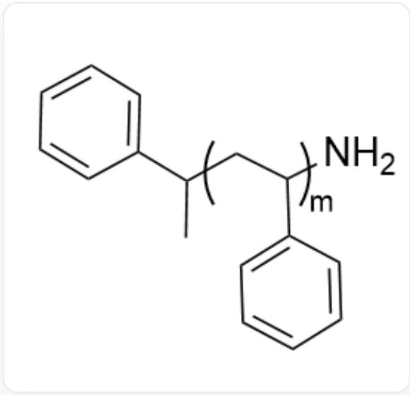
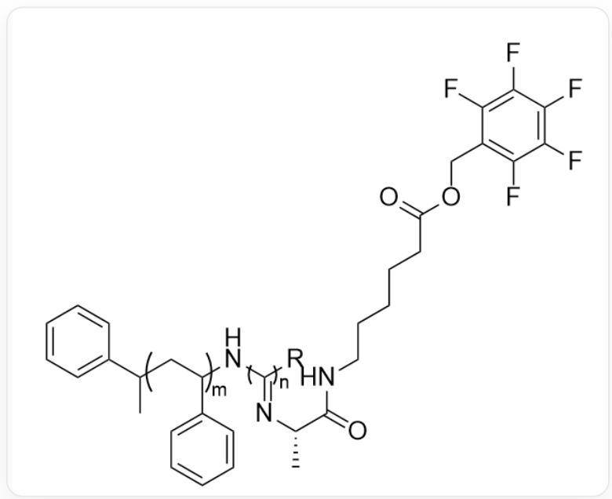

# Question

Proteins possess a rich hierarchical structure, and it is this complex and subtle structure that endows proteins with many functions, such as catalysis, transport, and information transfer, making them widely and importantly applied in fields such as biochemistry and medicine. For chemists, the ability to artificially synthesize protein analogs would expand the structural range of biological macromolecules and allow for more precise control in protein modification and other aspects. In 2021, Marcus Weck's group synthesized polyisocyanides that can mimic the secondary and tertiary structures of proteins, and the related results were published on MRC. Note: PMDETA is pentamethyldiethylenetriamine, and the terminal group structure of C does not need to be explicitly defined.

  
Reaction of styrene with  $\mathrm{CC(Br)C1 = CC = CC = C1}$  in the presence of cuprous bromide and PMDETA at  $100^{\circ}C$  to obtain A, A first reacts with sodium azide in DMF at room temperature, and then reacts with lithium aluminum hydride in THF to obtain B, B reacts with  $\mathrm{C[C@@H]}$ $(\mathrm{C(=O)NCC(=O)OCC1 = C(C(=C(C(=C1F)F)F)F)F)[N + ]\#[C - ]}$  in DCM in the presence of  $[Ni(CN^{t}Bu)_{4}][ClO_{4}]_{2}$  to obtain C

The following statements are made:

1. Each molecule of  $\mathbf{B}$  contains  $1sp^3$  nitrogen atom.  
2. B contains independent methyl groups and the carbon atom connected to the methyl group is bonded to a heteroatom.  
3. A certain segment of  $\mathbf{C}$  can coil into a  $\beta$ -helix-like structure, and the helical structure formed by this segment has a high inversion energy barrier and will not unwind even in strongly polar protic solvents. This segment is a polyisocyanide block.

4. Two segments of  $\mathbf{C}$  have further folded. However, if the monomer added in the step from  $\mathbf{B}$  to  $\mathbf{C}$  is replaced with the following compound, folding will not occur. The main intermolecular force causing this folding is  $\pi-\pi$  stacking.

  
[ \text{[C-]#[N+][C@@H](C)C(NCCCCC(OCC1=CC=CC=C1)=O)} = \text{O} ]

Then the sum of the coefficients of all correct statements is:

A. All statements are incorrect.  
B. 1  
C. 2  
D. 3  
E. 4  
F. 5  
G. 6  
H. 7

1. 8  
J. 9  
K. 10

# Answer

Correct Answer: I

# Detailed Explanation

Generating  $\mathbf{A}$  is a typical atom transfer radical polymerization (ATRP) reaction. Styrene is the monomer,  $\mathrm{CC(Br)C1 = CC = CC = C1}$  is the initiator, and cuprous bromide/PMDETA is the catalytic system. First, cuprous bromide reacts with  $\mathrm{CC(Br)C1 = CC = CC = C1}$  to generate  $\mathrm{C[C]([H])C1 = CC = CC = C1}$  radical (the radical is the carbon atom that was originally bonded to bromine) and cupric bromide, initiating the polymerization. At termination, the polymer radical abstracts the bromine atom from cupric bromide to obtain  $\mathbf{A}$ , with the basic structure:  $\mathrm{CC(C1 = CC = CC = C1)CC(Br)C2 = CC = CC = C2}$  (degree of polymerization is 1), where  $[\mathrm{JCC}()]\mathrm{C1} = \mathrm{CC} = \mathrm{CC} = \mathrm{C1}$  is the repeating unit.

A，基本结构为： $\mathrm{CC}(\mathrm{C1} = \mathrm{CC} = \mathrm{CC} = \mathrm{C1})\mathrm{CC}(\mathrm{Br})\mathrm{C2} = \mathrm{CC} = \mathrm{CC} = \mathrm{C2}$ （聚合度为1），其中[ \text{[*]CC([*)]} \mathrm{C1} = \mathrm{CC} = \mathrm{CC} = \mathrm{C1} ]为重复单元

In the process of generating  $\mathbf{B}$ , the bromine atom is first replaced by azide, and then reduced by lithium aluminum hydride to generate an amino group, to obtain  $\mathbf{B}$ : the basic structure is:  $\mathrm{CC}(\mathrm{C}1 = \mathrm{CC} = \mathrm{CC} = \mathrm{C}1)\mathrm{CC}(\mathrm{N})\mathrm{C}2 = \mathrm{CC} = \mathrm{CC} = \mathrm{C}2$  (degree of polymerization is 1), where  $\mathrm{[]CC([)]}\mathrm{C}1 = \mathrm{CC} = \mathrm{CC} = \mathrm{C}1$  is the repeating unit.

  
B：基本结构为：`CC(C1=CC=CC=C1)CC(N)C2=CC=CC=C2`（聚合度为1），其中`[*]CC([\*])C1=CC=CC=C1`为重复单元

# CHECKPOINT

1 PTS

The basic structure of  $\mathbf{B}$  is:  $\mathrm{CC}(\mathrm{C1} = \mathrm{CC} = \mathrm{CC} = \mathrm{C1})\mathrm{CC}(\mathrm{N})\mathrm{C2} = \mathrm{CC} = \mathrm{CC} = \mathrm{C2}$  (degree of polymerization is 1), containing 1 amino group, statement 1 is correct

The carbon in B bonded to the methyl group is bonded to the phenyl group and the methylene group, and is not bonded to heteroatoms.

# CHECKPOINT

1 PTS

The carbon in  $\mathbf{B}$  bonded to the methyl group is bonded to the phenyl group and the methylene group, and is not bonded to heteroatoms. Statement 2 is incorrect

The amino group in B attacks the isocyanide carbon atom, generating a carbanion, which then further attacks the next molecule of isocyanide, resulting in the polymer C: the basic structure is  $\mathrm{CC}(\mathrm{CC}(\mathrm{N} / \mathrm{C}([\mathrm{R}]}) = \mathrm{N} / [\mathrm{C}@\mathrm{H}]$  (C(NCCCCC(OCC1=C(F)C(F)=C(F)C(F)=C1F)=O)=O)C)C2=CC=CC=C2)C3=CC=C3' (the degree of

polymerization of both polymer segments is 1), where  $\mathrm{[}JCC(L)]\mathrm{C}1 = \mathrm{CC} = \mathrm{CC} = \mathrm{C}1$  and  $\mathrm{[}J / C(L)] = \mathrm{N} / [\mathrm{C}@\mathrm{H}]$  (C)C(NCCCCC(OCC1=C(C(F)=C(C(F)=C1F)F)=O)=O are the repeating units, and R represents an unknown end-capping group.

  
C：基本结构为\CC(CC(N/C([R])=N/[C@H]  
(C(NCCCCC(OCC1=C(F)C(F)=C(F)C(F)=C1F)=O)=O)C)C2=CC=CC=C2)C3=CC=CC=C3 (两段聚合物聚合度均为1), 其中`[^*]CC([*)]C1=CC=CC=C1`和`[^*]/C([*)]=N/[C@@H]  
(C)C(NCCCCC(OCC1=C(C(F)=C(C(F)=C1F)F)F)=O)=O\`为重复单元，R表示未知的封端基团

The amide groups on the side chains of the polyisocyanide block in C can form interchain hydrogen bonds with each other, maintaining a helical structure, and the carbon atoms on the main chain are all  $sp^2$  hybridized, which has a certain rigidity, and therefore has a very high inversion energy barrier.

# CHECKPOINT

1 PTS

The amide groups on the side chains of the polyisocyanide block in C can form interchain hydrogen bonds with each other, maintaining a helical structure, and the carbon atoms on the main chain are all  $sp^2$  hybridized, and therefore has a very high inversion energy barrier. Statement 3 is correct

Compared with the original monomer, the substituted monomer replaces the pentafluorophenyl group with a phenyl group. The pentafluorophenyl group is an electron-deficient aromatic ring, while the side group of the polystyrene segment is an electron-rich phenyl group. A strong  $\pi-\pi$  stacking interaction can occur between electron-deficient and electron-rich aromatic rings. After the replacement, this interaction disappears, preventing folding from occurring.

# CHECKPOINT

1 PTS

The pentafluorophenyl group is an electron-deficient aromatic ring, and the phenyl group is electron-rich, and a strong  $\pi-\pi$  stacking interaction can occur between them. Statement 4 is correct

Statements 1, 3, and 4 are correct, and the sum is 8, so choose I.