# Question

A is an aromatic compound with the molecular formula  $\mathrm{C_{10}H_{12}O}$ . Heating A to  $200^{\circ}\mathrm{C}$  causes isomerization to obtain compound B; B is treated with dimethyl sulfate to obtain compound C ( $\mathrm{C_{11}H_{14}O}$ ). A undergoes ozonolysis-reduction to yield D and formaldehyde; B undergoes ozonolysis-reduction to yield E and acetaldehyde; while C is treated with acidic potassium permanganate solution to obtain o-methoxybenzoic acid. Select the structure of A.

A. All other options are incorrect.  
B. There is more than one correct option.

C.  
D.  
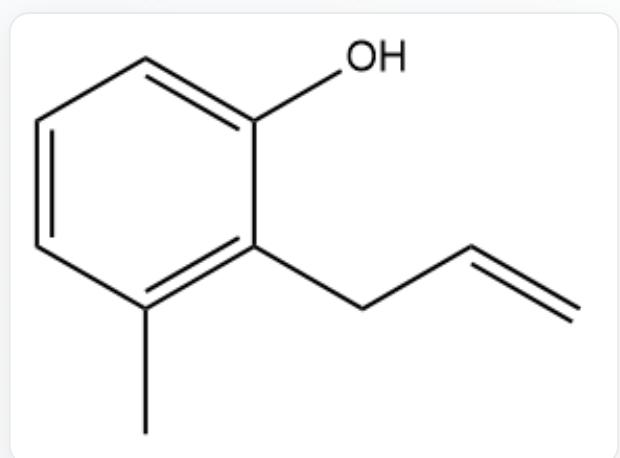  
C=CCC1=C(C)C=CC=C1O

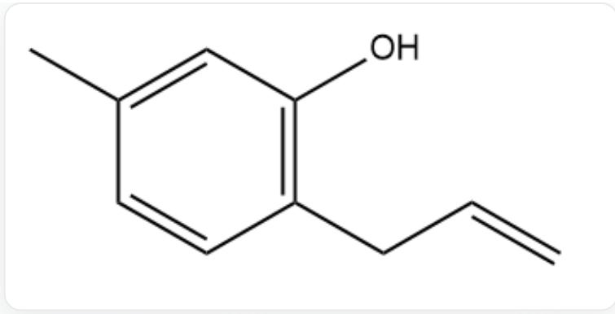  
$\mathrm{C = CCC1 = C(C = C(C)C = C1)O}$

E.

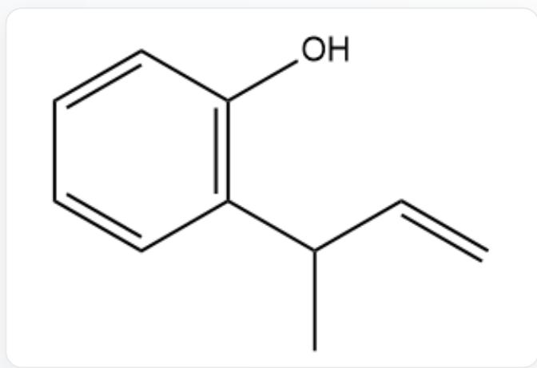  
$\mathrm{C = CC(C)C1 = C(C = CC = C1)O}$

F.

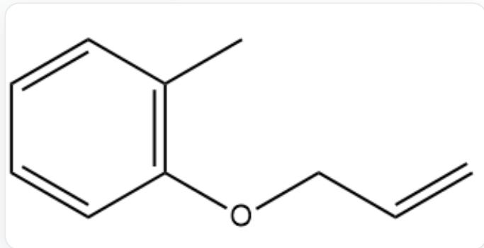  
C=CCOC1=C(C)C=CC=C1

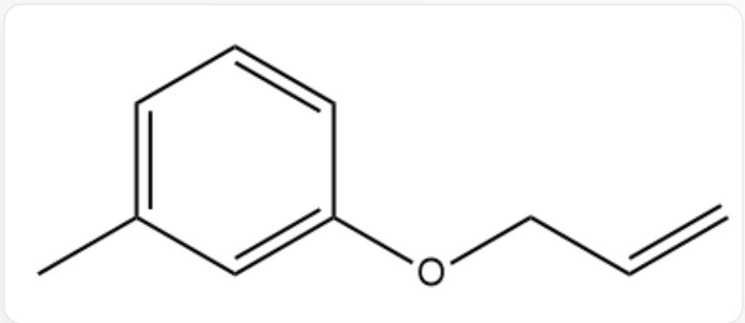  
G.  
C=CCOC1=CC(=CC=C1)C

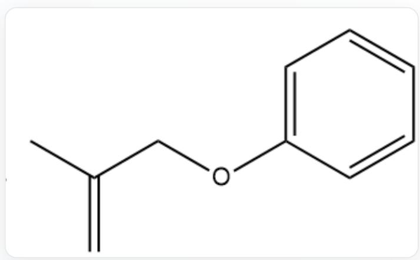  
H.  
C=C(C)COC1=CC=CC=C1

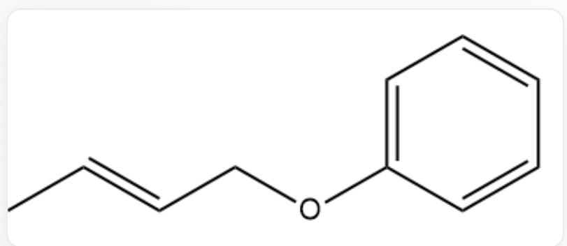  
1.  
CC=CCOC1=CC=CC=C1

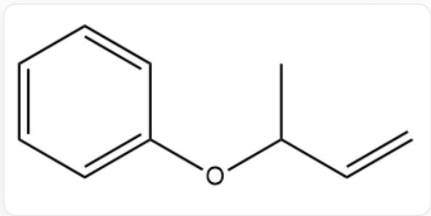  
J.  
C=CC(C)OC1=CC=CC=C1

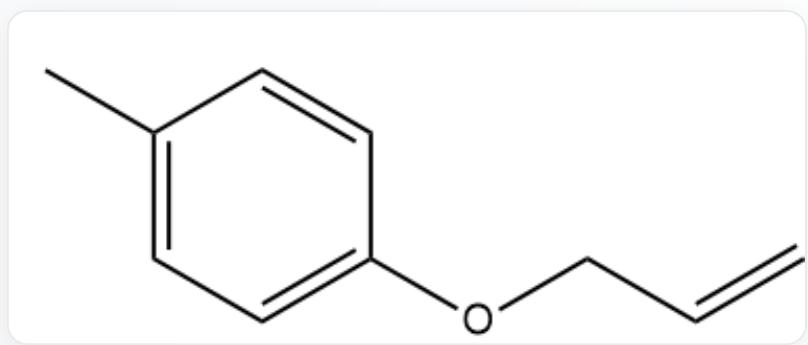  
K.  
C=CCOC1=CC=C(C)C=C1  
L.

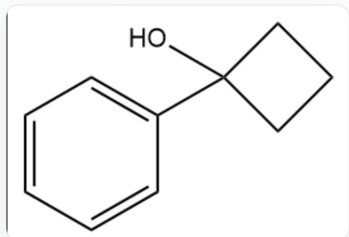  
C1=CC=C(C=C1)C2(CCC2)O

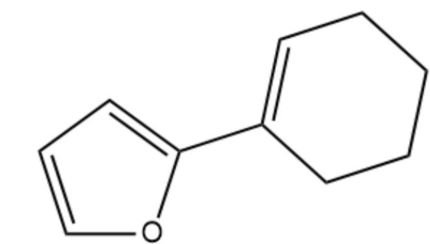  
M.  
O1C=CC=C1C2=CCCCC2

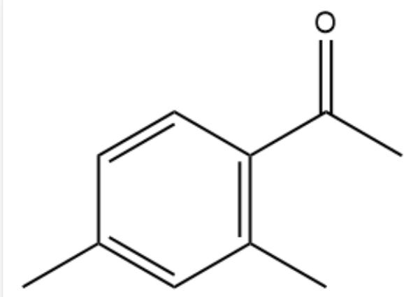  
N.  
CC1=CC(=C(C=C1)C(=O)C)C  
0.

  
P.

C1=CC=C2C(=C1)CCCC2O

  
Q.

C1CCC2=C(C=CC=C2C1)O

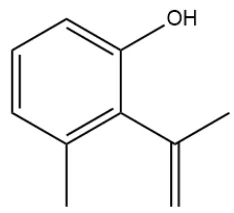  
R.

C=C(C)C1=C(C)C=CC=C1O

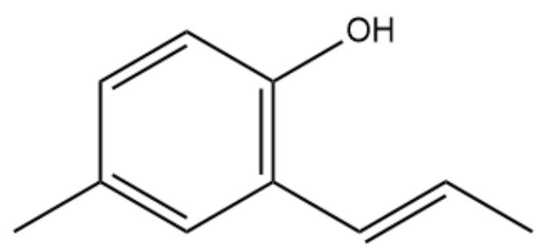  
S.

CC=CC1=C(C=CC(=C1)C)O

$\mathrm{C = CC1 = C(C = CC = C1)CCO}$

T.  
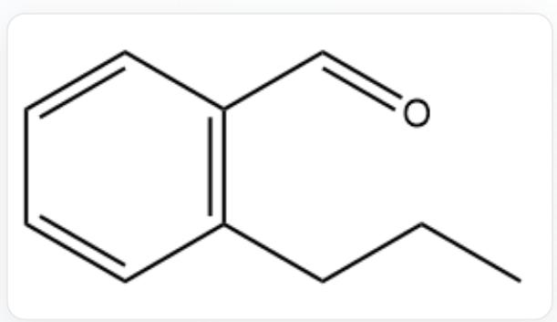  
$\mathrm{CCCC1 = C(C = CC = C1)C = O}$

# Answer

Correct Answer: J

# Detailed Explanation

$\mathbf{A}$  is obtained from an isomerization reaction to yield  $\mathbf{B}$ , then the molecular formula of  $\mathbf{B}$  is also  $\mathrm{C_{10}H_{12}O}$ .

# CHECKPOINT

1 PTS

The molecular formula of  $\mathbf{B}$  is  $\mathrm{C_{10}H_{12}O}$

B undergoes a methylation reaction with dimethyl sulfate to obtain C.

# CHECKPOINT

1 PTS

B undergoes a methylation reaction to obtain C

The molecular formula differs by one  $\mathrm{CH}_2$ , and there is only one O in  $\mathbf{B}$ , so there is only 1 hydroxyl group in  $\mathbf{B}$ .

# CHECKPOINT

2 PTS

There is only 1 hydroxyl group in  $\mathbf{B}$

C is oxidized by acidic potassium permanganate solution to obtain o-methoxybenzoic acid (COC1=C(C(=O)O)C=CC=C1), indicating that the aromatic ring of C is a benzene ring, and it is ortho-disubstituted.

# CHECKPOINT

2 PTS

C contains a benzene ring, and it is ortho-disubstituted

The methoxy group will not be oxidized by acidic potassium permanganate solution, while the ortho-hydrocarbon group is oxidized to a carboxyl group, and the chemical formula of the hydrocarbon group is  $\mathrm{C_4H_7}$ .

# CHECKPOINT

1 PTS

The two substituents on the benzene ring in  $\mathbf{C}$  are methoxy and  $-\mathrm{C}_4\mathrm{H}_7$

Both A and B can undergo ozonolysis reduction reactions, which contain carbon-carbon double bonds, so the degree of unsaturation of the  $-\mathrm{C}_4\mathrm{H}_7$  group comes from a carbon-carbon double bond.

# CHECKPOINT

1 PTS

-  $\mathrm{C_4H_7}$  group contains one carbon-carbon double bond

Combining the structure of B: o-alkenylphenol, the isomerization reaction of A at  $200^{\circ}\mathrm{C}$  is likely to be a Claisen rearrangement.

# CHECKPOINT

3 PTS

A undergoes Claisen rearrangement to obtain  $\mathbf{B}$

Therefore, A, B, C all contain methyl-substituted allyl groups. 1-methylallyl and 2-methylallyl are obtained after ozonolysis reduction to obtain formaldehyde; 3-methylallyl (crotyl) is obtained after ozonolysis reduction to obtain acetaldehyde. It can be determined that the structure of B is CC=CCC1=C(O)C=CC=C1.

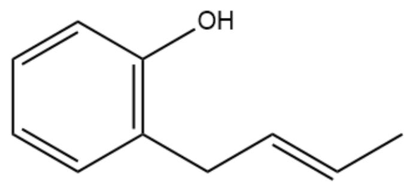

CC=CCC1=C(O)C=CC=C1

# CHECKPOINT

2 PTS

The structure of  $\mathbf{B}$  is CC=CC1=C(O)C=CC=C1

The reverse reaction deduces that the structure of  $\mathbf{A}$  is  $C = CC(C)OC1 = CC = CC = C1$ .

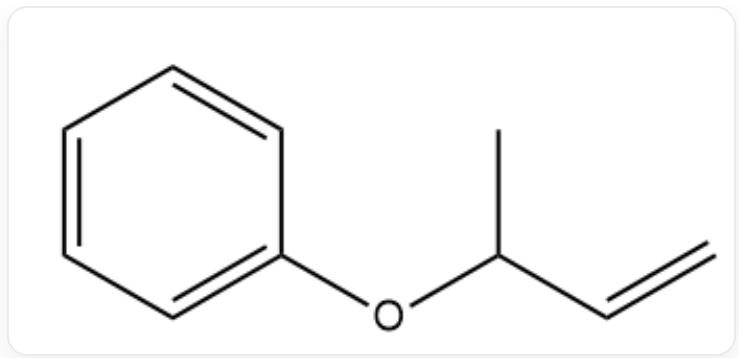

C=CC(C)OC1=CC=CC=C1

# CHECKPOINT

2 PTS

The structure of  $\mathbf{A}$  is  $\mathrm{C = CC(C)OC1 = CC = CC = C1}$