# 题目

A 为芳香化合物, 其分子式为  $\mathrm{C}_{10} \mathrm{H}_{12} \mathrm{O}$  。将 A 加热至  $200^{\circ} \mathrm{C}$  发生异构化, 得到化合物 B; B 用硫酸二甲酯处理, 可得到化合物 C  $\left(\mathrm{C}_{11} \mathrm{H}_{14} \mathrm{O}\right)$  。A 经臭氧化-还原得到 D 和甲醛; B 经臭氧化还原得到 E 和乙醛; 而 C 用酸性高锰酸钾溶液处理则得到邻甲氧基苯甲酸。选出 A 的结构。

A. 其他选项均不正确  
B. 有不止一个选项正确

C.

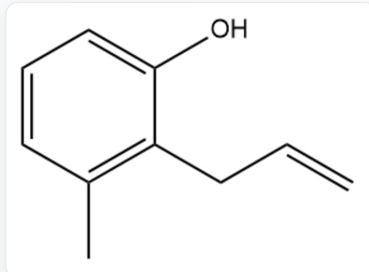

$\mathrm{C = CCC1 = C(C)C = CC = C1O}$

D.  
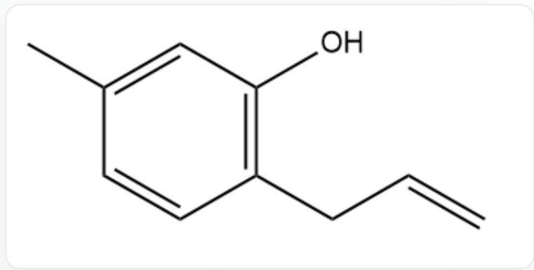  
$\mathrm{C = CCC1 = C(C = C(C)C = C1)O}$

E.  
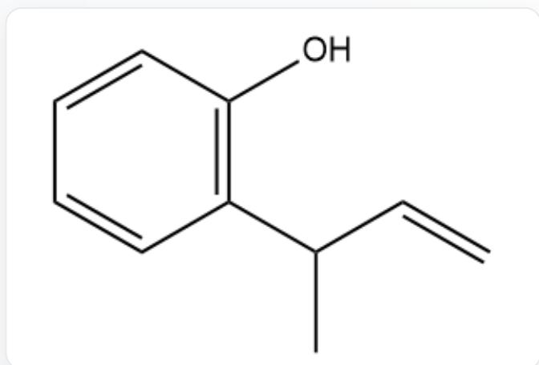  
$\mathrm{C = CC(C)C1 = C(C = CC = C1)O}$

F.  
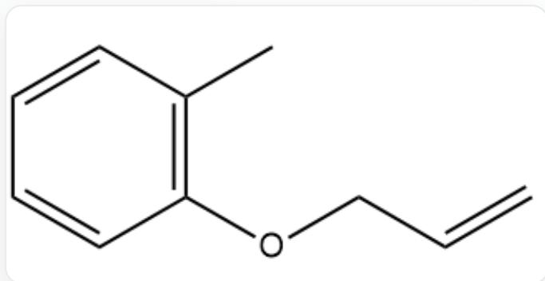  
C=CCOC1=C(C)C=CC=C1

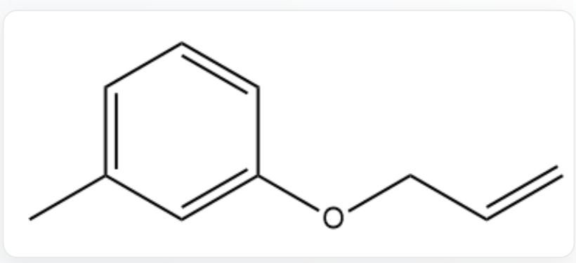  
G.  
C=CCOC1=CC(=CC=C1)C

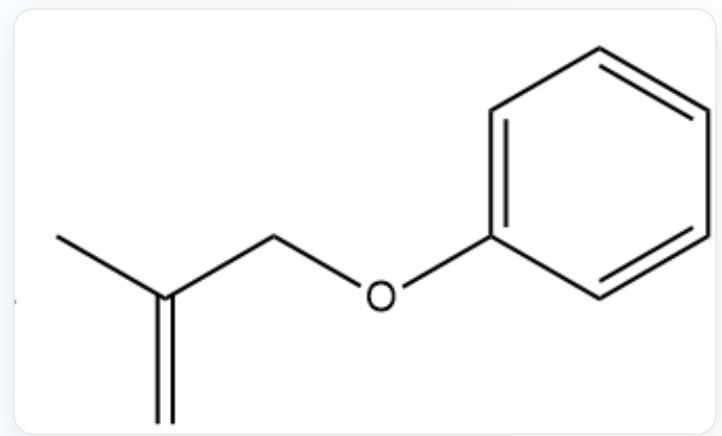  
H.  
C=C(C)COC1=CC=CC=C1

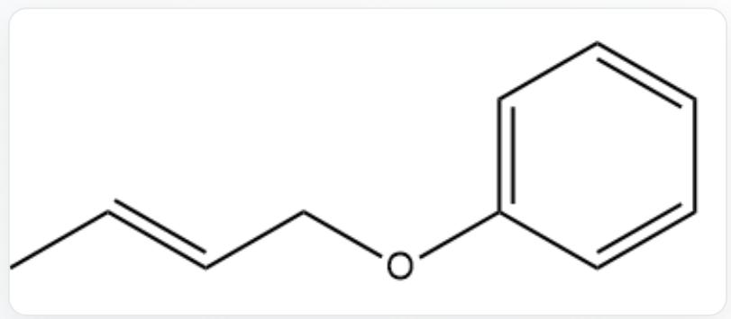  
1.  
CC=CCOC1=CC=CC=C1

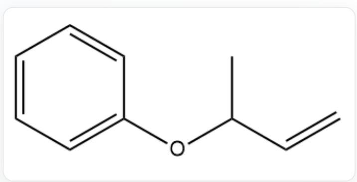  
J.  
C=CC(C)OC1=CC=CC=C1

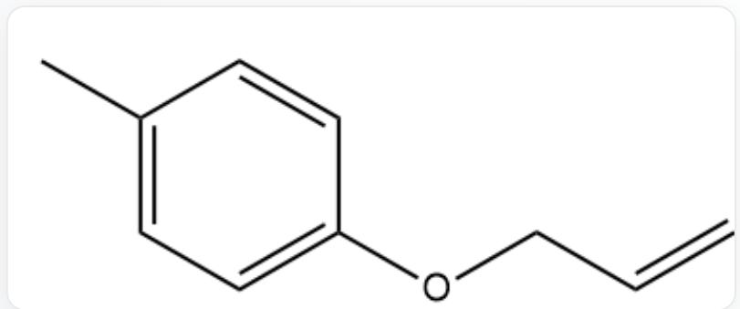  
K.  
C=CCOC1=CC=C(C)C=C1  
L.

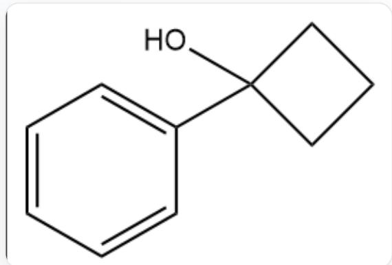  
C1=CC=C(C=C1)C2(CCC2)O

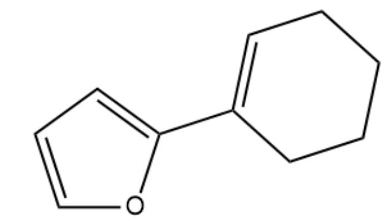  
M.  
O1C=CC=C1C2=CCCCC2

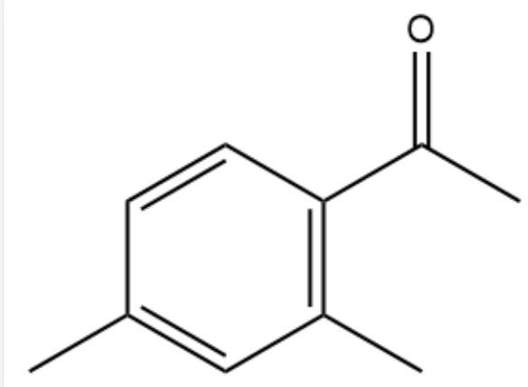  
N.  
CC1=CC(=C(C=C1)C(=O)C)C  
0.

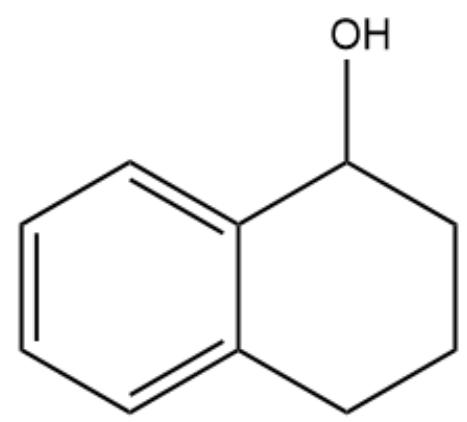  
P.

C1=CC=C2C(=C1)CCCC2O

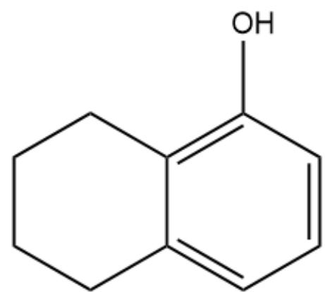  
Q.

C1CCC2=C(C=CC=C2C1)O

  
R.

C=C(C)C1=C(C)C=CC=C1O

  
S.

CC=CC1=C(C=CC(=C1)C)O

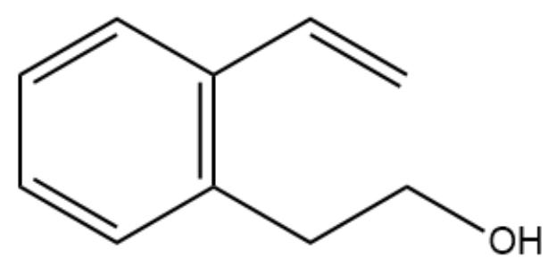

$\mathrm{C = CC1 = C(C = CC = C1)CCO}$

T.  
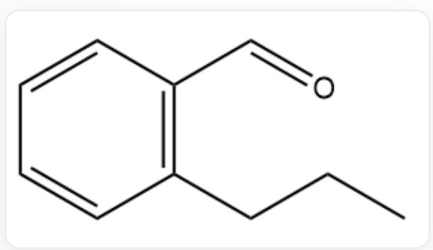  
$\mathrm{CCCC1 = C(C = CC = C1)C = O}$

# 答案

正确答案: J

# 详细解析

A 经过异构化反应得到 B, 则 B 的分子式也是  $\mathrm{C}_{10} \mathrm{H}_{12} \mathrm{O}$ .

# CHECKPOINT

1 PTS

B 的分子式是  $\mathrm{C}_{10} \mathrm{H}_{12} \mathrm{O}$

B与硫酸二甲酯进行甲基化反应，得到C.

# CHECKPOINT

1 PTS

B经过甲基化反应得到C

分子式相差一个  $\mathrm{CH}_2$  ，B中也只有一个O，因此B中有且只有1个羟基

# CHECKPOINT

2 PTS

B中有且只有1个羟基

C 经过酸性高锰酸钾溶液氧化后得到邻甲氧基苯甲酸 (COC1=C(C(=O)O)C=CC=C1), 说明 C 的芳香环为苯环, 且为邻位二取代.

# CHECKPOINT

2 PTS

C含有一个苯环，且为邻位二取代

甲氧基不会被酸性高锰酸钾溶液氧化, 而邻位的烃基被氧化成羧基, 烃基的化学式为  $\mathrm{C_4H_7}$ .

# CHECKPOINT

1 PTS

C中苯环上的两个取代基为甲氧基和-  $\mathrm{C}_{4} \mathrm{H}_{7}$

A与B均可以发生臭氧化还原反应, 其中包含碳碳双键, 因此-  $\mathrm{C}_4\mathrm{H}_7$  基团的不饱和度来自一个碳碳双键.

# CHECKPOINT

1 PTS

$-\mathrm{C}_{4} \mathrm{H}_{7}$  基团内有一个碳碳双键

结合B的结构：邻烯基苯酚，A在  $200^{\circ}\mathrm{C}$  下发生的异构化反应很可能是克莱森重排。

# CHECKPOINT

3 PTS

A 经过克莱森重排得到 B

于是A,B,C中均含有甲基取代的烯丙基,经过臭氧化还原得到甲醛的有1-甲基烯丙基,2-甲基烯丙基;经过臭氧化还原得到乙醛的是3-甲基烯丙基(巴豆基).可以确定B的结构是CC=CCC1=C(O)C=CC=C1.

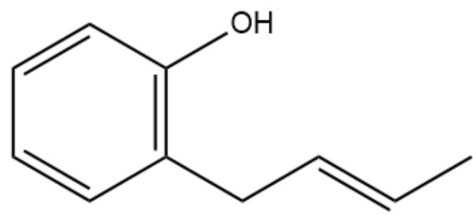

CC=CCC1=C(O)C=CC=C1

# CHECKPOINT

2 PTS

B的结构是CC=CCC1=C(O)C=CC=C1

逆反应推出A的结构是  $\mathrm{C = CC(C)OC1 = CC = CC = C1}$

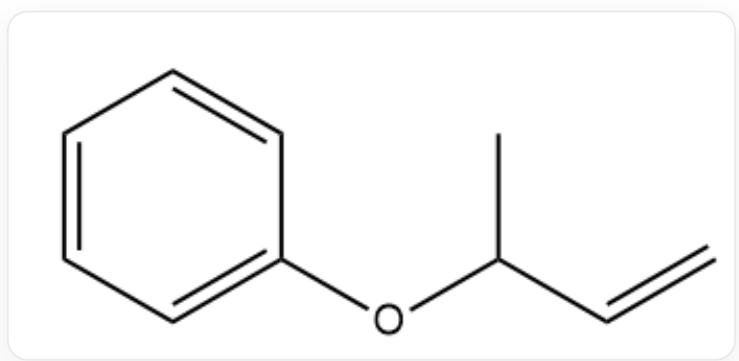

C=CC(C)OC1=CC=CC=C1

# CHECKPOINT

2 PTS

A 的结构是C=CC(C)OC1=CC=CC=C1