# Question

The synthesis of multi-functional group substituted aromatic rings has always been a research hotspot for scientists. The following is the synthetic route of a multi-substituted aromatic compound  $\mathbf{G}$ :

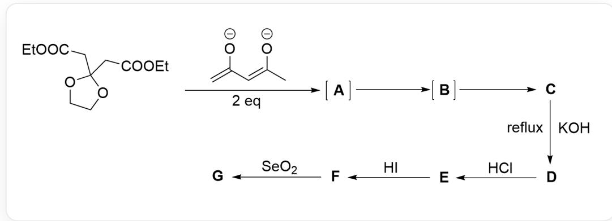

The image describes a stepwise organic synthesis process. The substrate structure is O=C(CC1(CC(OCC)=O)OCCO1)OCC. Two equivalents of C=C(/C=C([O-])/C)[O-] are added to react, going through two intermediates  ${}^{**}\mathrm{A}^{**}$  and  ${}^{**}\mathrm{B}^{**}$  to obtain product  ${}^{**}\mathrm{C}^{***}$ . Product  ${}^{**}\mathrm{C}^{**}$  is added to sodium hydroxide and refluxed to obtain  ${}^{**}\mathrm{D}^{**}$ .  ${}^{**}\mathrm{D}^{**}$  is added to hydrochloric acid to obtain  ${}^{**}\mathrm{E}^{**}$ .  ${}^{**}\mathrm{E}^{**}$  is added to hydrogen iodide to obtain  ${}^{**}\mathrm{F}^{**}$ .  ${}^{**}\mathrm{F}^{**}$  reacts with selenium dioxide to obtain product  ${}^{**}\mathrm{G}^{**}$ .

A protected carbonyl diester undergoes two anionic intermediates, A and B, to obtain the electrically neutral intermediate product C. C undergoes four steps of reaction to finally obtain G.

# Known:

1.  $\mathbf{B}$  has three rings, while  $\mathbf{C}$  has only two rings.  
2.  $\mathbf{G}$  is a tricyclic multi-substituted aromatic compound.  
3. All unknown structures except A have an aromatic ring.  
4. E, F both have an anthrone skeleton.

The following options are all possible structures of  $\mathbf{G}$ . The correct one is:

A.

B.  
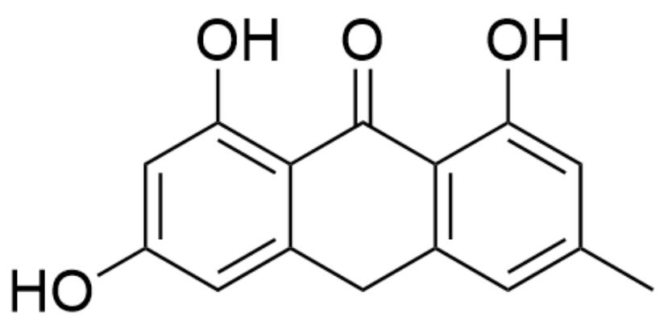  
OC1=CC(O)=C2C(CC(C=C(C)C=C3O)=C3C2=O)=C1

C.  
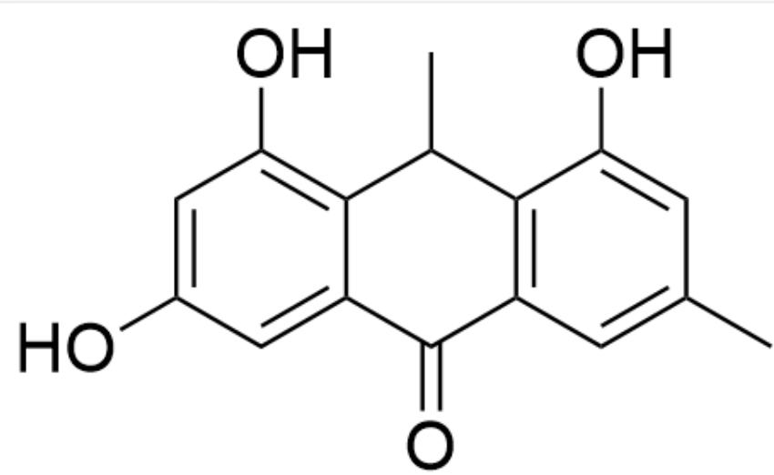  
OC1=CC(O)=C2C(C(C=C(C)C=C3O)=C3C2C)=O)=C1

D.  
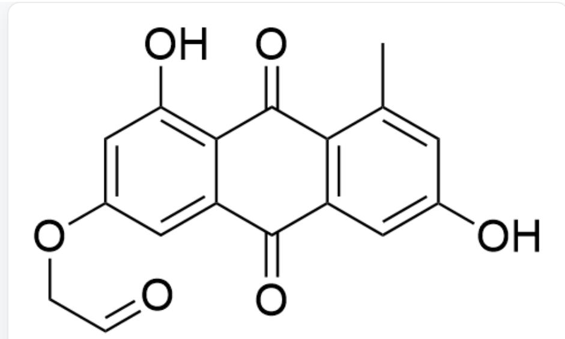  
OC1=C2C(C(C(C=C(O)C=C3C)=C3C2=O)=O)=CC(OCC=O)=C1

E.  
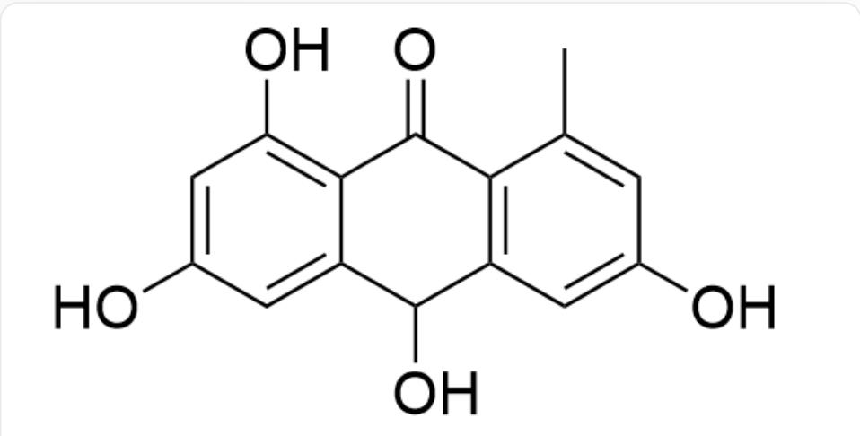  
OC1=CC(O)=C2C(C(O)C(C=C(O)C=C3C)=C3C2=O)=C1

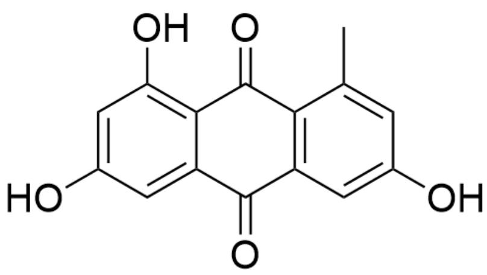  
F.

OC1=CC(O)=C2C(C(C(C=C(O)C=C3C)=C3C2=O)=O)=C1

  
G.

OC1=CC(O)=C2C(C(C=C(C)C=C3O)=C3C2=O)=O)=C1

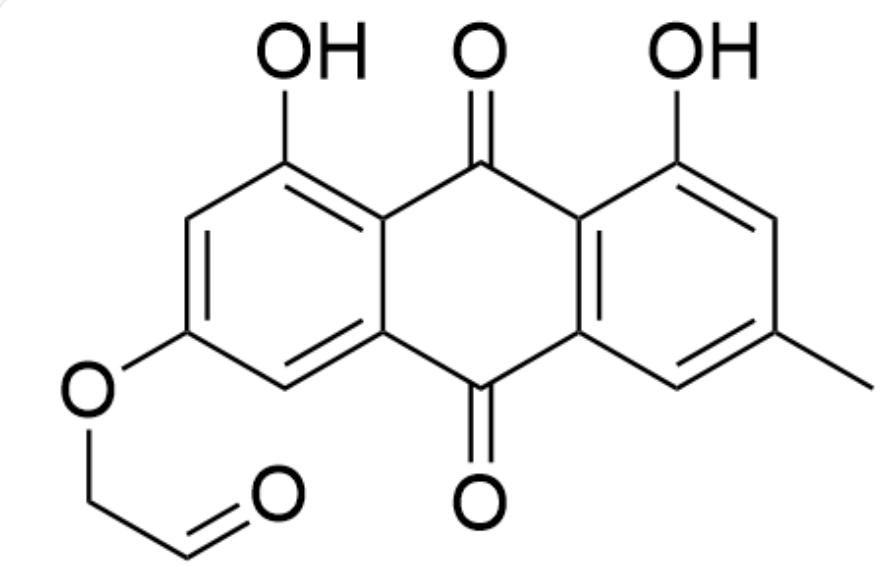  
OC1=C2C(C(C=C(C)C=C3O)=C3C2=O)=O)=CC(OCC=O)=C1

H.

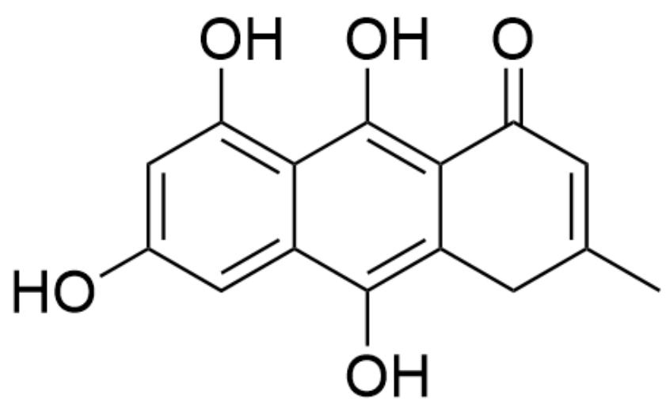  
OC1=CC(O)=C2C(C(O)=C(CC(C)=CC3=O)C3=C2O)=C1

1.

J.  
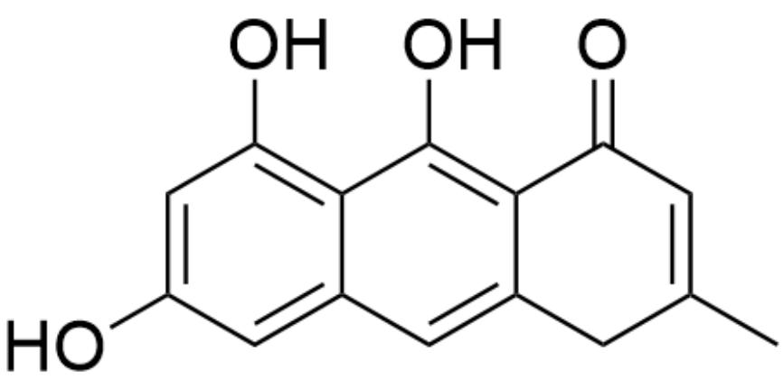  
OC1=CC(O)=C2C(C=C(CC(C)=CC3=O)C3=C2O)=C1

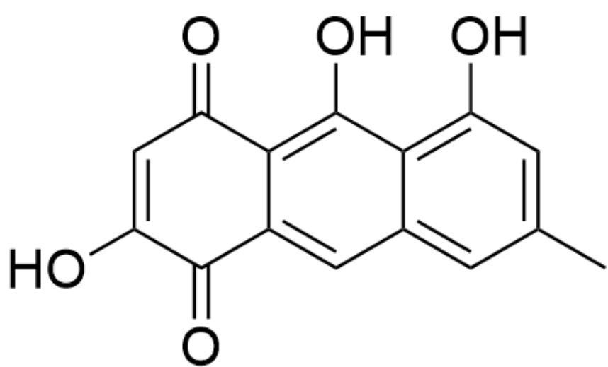  
OC(CC1=CC2=CC(C)=CC(O)=C2C(O)=C13)=O)=CC3=O

# Answer

Correct Answer: F

# Detailed Explanation

The substrate contains ester groups. The added acetylacetone dianion has two nucleophilic centers: the carbanions at the 1-position and 3-position; however, the nucleophilicity of the 1-position is stronger, leading to nucleophilic substitution with the ester group. Since two equivalents of acetylacetone dianion are added, both ester groups are substituted, forming a symmetrical hexaketone intermediate A, with the SMILES CC(CC(CC(CC1(CC(CC(CC(C)=O)=O)OCC01)=O)=O).

# CHECKPOINT

1 PTS

The 1-position of the acetylacetone dianion has stronger nucleophilicity and undergoes nucleophilic substitution with the ester group

# CHECKPOINT

1 PTS

The structure of A is CC(CC(CC(CC1(CC(CC(C)=O)=O)=O)OCCO1)=O)=O

A has one ring while B has three rings, resulting in the formation of two additional rings. The substrate contains numerous  $\beta$ -dicarbonyl structures. Due to symmetry, one of the triketone structures can form a stable dienolate intermediate CC(CC(CC(CC1(CC([CH-]C([CH-]C(C)=O)=O)=O)OCCO1)=O)=O, which undergoes aldol condensation with another triketone structure to form two six-membered rings. Initially, the first spiro ring O=C(C1)C(C([CH-]C(C)=O)=O)=C(CC(CC(C)=O)=O)CC21OCCO2 is formed, followed by the formation of the second six-membered ring O=C(C1)C(C(C(C)=O)=C(CC(C)=O)C2)=O)=C2CC31OCCO3. This intermediate

adopts a quinoid structure and readily aromatizes to a phenol, resulting in B as O=C(C1)C2=C(O)C(C(C)=O)=C(CC(C)=O)C=C2CC31OCC03, featuring three rings and one aromatic ring.

# CHECKPOINT

1 PTS

The dienolate intermediate CC(CC(CC(CC1(CC([CH-]C([CH-]C(C)=O)=O)=O)OCC01)=O)=O) exists

# CHECKPOINT

1 PTS

Aldol

condensation

forms

the

first

six-membered

ring

$$
\mathrm {O} = \mathrm {C} (\mathrm {C} 1) \mathrm {C} (\mathrm {C} ([ \mathrm {C H} - ] \mathrm {C} (\mathrm {C}) = \mathrm {O}) = \mathrm {O}) = \mathrm {C} (\mathrm {C C} (\mathrm {C C} (\mathrm {C}) = \mathrm {O}) = \mathrm {O}) \mathrm {C C} 2 1 \mathrm {O C C O} 2
$$

# CHECKPOINT

1 PTS

Aldol

condensation

forms

the

second

six-membered

ring

$$
\mathrm {O} = \mathrm {C} (\mathrm {C} 1) \mathrm {C} (\mathrm {C} (\mathrm {C} (\mathrm {C}) = \mathrm {O}) = \mathrm {C} (\mathrm {C C} (\mathrm {C}) = \mathrm {O}) \mathrm {C} 2) = \mathrm {O}) = \mathrm {C} 2 \mathrm {C C} 3 1 \mathrm {O C C O} 3
$$

# CHECKPOINT

1 PTS

$$
\mathbf {B} \text {i s} O = C (C 1) C 2 = C (O) C (C (C) = O) = C (C C (C) = O) C = C 2 C C 3 1 O C C O 3
$$

From  $\mathbf{B}$  to  $\mathbf{C}$ , one ring is lost, clearly indicating that the five-membered ketal ring is the most prone to ring-opening. Upon ring-opening, the connected six-membered ring also adopts a quinoid structure, leading to aromatization and

the formation of a second phenolic hydroxyl group. The structure of C is OC1=CC(OCCO)=CC2=C1C(O)=C(C(C)=O)C(CC(C)=O)=C2.

# CHECKPOINT

1 PTS

The five-membered ketal ring in  $\mathbf{B}$  undergoes ring-opening to form C

# CHECKPOINT

1 PTS

The structure of C is OC1=CC(OCCO)=CC2=C1C(O)=C(C(C)=O)C(CC(C)=O)=C2

From C to D, potassium hydroxide is added under reflux, generating enolate ions in the system. The enolate derived from the ketone substituent adjacent to the phenolic hydroxyl group can conjugate with the aromatic system, while the meta-positioned substituent cannot. Therefore, the enolate adjacent to the phenolic hydroxyl is preferentially formed, undergoing intramolecular aldol condensation with another ketone carbonyl group to yield the six-membered ring product D, with the structure OC1=CC(OCCO)=CC2=C1C(O)=C(C(C=C(C)C3)=O)C3=C2. (The selectivity of this aldol condensation is high, as documented in reference 10.1021/ja00435a063.)

# CHECKPOINT

1 PTS

The enolate derived from the ketone substituent adjacent to the phenolic hydroxyl group preferentially forms due to conjugation with the aromatic system

# CHECKPOINT

1 PTS

The structure of  $\mathbf{D}$  is OC1=CC(OCCO)=CC2=C1C(O)=C(C(C=C(C)C3)=O)C3=C2

From D to E, hydrochloric acid is added. D features a naphthalene ring fused with a six-membered ring, containing only one complete benzene ring. Under acidic conditions, it readily rearranges into an anthrone structure, which is more stable due to the presence of two complete benzene rings. Thus, the structure of E is OC1=CC(OCCO)=CC(CC2=C3C(O)=CC(C)=C2)=C1C3=O.

# CHECKPOINT

1 PTS

The naphthalene-fused six-membered ring can rearrange into an anthraquinone under acidic conditions

# CHECKPOINT

1 PTS

The structure of  $\mathbf{E}$  is OC1=CC(OCCO)=CC(CC2=C3C(O)=CC(C)=C2)=C1C3=O

From E to F, hydroiodic acid is added, clearly serving to remove the protecting group, with ethylene glycol departing to yield a phenolic hydroxyl group. The structure of F is OC1=CC(O)=CC(CC2=C3C(O)=CC(C)=C2)=C1C3=O.

# CHECKPOINT

1 PTS

Hydroiodic acid is used to remove the ethylene glycol protecting group

# CHECKPOINT

1 PTS

The structure of  $\mathbf{F}$  is OC1=CC(O)=CC(CC2=C3C(O)=CC(C)=C2)=C1C3=O

$\mathbf{G}$  is the product of the oxidation of  $\mathbf{F}$  by selenium dioxide, where the methylene group in the anthracene intermediate is oxidized to a quinone. If the phenolic hydroxyl group were oxidized, aromaticity would be lost. Thus, the structure of  $\mathbf{G}$  is OC1=CC(O)=CC(C(C2=C3C(O)=CC(C)=C2)=O)=C1C3=O.

# CHECKPOINT

1 PTS

Selenium dioxide oxidizes the methylene group in the central six-membered ring of the anthracene intermediate to a quinone

# CHECKPOINT

1 PTS

The structure of  $\mathbf{G}$  is OC1=CC(O)=CC(C(C2=C3C(O)=CC(C)=C2)=O)=C1C3=O

Based on the deduced structure of  $\mathbf{G}$ , option F is correct.

The following two figures visualize the structural formulas involved in the analysis of this problem:

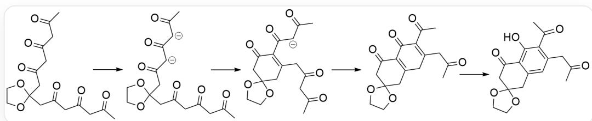

This figure depicts the intermediates involved in the formation of  $\mathbf{^{**}B^{**}}$  from the substrate

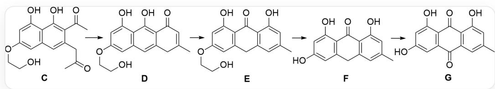

This figure shows the unknown species involved in the transformation from  $^{**}\mathrm{C}^{**}$  to  $^{**}\mathrm{G}^{**}$ , all labeled