# 题目

多官能团取代芳环的合成一直是科学家们研究的热点问题。下面为一多取代芳香化合物G的合成过程：

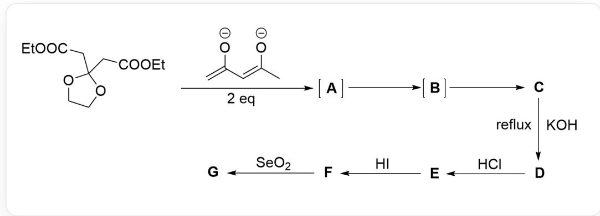

该图片描述了一个有机分步合成过程，底物结构为O=C(CC1(CC(OCC)=O)OCC01)OCC，加入两当量C=C(/C=C([O-]/C)[O-]发生反应，经历两个中间体**A**，**B**得到产物**C***。产物**C**加入氢氧化钠回流得到**D**，**D**加入盐酸得到**E**，**E**加入碘化氢得到**F**，**F**与二氧化硒反应得到产物**G**。

一个受保护的羰基二酯经历A，B两个负离子中间体得到电中性中间产物C，C经历四步反应最终得到G。

已知：

1. B中有三个环，而C中只有两个环。  
2. G为三环多取代芳香化合物。  
3. 除A外的未知结构均具有芳环。  
4. E, F均具有蒽酮骨架

下列选项均为可能的G的结构，正确的是:

A.

B.  
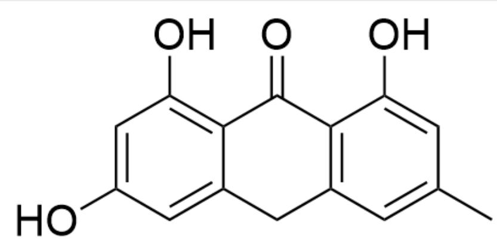  
OC1=CC(O)=C2C(CC(C=C(C)C=C3O)=C3C2=O)=C1

C.  
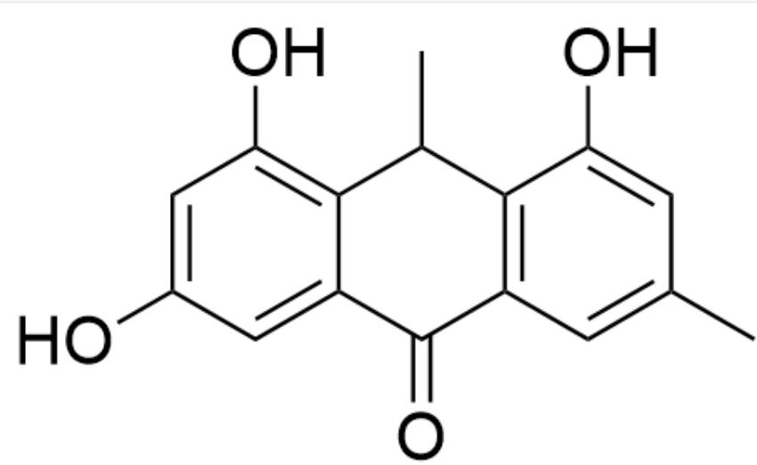  
OC1=CC(O)=C2C(C(C=C(C)C=C3O)=C3C2C)=O)=C1

D.  
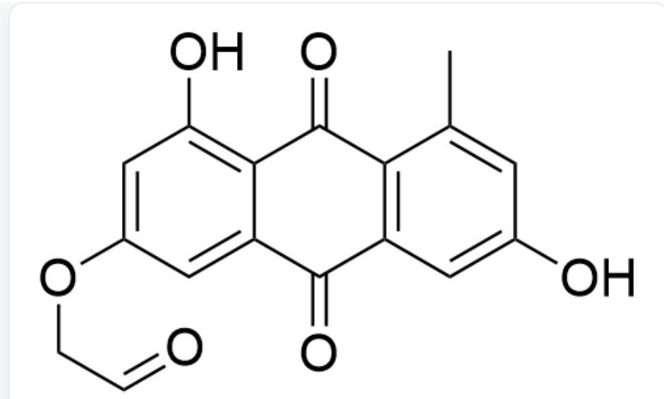  
OC1=C2C(C(C(C=C(O)C=C3C)=C3C2=O)=O)=CC(OCC=O)=C1

E.  
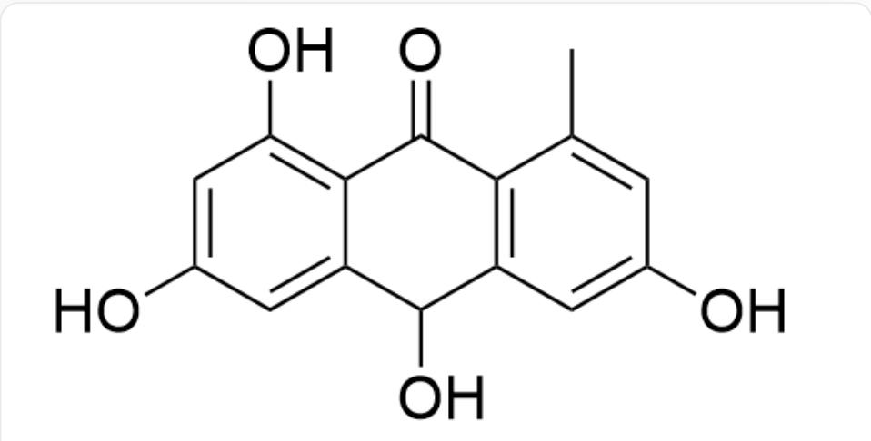  
OC1=CC(O)=C2C(C(O)C(C=C(O)C=C3C)=C3C2=O)=C1

  
F.

OC1=CC(O)=C2C(C(C(C=C(O)C=C3C)=C3C2=O)=O)=C1

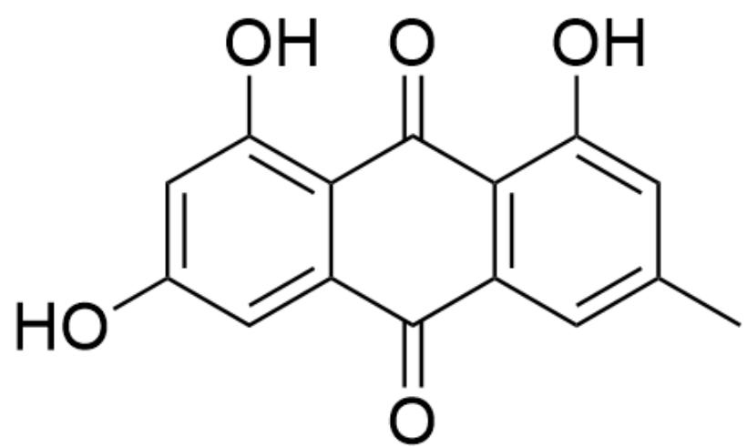  
G.

OC1=CC(O)=C2C(C(C=C(C)C=C3O)=C3C2=O)=O)=C1

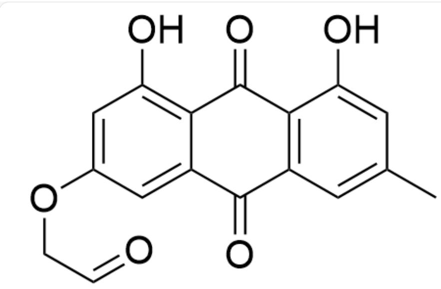  
OC1=C2C(C(C=C(C)C=C3O)=C3C2=O)=O)=CC(OCC=O)=C1

H.

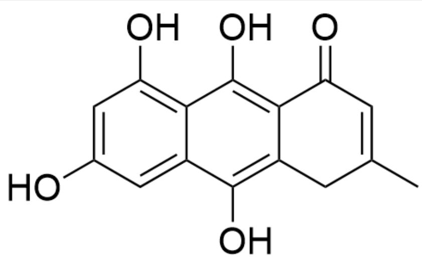  
OC1=CC(O)=C2C(C(O)=C(CC(C)=CC3=O)C3=C2O)=C1

1.

J.  
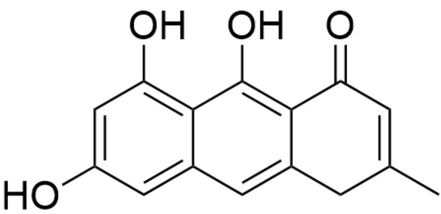  
OC1=CC(O)=C2C(C=C(CC(C)=CC3=O)C3=C2O)=C1

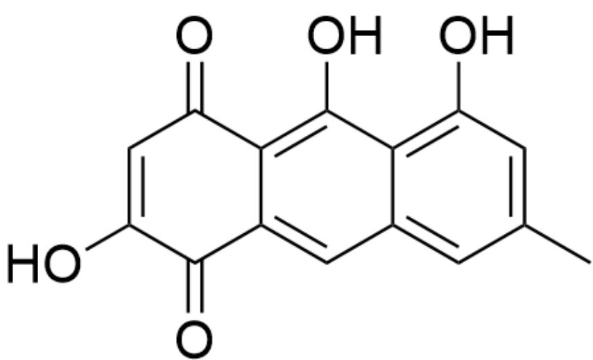  
$\mathrm{OC}(\mathrm{C}(\mathrm{C}1 = \mathrm{CC}2 = \mathrm{CC}(\mathrm{C}) = \mathrm{CC}(\mathrm{O}) = \mathrm{C}2\mathrm{C}(\mathrm{O}) = \mathrm{C}13) = \mathrm{O}) = \mathrm{CC}3 = \mathrm{O}$

# 答案

正确答案: F

# 详细解析

底物存在酯基，加入的乙酰丙酮双负离子有两个亲核中心：1号位/3号位碳负离子；但1号位的亲核性更强，与酯基发生亲核取代反应；由于加入两当量乙酰丙酮双负离子，两个酯基都会被取代，生成对称的六酮中间体A，SMILES为CC(CC(CC(CC1(CC(CC(CC=C)=O)=O)=O)OCC01)=O)=O=O。

# CHECKPOINT

1 PTS

乙酰丙酮双负离子1号位的亲核性更强，与酯基发生亲核取代反应

# CHECKPOINT

1 PTS

A结构为CC(CC(CC(CC1(CC(CC(CC(C)=O)=O)=O)OCC01)=O)=O)

A只有一个环而B有三个环，从而生成了两个环；底物含有大量  $\beta$ -二羰基结构，由对称性，其中一个三酮结构可以形成稳定的双烯醇负离子中间体CC(CC(CC(CC1(CC([CH-]C([CH-]C(C)=O)=O)OCC01)=O)=O)，对另一个三酮结构进行羟醛缩合形成两个六元环；首先生成第一个螺环  $O = C(C1)C(C([CH - ]C(C) = O) = O) = C(C(C(C) = O) = O)CC21OCC02$  ，之后形成第二个六元环  $O = C(C1)C(C(C(C) = O) = C(C(C(C) = O)C2) = O) = C2CC31OCC03$  。该中间体为醌式结构，易芳构化为酚，从而B为  $O = C(C1)C2 = C(O)C(C(C) = O) = C(CC(C) = O)C = C2CC31OCC03$  ，具有三个环和一个芳环。

# CHECKPOINT

1 PTS

存在双烯醇负离子中间体CC(CC(CC(CC1(CC([CH-]C([CH-]C(C)=O)=O)=O)OCC01)=O)=O

# CHECKPOINT

1 PTS

羟醛缩合形成第一个六元环O=C(C1)C(C([CH-]C(C)=O)=O)=C(CC(CC(C)=O)=O)CC210CC02

# CHECKPOINT

1 PTS

羟醛缩合形成第二个六元环O=C(C1)C(C(C(C)=O)=C(CC(C)=O)C2)=O)=C2CC31OCC03

# CHECKPOINT

1 PTS

B为O=C(C1)C2=C(O)C(C(C)=O)=C(CC(C)=O)C=C2CC31OCC03

B到C失去了一个环，很明显五元环缩酮结构最容易开环；开环同时与其连接的六元环也变为醌式结构，从而芳构化生成第二个酚羟基，C结构为OC1=CC(OCCO)=CC2=C1C(O)=C(C(C)=O)C(CC(C)=O)=C2。

# CHECKPOINT

1 PTS

B到C五元环缩酮结构开环

# CHECKPOINT

1 PTS

C结构为OC1=CC(OCCO)=CC2=C1C(O)=C(C(C)=O)C(CC(C)=O)=C2

C到D加入氢氧化钾回流，体系中会生成烯醇负离子；酚羟基邻位的酮取代基生成的烯醇负离子能够与芳香体系共轭，而间位的取代基不能，所以优先生成酚羟基邻位的酮取代基的烯醇负离子，与分子内另一个酮羰基进行羟醛缩合得到六元环产物D，结构为OC1=CC(OCCO)=CC2=C1C(O)=C(C(C=C(C)C3)=O)C3=C2。（此处羟醛缩合选择性很高，见文献10.1021/ja00435a063）

# CHECKPOINT

1 PTS

酚羟基邻位的酮取代基生成的烯醇负离子能够与芳香体系共轭，优先生成

# CHECKPOINT

1 PTS

D结构为OC1=CC(OCCO)=CC2=C1C(O)=C(C(C=C(C)C3)=O)C3=C2

D到E加入盐酸，D为萘环并六元环结构，该结构只有一个完整的苯环，酸性条件下容易重排为蒽酮结构，存在两个完整的苯环更稳定；因此E结构式为OC1=CC(OCCO)=CC(CC2=C3C(O)=CC(C)=C2)=C1C3=O

# CHECKPOINT

1 PTS

萘环并六元环酸性条件可重排为蒽醌

# CHECKPOINT

1 PTS

E结构式为OC1=CC(OCCO)=CC(CC2=C3C(O)=CC(C)=C2)=C1C3=O

E 到 F 加入碘化氢，很明显为脱去保护的反应，乙二醇离去生成酚羟基。F 结构为  $\mathrm{OC1} = \mathrm{CC(O)} = \mathrm{CC(CC2} = \mathrm{C3C(O)} = \mathrm{CC(C)} = \mathrm{C2}) = \mathrm{C1C3} = \mathrm{O}$  。

# CHECKPOINT

1 PTS

碘化氢用于脱去乙二醇

# CHECKPOINT

1 PTS

F结构为OC1=CC(O)=CC(CC2=C3C(O)=CC(C)=C2)=C1C3=O

G是F被二氧化硒氧化的产物，明显为蒽中间结构的亚甲基被氧化为醌，如果酚羟基被氧化则失去芳香性。从而G的结构为OC1=CC(O)=CC(C(C2=C3C(O)=CC(C)=C2)=O)=C1C3=O。

# CHECKPOINT

1 PTS

二氧化硒可氧化蒽中间六元环的亚甲基为醌

# CHECKPOINT

1 PTS

G的结构为OC1=CC(O)=CC(C(C2=C3C(O)=CC(C)=C2)=O)=C1C3=O

根据推出的G的结构式，选项F正确。

下面两张图为该题解析的结构式可视化：

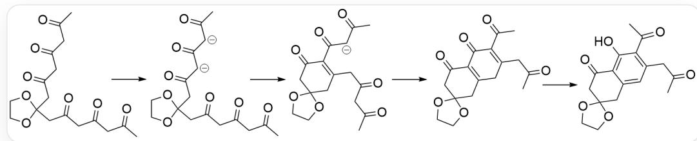  
该图为从底物生成\*\*B\*\*的过程涉及的中间体

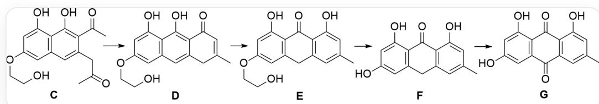  
该图为从  ${ }^{**} \mathrm{C}^{**}$  生成  ${ }^{**} \mathrm{G}^{**}$  的过程涉及的未知物种, 均有标记