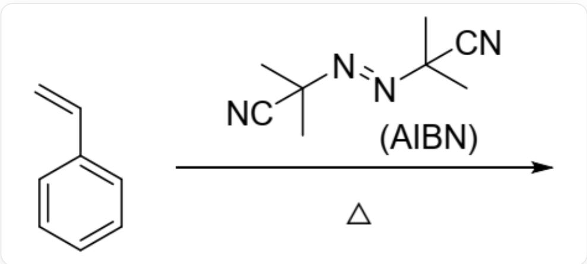
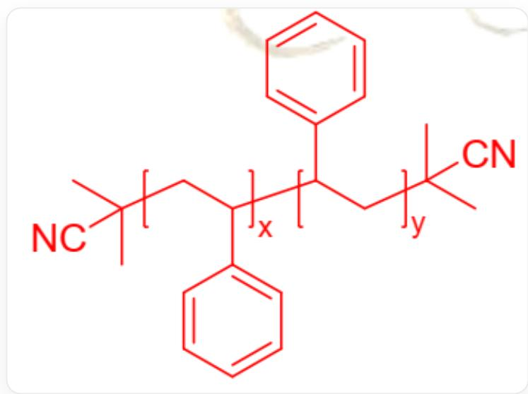

# Question

Azobisisobutyronitrile (AIBN, structure as follows) can initiate the free radical polymerization of styrene to polystyrene (PS):

  
Styrene polymerization initiated by AIBN: `CC(C)(C#N)/N=N/C(C)(C#N)C` under heating conditions

Polymerization initiated by  $^{14}C$ -labeled AIBN yields PS with a (number average) molecular weight of  $1.30 \times 10^{6}$ . Scintillation counter measurements show that the AIBN radioactivity is  $1.919 \times 10^{8}$  counts · min $^{-1}$  · mol $^{-1}$ ; the radioactivity of 5.80g PS is 858counts · min $^{-1}$ .

The following statements are made:

1. AIBN heating initiates polymerization and requires the release of one molecule of gas.  
2. Each molecule of the polymer has one cyano group.  
3. The polymer may have a center of symmetry.  
4. Each molecule of AIBN can produce two molecules of polymer.

The option below containing all correct statements is:

A. All statements are incorrect.

B. 1  
C. 2  
D. 3  
E. 4  
F. 1,2  
G. 1,3  
H. 1,4  
1. 2,3  
J. 2,4  
K. 3,4  
L. 1,2,3  
M. 1,2,4  
N. 2,3,4  
O. 1,3,4

P. 1,2,3,4

# Answer

Correct Answer: G

# Detailed Explanation

AIBN undergoes homolytic cleavage upon heating, generating two 2-cyano-2-propyl radicals:  $\mathrm{C}[\mathrm{C}](\mathrm{C}\# \mathrm{N})\mathrm{C}$  (the radical is located on the central carbon), and releasing one molecule of nitrogen gas.

# CHECKPOINT

1 PTS

AIBN heating initiates polymerization and requires the release of one molecule of nitrogen gas, statement 1 is correct

Subsequently, the radical reacts with styrene, generating a radical at the  $\alpha$ -position of the phenyl group to initiate polymerization.

The number of styrene monomers contained in each PS chain is:  $1.30 \times 10^{6} \div 104.1 = 1.25 \times 10^{4}$ .

The number of styrene monomers corresponding to each AIBN is:

$$
1. 9 1 9 \times 1 0 ^ {8} \div [ 8 5 8 \div (5. 8 0 \div 1 0 4. 1) ] = 1. 2 4 \times 1 0 ^ {4}.
$$

The two values are close; since one AIBN molecule generates two radicals, the chain termination method under experimental conditions is coupling termination. One molecule of AIBN produces one molecule of polymer.

# CHECKPOINT

1 PTS

The chain termination method under experimental conditions is coupling termination. One molecule of AIBN produces one molecule of polymer, statement 4 is incorrect

# CHECKPOINT

1 PTS

Calculated number of styrene monomers contained in each PS chain is  $1.25 \times 10^{4}$ , the number of styrene monomers corresponding to each AIBN is:  $1.24 \times 10^{4}$

Then it is easy to obtain the final polymer structure as:

The basic structure of the polymer is:  $\mathrm{CC}(\mathrm{CC}(\mathrm{C}(\mathrm{C}1 = \mathrm{CC} = \mathrm{CC} = \mathrm{C}1)\mathrm{CC}(\mathrm{C})(\mathrm{C}\# \mathrm{N})\mathrm{C})\mathrm{C}2 = \mathrm{CC} = \mathrm{CC} = \mathrm{C}2)(\mathrm{C}\# \mathrm{N})\mathrm{C}^{\prime}}$  (both degrees of polymerization x and y are 1), both repeating units are  $[\ast ]\mathsf{CC}([\ast ])\mathsf{C}1 = \mathsf{CC} = \mathsf{CC} = \mathsf{C}1^{\prime}$  ([*] indicates that the repeating unit is bonded to other parts of the polymer)

As can be seen from the structure, each molecule of this polymer has 2 cyano groups.

# CHECKPOINT

1 PTS

The molecule of this polymer has 2 cyano groups, statement 2 is incorrect

When the degrees of polymerization of the two segments are the same, i.e.,  $x = y$ , the polymer has a center of symmetry.

# CHECKPOINT

1 PTS

When the degree of polymerization  $x = y$ , the polymer has a center of symmetry, statement 3 is correct.

Statements 1 and 3 are correct, choose G