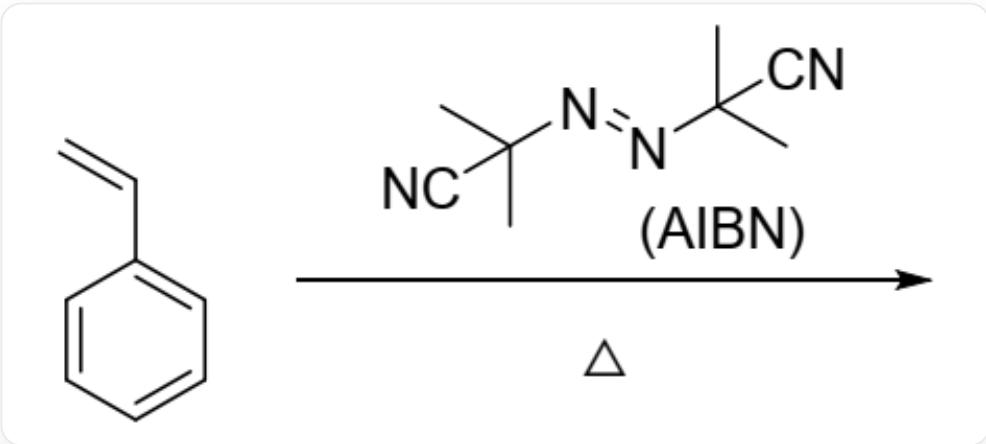
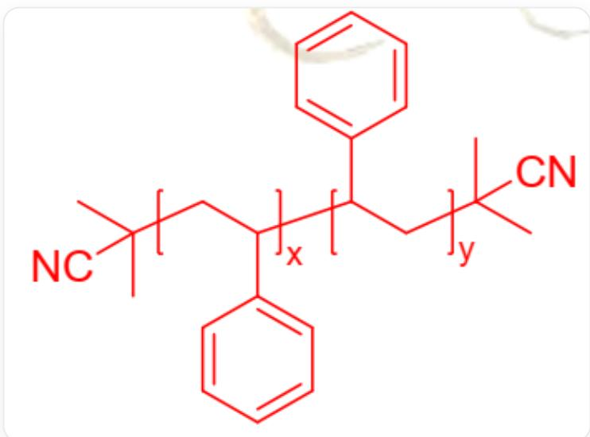

# 题目

用偶氮二异丁腈(AIBN,结构如下)可引发苯乙烯聚合为聚苯乙烯(PS)的自由基聚合反应

  
苯乙烯在加热条件下由AIBN： $\mathrm{CC}(\mathrm{C})(\mathrm{C}\# \mathrm{N}) / \mathrm{N} = \mathrm{N} / \mathrm{C}(\mathrm{C})(\mathrm{C}\# \mathrm{N})$  引发聚合

用  $^{14}C$  标记的AIBN引发聚合得到(数均)分子量为  $1.30 \times 10^{6}$  的PS。闪烁计数器测定表明，AIBN放射活性为  $1.919 \times 10^{8}$  counts·min $^{-1}$ ·mol $^{-1}$ ；5.80g PS放射活性为858counts·min $^{-1}$ 。

有以下说法：

1.AIBN加热引发聚合需要放出一分子气体  
2.每分子该聚合物具有一个氰基  
3.该聚合物可能具有对称中心  
4.每分子AIBN可以产生两分子聚合物

以下选项包含全部正确说法的是：

A. 所有说法均不正确  
B. 1

C. 2  
D. 3  
E. 4  
F. 1,2  
G. 1,3  
H. 1,4  
1. 2,3  
J. 2,4  
K. 3,4  
L. 1,2,3  
M. 1,2,4  
N. 2,3,4  
O. 1,3,4  
P. 1,2,3,4

# 答案

正确答案: G

# 详细解析

AIBN受热均裂，生成两个2-氰基-2-丙基自由基：`C[C](C#N)C`（自由基位于中心的碳上），并放出一分子氮气。

# CHECKPOINT

1 PTS

AIBN加热引发聚合需要放出一分子氮气，说法1正确

随后该自由基与苯乙烯反应，在苯基α位产生自由基引发聚合。

每根PS链含有的苯乙烯单体数目为：  $1.30 \times 10^{6} \div 104.1 = 1.25 \times 10^{4}$  。

每个 AIBN 对应的苯乙烯单体数目为： $1.919 \times 10^{8} \div [858 \div (5.80 \div 104.1)] = 1.24 \times 10^{4}$ 。

二者数值相近；由于1个AIBN分子产生2个自由基，因此实验条件下链终止的方式是偶合终止。每分子AIBN产生一分子聚合物。

# CHECKPOINT

1 PTS

实验条件下链终止的方式是偶合终止。每分子AIBN产生一分子聚合物，说法4错误

# CHECKPOINT

1 PTS

计算得每根PS链含有的苯乙烯单体数目为  $1.25 \times 10^{4}$ ，每个AIBN对应的苯乙烯单体数目为：

$$
1. 2 4 \times 1 0 ^ {4}
$$

则容易得到最终聚合物的结构为：

聚合物的基本结构为：CC(CC(C(C1=CC=CC=C1)CC(C)(C#N)C)C2=CC=CC=C2)(C#N)C（两段聚合度x，y均为

1)，两段重复单元均为`*`CC({*})C1=CC=CC=C1`（*[表示重复单元与聚合物其他部分成键）

由结构可知，每分子该聚合物具有2个氰基。

# CHECKPOINT

1 PTS

分子该聚合物具有2个氰基，说法2错误

当两段聚合物聚合度相同时，即  $x = y$  时，该聚合物具有对称中心。

# CHECKPOINT

1 PTS

当聚合度  $x = y$  时，该聚合物具有对称中心，说法3正确

说法1，3正确，选G