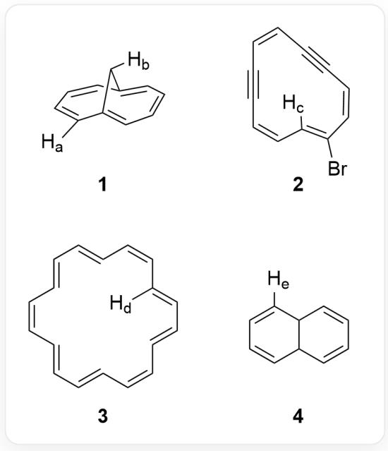

# Question

The following organic structures are provided, with some hydrogen atoms labeled.

The figure shows 4 compounds, which are 1: [H:b][C@@H]1C2=CC=CC=C1C=CC=C2[H:a]; 2:

$$
[ H: c ] C 1 = C (B r) / C = C \backslash C \# C / C = C \backslash C \# C \backslash C = C / 1; 3: [ H: d ] C 1 = C / C = C / C = C \backslash C = C \backslash C = C / C = C / C = C / C = C / 1; 4:
$$

[H:e]C1=CC=CC2C1C=CC=C2, where [H:a-e] are the five hydrogen atoms whose 1H NMR chemical shifts are to be sorted

Please compare the chemical shifts (ppm) of these hydrogen atoms in the nuclear magnetic resonance hydrogen spectrum and sort them in descending order of their relative values a~e.

A. All other options are incorrect  
B.  $c > a > b > e > d$  
C.  $c > e > a > b > d$  
D.  $c > a > e > b > d$

E.  $a > c > e > b > d$  
F.  $a > e > c > b > d$  
G.  $e > c > a > b > d$  
H.  $c > a > b > d > e$  
I.  $c > e > b > a > d$  
J.  $b > c > a > e > d$  
K.  $e > a > c > b > d$  
L.  $c > b > a > e > d$  
M.  $a > c > b > e > d$  
N. b>a>c>e>d  
0.  $\mathrm{e} > \mathrm{c} > \mathrm{b} > \mathrm{d} > \mathrm{a}$

# Answer

Correct Answer: D

# Detailed Explanation

The compounds in the figure given in the question all have conjugated systems, so the chemical shifts of hydrogen in them are mainly affected by aromaticity.

# CHECKPOINT

1 PTS

The chemical shifts of hydrogen are mainly affected by aromaticity

For compound 1, this is a special bridged ring system with a conjugated system. The double bond conjugated system has  $10\pi$  electrons and is aromatic. Due to the effect of the aromatic ring current, the hydrogen  $\mathrm{[H:b]}$  on the bridgehead carbon is in the shielded region, and the chemical shift shifts to a higher field, generally less than 0. It is less affected by the shielding effect and is around  $0\sim -1$  ppm; while  $\mathrm{[H:a]}$  is in the deshielded region, and the chemical shift shifts to a lower field, generally around  $7\sim 8$  ppm.

# CHECKPOINT

1 PTS

`[H:b]` is in the shielded region of the aromatic ring, and the chemical shift is  $0 \sim -1$  ppm

# CHECKPOINT

1 PTS

`[H:a]` is in the deshielded region of the aromatic ring, and the chemical shift is about  $7 \sim 8$  ppm

For compound 2, it is a ring system composed of carbon-carbon double and triple bonds. Due to the steric configuration limitations of the double and triple bonds, there must be coplanar  $\pi$  bonds. For this  $\pi$  bond, it is an antiaromatic system of  $12\pi$ , so  $\mathrm{[H:c]}$  inside the ring is in the deshielded region of the antiaromatic ring, and the deshielding effect of the antiaromatic ring is stronger. Therefore, the chemical shift of  $\mathrm{[H:c]}$  is greater than  $10~\mathrm{ppm}$ .

# CHECKPOINT

1 PTS

`[H:c]` is in the deshielded region of the antiaromatic ring, and the chemical shift of `[H:c]` is greater than 10 ppm

For compound 3, this is a typical aromatic 18-annulene structure, in which  $\mathrm{[H:d]}$  inside the ring is subject to the strong shielding effect of the aromatic ring current, and the chemical shift moves to a higher field. Its value is less than the chemical shift of  $\mathrm{[^H:b]}$ , approximately around  $-3\mathrm{ppm}$ .

# CHECKPOINT

1 PTS

`[H:d]` is subject to the strong shielding effect of the aromatic ring current, the chemical shift is less than `[H:b]`, around  $-3\mathrm{ppm}$

For compound 4, it is 9,10-dihydronaphthalene, which has two conjugated diene systems and is not aromatic. The chemical shift of  $\mathrm{[^H:e]}$  is the shift of hydrogen on the carbon of the conjugated diene, approximately  $5.5\sim 6.5$  ppm.

# CHECKPOINT

1 PTS

Since there is no aromaticity, the chemical shift of  $\mathrm{[H:e]}$  is about  $5.5\sim 6.5$  ppm

Finally, the relative values of the chemical shifts are sorted from largest to smallest as  $c > a > e > b > d$ .

# CHECKPOINT

1 PTS

The relative values of the chemical shifts are sorted from largest to smallest as  $c > a > e > b > d$

Select option D.