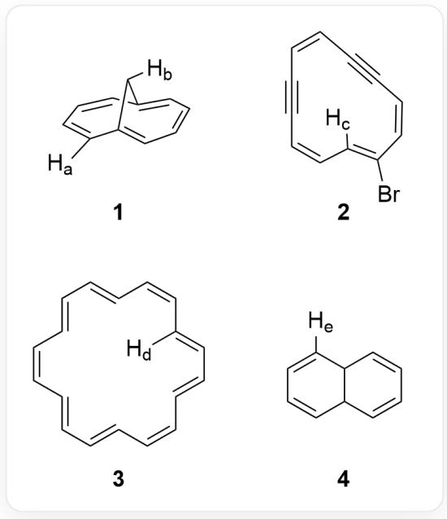

# 题目

现有以下有机物结构，其中标出了一些氢原子。

图中有4个化合物，分别为1: [H:b][C@@H]1C2=CC=CC=C1C=CC=C2[H:a]；2:  
  
`[H:c]C1=C(Br)/C=C\C#C/C=C\C#C\C=C/1`; 3: `[H:d]C1=C/C=C/C=C\C=C=C\C=C=C=C=C/C=1`; 4:  
`[H:e]C1=CC=CC2C1C=CC=C2`，其中[H:a-e]分别为待排序氢谱化学位移的五个氢原子

请比较这些氢原子的在核磁共振氢谱中的化学位移 (ppm)，按其相对值由大到小进行排序 a~e。

A. 其他选项均不正确  
B.  $c > a > b > e > d$  
C.  $c > e > a > b > d$  
D.  $c > a > e > b > d$  
E.  $a > c > e > b > d$

F.  $a > e > c > b > d$  
G.  $e > c > a > b > d$  
H.  $c > a > b > d > e$  
I.  $c > e > b > a > d$  
J.  $b > c > a > e > d$  
K.  $e > a > c > b > d$  
L.  $c > b > a > e > d$  
M.  $a > c > b > e > d$  
N. b>a>c>e>d  
0.  $e > c > b > d > a$

# 答案

正确答案: D

# 详细解析

题目所给图的化合物均具有共轭体系，因此其中氢的化学位移主要受芳香性的影响。

# CHECKPOINT

1 PTS

氢的化学位移主要受芳香性的影响

对于化合物1而言，这是一个特殊的桥环体系的共轭系统，双键共轭体系中有  $10\pi$  电子，具有芳香性，由于芳香环电流的影响，桥头碳上的氢  $\mathrm{[H:b]}$  在屏蔽区，化学位移向高场偏移，一般而言小于0，其受屏蔽效应影响较小，在  $0\sim -1\mathrm{ppm}$  附近；而  $\mathrm{[H:a]}$  在去屏蔽区，化学位移向低场偏移，一般而言在 $7\sim 8\mathrm{ppm}$  左右。

# CHECKPOINT

1 PTS

`[H:b]` 在芳环的屏蔽区，化学位移为  $0 \sim -1$  ppm

# CHECKPOINT

1 PTS

`[H:a]` 在芳环的去屏蔽区，化学位移约为  $7 \sim 8 \mathrm{ppm}$

对于化合物 2 而言，是由碳碳双键和三键构成的环系，由于双键、三键的立体构型限制，一定存在共平面的  $\pi$  键，而对于这个  $\pi$  键而言，为  $12\pi$  的反芳香性体系，因此，在环内部的 `[H:c]` 处于反芳香环的去屏蔽区，且反芳香环的去屏蔽效应更强，因此 `[H:c]` 的化学位移大于  $10~\mathrm{ppm}$ 。

# CHECKPOINT

1 PTS

`[H:c]` 处于反芳香环的去屏蔽区，`[H:c]` 的化学位移大于  $10\mathrm{ppm}$

对于化合物3而言，这是一个典型的芳香性18-轮烯的结构，其环内部的`[H:d]`受到强的芳香环电流的屏蔽效应，化学位移向高场移动，其值小于`[H:b]`的化学位移，大约为  $-3\mathrm{ppm}$  附近。

# CHECKPOINT

1 PTS

`[H:d]` 受到强的芳香环电流的屏蔽效应，化学位移小于 `[H:b]`，在  $-3\mathrm{ppm}$  附近

对于化合物4而言，其为9,10-二氢化萘，有两个共轭二烯体系，无芳香性，`[H:e]` 化学位移为共轭二烯烃碳上的氢的位移，大约为  $5.5 \sim 6.5 \mathrm{ppm}$ 。

# CHECKPOINT

1 PTS

由于没有芳香性，`[H:e]` 化学位移约为  $5.5 \sim 6.5$  ppm

最终，得到化学位移相对值由大到小进行排序为  $c > a > e > b > d$ 。

# CHECKPOINT

1 PTS

化学位移相对值由大到小进行排序为  $c > a > e > b > d$

选择选项D。