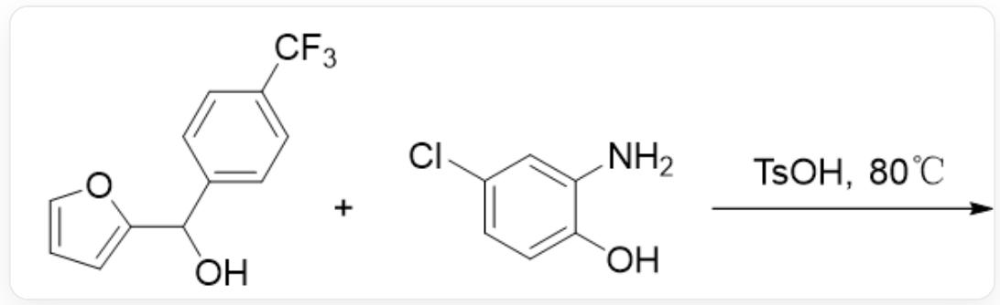
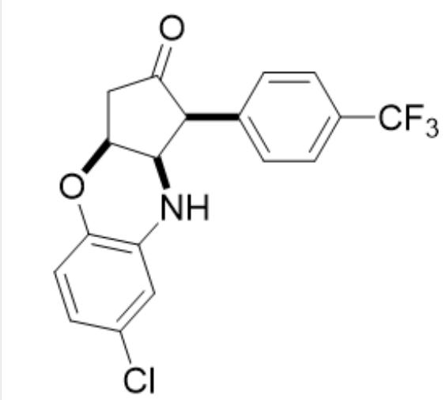
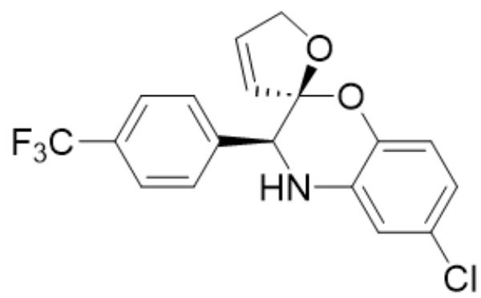
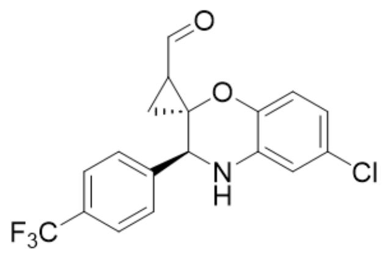
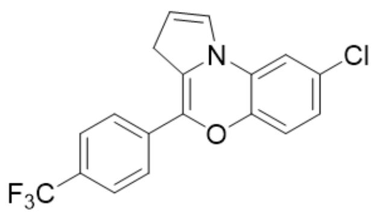
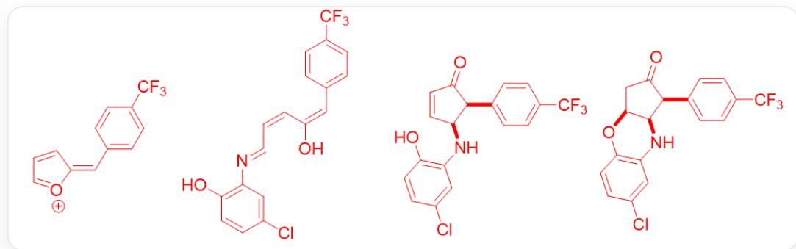

# Question

Morpholine rings are common in drug molecules and natural products. There are many interesting methodologies for the construction of morpholine rings. Research groups have reported the conversion of furan derivatives to morpholines, as shown in the figure below. It is known that the product's 1H NMR spectrum contains 7 aromatic hydrogens.

  
OC(C1=CC=C(C(F)(F)F)C=C1)C2=CC=CO2 and NC1=CC(Cl)=CC=C1O react under the conditions of TsOH,  $80^{\circ}C$

Considering the product formation process, select the correct product structure.

A. All other options are incorrect  
B.

$\mathrm{O = C1[C@@H](C2 = CC = C(C(F)(F)F)C = C2)[C@@H](NC3 = C(O4)C = CC(Cl) = C3)[C@@H]4C1}$

C.

CIC1=CC=C(O[C@]2([C@@H](N3)C4=CC=C(C(F)(F)F)C=C4)C=CCO2)C3=C1

D.

CIC1=CC=C(O[C@]2([C@@H](N3)C4=CC=C(C(F)(F)F)C=C4)CC2C=O)C3=C1

E.

CIC1=CC=C2C(N(C=CC3)C3=C(O2)C4=CC=C(C(F)(F)F)C=C4)=C1

# Answer

Correct Answer: B

# Detailed Explanation

Only seven aryl hydrogens in the product suggest that the furan ring should have undergone ring-opening.

# CHECKPOINT

1 PTS

Only seven aryl hydrogens in the product suggest that the furan ring should have undergone ring-opening.

Dehydration of hydroxyfuran under acidic conditions yields the carbenium ion intermediate 1FC(C=C1)=CC=C1/C=C2[O+]=CC=C/2)(F)F,

# CHECKPOINT

1 PTS

Dehydration of hydroxyfuran under acidic conditions

# CHECKPOINT

1 PTS

Carbenium ion intermediate 1 is  $\mathrm{FC(C(C = C1) = CC = C1 / C = C2[O + ] = CC = C / 2)(F)F}$

Subsequently, carbenium ion intermediate 1 undergoes ring-opening via aniline attack to give the intermediate  $\mathrm{OC}(/C = C\backslash C = N\backslash C1 = C(O)C = CC(Cl) = C1) = C / C2 = CC = C(C(F)(F)F)C = C2}$ .

# CHECKPOINT

1 PTS

Carbenium ion intermediate 1 undergoes ring-opening via aniline attack to give ring-opened intermediate 2

# CHECKPOINT

1 PTS

Ring-opened intermediate 2 is  $\mathrm{OC}(/C = C \backslash C = N \backslash C1 = C(O)C = CC(Cl) = C1) = C / C2 = CC = C(C(F)(F)F)C = C2}$

Ring-opened intermediate 2 can undergo a Nazarov cyclization reaction to give  $\mathrm{O = C1[C@@H](C2 = CC = C(C(F)}$  (F)F)C=C2)[C@@H](NC3=C(O)C=CC(Cl)=C3)C=C1

# CHECKPOINT

1 PTS

Ring-opened intermediate 2 can undergo a Nazarov cyclization reaction to give cyclized intermediate 3

# CHECKPOINT

1 PTS

Cyclized

intermediate

3

is

$\mathrm{O = C1[C@@H](C2 = CC = C(C(F)(F)F)C = C2)[C@@H]}$

$\mathrm{(NC3 = C(O)C = CC(Cl) = C3)C = C1}$

Cyclized intermediate 3 can undergo an intramolecular Michael addition to give the product:  $\mathrm{O = C1[C@@H]}$  ( $\mathrm{C2 = CC = C(C(F)(F)F}$ ) ( $\mathrm{C = C2}$ ) ( $\mathrm{C@@H}$ ) ( $\mathrm{NC3 = C(O4)C = CC(Cl) = C3}$ ) ( $\mathrm{C@@H}$ ) 4C1.

# CHECKPOINT

1 PTS

Cyclized intermediate 3 can undergo an intramolecular Michael addition to give the product

# CHECKPOINT

1 PTS

The product is  $\mathrm{O} = \mathrm{C}1[\mathrm{C}@\mathrm{H}](\mathrm{C}2 = \mathrm{CC} = \mathrm{C}(\mathrm{C}(\mathrm{F})(\mathrm{F})\mathrm{F})\mathrm{C} = \mathrm{C}2)[\mathrm{C}@\mathrm{H}](\mathrm{NC}3 = \mathrm{C}(\mathrm{O}4)\mathrm{C} = \mathrm{CC}(\mathrm{Cl}) = \mathrm{C}3)$  [C@@H]4C1

Therefore, B is correct.

Carbenium ion intermediate 1: FC(C(C=C1)=CC=C1/C=C2[O+]=CC=C/2)(F)F Ring-opened intermediate 2:

OC(/C=C\C=C=N\C1=C(O)C=CC(Cl)=C1)=C/C2=CC=C(C(F)(F)F)C=C2 Cyclized intermediate 3: O=C1[C@@H]

$(C2 = CC = C(C(F)(F)F)C = C2)[C@@H](NC3 = C(O)C = CC(Cl) = C3)C = C1$  Product:  $O = C1[C@\mathbb{Q}H](C2 = CC = C(C(F)$

(F)F)C=C2)[C@@H](NC3=C(O4)C=CC(Cl)=C3)[C@@H]4C1