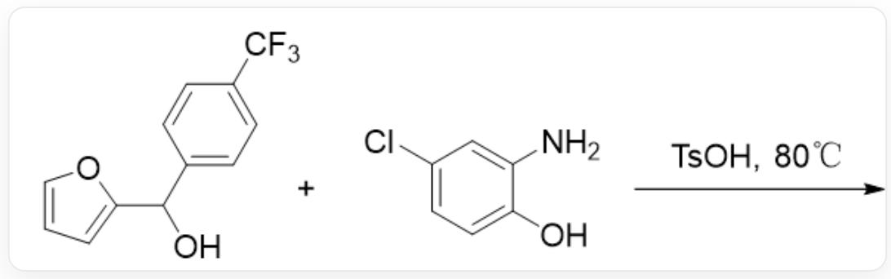
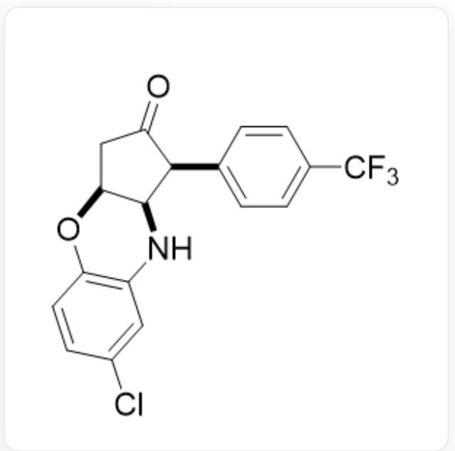
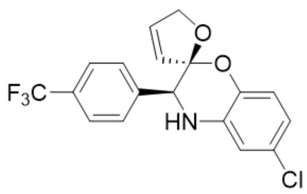
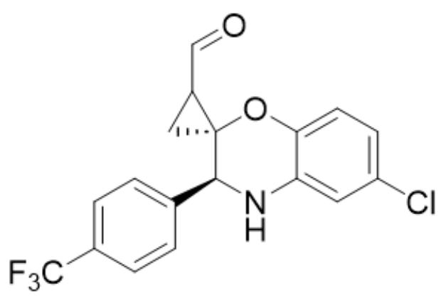
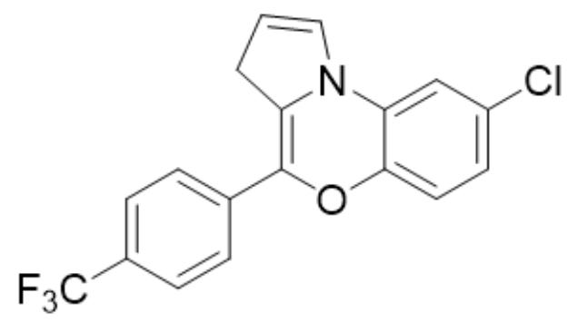
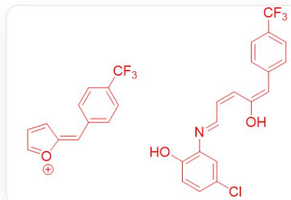
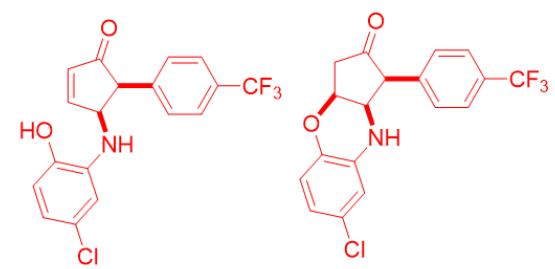

# 题目

吗啉环在药物分子和天然产物中都比较常见。针对吗啉环的构筑也有许多有趣的方法学。有课题组报道了呋喃衍生物转化为吗啉的反应，如下图所示。已知产物的核磁氢谱中有7个芳基氢。

OC(C1=CC=C(C(F)(F)F)C=C1)C2=CC=CO2和NC1=CC(Cl)=CC=C1O在TsOH,  $80^{\circ}C$  的条件下发生反应

考虑产物生成的过程，选出正确的产物结构。

A. 其他选项均不正确

B.

$\mathrm{O = C1[C@@H](C2 = CC = C(C(F)(F)F)C = C2)[C@@H](NC3 = C(O4)C = CC(Cl) = C3)[C@@H]4C1}$

  
C.

CIC1=CC=C(O[C@]2([C@@H](N3)C4=CC=C(C(F)(F)F)C=C4)C=CCO2)C3=C1

  
D.  
E.

CIC1=CC=C(O[C@]2([C@@H](N3)C4=CC=C(C(F)(F)F)C=C4)CC2C=O)C3=C1

CIC1=CC=C2C(N(C=CC3)C3=C(O2)C4=CC=C(C(F)(F)F)C=C4)=C1

# 答案

正确答案: B

# 详细解析

产物中只有七个芳基氢，暗示着呋喃环应该发生了开环。

# CHECKPOINT

1 PTS

产物中只有七个芳基氢，暗示着呋喃环应该发生了开环。

羟基呋喃在酸性条件下脱水得到正离子中间体1FC(C(C=C1)=CC=C1/C=C2[O+]=CC=C/2)(F)F,

# CHECKPOINT

1 PTS

羟基呋喃在酸性条件下脱水

# CHECKPOINT

1 PTS

正离子中间体1为FC(C(C=C1)=CC=C1/C=C2[O+]=CC=C/2)(F)F

此后正离子中间体1受到苯胺进攻开环得到  $\mathrm{OC}(/C = C\backslash C = N\backslash C1 = C(O)C = CC(Cl) = C1) = C / C2 = CC = C(C(F)$  (F)F)C=C2中间体。

# CHECKPOINT

1 PTS

正离子中间体1受到苯胺进攻开环得到开环中间体2

# CHECKPOINT

1 PTS

开环中间体2为OC(/C=C\C=N\C1=C(O)C=CC(Cl)=C1)=C/C2=CC=C(C(F)(F)F)C=C2

开环中间体2可以发生Nazarov环化反应得到  $O = C1[C@@H](C2 = CC = C(C(F)(F)F)C = C2)[C@@H]$  (NC3=C(O)C=CC(Cl)=C3)C=C1

# CHECKPOINT

1 PTS

开环中间体2可以发生Nazarov环化反应得到环化中间体3

# CHECKPOINT

1 PTS

环比中间体3为O=C1[C@@H](C2=CC=C(C(F)(F)F)C=C2)[C@@H](NC3=C(O)C=CC(Cl)=C3)C=C1

环比中间体3可以发生一次分子内的Michael加成得到产物：O=C1[C@@H](C2=CC=C(C(F)(F)F)C=C2)[C@@H](NC3=C(O4)C=CC(Cl)=C3)[C@@H]4C1。

# CHECKPOINT

1 PTS

环比中间体3可以发生一次分子内的Michael加成得到产物

# CHECKPOINT

1 PTS

产物为O=C1[C@@H](C2=CC=C(C(F)(F)F)C=C2)[C@@H](NC3=C(O4)C=CC(Cl)=C3)[C@@H]4C1

因此B是正确的。

正离子中间体1：FC(C(C=C1)=CC=C1/C=C2[O+]=CC=C/2)(F)F开环中间体2：

OC(/C=C\C=N\C1=C(O)C=CC(Cl)=C1)=C/C2=CC=C(C(F)(F)F)C=C2 环化中间体3：O=C1[C@@H] (C2=CC=C(C(F)(F)F)C=C2)[C@@H](NC3=C(O)C=CC(Cl)=C3)C=C1 产物：O=C1[C@@H](C2=CC=C(C(F) (F)F)C=C2)[C@@H](NC3=C(O4)C=CC(Cl)=C3)[C@@H]4C1