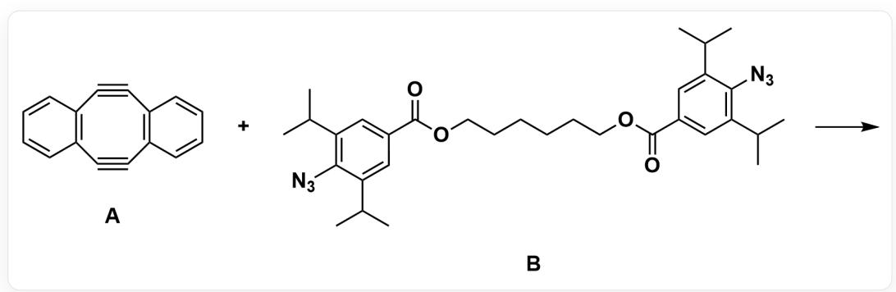
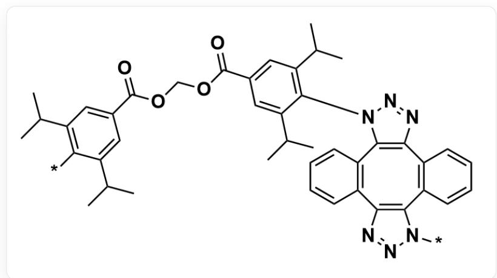
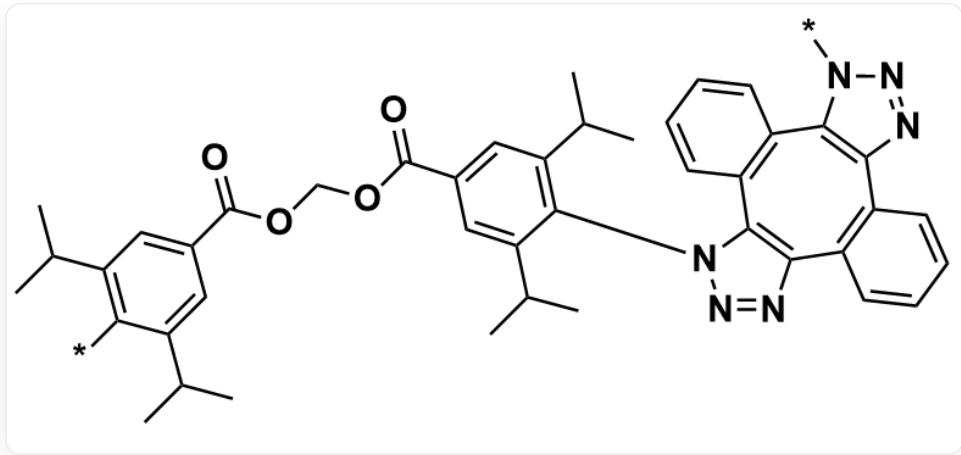

# Question

For the reaction occurring with the following substances, it can yield a polymeric product:

The SMILES of the reaction can be expressed as:

C12=C(C#CC3=C(C#C2)C=CC=C3)C=CC=C1.O=C(OCCCCCOC(C1=CC(C(C)C)=C(C(C(C)C)=C1)N=[N+]=

$\left[\mathrm{N}-\right]=\mathrm{O}) \mathrm{C} 2=\mathrm{C C}(\mathrm{C})(\mathrm{C})=\mathrm{C}(\mathrm{C}(\mathrm{C})(\mathrm{C})=\mathrm{C} 2) \mathrm{N}=[\mathrm{N} +]=[\mathrm{N}-]>>$  ，where the first reactant is denoted as A, and the second reactant is denoted as B

In the resulting polymeric product, there are two possible basic repeating unit structures:

- Repeating unit 1:

The SMILES of repeating unit 1:

CC(C1=CC(C(OCOC(C2=CC(C(C)C)=C(N3C4=C(N=N3)C5=C(C6=C(N=NN6*))C7=C4C=CC=C7)C=CC=C5)C(C(C)C=C2)=O)=O) = CC(C(C)C=C1*[])C

where  $[^{*}]$  indicates connection to other repeating units in the polymer

- Repeating unit 2:

  
The SMILES of repeating unit 2:  
CC(C1=CC(C(OCOC(C2=CC(C(C)C)=C(N3N=NC4=C3C5=C(C6=C(C7=C4C=CC=C7)N=NN6[*])C=CC=C5)C(C(C)C=C2)=O)=O) = CC(C(C)C=C1[*])C,  
where  $[^{*}]$  indicates connection to other repeating units in the polymer

Regarding the above reaction and the polymer formed, the following propositions are made:

1. This reaction requires the addition of a transition metal catalyst to proceed.  
2. This reaction cannot proceed at room temperature and requires heating conditions.  
3. In the polymer, the content of repeating unit 2 is greater than that of repeating unit 1.  
4. Let  $k_{1}$  be the reaction rate when one molecule of reactant  $\mathbf{B}$  is added to one molecule of reactant  $\mathbf{A}$ , and  $k_{2}$  be the reaction rate when the intermediate product at this time receives another molecule of reactant  $\mathbf{B}$ , then  $k_{1} > k_{2}$ .  
5. Let  $S = \frac{[\mathbf{A}]}{[\mathbf{B}]}$ , then for the four cases of  $S_{1,2,3,4} = 0.83, 0.91, 1.10, 1.20$  the order of the number-average molecular weight of the polymers formed is  $S_3 > S_4 > S_2 > S_1$ .

Calculate the value of  $z = \frac{\text{sum of squares of correct proposition numbers}}{\text{sum of incorrect proposition numbers} + 1}$ , and select the correct option.

A. All other options are incorrect  
B. 0.067  
C. 0.286  
D. 0.385  
E. 0.692  
F. 0.833  
G. 1.333

H. 1.545  
1. 2.273  
J. 2.600  
K. 3.222  
L. 5.857

# Answer

Correct Answer: I

# Detailed Explanation

The reaction is a dual strain-promoted azide-alkyne cycloaddition (DSPAAC) reaction with an active intermediate as a polymerization reaction. After one molecule of reactant B is added to one molecule of reactant A, in the resulting intermediate, one alkyne in the original eight-membered ring dialkyne of reactant A becomes an alkene. This conversion process leads to a large repulsive force between the phenyl group connected to the azide and the benzene ring on the eight-membered ring in the intermediate, making the eight-membered ring non-planar and more distorted, which increases the tension of the remaining alkyne bond in the eight-membered ring. Therefore, it will quickly undergo a DSPAAC reaction with another molecule of alkyne.

# CHECKPOINT

1 PTS

The eight-membered ring of the addition intermediate is more distorted, and the reactivity of the internal alkyne is higher than that of reactant A

Based on the above inference, analyze each proposition:

1. This reaction requires the addition of a transition metal catalyst to proceed.

This is a dual strain-promoted azide-alkyne cycloaddition (DSPAAC) reaction with an intermediate, rather than a traditional alkyne and azide CuAAC reaction catalyzed by Cu. Based on the  $3 + 2$  Click reaction of the alkyne in the eight-membered ring with azide, driven by ring strain, it is not necessary to add Cu or other transition metals as catalysts.

# CHECKPOINT

1 PTS

This reaction proceeds under the driving force of ring strain and does not require a transition metal catalyst

2. This reaction cannot proceed at room temperature and requires heating conditions.

The conditions for the Click reaction are mild. Combined with the previous discussion, it does not require heating and can proceed at room temperature.

# CHECKPOINT

1 PTS

This reaction can proceed at room temperature and does not require heating

3. In the polymer, the content of repeating unit 2 is greater than that of repeating unit 1.

In repeating unit 2, the orientations of the two azide B after addition to alkyne A are the same, while in repeating unit 1, the orientations of the azide substituents are different. Considering the intermediate after one molecule of B is added to one molecule of A, if the orientation of the azide substituent is the same as the orientation of the substituent of the first molecule added when another molecule of B is added, the reaction energy barrier will increase due to steric hindrance, which is not conducive to the formation of repeating unit 2. Therefore, in the polymer, the content of repeating unit 2 is less than that of repeating unit 1.

# CHECKPOINT

1 PTS

The content of repeating unit 2 is less than that of repeating unit 1

4. Let  $k_{1}$  be the reaction rate when one molecule of reactant  $\mathbf{B}$  is added to one molecule of reactant  $\mathbf{A}$ , and  $k_{2}$  be the reaction rate when the intermediate at this time receives another molecule of reactant  $\mathbf{B}$  for addition, then  $k_{1} > k_{2}$ .

Based on the previous discussion about the DSPAAC reaction, considering the intermediate after one molecule of  $\mathbf{B}$  is added to one molecule of  $\mathbf{A}$ , the phenyl group connected to the azide forms a large repulsive force with the benzene ring on the eight-membered ring, which increases the ring strain of the eight-membered ring and increases the reactivity of the intermediate. Therefore,  $k_{2} > k_{1}$ .

# CHECKPOINT

1 PTS

The reactivity of the intermediate is higher than that of the reactant,  $k_{2} > k_{1}$

5. Let  $S = \frac{[\mathbf{A}]}{[\mathbf{B}]}$ , then for the polymers generated under the four conditions of  $S_{1,2,3,4} = 0.83, 0.91, 1.10, 1.20$ , the order of their number-average molecular weight is  $S_3 > S_4 > S_2 > S_1$ .

Considering that the reactivity of the reaction intermediate is higher than that of reactant A, and the two alkynes in A have a mutually promoting effect, therefore, when reactant A is in excess, it will not significantly affect the number-average degree of polymerization of the polymer, but will only cause a slight decrease in the number-average degree of polymerization, while when reactant B is in excess, since the two azides in B have no promoting effect, it will cause a relatively large decrease in the number-average degree of polymerization.

# CHECKPOINT

0.5 PTS

The two alkynes in  $\mathbf{A}$  have a promoting effect, while the two azides in  $\mathbf{B}$  have no promoting effect

Therefore, for the polymers generated under the four conditions of  $S_{1,2,3,4} = 0.83, 0.91, 1.10, 1.20$ , the order of their number-average molecular weight is  $S_3 > S_4 > S_2 > S_1$ .

# CHECKPOINT

1 PTS

For the polymers generated under the four conditions of  $S_{1,2,3,4} = 0.83, 0.91, 1.10, 1.20$ , the order of their number-average molecular weight is  $S_3 > S_4 > S_2 > S_1$

Finally, calculate the value of  $z$ :

$$
z = \frac {\mathrm {S u m o f t h e s q u a r e s o f t h e c o r r e c t p r o p o s i t i o n n u m b e r s}}{\mathrm {S u m o f t h e i n c o r r e c t p r o p o s i t i o n n u m b e r s} + 1} = \frac {5 ^ {2}}{1 1} \approx 2. 2 7 3
$$

# CHECKPOINT

1 PTS

$$
z = 2. 2 7 3
$$

Therefore, select option I.