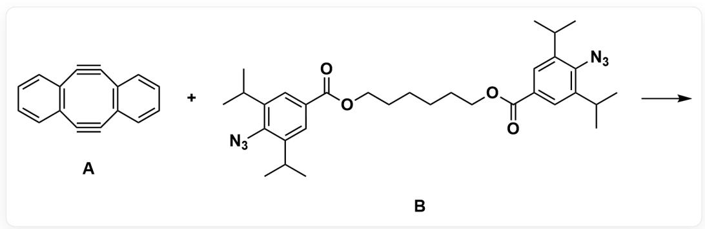
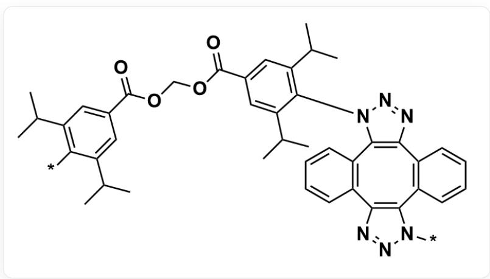
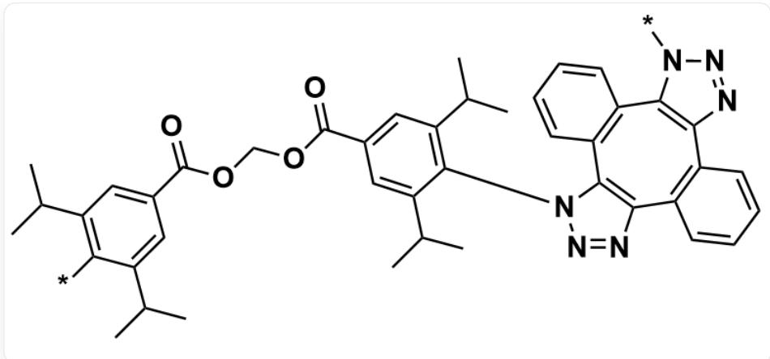

# 题目

对于以下物质发生的反应，其可以得到高分子产物：

  
反应的SMILES可以表示为：C12=C(C#CC3=C(C#C2)C=CC=C3)C=CC=C1.O=C(OCCCCCCCOC(C1=CC(C(C)C)=C(C(C(C)C)=C1)N=[N+]=[N·]=O)C2=CC(C(C)C)=C(C(C(C)C)=C2)N=[N+]=[N·] >>，其中，第一个反应物记号为A，第二个反应物记号为B

其生成的高分子产物中，有两种可能的基本重复单元结构：

- 重复单元1：

  
重复单元1的SMILES：  
CC(C1=CC(COCOC(C2=CC(C(C)C)=C(N3C4=C(N=N3)C5=C(C6=C(N=NN6[*])C7=C4C=CC=C7)C=CC=C5)C(C(C)C)=C2)=O)=O)  $=$  CC(C(C)C=C1*)]C,  
其中  $[^{\star}]$  表示与高分子中其他重复单元相连

- 重复单元2：

重复单元2的SMILES：  
  
CC(C1=CC(COCOC(C2=CC(C(C)C)=C(N3N=NC4=C3C5=C(C6=C(C7=C4C=CC=C7)N=NN6[*])C=CC=C5)C(C(C)C=C2)=O)=O)  $=$  CC(C(C)C=C1[*])C,  
其中  $[^{*}]$  表示与高分子中其他重复单元相连

对于以上反应及其所形成的高分子，有以下命题：

1. 该反应需要加入过渡金属催化才能够进行。  
2. 该反应在室温下无法进行，需要加热的条件。  
3. 在高分子中，重复单元2的含量大于重复单元1。  
4. 记当一分子反应物  $\mathbf{B}$  加成于一分子反应物  $\mathbf{A}$  的时的反应速率为  $k_{1}$ ，此时的中间产物再收到另一分子反应物  $\mathbf{B}$  加成的反应速率为  $k_{2}$ ，则  $k_{1} > k_{2}$ 。  
5. 记  $S = \frac{[\mathbf{A}]}{[\mathbf{B}]}$ ，则  $S_{1,2,3,4} = 0.83, 0.91, 1.10, 1.20$  四种情况下生成的聚合物，其数均分子量的大小顺序为  $S_3 > S_4 > S_2 > S_1$ 。

计算  $z = \frac{\text{正确命题序号}^2\text{的和}}{\text{错误命题序号和} + 1}$  的值，选出正确的选项。

A. 其他选项均不正确  
B. 0.067  
C. 0.286  
D. 0.385  
E. 0.692

F. 0.833  
G. 1.333

H. 1.545  
1. 2.273  
J. 2.600  
K. 3.222  
L. 5.857

# 答案

正确答案：I

# 详细解析

该反应是一个具有活性中间体的双应变促进叠氮化物-炔烃点击反应(DSPAAC)作为聚合反应。当一分子反应物B加成于一分子反应物A的后，此时的中间产物中，反应物A原本的八元环内双炔烃中，一个炔烃变成了烯烃，该转换过程会导致中间产物中与叠氮相连苯基与八元环上的苯环形成较大斥力，使得八元环无法共平面、更加扭曲，导致八元环中仅剩的炔烃的张力变大，因此会很快地与另一分子的炔烃发生DSPAAC反应。

# CHECKPOINT

1 PTS

加成的中间产物八元环更扭曲，环内炔烃反应性高于反应物A

基于以上推断，分析各个命题：

1. 该反应需要加入过渡金属催化才能够进行。

这是一个中间体的双应变促进叠氮化物-炔烃点击反应(DSPAAC)，而非传统的炔烃与叠氮在  $\mathrm{Cu}$  催化下进行的  $\mathrm{CuAAC}$  反应，基于八元环内炔烃在环张力驱动下发生的与叠氮的  $3 + 2$  Click反应时，不需要加入  $\mathrm{Cu}$  或其他过渡金属作为催化剂的。

# CHECKPOINT

1 PTS

该反应在环张力的驱动下进行，不需要过渡金属催化剂

2. 该反应在室温下无法进行，需要加热的条件。

Click 反应的条件温和，结合之间的论述，其不需要加热，在室温条件下即可进行。

# CHECKPOINT

1 PTS

该反应在室温下即可进行，不需要加热

3. 在高分子中，重复单元2的含量大于重复单元1。

重复单元2中两个叠氮B加成炔烃A后，叠氮取代基的取向相同，而重复单元1中叠氮取代基的取向不同。考虑一分子B加成于一分子A后的中间产物，若另一分子B加成时，叠氮的取代基方向与第一分子加成的取代基方向一致，则会由于空间位阻效应导致反应能垒升高，不利于重复单元2的形成，因此在高分子中，重复单元2的含量小于重复单元1。

# CHECKPOINT

1 PTS

重复单元2的含量小于重复单元1

4. 记当一分子反应物 B 加成于一分子反应物 A 的时的反应速率为  $k_{1}$ ，此时的中间产物再收到另一分子反应物 B 加成的反应速率为  $k_{2}$ ，则  $k_{1} > k_{2}$ 。

基于先前关于DSPAAC反应的论述，考虑一分子B加成于一分子A的后的中间产物，与叠氮相连苯基与八元环上的苯环形成较大斥力，使得八元环张力增大，提升了中间产物的反应活性，因此  $k_{2} > k_{1}$  。

# CHECKPOINT

1 PTS

中间产物的反应活性高于反应物，  $k_{2} > k_{1}$

5. 记  $S = \frac{[\mathbf{A}]}{[\mathbf{B}]}$ ，则  $S_{1,2,3,4} = 0.83, 0.91, 1.10, 1.20$  四种情况下生成的聚合物，其数均分子量的大小顺序为  $S_3 > S_4 > S_2 > S_1$ 。

考虑反应的中间产物反应活性高于反应物A，A中两个炔烃存在彼此促进的效应，因此，当反应物A过量时，并不会显著影响聚合物的数均聚合度，只会导致数均聚合度略微降低，而当反应物B过量时，由于B中两个叠氮并无促进作用，会导致数均聚合度产生较大幅的下降。

# CHECKPOINT

0.5 PTS

A 中两个炔烃存在促进作用，而 B 中两个叠氮并无促进作用

因此，  $S_{1,2,3,4} = 0.83,0.91,1.10,1.20$  四种情况下生成的聚合物，其数均分子量的大小顺序为  $S_{3} > S_{4} > S_{2} > S_{1}$

# CHECKPOINT

1 PTS

$S_{1,2,3,4} = 0.83, 0.91, 1.10, 1.20$  四种情况下生成的聚合物，其数均分子量的大小顺序为  $S_3 > S_4 > S_2 > S_1$

最终，计算  $z$  的值：

$$
z = \frac {\mathrm {正 确 命 题 序 号} ^ {2} \mathrm {的 和}}{\mathrm {错 误 命 题 序 号 和} + 1} = \frac {5 ^ {2}}{1 1} \approx 2. 2 7 3
$$

# CHECKPOINT

1 PTS

$z = 2.273$

因此，选择选项I。