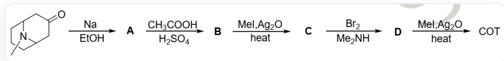
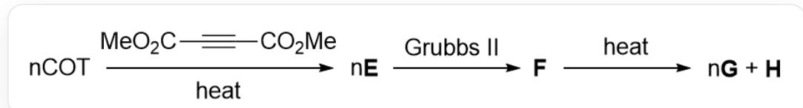
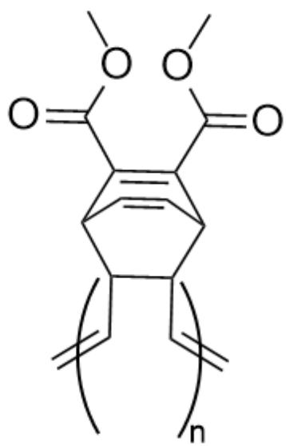

# Question

1915 Nobel Prize in Chemistry winner Willstätter first synthesized cyclooctatetraene (hereinafter referred to as COT) through artificial synthesis in the early 20th century, and its synthetic route is shown in the following figure:

The starting reactant O=C1CC2N(C)C(C1)CCC2 generates  ${}^{**}\mathrm{A}^{**}$  under Na and ethanol conditions, then  ${}^{**}\mathrm{A}^{**}$  generates  ${}^{**}\mathrm{B}^{**}$  under acetic acid and sulfuric acid conditions,  ${}^{**}\mathrm{B}^{**}$  generates  ${}^{**}\mathrm{C}^{**}$  under the action of iodomethane and silver oxide with heating,  ${}^{**}\mathrm{C}^{**}$  generates  ${}^{**}\mathrm{D}^{**}$  under the action of bromine and dimethylamine, and  ${}^{**}\mathrm{D}^{**}$  generates COT under the action of iodomethane and silver oxide with heating

With the gradual deepening of research on COT, scientists have discovered that COT has important applications in the synthesis of conductive polymer materials. The following figure shows the synthetic route, where  $\mathbf{H}$  is a common conductive polymer material, obtained from COT through a series of reactions.

n molecules of COT react with O=C(OC)C#CC(OC)=O under heating conditions to generate n molecules of  ${}^{**}\mathrm{E}^{**}$ , n molecules of  ${}^{**}\mathrm{E}^{**}$  generate  ${}^{**}\mathrm{F}^{**}$  under the action of Grubbs second-generation catalyst, and  ${}^{**}\mathrm{F}^{**}$  generates  ${}^{**}\mathrm{H}^{**}$  and n molecules of  ${}^{**}\mathrm{G}^{**}$  upon heating

Select the correct option from the following

A. COT can react with U to form a complex with the chemical formula  $\mathrm{U}(\mathrm{COT})_2$ . This complex oxidizes in oxygen to form  $\mathrm{U}_3\mathrm{O}_8$ . In the chemical equation for this combustion reaction, the formation of one molecule of  $\mathrm{U}_3\mathrm{O}_8$  requires the consumption of 21.33 molecules of oxygen.

B. The degree of unsaturation of  $\mathbf{C}$  is 3.  
C. D does not contain conjugated double bonds.  
D. In the reaction where  $\mathbf{B}$  generates  $\mathbf{C}$ , a small molecule with an atomicity of 13 is produced, and this small molecule will further react with iodomethane.  
E. F has electrical conductivity.  
F. E has two rings.  
G. A conjugated system exists in  $\mathbf{G}$ , with a total of 6 atoms participating in the conjugation.

# Answer

Correct Answer: D

# Detailed Explanation

The chemical formula of U's COT complex is  $\mathrm{U}(\mathrm{C}_8\mathrm{H}_8)_2$ . The oxidation of one molecule of  $\mathrm{U}_3\mathrm{O}_8$  requires the consumption of three molecules of  $\mathrm{U}(\mathrm{C}_8\mathrm{H}_8)_2$ . At the same time, the COT as a ligand is oxidized into 48 molecules of  $\mathrm{CO}_2$  and 24 molecules of  $\mathrm{H}_2\mathrm{O}$ . This process consumes a total of  $8 + 48*2 + 24 = 128$  oxygen atoms, i.e., 64 molecules of oxygen.

# CHECKPOINT

1 PTS

The generation of one molecule of  $\mathrm{U}_3\mathrm{O}_8$  requires the consumption of 64 molecules of oxygen, option A is incorrect

In the synthetic route of COT, the carbonyl group is first reduced in sodium ethanol to become a hydroxyl group, yielding OC1CC2N(C)C(C1)CCC2 (A); then A loses water under acidic conditions to yield CN1C2CCCC1C=CC2 (B); in the process of B generating C, iodomethane reacts with the amino group to generate a quaternary ammonium salt, and silver oxide acts as a base to undergo Hoffmann elimination under heating conditions. Since the amino group in B forms two bonds with the main ring, it can be eliminated twice, yielding C1=C\C=C/C=C\CC/1 (C), with an unsaturation degree of 4.

# CHECKPOINT

1 PTS

The chemical formula of  $\mathbf{C}$  is  $\mathrm{C_8H_{10}}$ , with an unsaturation degree of 4, option B is incorrect.

In the Hoffmann elimination reaction using iodomethane, iodomethane will continue to react with the amino group to generate a quaternary ammonium salt, eventually yielding a quaternary ammonium salt with three alkyl groups being methyl groups, followed by elimination, releasing one molecule of trimethylamine, with 13 atoms, and it can further react with iodomethane to produce tetramethylammonium iodide.

# CHECKPOINT

1 PTS

The reaction of  $\mathbf{B}$  to generate  $\mathbf{C}$  eliminates one molecule of trimethylamine with 13 atoms, which can further react with potassium iodide, option D is correct

C reacts with bromine and dimethylamine to obtain D, which should be that bromine undergoes addition to the double bond and is then substituted by dimethylamine, and finally undergoes another Hoffmann elimination to obtain COT. The addition reaction of bromine and the substitution of dimethylamine may produce a variety of products, but the product retaining the conjugated double bond is more stable. Therefore, D may be CN(C)C1CCC(N(C)C)/C=C\C=C/1 (D1) or CN(C)C1C(N(C)C)CC/C=C\C=C/1 (D2), where D2 will obtain a conjugated system after one Hoffmann elimination. At this time, another amino group is on the  $sp^2$  carbon, which can no longer be eliminated. The actual structure of D is D1. But both D1 and D2 have a conjugated system.

# CHECKPOINT

1 PTS

Addition will tend to obtain more stable products with conjugated systems, option C is incorrect

In common organic conductive polymers, all need to have a conjugated main electron system. COT reacts with dimethyl butynedioate under heating conditions, undergoing a Diels-Alder reaction, possibly yielding  $\mathrm{O} = \mathrm{C}(\mathrm{OC})\mathrm{C}1 = \mathrm{C}(\mathrm{C}(\mathrm{OC}) = \mathrm{O})\mathrm{C}2 / \mathrm{C} = \mathrm{C}\backslash \mathrm{C} = \mathrm{C} / \mathrm{C}1\mathrm{C} = \mathrm{C}2$  (E1) or an isomer where the conjugated double bond is cyclized into a four-membered ring  $\mathrm{O} = \mathrm{C}(\mathrm{OC})\mathrm{C}1 = \mathrm{C}(\mathrm{C}(\mathrm{OC}) = \mathrm{O})\mathrm{C}2\mathrm{C}3\mathrm{C} = \mathrm{CC}3\mathrm{C}1\mathrm{C} = \mathrm{C}2$  (E2). Among them, E1 cannot form a polymer under the action of Grubbs catalyst, while E2 can obtain a polymer through ROMP reaction. Therefore, the structure of E is E1, containing 3 rings.

# CHECKPOINT

1 PTS

The structure of  $\mathbf{E}$  is  $O = C(OC)C1 = C(C(OC) = O)C2C3C = CC3C1C = C2$ , containing 3 rings, option F is incorrect

$\mathbf{E}$  can be obtained by ROMP reaction to obtain  $\mathbf{F}$ , the structure is shown in the figure below, which does not contain a conjugated main electron system and is not conductive.

The polymer structure can be represented as  $\mathrm{O = C(C1 = C([C@H]2[C@@H][[C@@H]}}}$

([C@@H]1C=C2)C=C)C=C)C(OC)=O)OC. The two monosubstituted alkene groups interact through olefin metathesis, losing one molecule of ethylene, and the polymers are connected by double bonds

# CHECKPOINT

1 PTS

$\mathbf{F}$  does not contain a conjugated main electron system and is not conductive, option E is incorrect.

$\mathbf{F}$  can undergo a reverse Diels-Alder reaction under heating conditions, producing dimethyl phthalate  $(\mathbf{G})$  and the common conductive polymer polyacetylene  $(\mathbf{H})$ . The two ester groups in  $\mathbf{G}$  are conjugated with the benzene ring, with 10 atoms participating in the conjugation.

# CHECKPOINT

1 PTS

The two ester groups in  $\mathbf{G}$  are conjugated with the benzene ring, with 10 atoms participating in the conjugation, option G is incorrect