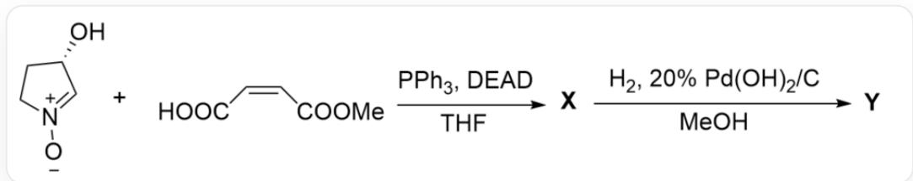

# Question

[ \text{[O-][N+]1=C[C@@H](O)CC1 reacting with O=C(/C=C\C(O)=O)OC under PPh}_3, \text{DEAD}, \text{THF conditions to generate X, and X reacting under H}_2, 20\% Pd(OH)_2/C, MeOH conditions to generate Y} ]

# Known:

1.  $\mathbf{Y}$  contains three rings and contains 8 carbon atoms.  
2. In the first step reaction,  $\mathrm{PPh}_3$ , DEAD are in large excess.  
3. The formation of  $\mathbf{Y}$  from  $\mathbf{X}$  proceeds through two important electrically neutral intermediates 1, 2.

Which of the following statements is correct:

A. All other options are incorrect  
B. The number of chiral centers in  $\mathbf{X}$  and  $\mathbf{Y}$  is inconsistent.  
C. X contains at least two S-configuration chiral carbon atoms  
D.  $\mathbf{X}, \mathbf{1}, \mathbf{2}$  both contain three rings.  
E. Under strongly alkaline conditions,  $\mathbf{Y}$  undergoes heated hydrolysis, and the hydrolysis product has two rings.

F. Y possesses a six-membered ring  
G. The chiral carbon atoms with R configuration are more than those with S configuration in Y.

# Answer

Correct Answer: G

# Detailed Explanation

The first step added  $\mathrm{PPh}_3$ , DEAD, which are obvious Mitsunobu reaction conditions. The reaction site is obviously the alcohol hydroxyl group of the five-membered ring substrate and the carboxyl group of another molecule of the substrate, generating an ester. According to the stereochemical requirements of the Mitsunobu reaction, the stereoconfiguration of the alcohol hydroxyl group will be inverted; the resulting ester structure is [O-]  $[\mathrm{N} + ]1 = \mathrm{C}[\mathrm{C}@\mathrm{H}](\mathrm{OC}(/\mathrm{C} = \mathrm{C}\backslash \mathrm{C}(\mathrm{OC}) = \mathrm{O}) = \mathrm{O})\mathrm{CC}1.$

# CHECKPOINT

1 PTS

The first step added  $\mathrm{PPh}_3$ , DEAD, which are Mitsunobu reaction conditions

# CHECKPOINT

1 PTS

The stereochemical requirements of the Mitsunobu reaction require the stereoconfiguration of the alcohol hydroxyl group to be inverted

# CHECKPOINT

1 PTS

The ester structure is  $[\mathrm{O - }][\mathrm{N + }]1 = \mathrm{C}[\mathrm{C@H}](\mathrm{OC} / / \mathrm{C} = \mathrm{C}\backslash \mathrm{C}(\mathrm{OC}) = \mathrm{O}) = \mathrm{O})\mathrm{CC}1$

According to the structure of  $\mathbf{Y}$  containing three rings and an ester, the molecule contains a 1,3-dipole and an electron-deficient double bond, which can obviously undergo an intramolecular [1,3] dipolar cycloaddition reaction to obtain two five-membered rings; the stereochemical requirements of this reaction are that since the double bond is in the cis conformation, the resulting substituents should be on the same side. Therefore, the structure of  $\mathbf{X}$  is  $[\mathrm{H}][\mathrm{C}@\mathrm{]}12[\mathrm{C}@\mathrm{@H}](\mathrm{C}(\mathrm{OC}) = \mathrm{O})\mathrm{ON3CC}[\mathrm{C}@\mathrm{@H}](\mathrm{OC}2 = \mathrm{O})(\mathrm{C}@\mathrm{]}31[\mathrm{H}]$ . This structure contains four chiral carbon atoms, three R and one S configuration, option C is incorrect.

# CHECKPOINT

1 PTS

Intramolecular [1,3] dipolar cycloaddition reaction occurs to obtain two five-membered rings

# CHECKPOINT

1 PTS

The double bond is in the cis conformation, and the resulting substituents should be on the same side

# CHECKPOINT

1 PTS

The structure of  $\mathbf{X}$  is [H][C@]12[C@@H](C(OC)=O)ON3CC[C@@H](OC2=O)[C@]31[H], with three R and one S configuration chiral carbon atoms

$\mathbf{X}$  reacts with hydrogen, and obviously the heteroatom bond  $\mathrm{N} - \mathrm{O}$  is reduced first; therefore, the intermediate 1 structure is [H][C@@]1([C@@]2([H])NCC[C@H]2OC1=O)[C@H](O)C(OC)=O.

# CHECKPOINT

1 PTS

The heteroatom bond  $\mathbf{N} - \mathbf{O}$  is reduced first

# CHECKPOINT

1 PTS

The intermediate 1 structure is [H][C@@]1([C@@]2([H])NCC[C@H]2OC1=O)[C@H](O)C(OC)=O

The final product has three rings, so 1 to 2 is obviously still a ring-forming reaction. Observing the structure, it can be seen that it should be the reaction of the amino group with the ester group to obtain a five-membered ring amide. Therefore, the intermediate 2 is a nucleophilic addition tetrahedral intermediate, with the structure [H]  $\mathrm{[C@]12[C@H](O)C(O)(OC)N3CC[C@@H](OC2 = O)[C@]31[H]}$ .

# CHECKPOINT

1 PTS

The amino group reacts with the ester group to obtain a five-membered ring amide

# CHECKPOINT

1 PTS

The intermediate 2 is a nucleophilic addition tetrahedral intermediate, with the structure  $\mathrm{[H][C@]12[C@H]}$  (O)C(O)(OC)N3CC[C@@H](OC2=O)[C@]31[H]

$\mathbf{Y}$  is a five-membered ring amide, with the structure  $[\mathrm{H}][\mathrm{C}@\mathrm{]12}[\mathrm{C}@\mathrm{H}](\mathrm{O})\mathrm{C}(\mathrm{N}3\mathrm{CC}[\mathrm{C}@\mathrm{@}\mathrm{H}](\mathrm{OC}2 = \mathrm{O})$ $[\mathrm{C}@\mathrm{]31}[\mathrm{H}]) = 0.$ $\mathbf{Y}$  contains three five-membered rings. The chiral carbon atoms in the process of generating  $\mathbf{Y}$

do not change, so the configuration remains unchanged, still three R and one S configuration, option G is correct, B is incorrect, and F is incorrect. 1 contains only two rings, option D is incorrect.

# CHECKPOINT

1 PTS

Y is a five-membered ring amide, with the structure  $\mathrm{[H][C@]12[C@H](O)C(N3CC[C@@H](OC2=O)}$ $[\mathrm{C}@\mathrm{]}31[\mathrm{H}]) = 0$

# CHECKPOINT

1 PTS

The chiral carbon atoms in the process of generating  $\mathbf{Y}$  do not change, still three R and one S configuration

$\mathbf{Y}$  hydrolyzes the ester and amide groups under basic heating conditions, so only one tetrahydropyrrole ring structure will be retained in the three rings, option E is incorrect.

# CHECKPOINT

1 PTS

$\mathbf{Y}$  hydrolyzes the ester and amide groups under basic heating conditions, so only one tetrahydropyrrole ring structure will be retained in the three rings