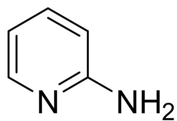
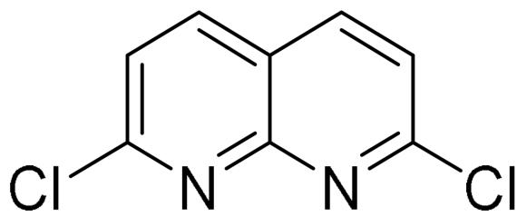
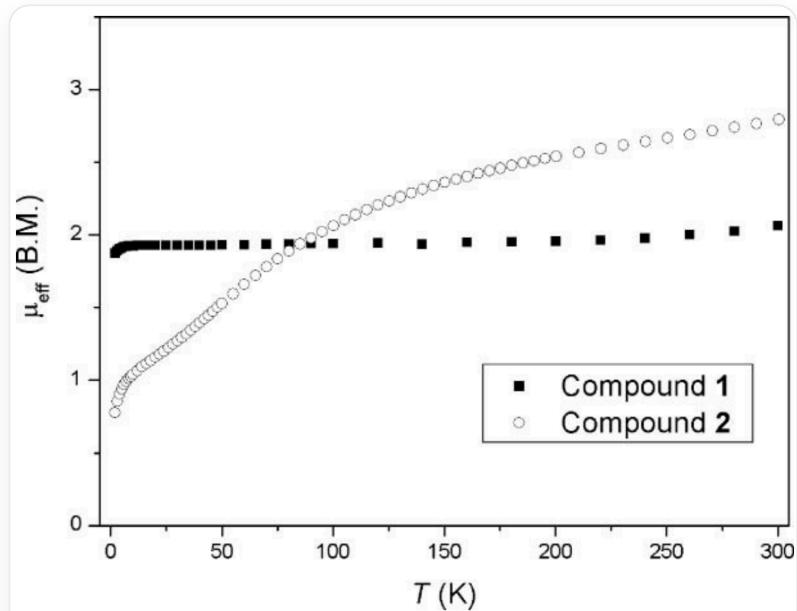
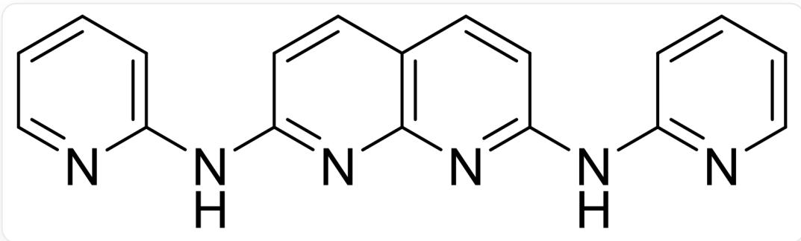

# 题目

由于金属-金属键的独特性质，金属串络合物的合成一直以来受到研究人员的广泛关注。一种金属串常用的配体A合成方法如下：在氩气气氛下，将底物B(1.98 g, 23 mmol)及C(2.16 g, 10 mmol)、t-BuOK(2.81 g, 25 mmol)、 $\mathrm{Pd}_2(\mathrm{dba})_3$  (183 mg, 0.20 mmol)、dppp(165 mg, 0.40 mmol)加入干燥的烧瓶中，搅拌混合物并在甲苯(100 mL)中回流48小时，观察到体系变为深棕色。在减压下除去溶剂，而后将混合物倒入水中，过滤沉淀物得到固体，用乙酸乙酯作为洗脱剂，通过硅胶柱色谱法得到亮黄色产物A。已知dppp为一种双齿膦配体，B和C的结构如下：

  
B

  
C  
B的SMILES为NC1=NC=CC=C1，C的SMILES为CIC1=NC2=C(C=C1)C=CC(Cl)=N2

将A(251 mg)、萘(25 g)及DMF(5 mL)的混合物置入锥形瓶中，加热至  $100^{\circ}\mathrm{C}$  。然后缓慢加入 t - BuOK(224 mg, 2.0 mmol)，体系立刻变深棕色。在约  $130\sim 140^{\circ}\mathrm{C}$  下加热15小时，而后再  $200^{\circ}\mathrm{C}$  下回流15分钟，得到橙色透明溶液。逐滴加入无水  $\mathrm{CoCl}_2$  (182 mg, 1.4 mmol)，再回流30分钟后，缓慢加入NaSCN(32 mg, 0.40 mmol)，颜色由深棕色变为深绿色。混合物再回流3小时，再浓缩至约5 mL，然后冷却至  $70^{\circ}\mathrm{C}$  。用己烷处理，沉淀出金属络合物。抽滤收集沉淀物，用己烷洗涤以除去萘及DMF。固体用  $\mathrm{CH}_2\mathrm{Cl}_2$  萃取并过滤，将  $\mathrm{CH}_2\mathrm{Cl}_2$  溶液用过量的  $\mathrm{KPF}_6$  于甲醇中处理并搅拌过夜后，于真空下除去溶剂。残余固体用  $\mathrm{CH}_2\mathrm{Cl}_2$  萃取并过滤，正戊烷蒸汽缓慢扩散到滤液中以获得深紫色的1:1型盐D。D中各元素质量分数(均为理论值)如下：Co  $18.14\%$  ，C  $46.22\%$  ，H  $2.59\%$  ，N  $18.69\%$  。已知配合物中所有配位原子相同。

用  $\left[\mathrm{Cp}_{2} \mathrm{Fe}\right]\left(\mathrm{PF}_{6}\right)$  在  $\mathrm{CH}_{2} \mathrm{Cl}_{2} / \mathrm{MeOH}$  中处理  $\mathbf{D}$ , 按1:1反应可以得到  $\mathbf{E}$  。

室温下D能量最高的单电子占据  $\delta^{*}(6)$  ；E能量最高的两个单电子分别占据能差不大的  $\delta^{*}(6)$  和  $\sigma^{*}(4)$  。

# 下列说法正确的有：

1. 已知D中Co-Co键平均键级为0.5，则Co均满足18电子规则  
2. E的所有阴阳离子中共有38个原子参与配位，且配位原子种类为2  
3. 制备 D 的过程中, 反应体系必然有物质被氧化了  
4. 考虑相距最远的  $\mathrm{Co}$  原子之间的距离,  $\mathbf{D} > \mathbf{E}$  
5. D和E的磁矩随温度变化如下图所示：

这张图片是一幅背景为白色的二维散点线图。垂直的Y轴标签为“ $\mu_{\text{eff}}$  (B.M.)”，刻度从0开始，向上依次标有1、2、3。水平的X轴标签为“T(K)”，刻度从0开始，向右依次标有50、100、150、200、250和300。图中展示了两条由离散数据点构成的曲线，图例中指出黑色方块代表化合物1，白色圆圈代表化合物2。第一条曲线由实心黑色方块表示，它在接近0K的极低温度区， $\mu_{\text{eff}}$  值约为1.9，随后该值基本保持恒定，形成一个平坦的区域，直到T约为75K。在75K之后，这条曲线的 $\mu_{\text{eff}}$ 值随着温度的升高而非常缓慢地上升，在300K时达到约2.1。第二条曲线由空心白色圆圈表示，它在接近0K的温度下， $\mu_{\text{eff}}$ 值低于1.0，大约在0.8左右。随着温度T的升高，这条曲线的 $\mu_{\text{eff}}$ 值持续显著上升，其上升的速率在低温区较大，并随着温度的增高而逐渐减缓。在T约等于80K时，这条空心圆圈曲线与实心方块曲线相交，此时 $\mu_{\text{eff}}$ 值略低于2.0。在T等于300K时，空心圆圈曲线达到其在图中的最高点， $\mu_{\text{eff}}$ 值约为2.8。

则黑色方块代表  $\mathbf{E}$ , 白色圆圈代表  $\mathbf{D}$

A. 其他选项均不正确  
B. 1,3,4  
C. 2,3,5  
D. 3,4  
E. 3,4,5  
F. 1,3  
G. 2,4  
H. 4,5  
1,3,4,5  
J. 2,5  
K. 3,4,5  
L. 2  
M. 1,3,5  
N. 2,3,4,5

O. 4  
P. 2,3,4

# 答案

正确答案: P

# 详细解析

B和C反应，发生两次偶联得到A：

  
SMILES为C1(C=CC(NC2=CC=CC=N2)=N3)=C3N=C(NC4=NC=CC=C4)C=C1

# CHECKPOINT

1 PTS

A 为  $\mathrm{C}1(\mathrm{C} = \mathrm{CC}(\mathrm{NC}2 = \mathrm{CC} = \mathrm{CC} = \mathrm{N}2) = \mathrm{N}3) = \mathrm{C}3\mathrm{N} = \mathrm{C}(\mathrm{NC}4 = \mathrm{NC} = \mathrm{CC} = \mathrm{C}4)\mathrm{C} = \mathrm{C}$

A的阴离子对应配体  $\mathrm{L}^{2-}$  。由质量分数， $\mathrm{n(C)} / \mathrm{n(Co)} = 12.50, \mathrm{n(H)} / \mathrm{n(Co)} = 8.35, \mathrm{n(N)} / \mathrm{n(Co)} = 4.33$ ，再结合配体  $\mathrm{L}^{2-}$  的结构可知，一个金属串上(A)应有6个Co原子。

# CHECKPOINT

1 PTS

一个金属串上应有6个Co原子

由质量分数可知  $\mathrm{n}(\mathrm{C}) = 75$  ，  $\mathrm{n}(\mathrm{H}) = 50$  ，  $\mathrm{n}(\mathrm{N}) = 26$

# CHECKPOINT

1 PTS

$$
\mathrm {n} (\mathrm {C}) = 7 5, \quad \mathrm {n} (\mathrm {H}) = 5 0, \quad \mathrm {n} (\mathrm {N}) = 2 6
$$

由N的数量可知，D中含有4个  $\mathrm{L}^{2-}$  和2个  $\mathrm{SCN}^{-}$ ，共含74个C和48个H，其中有多余的1个C原子和2个H原子。

化合物的阴离子应为  $\mathrm{PF}_{6}^{-}$ ，假设只有1个阴离子，则剩余： $75\mathrm{M}(\mathrm{C}) / 46.22\% - 6\mathrm{M}(\mathrm{Co}) - 4\mathrm{M}(\mathrm{L}^{2-}) - 2\mathrm{M}(\mathrm{SCN}^{-}) - \mathrm{M}(\mathrm{PF}_{6}^{-}) = 84.76\mathrm{~g/mol}$

# CHECKPOINT

2 PTS

假设只有1个阴离子，则D剩余  $84.76 \mathrm{~g} / \mathrm{mol}$

这正好对应  $\mathrm{CH}_2\mathrm{Cl}_2$  ，结合多余的1个C原子和2个H原子可知，配合物有一分子  $\mathrm{CH}_2\mathrm{Cl}_2$  的溶剂合。

所有配位原子相同，由此可知  $\mathrm{SCN}^{-}$  应以  $\mathbf{N}$  原子配位。

故  $\mathbf{D}$  的化学式为  $[\mathrm{Co}_6(\mu_6 - \mathrm{L})_4(\mathrm{NCS})_2](\mathrm{PF}_6)\cdot \mathrm{CH}_2\mathrm{Cl}_2$

# CHECKPOINT

1 PTS

D 的化学式为  $\left[\mathrm{Co}_{6}\left(\mu_{6}-\mathrm{L}\right)_{4}(\mathrm{NCS})_{2}\right]\left(\mathrm{PF}_{6}\right) \cdot \mathrm{CH}_{2} \mathrm{Cl}_{2}$

D中金属主体为  $\mathrm{Co}_{6}^{11+}$ ， $\mathrm{Co}^{2+}$  被还原了，反应体系必然有物质被氧化，说法3正确；算上26个N原子提供的电子以及5根0.5键级的  $\mathrm{Co}-\mathrm{Co}$  键，共  $6 \times 9 - 11 + 26 \times 2 + 5 \times 0.5 \times 2 = 100 < 6 \times 18$ ，说法1错误

# CHECKPOINT

1 PTS

D中6Co共100个电子，不可能均满足18电子规则

# CHECKPOINT

0.5 PTS

合成D的反应体系必然有物质被氧化

E为D被单电子氧化，即  $\left[\mathrm{Co}_{6}(\mu_{6}-\mathrm{L})_{4}(\mathrm{NCS})_{2}\right](\mathrm{PF}_{6})_{2} \cdot 2 \mathrm{CH}_{2} \mathrm{Cl}_{2}$  （配位溶剂不作要求，不影响选项的判断），阳离子中有26个N、阴离子中有12个F参与配位，说法2正确；E中Co的平均氧化态更高，因此  $\mathrm{Co}-\mathrm{Co}$  键键级更大来缓解缺电子性，  $\mathrm{Co}-\mathrm{Co}$  也就更短，说法4正确

# CHECKPOINT

0.5 PTS

$\mathbf{E}$  为  $[\mathrm{Co}_6(\mu_6 - \mathrm{L})_4(\mathrm{NCS})_2](\mathrm{PF}_6)_2\cdot 2\mathrm{CH}_2\mathrm{Cl}_2$

# CHECKPOINT

1 PTS

相比D，E中Co的平均氧化态更高，  $\mathrm{Co - Co}$  也就更短

有1个单电子的D温度变化基本上不影响磁矩；而温度升高E的电子可以被激发，在单线态/三线态之间转变。故正确答案为：黑色方块对应D，白色圆圈对应E，说法5错误

# CHECKPOINT

1 PTS

黑色方块对应D，白色圆圈对应E

说法2,3,4正确，选P