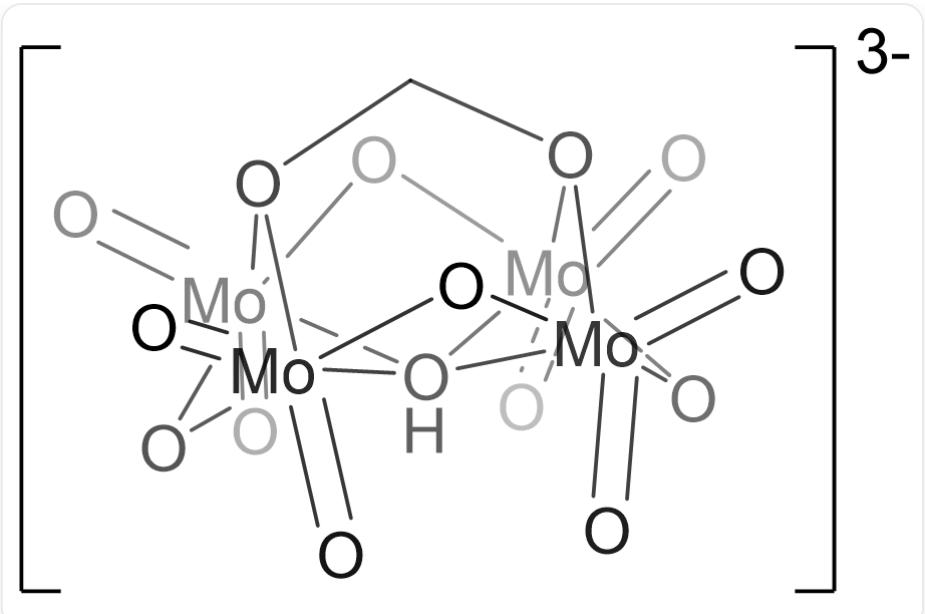

# Question

At room temperature, excess formaldehyde hydrate was added to a dichloromethane solution of  $\left[(n - C_4H_9)_4N\right]_2Mo_2O_7$ , and after sufficient reaction (solution 1), ethyl ether was added for crystallization; the crude product was purified by recrystallization to obtain compound X. Further studies have shown that X is a salt compound, and its crystal contains only 1 kind of cation and 1 kind of anion; the formula weight of the anion is 638.8, and it has a multinuclear cluster structure; among them, all Mo atoms have the same chemical environment. In X, the content (mass fraction) of each element is: C,  $43.1\%$ ; H,  $8.2\%$ ; N,  $3.1\%$ ; O,  $17.6\%$ .

Which of the following statements are correct:

1. The number of  $\mathbf{H}$  in the chemical formula of  $\mathbf{X}$  does not exceed 110  
2. Solution 1 is neutral, or weakly acidic/basic  
3. In one anion of  $\mathbf{X}$ , there are 2 triply coordinated O  
4. In molybdates formed by molybdenum, the number of terminal oxygen atoms connected to each molybdenum is usually no more than 2

A. All other options are incorrect  
B. 1  
C. 2  
D. 3  
E. 4  
F. 1,2

G. 1,3  
H. 1,4  
1. 2,3  
J. 2,4  
K. 3,4  
L. 1,2,3  
M. 1,2,4  
N. 1,3,4  
O. 2,3,4  
P. 1,2,3,4

# Answer

Correct Answer: K

# Detailed Explanation

X contains only Mo in addition to C, H, N, and O;

The content of Mo is:  $1 - 43.1\% - 8.2\% - 3.1\% - 17.6\% = 28.0\%$

The ratio of the number of N and Mo atoms in X is:  $(3.1\% / 14.01):(28.0\% / 95.95) = 0.758 \approx 3:4$

# CHECKPOINT

0.5 PTS

$\mathrm{N}:\mathrm{Mo} = 3:4$  in  $\mathbf{X}$

The ratio of the number of N and O atoms in  $\mathbf{X}$  is:  $(3.1\% / 14.01):(17.6\% / 16.00) = 0.201 \approx 1:5 = 3:15$

# CHECKPOINT

0.5 PTS

$\mathrm{N}:\mathrm{O} = 1:5$  in  $\mathbf{X}$

The cation of  $\mathbf{X}$  should be  $\left[(n - C_4H_9)_4N\right]^+$ ; therefore, both Mo and O atoms are in the anion. Given the anion formula weight is 638.8,

there should be 4 Mo atoms and 15 O atoms in the anion;

The formula weight of the remaining part in the  $\mathbf{X}$  anion is:  $638.8 - 95.95 \times 4 - 16.00 \times 15 = 15.0$

Corresponding to 1 C and 3 H atoms;

Therefore, the composition of  $\mathbf{X}$  is  $\left[(n - C_4H_9)_4N\right]_3\left[\mathrm{Mo}_4\mathrm{O}_{15}\mathrm{CH}_3\right]$

The carbon in the anion of  $\mathbf{X}$  comes from formaldehyde hydrate  $\mathrm{CH}_2(\mathrm{OH})_2$ , so the chemical formula of  $\mathbf{X}$  is:  $\left[(n - C_4H_9)_4N\right]_3\left[\mathrm{Mo}_4\mathrm{O}_{12}(\mathrm{CH}_2\mathrm{O}_2)(\mathrm{OH})\right]$

# CHECKPOINT

2 PTS

The chemical formula of  $\mathbf{X}$  is  $\left[(n - C_4H_9)_4N\right]_3\left[\mathrm{Mo}_4\mathrm{O}_{12}(\mathrm{CH}_2\mathrm{O}_2)(\mathrm{OH})\right]$

$\mathbf{X}$  contains  $9 \times 4 \times 3 + 3 = 111$ , statement 1 is incorrect.

The reaction of two molecules of  $\left[(n - C_4H_9)_4N\right]_2Mo_2O_7$  with one molecule of  $\mathrm{CH}_2(\mathrm{OH})_2$  will produce a strong base, statement 2 is incorrect:

$$
2 \left[\left(\mathrm {n - C} _ {4} \mathrm {H} _ {9}\right) _ {4} \mathrm {N} \right] _ {2} \mathrm {M o} _ {2} \mathrm {O} _ {7} + \mathrm {C H} _ {2} (\mathrm {O H}) _ {2} \rightarrow \left[\left(\mathrm {n - C} _ {4} \mathrm {H} _ {9}\right) _ {4} \mathrm {N} \right] _ {3} \left[ \mathrm {M o} _ {4} \mathrm {O} _ {1 2} \left(\mathrm {C H} _ {2} \mathrm {O} _ {2}\right) (\mathrm {O H}) \right] + \left[\left(\mathrm {n - C} _ {4} \mathrm {H} _ {9}\right) _ {4} \mathrm {N} \right] \mathrm {O H}
$$

# CHECKPOINT

1 PTS

The reaction will produce  $\left[\left(\mathrm{n - C}_4\mathrm{H}_9\right)_4\mathrm{N}\right]\mathrm{OH}$

The chemical environment of Mo is the same, so  $\mathrm{OH}^{-}$  must be in the middle of the  $\mathrm{Mo}_4$  rectangle. There are 12  $\mathrm{O}^{2-}$ , first consider 4 bridging and 4 terminal, at this time Mo is already four-coordinated, but in multinuclear cluster structures, it is generally six-coordinated.  $\mathrm{CH}_2\mathrm{O}_2^{2-}$  can be placed on the other side of  $\mathrm{OH}^{-}$ , and coordinated with 4 Mo at the same time, and the remaining 4 individual  $\mathrm{O}^{2-}$  can be terminally coordinated with Mo. There are only 2 three-coordinated O, statement 3 is correct:

$\mathrm{O = [Mo]1([OH][[Mo]2(O3)(O1)(=O) = O)[(Mo]345(=O) = O)[Mo]67(O4)(=O) = O)(O6)(O2CO75) = O}$  ，带3个负电荷

# CHECKPOINT

2 PTS

The anion structure of  $\mathbf{X}$  is  $O = [\mathrm{Mo}]1([\mathrm{OH}][[\mathrm{Mo}]2(\mathrm{O3})(\mathrm{O1})(= O) = O)([\mathrm{Mo}]345(= O) = O)[\mathrm{Mo}]67(\mathrm{O4})$ $(= 0) = 0)(06)(02CO75) = 0$  (with 3 negative charges)

Terminal oxygen  $\mathrm{O}^{2-}$  has 2 negative charges and is a good  $\sigma$  donor and  $\pi$  donor; when there are more terminal  $\mathrm{O}^{2-}$ , the Mo center is electron deficient and tends to form low-coordinated monomeric structures. Statement 4 is correct.

# CHECKPOINT

1 PTS

Terminal oxygen  $\mathrm{O}^{2-}$  has 2 negative charges and is a good  $\sigma$  donor and  $\pi$  donor; when there are more terminal  $\mathrm{O}^{2-}$ , the Mo center is electron deficient and tends to form low-coordinated monomeric structures

Statements 3 and 4 are correct, choose K