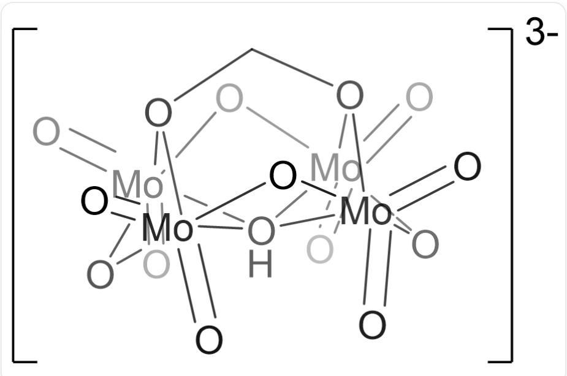

# 题目

在室温下，向  $\left[\left(\mathrm{n}-\mathrm{C}_{4} \mathrm{H}_{9}\right)_{4} \mathrm{~N}\right]_{2} \mathrm{Mo}_{2} \mathrm{O}_{7}$  的二氯甲烷溶液中加入过量的甲醛水合物，充分反应后(溶液1)，加入乙醚析晶；粗产物经重结晶纯化，可得到化合物X。进一步研究表明，X是盐类化合物，其晶体中仅含1种阳离子和1种阴离子；阴离子式量为638.8，具有多核簇状结构；其中，所有Mo原子的化学环境完全相同。在X中，各元素的含量（质量分数）为：C， $43.1\%$ ；H， $8.2\%$ ；N， $3.1\%$ ；O， $17.6\%$ 。

下列说法正确的有：

1.  $\mathbf{X}$  的化学式中H的数目不超过110  
2. 溶液1为中性，或者是较弱的酸性/碱性  
3.1个X的阴离子中，三配位的O有2个  
4. 在由钼形成的多酸盐中，每个钼所连接的端基氧的数目通常不多于2

A. 其他选项均不正确  
B. 1  
C. 2  
D. 3  
E. 4  
F. 1,2  
G. 1,3

H. 1,4  
1. 2,3  
J. 2,4  
K. 3,4  
L. 1,2,3  
M. 1,2,4  
N. 1,3,4  
O. 2,3,4  
P. 1,2,3,4

# 答案

正确答案: K

# 详细解析

X中除C、H、N、O外只有Mo；

Mo的含量为：  $1 - 43.1\% -8.2\% -3.1\% -17.6\% = 28.0\%$

X 中 N 和 Mo 原子的数目比为:  $(3.1\% / 14.01):(28.0\% / 95.95) = 0.758 \approx 3:4$

# CHECKPOINT

0.5 PTS

X中N：Mo=3:4

X中N和O原子的数目比为：  $(3.1\% /14.01):(17.6\% /16.00) = 0.201\approx 1:5 = 3:15$

# CHECKPOINT

0.5 PTS

X中N：O=1:5

X 的阳离子应为  $\left[\left(\mathrm{n}-\mathrm{C}_{4} \mathrm{H}_{9}\right)_{4} \mathrm{~N}\right]^{+}$ ; 所以 Mo 和 O 原子均在阴离子中, 结合阴离子式量为 638.8,

阴离子中应有4个Mo原子和15个O原子；

X阴离子中剩余部分的式量为：  $638.8 - 95.95\times 4 - 16.00\times 15 = 15.0$

对应1个C和3个H原子；

所以， $\mathbf{X}$  的组成为  $\left[(n - C_4H_9)_4N\right]_3\left[\mathrm{Mo}_4\mathrm{O}_{15}\mathrm{CH}_3\right]$

X 的阴离子中的碳来源于甲醛水合物  $\mathrm{CH}_2(\mathrm{OH})_2$ ，因此 X 的化学式为： $\left[(n-\mathrm{C}_4\mathrm{H}_9)_4\mathrm{N}\right]_3[\mathrm{Mo}_4\mathrm{O}_{12}(\mathrm{CH}_2\mathrm{O}_2)(\mathrm{OH})]$

# CHECKPOINT

2 PTS

$\mathbf{X}$  的化学式为  $\left[(n - C_4H_9)_4N\right]_3\left[\mathrm{Mo}_4\mathrm{O}_{12}(\mathrm{CH}_2\mathrm{O}_2)(\mathrm{OH})\right]$

X中含  $9\times 4\times 3 + 3 = 111$  ，说法1错误

两分子的  $\left[(n - C_{4}H_{9})_{4}N\right]_{2}Mo_{2}O_{7}$  与一分子的  $\mathrm{CH}_2(\mathrm{OH})_2$  反应，会产生强碱，说法2错误：

$$
2 \left[\left(\mathrm {n - C _ {4} H _ {9}}\right) _ {4} \mathrm {N} \right] _ {2} \mathrm {M o} _ {2} \mathrm {O} _ {7} + \mathrm {C H} _ {2} (\mathrm {O H}) _ {2} \rightarrow \left[\left(\mathrm {n - C _ {4} H _ {9}}\right) _ {4} \mathrm {N} \right] _ {3} \left[ \mathrm {M o} _ {4} \mathrm {O} _ {1 2} (\mathrm {C H} _ {2} \mathrm {O} _ {2}) (\mathrm {O H}) \right] + \left[\left(\mathrm {n - C _ {4} H _ {9}}\right) _ {4} \mathrm {N} \right] \mathrm {O H}
$$

# CHECKPOINT

1 PTS

反应会产生  $\left[\left(\mathrm{n - C}_{4} \mathrm{H}_{9}\right)_{4} \mathrm{~N}\right] \mathrm{OH}$

Mo 的化学环境相同, 因此  $\mathrm{OH}^{-}$  必然处于  $\mathrm{Mo}_{4}$  矩形正中间。有 12 个  $\mathrm{O}^{2-}$ , 先考虑 4 个桥联, 4 个端配, 此时 Mo 已经四配位了, 但在多核簇状结构里一般要六配位。可以把  $\mathrm{CH}_{2} \mathrm{O}_{2}^{2-}$  放在  $\mathrm{OH}^{-}$  的另一侧, 同时与 4 个 Mo 配位, 剩下的 4 个单独的  $\mathrm{O}^{2-}$  再与 Mo 端配即可。三配位的 O 仅有 2 个, 说法3正确:

$\mathrm{O = [Mo]1([OH][[Mo]2(O3)(O1)(=O) = O)[(Mo]345(=O) = O)[Mo]67(O4)(=O) = O)(O6)(O2CO75) = O}$  ，带3个负电荷

# CHECKPOINT

2 PTS

X的阴离子结构为  $O = [Mo]1([OH][Mo]2(O3)(O1)(= O) = O)[Mo]345(= O) = O)[Mo]67(O4)(= O) = O)(O6)$ $(\mathrm{O}2\mathrm{CO}75) = 0$  （带3个负电荷）

端基氧  $\mathrm{O}^{2-}$  带有2个负电荷，是好的  $\sigma$  给体和  $\pi$  给体；端基  $\mathrm{O}^{2-}$  较多时，Mo中心缺电子，而倾向于形成低配位的单体结构。说法4正确

# CHECKPOINT

1 PTS

端基氧  $\mathrm{O}^{2-}$  带有 2 个负电荷，是好的  $\sigma$  给体和  $\pi$  给体；端基  $\mathrm{O}^{2-}$  较多时，Mo 中心缺电子，而倾向于形成低配位的单体结构

说法3和4正确，选K