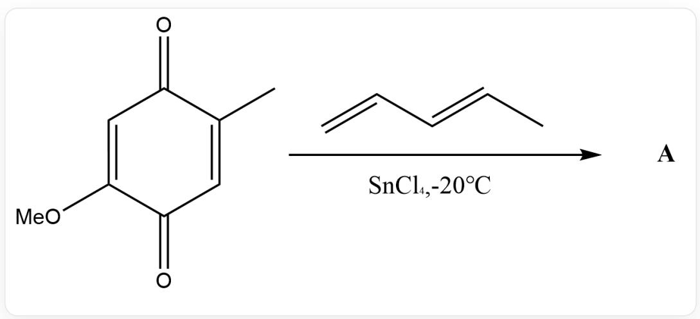
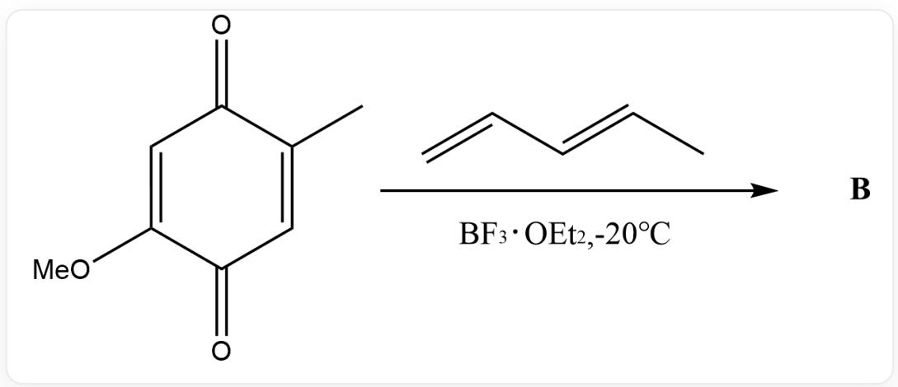
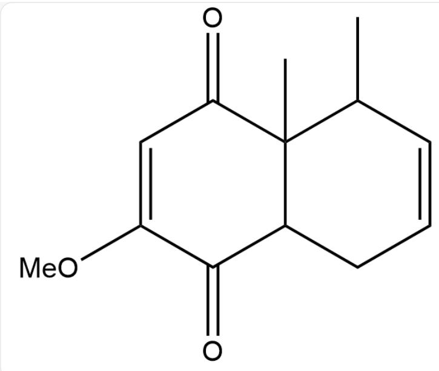
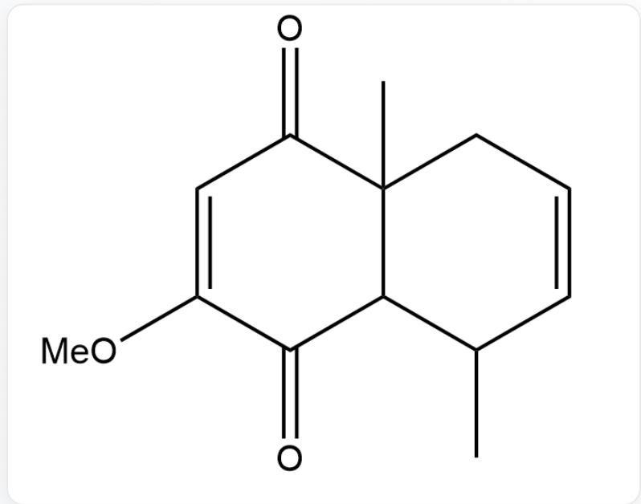
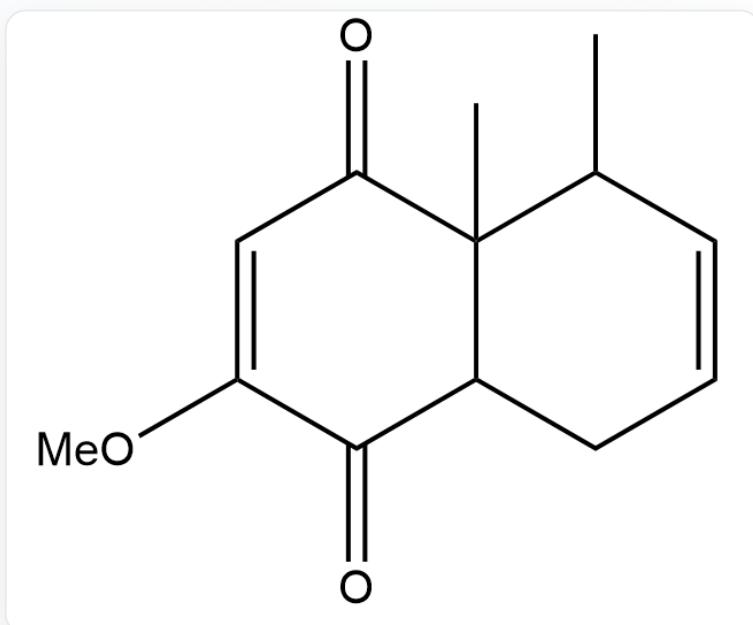
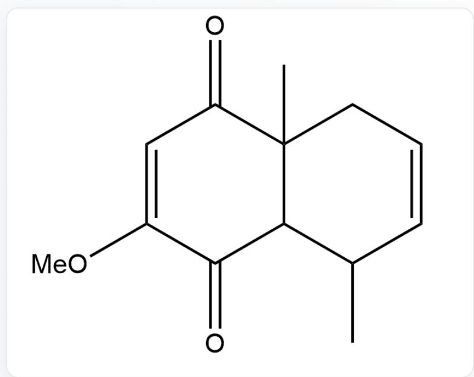
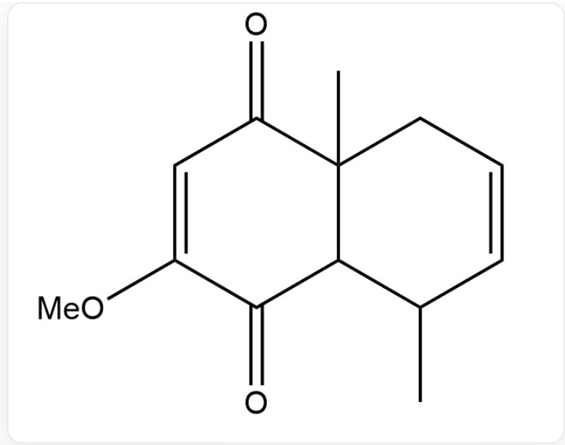
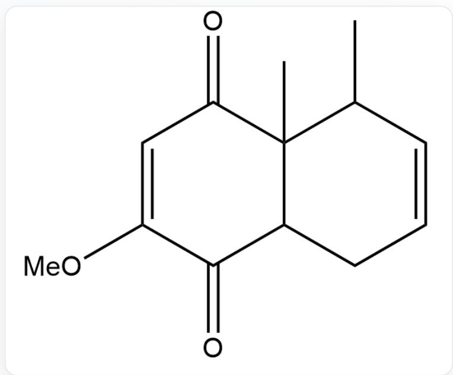
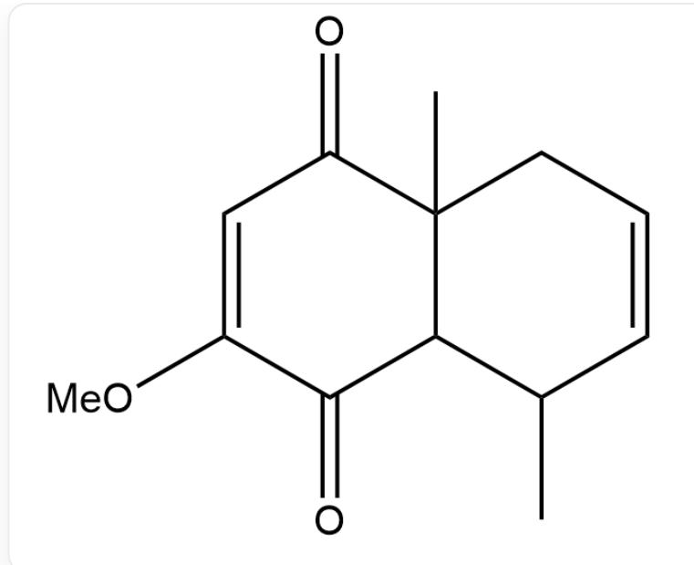
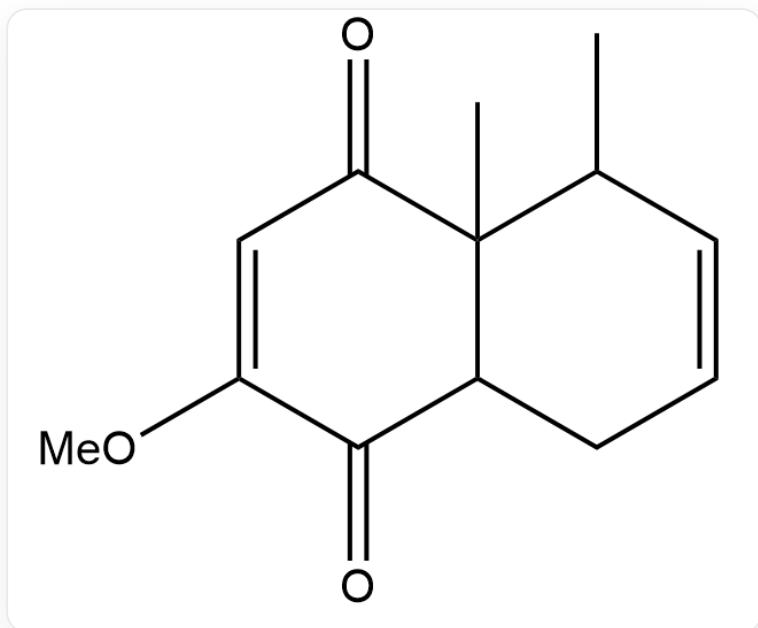

# Question

$\mathrm{O = C(C = C1OC)C(C) = CC1 = O > C = C / C = C / C.CI[Sn](Cl)(Cl)Cl > [A]}$ , the reaction was carried out at  $-20^{\circ}C$

$O = C(C = C1OC)C(C) = CC1 = O > C = C / C = C / C$ . FB(F)(O(CC)CC)F>[B], the reaction was carried out at  $-20^{\circ}C$

Please provide the most likely products A and B for the above two reactions, respectively (without considering stereochemistry)

A.

$\mathrm{O = C(C = C1OC)C(C(C)C = CC2)(C)C2C1 = O}$  ，ProductA

Product A

$\mathrm{O = C(C = C1OC)C(CC = CC2C)(C)C2C1 = O}$  ，ProductB

Product B

B.

O=C(C=C1OC)C(C(C)C=CC2)(C)C2C1 = O, Product A

Product A

$\mathrm{O = C(C = C1OC)C(C(C)C = CC2)(C)C2C1 = O,ProductB}$

Product B

C.

$\mathrm{O = C(C = C1OC)C(CC = CC2C)(C)C2C1 = O,ProductA}$

Product A

$\mathrm{O = C(C = C1OC)C(CC = CC2C)(C)C2C1 = O,ProductB}$

Product B

D.

$\mathrm{O = C(C = C1OC)C(CC = CC2C)(C)C2C1 = O}$  ，Product A

Product A

$\mathrm{O = C(C = C1OC)C(C(C)C = CC2)(C)C2C1 = O}$  ，ProductB

Product B

# Answer

Correct Answer: D

# Detailed Explanation

$\mathrm{SnCl}_4$  can simultaneously coordinate with both the carbonyl and methoxy groups, thereby activating the lower carbonyl.

# CHECKPOINT

1 PTS

$\mathrm{SnCl}_4$  can simultaneously coordinate with both the carbonyl and methoxy groups, thereby activating the lower carbonyl

In contrast,  $\mathrm{BF}_3$  can only form tetracoordination and preferentially coordinates with the electron-rich upper carbonyl, activating the upper carbonyl.

# CHECKPOINT

1 PTS

In contrast,  $\mathrm{BF}_3$  can only form tetracoordination and preferentially coordinates with the electron-rich upper carbonyl, activating the upper carbonyl

For the diene component, the alkyl group is electron-donating, so the side connected to the alkyl group becomes positively charged, while the other end becomes negatively charged. Reacting with the corresponding sites of the dienophile yields products A and B:

A.

  
$\mathrm{O = C(C = C1OC)C(CC = CC2C)(C)C2C1 = O,ProductA}$

B.

  
$\mathrm{O = C(C = C1OC)C(C(C)C = CC2)(C)C2C1 = O,ProductB}$

Therefore, option D is correct.

# CHECKPOINT

1 PTS

Product A is  $\mathrm{O} = \mathrm{C}(\mathrm{C} = \mathrm{C}1\mathrm{OC})\mathrm{C}(\mathrm{CC} = \mathrm{CC}2\mathrm{C})(\mathrm{C})\mathrm{C}2\mathrm{C}1 = \mathrm{O}$

# CHECKPOINT

1 PTS

Product B is  $\mathrm{O} = \mathrm{C}(\mathrm{C} = \mathrm{C}1\mathrm{OC})\mathrm{C}(\mathrm{C}(\mathrm{C})\mathrm{C} = \mathrm{CC}2)(\mathrm{C})\mathrm{C}2\mathrm{C}1 = \mathrm{O}$